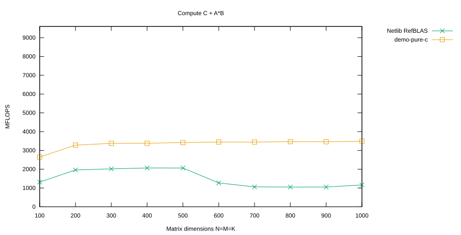

# Pure ANSI C Implementation of DGEMM

In the following we present a cache-optimized implementation of the matrix-matrix product.

The function `dgemm_nn` can compute operations of the form

$$
C \leftarrow \beta C + \alpha A B.
$$

All matrices can have arbitrary row and column strides. In particular, each matrix can be stored either row-wise or column-wise.

This also means that the function can be used to compute

$$
C \leftarrow \beta C + \alpha A^T B,
$$

$$
C \leftarrow \beta C + \alpha A B^T,
$$

and

$$
C \leftarrow \beta C + \alpha A^T B^T.
$$

## Select the `demo-pure-c` Branch

Before switching branches, first clean the project:

```console
$ cd ulmBLAS
$ make clean
```

<details>
<summary>Show complete output of <code>make clean</code></summary>

```console
for dir in src refblas test bench; do make -C $dir clean; done
rm -f auxiliary/xerbla.o level1/dasum.o level1/daxpy.o ...
rm -f auxiliary/atl_xerbla.o level1/atl_dasum.o level1/atl_daxpy.o ...
rm -f ../libulmblas.a
rm -f ../libatlulmblas.a
...
```

</details>

Now check out the `demo-pure-c` branch:

```console
$ git checkout -B demo-pure-c remotes/origin/demo-pure-c
Reset branch 'demo-pure-c'
Branch demo-pure-c set up to track remote branch demo-pure-c from origin.
Your branch is up-to-date with 'origin/demo-pure-c'.
```

Then compile the project:

```console
$ make
```

<details>
<summary>Show complete build output</summary>

```console
make -C src
gcc-4.8 -Wall -I. -O3 -msse3 -mfpmath=sse -fomit-frame-pointer -c -o auxiliary/xerbla.o auxiliary/xerbla.c
...
gfortran -o xdl1blastst l1blastst.o libtstatlas.a ../libatlulmblas.a ../librefblas.a
gfortran -o xdl3blastst l3blastst.o libtstatlas.a ../libatlulmblas.a ../librefblas.a
```

</details>

## Building Blocks of `dgemm_nn`

The implementation consists of a small number of building blocks:

- `pack_MRxk` and `pack_A` copy row panels from blocks of $A$ into the buffer `_A`.
- `pack_kxNR` and `pack_B` copy column panels from blocks of $B$ into the buffer `_B`.
- `dgemm_micro_kernel` multiplies one packed row panel of $A$ with one packed column panel of $B$.
- `dgemm_macro_kernel` applies the micro kernel to the packed blocks.
- `dgemm_nn` implements the complete operation

$$
C \leftarrow \beta C + \alpha A B.
$$

The important idea is that most of the machinery exists to arrange the data so that the actual computation inside the micro kernel can be performed efficiently.

## The Micro Kernel Algorithm

For simplicity, assume

$$
m_r = n_r = 4.
$$

The pure C implementation works as long as $m_r$ divides $m_c$ and $n_r$ divides $n_c$.

`A` points to a packed, possibly zero-padded row panel of height four and width $k_c$. It is stored column-wise:

$$
A =
\begin{pmatrix}
a_0 & a_4 & \dots & a_{4k_c-4} \\
a_1 & a_5 & \dots & a_{4k_c-3} \\
a_2 & a_6 & \dots & a_{4k_c-2} \\
a_3 & a_7 & \dots & a_{4k_c-1}
\end{pmatrix}.
$$

`B` points to a column panel of height $k_c$ and width four. It is stored row-wise:

$$
B =
\begin{pmatrix}
b_0 & b_1 & b_2 & b_3 \\
b_4 & b_5 & b_6 & b_7 \\
\vdots & \vdots & \vdots & \vdots \\
b_{4k_c-4} & b_{4k_c-3} & b_{4k_c-2} & b_{4k_c-1}
\end{pmatrix}.
$$

Consequently, the product $AB$ can be interpreted as a sequence of rank-one updates:

$$
AB =
\sum_{l=0}^{k_c-1}
\begin{pmatrix}
a_{4l} \\
a_{4l+1} \\
a_{4l+2} \\
a_{4l+3}
\end{pmatrix}
\begin{pmatrix}
b_{4l} &
b_{4l+1} &
b_{4l+2} &
b_{4l+3}
\end{pmatrix}.
$$

We compute this product sequentially.

First initialize

$$
\mathbf{AB} \leftarrow \mathbf{0}_{4\times4}.
$$

Then, for $l=0,\ldots,k_c-1$, update

$$
\mathbf{AB}
\leftarrow
\mathbf{AB}
+
\begin{pmatrix}
a_{4l} \\
a_{4l+1} \\
a_{4l+2} \\
a_{4l+3}
\end{pmatrix}
\begin{pmatrix}
b_{4l} &
b_{4l+1} &
b_{4l+2} &
b_{4l+3}
\end{pmatrix}.
$$

**This loop is the computational hotspot.** In principle, the overall performance is dominated by how efficiently this update of $\mathbf{AB}$ can be carried out.

Afterwards, we merely update the corresponding micro block $\widetilde{C}$:

$$
\widetilde{C} \leftarrow \beta \widetilde{C},
$$

followed by

$$
\widetilde{C}
\leftarrow
\widetilde{C} + \alpha \mathbf{AB}.
$$

This small rank-one update will be the main focus of the following pages.

## The `dgemm_nn` Code — Less Than 450 Lines!

The complete implementation is contained in

[`src/level3/dgemm_nn.c`](https://github.com/michael-lehn/ulmBLAS/blob/demo-pure-c/src/level3/dgemm_nn.c)

on the `demo-pure-c` branch.

The relevant part of the pure C micro kernel is remarkably simple:

```c
for (l=0; l<MR*NR; ++l) {
    AB[l] = 0;
}

for (l=0; l<kc; ++l) {
    for (j=0; j<NR; ++j) {
        for (i=0; i<MR; ++i) {
            AB[i+j*MR] += A[i]*B[j];
        }
    }
    A += MR;
    B += NR;
}
```

Everything around this loop is mainly concerned with packing the matrices, traversing cache-sized blocks, handling boundary cases, and updating $C$.

## Benchmark Results

The `bench/` directory contains the benchmark suite extracted from the ATLAS project.

Run

```console
$ cd bench
$ ./xdl3blastst
```

to benchmark the implementation against the Netlib reference BLAS.

<details>
<summary>Show benchmark output</summary>

```text
--------------------------------- GEMM ----------------------------------
TST# A B    M    N    K ALPHA  LDA  LDB  BETA  LDC  TIME MFLOP SpUp  TEST
==== = = ==== ==== ==== ===== ==== ==== ===== ==== ===== ===== ==== =====
   0 N N  100  100  100   1.0 1000 1000   1.0 1000  0.00 1315.8 1.00 -----
   0 N N  100  100  100   1.0 1000 1000   1.0 1000  0.00 2649.0 2.01 PASS 
   1 N N  200  200  200   1.0 1000 1000   1.0 1000  0.01 1961.3 1.00 -----
   1 N N  200  200  200   1.0 1000 1000   1.0 1000  0.00 3283.4 1.67 PASS 
   2 N N  300  300  300   1.0 1000 1000   1.0 1000  0.03 2019.3 1.00 -----
   2 N N  300  300  300   1.0 1000 1000   1.0 1000  0.02 3375.6 1.67 PASS 
   3 N N  400  400  400   1.0 1000 1000   1.0 1000  0.06 2066.4 1.00 -----
   3 N N  400  400  400   1.0 1000 1000   1.0 1000  0.04 3382.2 1.64 PASS 
   4 N N  500  500  500   1.0 1000 1000   1.0 1000  0.12 2064.9 1.00 -----
   4 N N  500  500  500   1.0 1000 1000   1.0 1000  0.07 3419.3 1.66 PASS 
   5 N N  600  600  600   1.0 1000 1000   1.0 1000  0.34 1270.4 1.00 -----
   5 N N  600  600  600   1.0 1000 1000   1.0 1000  0.13 3449.5 2.72 PASS 
   6 N N  700  700  700   1.0 1000 1000   1.0 1000  0.65 1060.5 1.00 -----
   6 N N  700  700  700   1.0 1000 1000   1.0 1000  0.20 3444.5 3.25 PASS 
   7 N N  800  800  800   1.0 1000 1000   1.0 1000  0.97 1050.7 1.00 -----
   7 N N  800  800  800   1.0 1000 1000   1.0 1000  0.30 3468.3 3.30 PASS 
   8 N N  900  900  900   1.0 1000 1000   1.0 1000  1.39 1052.0 1.00 -----
   8 N N  900  900  900   1.0 1000 1000   1.0 1000  0.42 3461.3 3.29 PASS 
   9 N N 1000 1000 1000   1.0 1000 1000   1.0 1000  1.72 1164.3 1.00 -----
   9 N N 1000 1000 1000   1.0 1000 1000   1.0 1000  0.57 3494.0 3.00 PASS 
10 tests run, 10 passed
```

</details>

Lines marked with `PASS` show results for our implementation. Lines ending in `-----` belong to the Netlib reference implementation.

The pure C implementation already achieves about **3.5 GFLOPS** for sufficiently large matrices on the original benchmark machine.

To visualize the results, first write them to a report file and separate the two implementations:

```console
$ ./xdl3blastst > report
$ grep PASS report > demo-pure-c
$ grep " -----$" report > refBLAS
```

The following gnuplot script `bench.gps` creates an SVG plot:

```gnuplot
set terminal svg size 940,480
set output "bench.svg"
set xlabel "Matrix dimensions N=M=K"
set ylabel "MFLOPS"
set yrange [0:9600]
set title "Compute C + A*B"
set key outside
plot "refBLAS" using 4:13 with linespoints lt 2 title "Netlib RefBLAS", \
     "demo-pure-c" using 4:13 with linespoints lt 4 title "demo-pure-c"
```

Generate the plot with

```console
$ gnuplot bench.gps
```



## Sensitivity to Compilers

Unfortunately, different compilers, compiler versions, and optimization flags can have a significant influence on performance.

For example, on the machine used for the original tutorial, compiling the micro kernel with the Apple Clang version available at the time caused a substantial performance drop compared with GCC 4.8.

The compiler versions were:

```console
$ clang --version
Apple LLVM version 5.1 (clang-503.0.40) (based on LLVM 3.4svn)
Target: x86_64-apple-darwin13.3.0
Thread model: posix

$ gcc-4.8 --version
gcc-4.8 (Homebrew gcc 4.8.3_1) 4.8.3
```

This compiler sensitivity is one of the motivations for taking more control over the computational hotspot. On the following pages we therefore move first to SSE intrinsics and eventually to assembly code.

---

[← Previous](../page01/) | [Main Page](../README.md) | [Next →](../page03/)

Copyright © 2014 Michael Lehn
