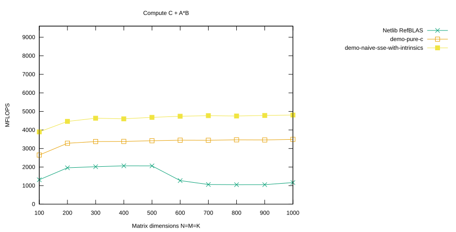

# Naive Use of SSE Intrinsics

The implementation presented here uses SSE intrinsics.

In my naive way of thinking, I expected an optimizing compiler to produce essentially this implementation at the assembly level when compiling the `demo-pure-c` micro kernel. However, no matter what attributes, optimization flags, and tricks I used, the compiler could not optimize the `demo-pure-c` micro kernel to the performance level of the implementation presented here.

## Select the `demo-naive-sse-with-intrinsics` Branch

Again, we first do a `make clean` before switching branches:

```console
$ cd ulmBLAS
$ make clean
```

<details>
<summary>Show complete output of <code>make clean</code></summary>

```console
for dir in src refblas test bench; do make -C $dir clean; done
rm -f auxiliary/xerbla.o level1/dasum.o level1/daxpy.o level1/dcopy.o ...
rm -f auxiliary/atl_xerbla.o level1/atl_dasum.o level1/atl_daxpy.o ...
rm -f ../libulmblas.a
rm -f ../libatlulmblas.a
...
```

</details>

Now check out the `demo-naive-sse-with-intrinsics` branch:

```console
$ git branch -a
* demo-pure-c
  master
  remotes/origin/HEAD -> origin/master
  remotes/origin/bench-atlas
  remotes/origin/bench-blis
  remotes/origin/bench-eigen
  remotes/origin/bench-mkl
  remotes/origin/blis-avx-microkernel
  remotes/origin/demo-naive-avx-with-intrinsics
  remotes/origin/demo-naive-sse-with-intrinsics
  remotes/origin/demo-naive-sse-with-intrinsics-unrolled
  remotes/origin/demo-pure-c
  remotes/origin/demo-sse-all-asm
  remotes/origin/demo-sse-all-asm-try-prefetching
  remotes/origin/demo-sse-all-asm-try-prefetching-v2
  remotes/origin/demo-sse-all-asm-with-prefetching
  remotes/origin/demo-sse-asm
  remotes/origin/demo-sse-asm-for-AB-loop
  remotes/origin/demo-sse-asm-unrolled
  remotes/origin/demo-sse-asm-unrolled-v2
  remotes/origin/demo-sse-asm-unrolled-v3
  remotes/origin/demo-sse-asm-unrolled-with-prefetch
  remotes/origin/demo-sse-intrinsics
  remotes/origin/demo-sse-intrinsics-for-AB-loop
  remotes/origin/demo-sse-intrinsics-v2
  remotes/origin/demo-sse-intrinsics-v3
  remotes/origin/demo-with-sse-intrinsics
  remotes/origin/master
  remotes/origin/trsm-assignment
  remotes/origin/trsm-pure-c

$ git checkout -B demo-naive-sse-with-intrinsics remotes/origin/demo-naive-sse-with-intrinsics
Switched to a new branch 'demo-naive-sse-with-intrinsics'
Branch demo-naive-sse-with-intrinsics set up to track remote branch demo-naive-sse-with-intrinsics from origin.
```

Then compile the project:

```console
$ make
```

<details>
<summary>Show complete build output</summary>

```console
make -C src
gcc-4.8 -Wall -I. -O2 -msse3 -mfpmath=sse -fomit-frame-pointer -c -o auxiliary/xerbla.o auxiliary/xerbla.c
gcc-4.8 -Wall -I. -O2 -msse3 -mfpmath=sse -fomit-frame-pointer -c -o level1/dasum.o level1/dasum.c
gcc-4.8 -Wall -I. -O2 -msse3 -mfpmath=sse -fomit-frame-pointer -c -o level1/daxpy.o level1/daxpy.c
...
gfortran -o xdl1blastst l1blastst.o libtstatlas.a ../libatlulmblas.a ../librefblas.a
gfortran -o xdl3blastst l3blastst.o libtstatlas.a ../libatlulmblas.a ../librefblas.a
```

</details>

## The Micro Kernel Algorithm

We only optimize the update step

$$
\mathbf{AB}
\leftarrow
\mathbf{AB}
+
\begin{pmatrix}
a_{4l}\\
a_{4l+1}\\
a_{4l+2}\\
a_{4l+3}
\end{pmatrix}
\begin{pmatrix}
b_{4l} &
b_{4l+1} &
b_{4l+2} &
b_{4l+3}
\end{pmatrix}
$$

using SSE intrinsics.

Looking again at the original C code

```c
for (l=0; l<kc; ++l) {
    for (j=0; j<NR; ++j) {
        for (i=0; i<MR; ++i) {
            AB[i+j*MR] += A[i]*B[j];
        }
    }
    A += MR;
    B += NR;
}
```

we notice that `B[j]` does not change in the innermost loop. The natural idea is therefore to treat each column update as a scalar multiplied by the four entries from `A`:

$$
\mathbf{AB}
\leftarrow
\mathbf{AB}
+
\begin{pmatrix}
b_{4l}
\begin{pmatrix}
a_{4l}\\
a_{4l+1}\\
a_{4l+2}\\
a_{4l+3}
\end{pmatrix}
&
b_{4l+1}
\begin{pmatrix}
a_{4l}\\
a_{4l+1}\\
a_{4l+2}\\
a_{4l+3}
\end{pmatrix}
&
b_{4l+2}
\begin{pmatrix}
a_{4l}\\
a_{4l+1}\\
a_{4l+2}\\
a_{4l+3}
\end{pmatrix}
&
b_{4l+3}
\begin{pmatrix}
a_{4l}\\
a_{4l+1}\\
a_{4l+2}\\
a_{4l+3}
\end{pmatrix}
\end{pmatrix}.
$$

Let

$$
\mathbb{b}_{00},\;
\mathbb{b}_{11},\;
\mathbb{b}_{22},\;
\mathbb{b}_{33},\;
\mathbb{a}_{01},\;
\mathbb{a}_{23}
$$

denote SSE registers. We use these six registers for the operands:

$$
\begin{aligned}
\mathbb{b}_{00} &\leftarrow
\begin{pmatrix}b_{4l}\\ b_{4l}\end{pmatrix},
&
\mathbb{b}_{11} &\leftarrow
\begin{pmatrix}b_{4l+1}\\ b_{4l+1}\end{pmatrix},
\\
\mathbb{b}_{22} &\leftarrow
\begin{pmatrix}b_{4l+2}\\ b_{4l+2}\end{pmatrix},
&
\mathbb{b}_{33} &\leftarrow
\begin{pmatrix}b_{4l+3}\\ b_{4l+3}\end{pmatrix},
\\
\mathbb{a}_{01} &\leftarrow
\begin{pmatrix}a_{4l}\\ a_{4l+1}\end{pmatrix},
&
\mathbb{a}_{23} &\leftarrow
\begin{pmatrix}a_{4l+2}\\ a_{4l+3}\end{pmatrix}.
\end{aligned}
$$

Another eight SSE registers represent the $4\times4$ result block $\mathbf{AB}$:

$$
\begin{aligned}
\mathbb{ab}_{00,10} &\leftarrow
\begin{pmatrix}ab_{0,0}\\ ab_{1,0}\end{pmatrix},
&
\mathbb{ab}_{20,30} &\leftarrow
\begin{pmatrix}ab_{2,0}\\ ab_{3,0}\end{pmatrix},
\\
\mathbb{ab}_{01,11} &\leftarrow
\begin{pmatrix}ab_{0,1}\\ ab_{1,1}\end{pmatrix},
&
\mathbb{ab}_{21,31} &\leftarrow
\begin{pmatrix}ab_{2,1}\\ ab_{3,1}\end{pmatrix},
\\
\mathbb{ab}_{02,12} &\leftarrow
\begin{pmatrix}ab_{0,2}\\ ab_{1,2}\end{pmatrix},
&
\mathbb{ab}_{22,32} &\leftarrow
\begin{pmatrix}ab_{2,2}\\ ab_{3,2}\end{pmatrix},
\\
\mathbb{ab}_{03,13} &\leftarrow
\begin{pmatrix}ab_{0,3}\\ ab_{1,3}\end{pmatrix},
&
\mathbb{ab}_{23,33} &\leftarrow
\begin{pmatrix}ab_{2,3}\\ ab_{3,3}\end{pmatrix}.
\end{aligned}
$$

Our x86-64 architecture provides 16 SSE registers, so two registers remain. We use these for temporary results and denote them by

$$
\mathbb{tmp}_1,\qquad \mathbb{tmp}_2.
$$

A single update can now be carried out column by column. For example, the first column is updated as

$$
\begin{aligned}
\mathbb{tmp}_1 &\leftarrow \mathbb{a}_{01},\\
\mathbb{tmp}_2 &\leftarrow \mathbb{a}_{23},\\
\mathbb{tmp}_1 &\leftarrow \mathbb{tmp}_1 \odot \mathbb{b}_{00},\\
\mathbb{tmp}_2 &\leftarrow \mathbb{tmp}_2 \odot \mathbb{b}_{00},\\
\mathbb{ab}_{00,10}
&\leftarrow
\mathbb{ab}_{00,10}+\mathbb{tmp}_1,\\
\mathbb{ab}_{20,30}
&\leftarrow
\mathbb{ab}_{20,30}+\mathbb{tmp}_2.
\end{aligned}
$$

The remaining three columns are updated in exactly the same way using
$\mathbb{b}_{11}$, $\mathbb{b}_{22}$, and $\mathbb{b}_{33}$.

Here, $\odot$ denotes component-wise multiplication of the two entries in an SSE register.

Before the first update, all eight $\mathbb{ab}$ registers are initialized to zero. After all $k_c$ updates have been performed, their contents are written back to memory.

## The `dgemm_nn` Code

The complete implementation is contained in

[`src/level3/dgemm_nn.c`](https://github.com/michael-lehn/ulmBLAS/blob/demo-naive-sse-with-intrinsics/src/level3/dgemm_nn.c)

on the `demo-naive-sse-with-intrinsics` branch.

Compared with the pure C version, the local buffers `_A`, `_B`, `_C`, and `AB` are now explicitly aligned to 16 bytes. This alignment is required by the load and store intrinsics used in the micro kernel.

The computational part of the micro kernel is:

```c
double AB[MR*NR] __attribute__ ((aligned (16)));

// Cols of AB in SSE registers
__m128d ab_00_10, ab_20_30;
__m128d ab_01_11, ab_21_31;
__m128d ab_02_12, ab_22_32;
__m128d ab_03_13, ab_23_33;

__m128d a_01, a_23;
__m128d b_00, b_11, b_22, b_33;
__m128d tmp1, tmp2;

ab_00_10 = _mm_setzero_pd();
ab_20_30 = _mm_setzero_pd();
ab_01_11 = _mm_setzero_pd();
ab_21_31 = _mm_setzero_pd();
ab_02_12 = _mm_setzero_pd();
ab_22_32 = _mm_setzero_pd();
ab_03_13 = _mm_setzero_pd();
ab_23_33 = _mm_setzero_pd();

for (l=0; l<kc; ++l) {
    a_01 = _mm_load_pd(A);
    a_23 = _mm_load_pd(A+2);

    b_00 = _mm_load_pd1(B);
    b_11 = _mm_load_pd1(B+1);
    b_22 = _mm_load_pd1(B+2);
    b_33 = _mm_load_pd1(B+3);

    // col 0 of AB
    tmp1 = a_01;
    tmp2 = a_23;
    tmp1 = _mm_mul_pd(tmp1, b_00);
    tmp2 = _mm_mul_pd(tmp2, b_00);
    ab_00_10 = _mm_add_pd(tmp1, ab_00_10);
    ab_20_30 = _mm_add_pd(tmp2, ab_20_30);

    // col 1 of AB
    tmp1 = a_01;
    tmp2 = a_23;
    tmp1 = _mm_mul_pd(tmp1, b_11);
    tmp2 = _mm_mul_pd(tmp2, b_11);
    ab_01_11 = _mm_add_pd(tmp1, ab_01_11);
    ab_21_31 = _mm_add_pd(tmp2, ab_21_31);

    // col 2 of AB
    tmp1 = a_01;
    tmp2 = a_23;
    tmp1 = _mm_mul_pd(tmp1, b_22);
    tmp2 = _mm_mul_pd(tmp2, b_22);
    ab_02_12 = _mm_add_pd(tmp1, ab_02_12);
    ab_22_32 = _mm_add_pd(tmp2, ab_22_32);

    // col 3 of AB
    tmp1 = a_01;
    tmp2 = a_23;
    tmp1 = _mm_mul_pd(tmp1, b_33);
    tmp2 = _mm_mul_pd(tmp2, b_33);
    ab_03_13 = _mm_add_pd(tmp1, ab_03_13);
    ab_23_33 = _mm_add_pd(tmp2, ab_23_33);

    A += 4;
    B += 4;
}

_mm_store_pd(AB+ 0, ab_00_10);
_mm_store_pd(AB+ 2, ab_20_30);
_mm_store_pd(AB+ 4, ab_01_11);
_mm_store_pd(AB+ 6, ab_21_31);
_mm_store_pd(AB+ 8, ab_02_12);
_mm_store_pd(AB+10, ab_22_32);
_mm_store_pd(AB+12, ab_03_13);
_mm_store_pd(AB+14, ab_23_33);
```

## Benchmark Results

Run the benchmark and store its output in `report`:

```console
$ cd bench
$ ./xdl3blastst > report
$ cat report
```

<details>
<summary>Show complete benchmark output</summary>

```text
./xdl3blastst
--------------------------------- GEMM ----------------------------------
TST# A B    M    N    K ALPHA  LDA  LDB  BETA  LDC  TIME MFLOP SpUp  TEST
==== = = ==== ==== ==== ===== ==== ==== ===== ==== ===== ===== ==== =====
   0 N N  100  100  100   1.0 1000 1000   1.0 1000  0.00 1798.6 1.00 -----
   0 N N  100  100  100   1.0 1000 1000   1.0 1000  0.00 3898.6 2.17 PASS
   1 N N  200  200  200   1.0 1000 1000   1.0 1000  0.01 1949.6 1.00 -----
   1 N N  200  200  200   1.0 1000 1000   1.0 1000  0.00 4461.8 2.29 PASS
   2 N N  300  300  300   1.0 1000 1000   1.0 1000  0.03 2018.2 1.00 -----
   2 N N  300  300  300   1.0 1000 1000   1.0 1000  0.01 4634.0 2.30 PASS
   3 N N  400  400  400   1.0 1000 1000   1.0 1000  0.06 2017.5 1.00 -----
   3 N N  400  400  400   1.0 1000 1000   1.0 1000  0.03 4601.2 2.28 PASS
   4 N N  500  500  500   1.0 1000 1000   1.0 1000  0.14 1837.7 1.00 -----
   4 N N  500  500  500   1.0 1000 1000   1.0 1000  0.05 4680.6 2.55 PASS
   5 N N  600  600  600   1.0 1000 1000   1.0 1000  0.32 1337.4 1.00 -----
   5 N N  600  600  600   1.0 1000 1000   1.0 1000  0.09 4740.0 3.54 PASS
   6 N N  700  700  700   1.0 1000 1000   1.0 1000  0.70 983.0 1.00 -----
   6 N N  700  700  700   1.0 1000 1000   1.0 1000  0.14 4770.6 4.85 PASS
   7 N N  800  800  800   1.0 1000 1000   1.0 1000  0.98 1045.5 1.00 -----
   7 N N  800  800  800   1.0 1000 1000   1.0 1000  0.22 4752.8 4.55 PASS
   8 N N  900  900  900   1.0 1000 1000   1.0 1000  1.38 1056.5 1.00 -----
   8 N N  900  900  900   1.0 1000 1000   1.0 1000  0.30 4783.0 4.53 PASS
   9 N N 1000 1000 1000   1.0 1000 1000   1.0 1000  1.72 1160.3 1.00 -----
   9 N N 1000 1000 1000   1.0 1000 1000   1.0 1000  0.42 4805.7 4.14 PASS

10 tests run, 10 passed
```

</details>

Filter out the results for this implementation:

```console
$ grep PASS report > demo-naive-sse-with-intrinsics
```

Together with the results from the previous page, we can plot all three implementations.

The gnuplot script `bench3.gps` is:

```gnuplot
set terminal svg size 940,480 background rgb 'white'
set output "bench3.svg"

set xlabel "Matrix dimensions N=M=K"
set ylabel "MFLOPS"
set yrange [0:9600]
set title "Compute C + A*B"
set key outside

plot "refBLAS" using 4:13 with linespoints lt 2 \
         title "Netlib RefBLAS", \
     "demo-pure-c" using 4:13 with linespoints lt 4 \
         title "demo-pure-c", \
     "demo-naive-sse-with-intrinsics" using 4:13 with linespoints lt 5 \
         title "demo-naive-sse-with-intrinsics"
```

Generate the plot with

```console
$ gnuplot bench3.gps
```

and obtain:



The naive SSE implementation reaches about **4.8 GFLOPS** for larger matrices on the original benchmark machine, compared with about **3.5 GFLOPS** for the pure C implementation.

---

[← Previous](../page02/README.md) | [Main Page](../README.md) | [Next →](../page04/README.md)

Copyright © 2014 Michael Lehn
