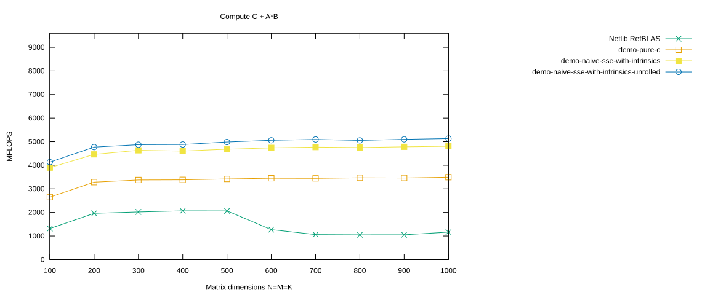

# Loop Unrolling

We optimize the previous implementation by manually unrolling the loop.

Again, the performance achieved here is what I would have expected from a smart compiler for the `demo-pure-c` branch — at least if we provide enough hints through compiler flags and attributes.

## Select the `demo-naive-sse-with-intrinsics-unrolled` Branch

As before, first clean the project:

```console id="i1rgi7"
$ cd ulmBLAS
$ make clean
```

<details>
<summary>Show complete output of <code>make clean</code></summary>

```console id="0bn3d5"
for dir in src refblas test bench; do make -C $dir clean; done
rm -f auxiliary/xerbla.o level1/dasum.o level1/daxpy.o ...
rm -f auxiliary/atl_xerbla.o level1/atl_dasum.o level1/atl_daxpy.o ...
rm -f ../libulmblas.a
rm -f ../libatlulmblas.a
...
```

</details>

Now check out the `demo-naive-sse-with-intrinsics-unrolled` branch:

```console id="26j319"
$ git branch -a
* demo-naive-sse-with-intrinsics
  demo-pure-c
  master
  remotes/origin/HEAD -> origin/master
  remotes/origin/bench-atlas
  remotes/origin/bench-blis
  remotes/origin/bench-eigen
  remotes/origin/bench-mkl
  remotes/origin/blis-avx-microkernel
  remotes/origin/demo-naive-avx-with-intrinsics
  remotes/origin/demo-naive-sse-with-intrinsics
  remotes/origin/demo-naive-sse-with-intrinsics-unrolled
  remotes/origin/demo-pure-c
  remotes/origin/demo-sse-all-asm
  remotes/origin/demo-sse-all-asm-try-prefetching
  remotes/origin/demo-sse-all-asm-try-prefetching-v2
  remotes/origin/demo-sse-all-asm-with-prefetching
  remotes/origin/demo-sse-asm
  remotes/origin/demo-sse-asm-for-AB-loop
  remotes/origin/demo-sse-asm-unrolled
  remotes/origin/demo-sse-asm-unrolled-v2
  remotes/origin/demo-sse-asm-unrolled-v3
  remotes/origin/demo-sse-asm-unrolled-with-prefetch
  remotes/origin/demo-sse-intrinsics
  remotes/origin/demo-sse-intrinsics-for-AB-loop
  remotes/origin/demo-sse-intrinsics-v2
  remotes/origin/demo-sse-intrinsics-v3
  remotes/origin/demo-with-sse-intrinsics
  remotes/origin/master
  remotes/origin/trsm-assignment
  remotes/origin/trsm-pure-c

$ git checkout -B demo-naive-sse-with-intrinsics-unrolled remotes/origin/demo-naive-sse-with-intrinsics-unrolled
Switched to a new branch 'demo-naive-sse-with-intrinsics-unrolled'
Branch demo-naive-sse-with-intrinsics-unrolled set up to track remote branch demo-naive-sse-with-intrinsics-unrolled from origin.
```

Then compile the project:

```console id="kv5h03"
$ make
```

<details>
<summary>Show complete build output</summary>

```console id="9euvyq"
$shell> make                                                             
make -C src
gcc-4.8 -Wall -I. -O2  -msse3 -mfpmath=sse -fomit-frame-pointer -c -o auxiliary/xerbla.o auxiliary/xerbla.c
gcc-4.8 -Wall -I. -O2  -msse3 -mfpmath=sse -fomit-frame-pointer -c -o level1/dasum.o level1/dasum.c
gcc-4.8 -Wall -I. -O2  -msse3 -mfpmath=sse -fomit-frame-pointer -c -o level1/daxpy.o level1/daxpy.c
gcc-4.8 -Wall -I. -O2  -msse3 -mfpmath=sse -fomit-frame-pointer -c -o level1/dcopy.o level1/dcopy.c
gcc-4.8 -Wall -I. -O2  -msse3 -mfpmath=sse -fomit-frame-pointer -c -o level1/ddot.o level1/ddot.c
gcc-4.8 -Wall -I. -O2  -msse3 -mfpmath=sse -fomit-frame-pointer -c -o level1/dnrm2.o level1/dnrm2.c
gcc-4.8 -Wall -I. -O2  -msse3 -mfpmath=sse -fomit-frame-pointer -c -o level1/drot.o level1/drot.c
gcc-4.8 -Wall -I. -O2  -msse3 -mfpmath=sse -fomit-frame-pointer -c -o level1/drotg.o level1/drotg.c
gcc-4.8 -Wall -I. -O2  -msse3 -mfpmath=sse -fomit-frame-pointer -c -o level1/drotm.o level1/drotm.c
gcc-4.8 -Wall -I. -O2  -msse3 -mfpmath=sse -fomit-frame-pointer -c -o level1/drotmg.o level1/drotmg.c
gcc-4.8 -Wall -I. -O2  -msse3 -mfpmath=sse -fomit-frame-pointer -c -o level1/dscal.o level1/dscal.c
gcc-4.8 -Wall -I. -O2  -msse3 -mfpmath=sse -fomit-frame-pointer -c -o level1/dswap.o level1/dswap.c
gcc-4.8 -Wall -I. -O2  -msse3 -mfpmath=sse -fomit-frame-pointer -c -o level1/idamax.o level1/idamax.c
gcc-4.8 -Wall -I. -O2  -msse3 -mfpmath=sse -fomit-frame-pointer -c -o level3/dgemm.o level3/dgemm.c
gcc-4.8 -Wall -I. -O2  -msse3 -mfpmath=sse -fomit-frame-pointer -c -o level3/dgemm_nn.o level3/dgemm_nn.c
gcc-4.8 -Wall -I. -O2  -msse3 -mfpmath=sse -fomit-frame-pointer -c -o level3/dsymm.o level3/dsymm.c
gcc-4.8 -Wall -I. -O2  -msse3 -mfpmath=sse -fomit-frame-pointer -c -o level3/stubs.o level3/stubs.c
ar cru ../libulmblas.a  auxiliary/xerbla.o  level1/dasum.o level1/daxpy.o level1/dcopy.o level1/ddot.o level1/dnrm2.o level1/drot.o level1/drotg.o level1/drotm.o level1/drotmg.o level1/dscal.o level1/dswap.o level1/idamax.o  level3/dgemm.o level3/dgemm_nn.o level3/dsymm.o level3/stubs.o
ranlib ../libulmblas.a
gcc-4.8 -Wall -I. -O2  -msse3 -mfpmath=sse -fomit-frame-pointer -DFAKE_ATLAS -c -o auxiliary/atl_xerbla.o auxiliary/xerbla.c
gcc-4.8 -Wall -I. -O2  -msse3 -mfpmath=sse -fomit-frame-pointer -DFAKE_ATLAS -c -o level1/atl_dasum.o level1/dasum.c
gcc-4.8 -Wall -I. -O2  -msse3 -mfpmath=sse -fomit-frame-pointer -DFAKE_ATLAS -c -o level1/atl_daxpy.o level1/daxpy.c
gcc-4.8 -Wall -I. -O2  -msse3 -mfpmath=sse -fomit-frame-pointer -DFAKE_ATLAS -c -o level1/atl_dcopy.o level1/dcopy.c
gcc-4.8 -Wall -I. -O2  -msse3 -mfpmath=sse -fomit-frame-pointer -DFAKE_ATLAS -c -o level1/atl_ddot.o level1/ddot.c
gcc-4.8 -Wall -I. -O2  -msse3 -mfpmath=sse -fomit-frame-pointer -DFAKE_ATLAS -c -o level1/atl_dnrm2.o level1/dnrm2.c
gcc-4.8 -Wall -I. -O2  -msse3 -mfpmath=sse -fomit-frame-pointer -DFAKE_ATLAS -c -o level1/atl_drot.o level1/drot.c
gcc-4.8 -Wall -I. -O2  -msse3 -mfpmath=sse -fomit-frame-pointer -DFAKE_ATLAS -c -o level1/atl_drotg.o level1/drotg.c
gcc-4.8 -Wall -I. -O2  -msse3 -mfpmath=sse -fomit-frame-pointer -DFAKE_ATLAS -c -o level1/atl_drotm.o level1/drotm.c
gcc-4.8 -Wall -I. -O2  -msse3 -mfpmath=sse -fomit-frame-pointer -DFAKE_ATLAS -c -o level1/atl_drotmg.o level1/drotmg.c
gcc-4.8 -Wall -I. -O2  -msse3 -mfpmath=sse -fomit-frame-pointer -DFAKE_ATLAS -c -o level1/atl_dscal.o level1/dscal.c
gcc-4.8 -Wall -I. -O2  -msse3 -mfpmath=sse -fomit-frame-pointer -DFAKE_ATLAS -c -o level1/atl_dswap.o level1/dswap.c
gcc-4.8 -Wall -I. -O2  -msse3 -mfpmath=sse -fomit-frame-pointer -DFAKE_ATLAS -c -o level1/atl_idamax.o level1/idamax.c
gcc-4.8 -Wall -I. -O2  -msse3 -mfpmath=sse -fomit-frame-pointer -DFAKE_ATLAS -c -o level3/atl_dgemm.o level3/dgemm.c
gcc-4.8 -Wall -I. -O2  -msse3 -mfpmath=sse -fomit-frame-pointer -DFAKE_ATLAS -c -o level3/atl_dgemm_nn.o level3/dgemm_nn.c
gcc-4.8 -Wall -I. -O2  -msse3 -mfpmath=sse -fomit-frame-pointer -DFAKE_ATLAS -c -o level3/atl_dsymm.o level3/dsymm.c
gcc-4.8 -Wall -I. -O2  -msse3 -mfpmath=sse -fomit-frame-pointer -DFAKE_ATLAS -c -o level3/atl_stubs.o level3/stubs.c
ar cru ../libatlulmblas.a  auxiliary/atl_xerbla.o  level1/atl_dasum.o level1/atl_daxpy.o level1/atl_dcopy.o level1/atl_ddot.o level1/atl_dnrm2.o level1/atl_drot.o level1/atl_drotg.o level1/atl_drotm.o level1/atl_drotmg.o level1/atl_dscal.o level1/atl_dswap.o level1/atl_idamax.o  level3/atl_dgemm.o level3/atl_dgemm_nn.o level3/atl_dsymm.o level3/atl_stubs.o
ranlib ../libatlulmblas.a
make -C refblas
gfortran -fimplicit-none -O3 -c -o caxpy.o caxpy.f
gfortran -fimplicit-none -O3 -c -o ccopy.o ccopy.f
gfortran -fimplicit-none -O3 -c -o cdotc.o cdotc.f
gfortran -fimplicit-none -O3 -c -o cdotu.o cdotu.f
gfortran -fimplicit-none -O3 -c -o cgbmv.o cgbmv.f
gfortran -fimplicit-none -O3 -c -o cgemm.o cgemm.f
gfortran -fimplicit-none -O3 -c -o cgemv.o cgemv.f
gfortran -fimplicit-none -O3 -c -o cgerc.o cgerc.f
gfortran -fimplicit-none -O3 -c -o cgeru.o cgeru.f
gfortran -fimplicit-none -O3 -c -o chbmv.o chbmv.f
gfortran -fimplicit-none -O3 -c -o chemm.o chemm.f
gfortran -fimplicit-none -O3 -c -o chemv.o chemv.f
gfortran -fimplicit-none -O3 -c -o cher.o cher.f
gfortran -fimplicit-none -O3 -c -o cher2.o cher2.f
gfortran -fimplicit-none -O3 -c -o cher2k.o cher2k.f
gfortran -fimplicit-none -O3 -c -o cherk.o cherk.f
gfortran -fimplicit-none -O3 -c -o chpmv.o chpmv.f
gfortran -fimplicit-none -O3 -c -o chpr.o chpr.f
gfortran -fimplicit-none -O3 -c -o chpr2.o chpr2.f
gfortran -fimplicit-none -O3 -c -o crotg.o crotg.f
gfortran -fimplicit-none -O3 -c -o cscal.o cscal.f
gfortran -fimplicit-none -O3 -c -o csrot.o csrot.f
gfortran -fimplicit-none -O3 -c -o csscal.o csscal.f
gfortran -fimplicit-none -O3 -c -o cswap.o cswap.f
gfortran -fimplicit-none -O3 -c -o csymm.o csymm.f
gfortran -fimplicit-none -O3 -c -o csyr2k.o csyr2k.f
gfortran -fimplicit-none -O3 -c -o csyrk.o csyrk.f
gfortran -fimplicit-none -O3 -c -o ctbmv.o ctbmv.f
gfortran -fimplicit-none -O3 -c -o ctbsv.o ctbsv.f
gfortran -fimplicit-none -O3 -c -o ctpmv.o ctpmv.f
gfortran -fimplicit-none -O3 -c -o ctpsv.o ctpsv.f
gfortran -fimplicit-none -O3 -c -o ctrmm.o ctrmm.f
gfortran -fimplicit-none -O3 -c -o ctrmv.o ctrmv.f
gfortran -fimplicit-none -O3 -c -o ctrsm.o ctrsm.f
gfortran -fimplicit-none -O3 -c -o ctrsv.o ctrsv.f
gfortran -fimplicit-none -O3 -c -o dasum.o dasum.f
gfortran -fimplicit-none -O3 -c -o daxpy.o daxpy.f
gfortran -fimplicit-none -O3 -c -o dcabs1.o dcabs1.f
gfortran -fimplicit-none -O3 -c -o dcopy.o dcopy.f
gfortran -fimplicit-none -O3 -c -o ddot.o ddot.f
gfortran -fimplicit-none -O3 -c -o dgbmv.o dgbmv.f
gfortran -fimplicit-none -O3 -c -o dgemm.o dgemm.f
gfortran -fimplicit-none -O3 -c -o dgemv.o dgemv.f
gfortran -fimplicit-none -O3 -c -o dger.o dger.f
gfortran -fimplicit-none -O3 -c -o dnrm2.o dnrm2.f
gfortran -fimplicit-none -O3 -c -o drot.o drot.f
gfortran -fimplicit-none -O3 -c -o drotg.o drotg.f
gfortran -fimplicit-none -O3 -c -o drotm.o drotm.f
gfortran -fimplicit-none -O3 -c -o drotmg.o drotmg.f
gfortran -fimplicit-none -O3 -c -o dsbmv.o dsbmv.f
gfortran -fimplicit-none -O3 -c -o dscal.o dscal.f
gfortran -fimplicit-none -O3 -c -o dsdot.o dsdot.f
gfortran -fimplicit-none -O3 -c -o dspmv.o dspmv.f
gfortran -fimplicit-none -O3 -c -o dspr.o dspr.f
gfortran -fimplicit-none -O3 -c -o dspr2.o dspr2.f
gfortran -fimplicit-none -O3 -c -o dswap.o dswap.f
gfortran -fimplicit-none -O3 -c -o dsymm.o dsymm.f
gfortran -fimplicit-none -O3 -c -o dsymv.o dsymv.f
gfortran -fimplicit-none -O3 -c -o dsyr.o dsyr.f
gfortran -fimplicit-none -O3 -c -o dsyr2.o dsyr2.f
gfortran -fimplicit-none -O3 -c -o dsyr2k.o dsyr2k.f
gfortran -fimplicit-none -O3 -c -o dsyrk.o dsyrk.f
gfortran -fimplicit-none -O3 -c -o dtbmv.o dtbmv.f
gfortran -fimplicit-none -O3 -c -o dtbsv.o dtbsv.f
gfortran -fimplicit-none -O3 -c -o dtpmv.o dtpmv.f
gfortran -fimplicit-none -O3 -c -o dtpsv.o dtpsv.f
gfortran -fimplicit-none -O3 -c -o dtrmm.o dtrmm.f
gfortran -fimplicit-none -O3 -c -o dtrmv.o dtrmv.f
gfortran -fimplicit-none -O3 -c -o dtrsm.o dtrsm.f
gfortran -fimplicit-none -O3 -c -o dtrsv.o dtrsv.f
gfortran -fimplicit-none -O3 -c -o dzasum.o dzasum.f
gfortran -fimplicit-none -O3 -c -o dznrm2.o dznrm2.f
gfortran -fimplicit-none -O3 -c -o icamax.o icamax.f
gfortran -fimplicit-none -O3 -c -o idamax.o idamax.f
gfortran -fimplicit-none -O3 -c -o isamax.o isamax.f
gfortran -fimplicit-none -O3 -c -o izamax.o izamax.f
gfortran -fimplicit-none -O3 -c -o lsame.o lsame.f
gfortran -fimplicit-none -O3 -c -o sasum.o sasum.f
gfortran -fimplicit-none -O3 -c -o saxpy.o saxpy.f
gfortran -fimplicit-none -O3 -c -o scabs1.o scabs1.f
gfortran -fimplicit-none -O3 -c -o scasum.o scasum.f
gfortran -fimplicit-none -O3 -c -o scnrm2.o scnrm2.f
gfortran -fimplicit-none -O3 -c -o scopy.o scopy.f
gfortran -fimplicit-none -O3 -c -o sdot.o sdot.f
gfortran -fimplicit-none -O3 -c -o sdsdot.o sdsdot.f
gfortran -fimplicit-none -O3 -c -o sgbmv.o sgbmv.f
gfortran -fimplicit-none -O3 -c -o sgemm.o sgemm.f
gfortran -fimplicit-none -O3 -c -o sgemv.o sgemv.f
gfortran -fimplicit-none -O3 -c -o sger.o sger.f
gfortran -fimplicit-none -O3 -c -o snrm2.o snrm2.f
gfortran -fimplicit-none -O3 -c -o srot.o srot.f
gfortran -fimplicit-none -O3 -c -o srotg.o srotg.f
gfortran -fimplicit-none -O3 -c -o srotm.o srotm.f
gfortran -fimplicit-none -O3 -c -o srotmg.o srotmg.f
gfortran -fimplicit-none -O3 -c -o ssbmv.o ssbmv.f
gfortran -fimplicit-none -O3 -c -o sscal.o sscal.f
gfortran -fimplicit-none -O3 -c -o sspmv.o sspmv.f
gfortran -fimplicit-none -O3 -c -o sspr.o sspr.f
gfortran -fimplicit-none -O3 -c -o sspr2.o sspr2.f
gfortran -fimplicit-none -O3 -c -o sswap.o sswap.f
gfortran -fimplicit-none -O3 -c -o ssymm.o ssymm.f
gfortran -fimplicit-none -O3 -c -o ssymv.o ssymv.f
gfortran -fimplicit-none -O3 -c -o ssyr.o ssyr.f
gfortran -fimplicit-none -O3 -c -o ssyr2.o ssyr2.f
gfortran -fimplicit-none -O3 -c -o ssyr2k.o ssyr2k.f
gfortran -fimplicit-none -O3 -c -o ssyrk.o ssyrk.f
gfortran -fimplicit-none -O3 -c -o stbmv.o stbmv.f
gfortran -fimplicit-none -O3 -c -o stbsv.o stbsv.f
gfortran -fimplicit-none -O3 -c -o stpmv.o stpmv.f
gfortran -fimplicit-none -O3 -c -o stpsv.o stpsv.f
gfortran -fimplicit-none -O3 -c -o strmm.o strmm.f
gfortran -fimplicit-none -O3 -c -o strmv.o strmv.f
gfortran -fimplicit-none -O3 -c -o strsm.o strsm.f
gfortran -fimplicit-none -O3 -c -o strsv.o strsv.f
gfortran -fimplicit-none -O3 -c -o xerbla.o xerbla.f
gfortran -fimplicit-none -O3 -c -o xerbla_array.o xerbla_array.f
gfortran -fimplicit-none -O3 -c -o zaxpy.o zaxpy.f
gfortran -fimplicit-none -O3 -c -o zcopy.o zcopy.f
gfortran -fimplicit-none -O3 -c -o zdotc.o zdotc.f
gfortran -fimplicit-none -O3 -c -o zdotu.o zdotu.f
gfortran -fimplicit-none -O3 -c -o zdrot.o zdrot.f
gfortran -fimplicit-none -O3 -c -o zdscal.o zdscal.f
gfortran -fimplicit-none -O3 -c -o zgbmv.o zgbmv.f
gfortran -fimplicit-none -O3 -c -o zgemm.o zgemm.f
gfortran -fimplicit-none -O3 -c -o zgemv.o zgemv.f
gfortran -fimplicit-none -O3 -c -o zgerc.o zgerc.f
gfortran -fimplicit-none -O3 -c -o zgeru.o zgeru.f
gfortran -fimplicit-none -O3 -c -o zhbmv.o zhbmv.f
gfortran -fimplicit-none -O3 -c -o zhemm.o zhemm.f
gfortran -fimplicit-none -O3 -c -o zhemv.o zhemv.f
gfortran -fimplicit-none -O3 -c -o zher.o zher.f
gfortran -fimplicit-none -O3 -c -o zher2.o zher2.f
gfortran -fimplicit-none -O3 -c -o zher2k.o zher2k.f
gfortran -fimplicit-none -O3 -c -o zherk.o zherk.f
gfortran -fimplicit-none -O3 -c -o zhpmv.o zhpmv.f
gfortran -fimplicit-none -O3 -c -o zhpr.o zhpr.f
gfortran -fimplicit-none -O3 -c -o zhpr2.o zhpr2.f
gfortran -fimplicit-none -O3 -c -o zrotg.o zrotg.f
gfortran -fimplicit-none -O3 -c -o zscal.o zscal.f
gfortran -fimplicit-none -O3 -c -o zswap.o zswap.f
gfortran -fimplicit-none -O3 -c -o zsymm.o zsymm.f
gfortran -fimplicit-none -O3 -c -o zsyr2k.o zsyr2k.f
gfortran -fimplicit-none -O3 -c -o zsyrk.o zsyrk.f
gfortran -fimplicit-none -O3 -c -o ztbmv.o ztbmv.f
gfortran -fimplicit-none -O3 -c -o ztbsv.o ztbsv.f
gfortran -fimplicit-none -O3 -c -o ztpmv.o ztpmv.f
gfortran -fimplicit-none -O3 -c -o ztpsv.o ztpsv.f
gfortran -fimplicit-none -O3 -c -o ztrmm.o ztrmm.f
gfortran -fimplicit-none -O3 -c -o ztrmv.o ztrmv.f
gfortran -fimplicit-none -O3 -c -o ztrsm.o ztrsm.f
gfortran -fimplicit-none -O3 -c -o ztrsv.o ztrsv.f
ar cru ../librefblas.a caxpy.o ccopy.o cdotc.o cdotu.o cgbmv.o cgemm.o cgemv.o cgerc.o cgeru.o chbmv.o chemm.o chemv.o cher.o cher2.o cher2k.o cherk.o chpmv.o chpr.o chpr2.o crotg.o cscal.o csrot.o csscal.o cswap.o csymm.o csyr2k.o csyrk.o ctbmv.o ctbsv.o ctpmv.o ctpsv.o ctrmm.o ctrmv.o ctrsm.o ctrsv.o dasum.o daxpy.o dcabs1.o dcopy.o ddot.o dgbmv.o dgemm.o dgemv.o dger.o dnrm2.o drot.o drotg.o drotm.o drotmg.o dsbmv.o dscal.o dsdot.o dspmv.o dspr.o dspr2.o dswap.o dsymm.o dsymv.o dsyr.o dsyr2.o dsyr2k.o dsyrk.o dtbmv.o dtbsv.o dtpmv.o dtpsv.o dtrmm.o dtrmv.o dtrsm.o dtrsv.o dzasum.o dznrm2.o icamax.o idamax.o isamax.o izamax.o lsame.o sasum.o saxpy.o scabs1.o scasum.o scnrm2.o scopy.o sdot.o sdsdot.o sgbmv.o sgemm.o sgemv.o sger.o snrm2.o srot.o srotg.o srotm.o srotmg.o ssbmv.o sscal.o sspmv.o sspr.o sspr2.o sswap.o ssymm.o ssymv.o ssyr.o ssyr2.o ssyr2k.o ssyrk.o stbmv.o stbsv.o stpmv.o stpsv.o strmm.o strmv.o strsm.o strsv.o xerbla.o xerbla_array.o zaxpy.o zcopy.o zdotc.o zdotu.o zdrot.o zdscal.o zgbmv.o zgemm.o zgemv.o zgerc.o zgeru.o zhbmv.o zhemm.o zhemv.o zher.o zher2.o zher2k.o zherk.o zhpmv.o zhpr.o zhpr2.o zrotg.o zscal.o zswap.o zsymm.o zsyr2k.o zsyrk.o ztbmv.o ztbsv.o ztpmv.o ztpsv.o ztrmm.o ztrmv.o ztrsm.o ztrsv.o
ranlib ../librefblas.a
make -C test
gfortran dblat1.f -L.. -lrefblas -o dblat1_ref
dblat1.f:215.44:
               CALL STEST1(DNRM2(N,SX,INCX),STEMP,STEMP,SFAC)           
                                            1
Warning: Rank mismatch in argument 'strue1' at (1) (scalar and rank-1)
dblat1.f:219.44:
               CALL STEST1(DASUM(N,SX,INCX),STEMP,STEMP,SFAC)           
                                            1
Warning: Rank mismatch in argument 'strue1' at (1) (scalar and rank-1)
gfortran dblat3.f -L.. -lrefblas -o dblat3_ref
gfortran dblat1.f -L.. -lulmblas -o dblat1_ulm
dblat1.f:215.44:
               CALL STEST1(DNRM2(N,SX,INCX),STEMP,STEMP,SFAC)           
                                            1
Warning: Rank mismatch in argument 'strue1' at (1) (scalar and rank-1)
dblat1.f:219.44:
               CALL STEST1(DASUM(N,SX,INCX),STEMP,STEMP,SFAC)           
                                            1
Warning: Rank mismatch in argument 'strue1' at (1) (scalar and rank-1)
gfortran dblat3.f -L.. -lulmblas -o dblat3_ulm
make -C bench
gcc-4.8 -c -DL2SIZE=4194304 -DAdd_ -DF77_INTEGER=int -DStringSunStyle -DATL_SSE2 -DDREAL   -c -o l1blastst.o l1blastst.c
gcc-4.8 -c -DL2SIZE=4194304 -DAdd_ -DF77_INTEGER=int -DStringSunStyle -DATL_SSE2 -DDREAL   -c -o ATL_cputime.o ATL_cputime.c
gcc-4.8 -c -DL2SIZE=4194304 -DAdd_ -DF77_INTEGER=int -DStringSunStyle -DATL_SSE2 -DDREAL   -c -o ATL_epsilon.o ATL_epsilon.c
gcc-4.8 -c -DL2SIZE=4194304 -DAdd_ -DF77_INTEGER=int -DStringSunStyle -DATL_SSE2 -DDREAL   -c -o ATL_f77amax.o ATL_f77amax.c
gcc-4.8 -c -DL2SIZE=4194304 -DAdd_ -DF77_INTEGER=int -DStringSunStyle -DATL_SSE2 -DDREAL   -c -o ATL_f77asum.o ATL_f77asum.c
gcc-4.8 -c -DL2SIZE=4194304 -DAdd_ -DF77_INTEGER=int -DStringSunStyle -DATL_SSE2 -DDREAL   -c -o ATL_f77axpy.o ATL_f77axpy.c
gcc-4.8 -c -DL2SIZE=4194304 -DAdd_ -DF77_INTEGER=int -DStringSunStyle -DATL_SSE2 -DDREAL   -c -o ATL_f77copy.o ATL_f77copy.c
gcc-4.8 -c -DL2SIZE=4194304 -DAdd_ -DF77_INTEGER=int -DStringSunStyle -DATL_SSE2 -DDREAL   -c -o ATL_f77dot.o ATL_f77dot.c
gcc-4.8 -c -DL2SIZE=4194304 -DAdd_ -DF77_INTEGER=int -DStringSunStyle -DATL_SSE2 -DDREAL   -c -o ATL_f77gemm.o ATL_f77gemm.c
gcc-4.8 -c -DL2SIZE=4194304 -DAdd_ -DF77_INTEGER=int -DStringSunStyle -DATL_SSE2 -DDREAL   -c -o ATL_f77nrm2.o ATL_f77nrm2.c
gcc-4.8 -c -DL2SIZE=4194304 -DAdd_ -DF77_INTEGER=int -DStringSunStyle -DATL_SSE2 -DDREAL   -c -o ATL_f77rot.o ATL_f77rot.c
gcc-4.8 -c -DL2SIZE=4194304 -DAdd_ -DF77_INTEGER=int -DStringSunStyle -DATL_SSE2 -DDREAL   -c -o ATL_f77rotg.o ATL_f77rotg.c
gcc-4.8 -c -DL2SIZE=4194304 -DAdd_ -DF77_INTEGER=int -DStringSunStyle -DATL_SSE2 -DDREAL   -c -o ATL_f77rotm.o ATL_f77rotm.c
gcc-4.8 -c -DL2SIZE=4194304 -DAdd_ -DF77_INTEGER=int -DStringSunStyle -DATL_SSE2 -DDREAL   -c -o ATL_f77rotmg.o ATL_f77rotmg.c
gcc-4.8 -c -DL2SIZE=4194304 -DAdd_ -DF77_INTEGER=int -DStringSunStyle -DATL_SSE2 -DDREAL   -c -o ATL_f77scal.o ATL_f77scal.c
gcc-4.8 -c -DL2SIZE=4194304 -DAdd_ -DF77_INTEGER=int -DStringSunStyle -DATL_SSE2 -DDREAL   -c -o ATL_f77swap.o ATL_f77swap.c
gcc-4.8 -c -DL2SIZE=4194304 -DAdd_ -DF77_INTEGER=int -DStringSunStyle -DATL_SSE2 -DDREAL   -c -o ATL_f77symm.o ATL_f77symm.c
gcc-4.8 -c -DL2SIZE=4194304 -DAdd_ -DF77_INTEGER=int -DStringSunStyle -DATL_SSE2 -DDREAL   -c -o ATL_f77syr2k.o ATL_f77syr2k.c
gcc-4.8 -c -DL2SIZE=4194304 -DAdd_ -DF77_INTEGER=int -DStringSunStyle -DATL_SSE2 -DDREAL   -c -o ATL_f77syrk.o ATL_f77syrk.c
gcc-4.8 -c -DL2SIZE=4194304 -DAdd_ -DF77_INTEGER=int -DStringSunStyle -DATL_SSE2 -DDREAL   -c -o ATL_f77trmm.o ATL_f77trmm.c
gcc-4.8 -c -DL2SIZE=4194304 -DAdd_ -DF77_INTEGER=int -DStringSunStyle -DATL_SSE2 -DDREAL   -c -o ATL_f77trsm.o ATL_f77trsm.c
gcc-4.8 -c -DL2SIZE=4194304 -DAdd_ -DF77_INTEGER=int -DStringSunStyle -DATL_SSE2 -DDREAL   -c -o ATL_flushcache.o ATL_flushcache.c
gcc-4.8 -c -DL2SIZE=4194304 -DAdd_ -DF77_INTEGER=int -DStringSunStyle -DATL_SSE2 -DDREAL   -c -o ATL_gediffnrm1.o ATL_gediffnrm1.c
gcc-4.8 -c -DL2SIZE=4194304 -DAdd_ -DF77_INTEGER=int -DStringSunStyle -DATL_SSE2 -DDREAL   -c -o ATL_gegen.o ATL_gegen.c
gcc-4.8 -c -DL2SIZE=4194304 -DAdd_ -DF77_INTEGER=int -DStringSunStyle -DATL_SSE2 -DDREAL   -c -o ATL_genrm1.o ATL_genrm1.c
gcc-4.8 -c -DL2SIZE=4194304 -DAdd_ -DF77_INTEGER=int -DStringSunStyle -DATL_SSE2 -DDREAL   -c -o ATL_infnrm.o ATL_infnrm.c
gcc-4.8 -c -DL2SIZE=4194304 -DAdd_ -DF77_INTEGER=int -DStringSunStyle -DATL_SSE2 -DDREAL   -c -o ATL_rand.o ATL_rand.c
gcc-4.8 -c -DL2SIZE=4194304 -DAdd_ -DF77_INTEGER=int -DStringSunStyle -DATL_SSE2 -DDREAL   -c -o ATL_set.o ATL_set.c
gcc-4.8 -c -DL2SIZE=4194304 -DAdd_ -DF77_INTEGER=int -DStringSunStyle -DATL_SSE2 -DDREAL   -c -o ATL_synrm.o ATL_synrm.c
gcc-4.8 -c -DL2SIZE=4194304 -DAdd_ -DF77_INTEGER=int -DStringSunStyle -DATL_SSE2 -DDREAL   -c -o ATL_trnrm1.o ATL_trnrm1.c
gcc-4.8 -c -DL2SIZE=4194304 -DAdd_ -DF77_INTEGER=int -DStringSunStyle -DATL_SSE2 -DDREAL   -c -o ATL_vdiff.o ATL_vdiff.c
gcc-4.8 -c -DL2SIZE=4194304 -DAdd_ -DF77_INTEGER=int -DStringSunStyle -DATL_SSE2 -DDREAL   -c -o ATL_zero.o ATL_zero.c
gfortran   -c -o ATL_df77wrap.o ATL_df77wrap.f
ar r libtstatlas.a  ATL_cputime.o  ATL_epsilon.o  ATL_f77amax.o  ATL_f77asum.o  ATL_f77axpy.o  ATL_f77copy.o  ATL_f77dot.o  ATL_f77gemm.o  ATL_f77nrm2.o  ATL_f77rot.o  ATL_f77rotg.o  ATL_f77rotm.o  ATL_f77rotmg.o  ATL_f77scal.o  ATL_f77swap.o  ATL_f77symm.o  ATL_f77syr2k.o  ATL_f77syrk.o  ATL_f77trmm.o  ATL_f77trsm.o  ATL_flushcache.o  ATL_gediffnrm1.o  ATL_gegen.o  ATL_genrm1.o  ATL_infnrm.o  ATL_rand.o  ATL_set.o  ATL_synrm.o  ATL_trnrm1.o  ATL_vdiff.o  ATL_zero.o  ATL_df77wrap.o
ar: creating archive libtstatlas.a
ranlib libtstatlas.a
gfortran -o xdl1blastst l1blastst.o libtstatlas.a ../libatlulmblas.a ../librefblas.a
gfortran -o xdl3blastst l3blastst.o libtstatlas.a ../libatlulmblas.a ../librefblas.a
```

</details>

## Unrolling

The previous micro kernel performs one rank-one update per loop iteration.

Here we manually unroll the loop by a factor of four. Instead of

```c id="jmj6lv"
for (l=0; l<kc; ++l) {
    /*
     * one update
     */
}
```

we effectively perform

```c id="j7phlr"
for (l=0; l<kc/4; ++l) {
    /*
     * update 1
     * update 2
     * update 3
     * update 4
     */
}
```

followed by a cleanup loop for the remaining `kc % 4` iterations.

The purpose is not to change the arithmetic. We still compute exactly the same sequence of rank-one updates. Unrolling reduces loop overhead and, more importantly, gives the processor and compiler a larger instruction window in which independent operations can be scheduled.

> **TODO from the original 2014 tutorial**
>
> Add some of the lecture notes about pipelining, branch prediction, and prefetching.
>
> Add pictures showing how this is realized in the implementation.

## The `dgemm_nn` Code

The complete implementation is contained in

[`src/level3/dgemm_nn.c`](https://github.com/michael-lehn/ulmBLAS/blob/demo-naive-sse-with-intrinsics-unrolled/src/level3/dgemm_nn.c)

on the `demo-naive-sse-with-intrinsics-unrolled` branch.

The main difference is in the computational loop. Four consecutive updates are written out explicitly:

```c id="9q8v6f"
for (l=0; l<kc/4; ++l) {

    /*
     * Update 1
     */
    a_01 = _mm_load_pd(A);
    a_23 = _mm_load_pd(A+2);

    b_00 = _mm_load_pd1(B);
    b_11 = _mm_load_pd1(B+1);
    b_22 = _mm_load_pd1(B+2);
    b_33 = _mm_load_pd1(B+3);

    tmp1 = a_01;
    tmp2 = a_23;

    // col 0 of AB
    tmp1 = _mm_mul_pd(tmp1, b_00);
    tmp2 = _mm_mul_pd(tmp2, b_00);
    ab_00_10 = _mm_add_pd(tmp1, ab_00_10);
    ab_20_30 = _mm_add_pd(tmp2, ab_20_30);

    // col 1 of AB
    tmp1 = a_01;
    tmp2 = a_23;
    tmp1 = _mm_mul_pd(tmp1, b_11);
    tmp2 = _mm_mul_pd(tmp2, b_11);
    ab_01_11 = _mm_add_pd(tmp1, ab_01_11);
    ab_21_31 = _mm_add_pd(tmp2, ab_21_31);

    // col 2 of AB
    tmp1 = a_01;
    tmp2 = a_23;
    tmp1 = _mm_mul_pd(tmp1, b_22);
    tmp2 = _mm_mul_pd(tmp2, b_22);
    ab_02_12 = _mm_add_pd(tmp1, ab_02_12);
    ab_22_32 = _mm_add_pd(tmp2, ab_22_32);

    // col 3 of AB
    tmp1 = a_01;
    tmp2 = a_23;
    tmp1 = _mm_mul_pd(tmp1, b_33);
    tmp2 = _mm_mul_pd(tmp2, b_33);
    ab_03_13 = _mm_add_pd(tmp1, ab_03_13);
    ab_23_33 = _mm_add_pd(tmp2, ab_23_33);

    A += 4;
    B += 4;

    /*
     * Updates 2, 3 and 4 follow in exactly the same form.
     */
}
```

After the unrolled loop, the remaining updates are handled by

```c id="mkru6f"
for (l=0; l<kc%4; ++l) {
    a_01 = _mm_load_pd(A);
    a_23 = _mm_load_pd(A+2);

    b_00 = _mm_load_pd1(B);
    b_11 = _mm_load_pd1(B+1);
    b_22 = _mm_load_pd1(B+2);
    b_33 = _mm_load_pd1(B+3);

    /*
     * Perform the same four column updates as before.
     */

    A += 4;
    B += 4;
}
```

The complete source file shows all four explicitly unrolled updates.

## Benchmark Results

Run the benchmark:

```console id="1xxl0e"
$ cd bench
$ ./xdl3blastst > report
$ cat report
```

<details>
<summary>Show complete benchmark output</summary>

```text id="xlzp4v"
./xdl3blastst
--------------------------------- GEMM ----------------------------------
TST# A B    M    N    K ALPHA  LDA  LDB  BETA  LDC  TIME MFLOP SpUp  TEST
==== = = ==== ==== ==== ===== ==== ==== ===== ==== ===== ===== ==== =====
   0 N N  100  100  100   1.0 1000 1000   1.0 1000  0.00 1798.6 1.00 -----
   0 N N  100  100  100   1.0 1000 1000   1.0 1000  0.00 4132.2 2.30 PASS
   1 N N  200  200  200   1.0 1000 1000   1.0 1000  0.01 1960.8 1.00 -----
   1 N N  200  200  200   1.0 1000 1000   1.0 1000  0.00 4770.4 2.43 PASS
   2 N N  300  300  300   1.0 1000 1000   1.0 1000  0.03 2000.0 1.00 -----
   2 N N  300  300  300   1.0 1000 1000   1.0 1000  0.01 4873.6 2.44 PASS
   3 N N  400  400  400   1.0 1000 1000   1.0 1000  0.07 1929.6 1.00 -----
   3 N N  400  400  400   1.0 1000 1000   1.0 1000  0.03 4881.0 2.53 PASS
   4 N N  500  500  500   1.0 1000 1000   1.0 1000  0.12 2063.5 1.00 -----
   4 N N  500  500  500   1.0 1000 1000   1.0 1000  0.05 4986.1 2.42 PASS
   5 N N  600  600  600   1.0 1000 1000   1.0 1000  0.32 1339.5 1.00 -----
   5 N N  600  600  600   1.0 1000 1000   1.0 1000  0.09 5059.9 3.78 PASS
   6 N N  700  700  700   1.0 1000 1000   1.0 1000  0.66 1032.4 1.00 -----
   6 N N  700  700  700   1.0 1000 1000   1.0 1000  0.13 5095.1 4.94 PASS
   7 N N  800  800  800   1.0 1000 1000   1.0 1000  0.97 1053.7 1.00 -----
   7 N N  800  800  800   1.0 1000 1000   1.0 1000  0.20 5055.0 4.80 PASS
   8 N N  900  900  900   1.0 1000 1000   1.0 1000  1.38 1053.9 1.00 -----
   8 N N  900  900  900   1.0 1000 1000   1.0 1000  0.29 5099.5 4.84 PASS
   9 N N 1000 1000 1000   1.0 1000 1000   1.0 1000  1.73 1154.4 1.00 -----
   9 N N 1000 1000 1000   1.0 1000 1000   1.0 1000  0.39 5133.4 4.45 PASS

10 tests run, 10 passed
```

</details>

Filter out the results for this implementation:

```console id="tqrmnu"
$ grep PASS report > demo-naive-sse-with-intrinsics-unrolled
```

We can now compare all implementations so far.

```gnuplot id="8xpamc"
set terminal svg size 1140,480 background rgb 'white'
set output "bench4.svg"

set xlabel "Matrix dimensions N=M=K"
set ylabel "MFLOPS"
set yrange [0:9600]
set title "Compute C + A*B"
set key outside

plot "refBLAS" using 4:13 with linespoints lt 2 \
         title "Netlib RefBLAS", \
     "demo-pure-c" using 4:13 with linespoints lt 4 \
         title "demo-pure-c", \
     "demo-naive-sse-with-intrinsics" using 4:13 with linespoints lt 5 \
         title "demo-naive-sse-with-intrinsics", \
     "demo-naive-sse-with-intrinsics-unrolled" using 4:13 with linespoints lt 6 \
         title "demo-naive-sse-with-intrinsics-unrolled"
```

Generate the plot with

```console id="0h6dkf"
$ gnuplot bench4.gps
```



The manually unrolled version reaches a little over **5.1 GFLOPS** on the original benchmark machine, compared with about **4.8 GFLOPS** for the previous SSE-intrinsics implementation.

---

[← Previous](../page03/README.md) | [Main Page](../README.md) | [Next →](../page05/README.md)

Copyright © 2014 Michael Lehn
