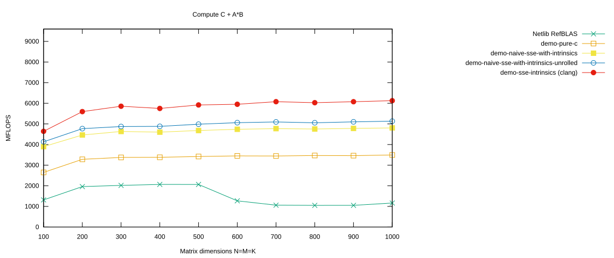
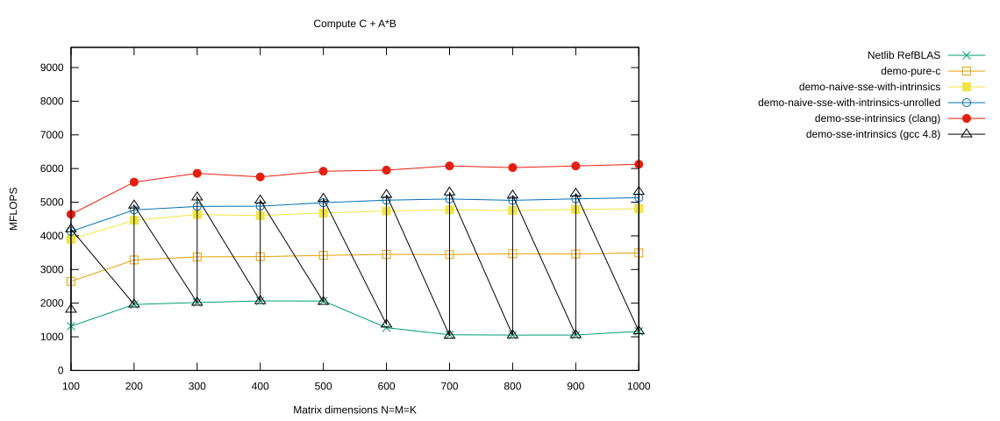

# Another SSE Intrinsics Approach

In this section we follow the idea of the BLIS micro kernel for x86-64 architectures with SSE.

Compared with the original BLIS micro kernel, we simplify quite a few things:

- We use SSE intrinsics instead of inline assembly.
- We do not take the latency of SSE instructions into account.
- We do not unroll the update loop.
- We do not explicitly prefetch panels or other data.

## Select the `demo-sse-intrinsics` Branch

Again, we first do a `make clean` before switching branches:

```console
$ cd ulmBLAS
$ make clean
```

Now check out the `demo-sse-intrinsics` branch:

```console
$ git checkout -B demo-sse-intrinsics remotes/origin/demo-sse-intrinsics
Switched to a new branch 'demo-sse-intrinsics'
Branch demo-sse-intrinsics set up to track remote branch demo-sse-intrinsics from origin.
```

Then compile the project:

```console
$ make
```

<details>
<summary>Show complete build output</summary>

```console
$shell> make                                                             
make -C src
clang -Wall -I. -O2  -mfpmath=sse -fomit-frame-pointer -DULM_BLOCKED -c -o auxiliary/xerbla.o auxiliary/xerbla.c
clang -Wall -I. -O2  -mfpmath=sse -fomit-frame-pointer -DULM_BLOCKED -c -o level1/dasum.o level1/dasum.c
clang -Wall -I. -O2  -mfpmath=sse -fomit-frame-pointer -DULM_BLOCKED -c -o level1/daxpy.o level1/daxpy.c
clang -Wall -I. -O2  -mfpmath=sse -fomit-frame-pointer -DULM_BLOCKED -c -o level1/dcopy.o level1/dcopy.c
clang -Wall -I. -O2  -mfpmath=sse -fomit-frame-pointer -DULM_BLOCKED -c -o level1/ddot.o level1/ddot.c
clang -Wall -I. -O2  -mfpmath=sse -fomit-frame-pointer -DULM_BLOCKED -c -o level1/dnrm2.o level1/dnrm2.c
clang -Wall -I. -O2  -mfpmath=sse -fomit-frame-pointer -DULM_BLOCKED -c -o level1/drot.o level1/drot.c
clang -Wall -I. -O2  -mfpmath=sse -fomit-frame-pointer -DULM_BLOCKED -c -o level1/drotg.o level1/drotg.c
clang -Wall -I. -O2  -mfpmath=sse -fomit-frame-pointer -DULM_BLOCKED -c -o level1/drotm.o level1/drotm.c
clang -Wall -I. -O2  -mfpmath=sse -fomit-frame-pointer -DULM_BLOCKED -c -o level1/drotmg.o level1/drotmg.c
clang -Wall -I. -O2  -mfpmath=sse -fomit-frame-pointer -DULM_BLOCKED -c -o level1/dscal.o level1/dscal.c
clang -Wall -I. -O2  -mfpmath=sse -fomit-frame-pointer -DULM_BLOCKED -c -o level1/dswap.o level1/dswap.c
clang -Wall -I. -O2  -mfpmath=sse -fomit-frame-pointer -DULM_BLOCKED -c -o level1/idamax.o level1/idamax.c
clang -Wall -I. -O2  -mfpmath=sse -fomit-frame-pointer -DULM_BLOCKED -c -o level3/dgemm.o level3/dgemm.c
clang -Wall -I. -O2  -mfpmath=sse -fomit-frame-pointer -DULM_BLOCKED -c -o level3/dgemm_nn.o level3/dgemm_nn.c
clang -Wall -I. -O2  -mfpmath=sse -fomit-frame-pointer -DULM_BLOCKED -c -o level3/dsymm.o level3/dsymm.c
clang -Wall -I. -O2  -mfpmath=sse -fomit-frame-pointer -DULM_BLOCKED -c -o level3/stubs.o level3/stubs.c
ar cru ../libulmblas.a  auxiliary/xerbla.o  level1/dasum.o level1/daxpy.o level1/dcopy.o level1/ddot.o level1/dnrm2.o level1/drot.o level1/drotg.o level1/drotm.o level1/drotmg.o level1/dscal.o level1/dswap.o level1/idamax.o  level3/dgemm.o level3/dgemm_nn.o level3/dsymm.o level3/stubs.o
ranlib ../libulmblas.a
clang -Wall -I. -O2  -mfpmath=sse -fomit-frame-pointer -DULM_BLOCKED -DFAKE_ATLAS -c -o auxiliary/atl_xerbla.o auxiliary/xerbla.c
clang -Wall -I. -O2  -mfpmath=sse -fomit-frame-pointer -DULM_BLOCKED -DFAKE_ATLAS -c -o level1/atl_dasum.o level1/dasum.c
clang -Wall -I. -O2  -mfpmath=sse -fomit-frame-pointer -DULM_BLOCKED -DFAKE_ATLAS -c -o level1/atl_daxpy.o level1/daxpy.c
clang -Wall -I. -O2  -mfpmath=sse -fomit-frame-pointer -DULM_BLOCKED -DFAKE_ATLAS -c -o level1/atl_dcopy.o level1/dcopy.c
clang -Wall -I. -O2  -mfpmath=sse -fomit-frame-pointer -DULM_BLOCKED -DFAKE_ATLAS -c -o level1/atl_ddot.o level1/ddot.c
clang -Wall -I. -O2  -mfpmath=sse -fomit-frame-pointer -DULM_BLOCKED -DFAKE_ATLAS -c -o level1/atl_dnrm2.o level1/dnrm2.c
clang -Wall -I. -O2  -mfpmath=sse -fomit-frame-pointer -DULM_BLOCKED -DFAKE_ATLAS -c -o level1/atl_drot.o level1/drot.c
clang -Wall -I. -O2  -mfpmath=sse -fomit-frame-pointer -DULM_BLOCKED -DFAKE_ATLAS -c -o level1/atl_drotg.o level1/drotg.c
clang -Wall -I. -O2  -mfpmath=sse -fomit-frame-pointer -DULM_BLOCKED -DFAKE_ATLAS -c -o level1/atl_drotm.o level1/drotm.c
clang -Wall -I. -O2  -mfpmath=sse -fomit-frame-pointer -DULM_BLOCKED -DFAKE_ATLAS -c -o level1/atl_drotmg.o level1/drotmg.c
clang -Wall -I. -O2  -mfpmath=sse -fomit-frame-pointer -DULM_BLOCKED -DFAKE_ATLAS -c -o level1/atl_dscal.o level1/dscal.c
clang -Wall -I. -O2  -mfpmath=sse -fomit-frame-pointer -DULM_BLOCKED -DFAKE_ATLAS -c -o level1/atl_dswap.o level1/dswap.c
clang -Wall -I. -O2  -mfpmath=sse -fomit-frame-pointer -DULM_BLOCKED -DFAKE_ATLAS -c -o level1/atl_idamax.o level1/idamax.c
clang -Wall -I. -O2  -mfpmath=sse -fomit-frame-pointer -DULM_BLOCKED -DFAKE_ATLAS -c -o level3/atl_dgemm.o level3/dgemm.c
clang -Wall -I. -O2  -mfpmath=sse -fomit-frame-pointer -DULM_BLOCKED -DFAKE_ATLAS -c -o level3/atl_dgemm_nn.o level3/dgemm_nn.c
clang -Wall -I. -O2  -mfpmath=sse -fomit-frame-pointer -DULM_BLOCKED -DFAKE_ATLAS -c -o level3/atl_dsymm.o level3/dsymm.c
clang -Wall -I. -O2  -mfpmath=sse -fomit-frame-pointer -DULM_BLOCKED -DFAKE_ATLAS -c -o level3/atl_stubs.o level3/stubs.c
ar cru ../libatlulmblas.a  auxiliary/atl_xerbla.o  level1/atl_dasum.o level1/atl_daxpy.o level1/atl_dcopy.o level1/atl_ddot.o level1/atl_dnrm2.o level1/atl_drot.o level1/atl_drotg.o level1/atl_drotm.o level1/atl_drotmg.o level1/atl_dscal.o level1/atl_dswap.o level1/atl_idamax.o  level3/atl_dgemm.o level3/atl_dgemm_nn.o level3/atl_dsymm.o level3/atl_stubs.o
ranlib ../libatlulmblas.a
make -C refblas
gfortran -fimplicit-none -O3 -c -o caxpy.o caxpy.f
gfortran -fimplicit-none -O3 -c -o ccopy.o ccopy.f
gfortran -fimplicit-none -O3 -c -o cdotc.o cdotc.f
gfortran -fimplicit-none -O3 -c -o cdotu.o cdotu.f
gfortran -fimplicit-none -O3 -c -o cgbmv.o cgbmv.f
gfortran -fimplicit-none -O3 -c -o cgemm.o cgemm.f
gfortran -fimplicit-none -O3 -c -o cgemv.o cgemv.f
gfortran -fimplicit-none -O3 -c -o cgerc.o cgerc.f
gfortran -fimplicit-none -O3 -c -o cgeru.o cgeru.f
gfortran -fimplicit-none -O3 -c -o chbmv.o chbmv.f
gfortran -fimplicit-none -O3 -c -o chemm.o chemm.f
gfortran -fimplicit-none -O3 -c -o chemv.o chemv.f
gfortran -fimplicit-none -O3 -c -o cher.o cher.f
gfortran -fimplicit-none -O3 -c -o cher2.o cher2.f
gfortran -fimplicit-none -O3 -c -o cher2k.o cher2k.f
gfortran -fimplicit-none -O3 -c -o cherk.o cherk.f
gfortran -fimplicit-none -O3 -c -o chpmv.o chpmv.f
gfortran -fimplicit-none -O3 -c -o chpr.o chpr.f
gfortran -fimplicit-none -O3 -c -o chpr2.o chpr2.f
gfortran -fimplicit-none -O3 -c -o crotg.o crotg.f
gfortran -fimplicit-none -O3 -c -o cscal.o cscal.f
gfortran -fimplicit-none -O3 -c -o csrot.o csrot.f
gfortran -fimplicit-none -O3 -c -o csscal.o csscal.f
gfortran -fimplicit-none -O3 -c -o cswap.o cswap.f
gfortran -fimplicit-none -O3 -c -o csymm.o csymm.f
gfortran -fimplicit-none -O3 -c -o csyr2k.o csyr2k.f
gfortran -fimplicit-none -O3 -c -o csyrk.o csyrk.f
gfortran -fimplicit-none -O3 -c -o ctbmv.o ctbmv.f
gfortran -fimplicit-none -O3 -c -o ctbsv.o ctbsv.f
gfortran -fimplicit-none -O3 -c -o ctpmv.o ctpmv.f
gfortran -fimplicit-none -O3 -c -o ctpsv.o ctpsv.f
gfortran -fimplicit-none -O3 -c -o ctrmm.o ctrmm.f
gfortran -fimplicit-none -O3 -c -o ctrmv.o ctrmv.f
gfortran -fimplicit-none -O3 -c -o ctrsm.o ctrsm.f
gfortran -fimplicit-none -O3 -c -o ctrsv.o ctrsv.f
gfortran -fimplicit-none -O3 -c -o dasum.o dasum.f
gfortran -fimplicit-none -O3 -c -o daxpy.o daxpy.f
gfortran -fimplicit-none -O3 -c -o dcabs1.o dcabs1.f
gfortran -fimplicit-none -O3 -c -o dcopy.o dcopy.f
gfortran -fimplicit-none -O3 -c -o ddot.o ddot.f
gfortran -fimplicit-none -O3 -c -o dgbmv.o dgbmv.f
gfortran -fimplicit-none -O3 -c -o dgemm.o dgemm.f
gfortran -fimplicit-none -O3 -c -o dgemv.o dgemv.f
gfortran -fimplicit-none -O3 -c -o dger.o dger.f
gfortran -fimplicit-none -O3 -c -o dnrm2.o dnrm2.f
gfortran -fimplicit-none -O3 -c -o drot.o drot.f
gfortran -fimplicit-none -O3 -c -o drotg.o drotg.f
gfortran -fimplicit-none -O3 -c -o drotm.o drotm.f
gfortran -fimplicit-none -O3 -c -o drotmg.o drotmg.f
gfortran -fimplicit-none -O3 -c -o dsbmv.o dsbmv.f
gfortran -fimplicit-none -O3 -c -o dscal.o dscal.f
gfortran -fimplicit-none -O3 -c -o dsdot.o dsdot.f
gfortran -fimplicit-none -O3 -c -o dspmv.o dspmv.f
gfortran -fimplicit-none -O3 -c -o dspr.o dspr.f
gfortran -fimplicit-none -O3 -c -o dspr2.o dspr2.f
gfortran -fimplicit-none -O3 -c -o dswap.o dswap.f
gfortran -fimplicit-none -O3 -c -o dsymm.o dsymm.f
gfortran -fimplicit-none -O3 -c -o dsymv.o dsymv.f
gfortran -fimplicit-none -O3 -c -o dsyr.o dsyr.f
gfortran -fimplicit-none -O3 -c -o dsyr2.o dsyr2.f
gfortran -fimplicit-none -O3 -c -o dsyr2k.o dsyr2k.f
gfortran -fimplicit-none -O3 -c -o dsyrk.o dsyrk.f
gfortran -fimplicit-none -O3 -c -o dtbmv.o dtbmv.f
gfortran -fimplicit-none -O3 -c -o dtbsv.o dtbsv.f
gfortran -fimplicit-none -O3 -c -o dtpmv.o dtpmv.f
gfortran -fimplicit-none -O3 -c -o dtpsv.o dtpsv.f
gfortran -fimplicit-none -O3 -c -o dtrmm.o dtrmm.f
gfortran -fimplicit-none -O3 -c -o dtrmv.o dtrmv.f
gfortran -fimplicit-none -O3 -c -o dtrsm.o dtrsm.f
gfortran -fimplicit-none -O3 -c -o dtrsv.o dtrsv.f
gfortran -fimplicit-none -O3 -c -o dzasum.o dzasum.f
gfortran -fimplicit-none -O3 -c -o dznrm2.o dznrm2.f
gfortran -fimplicit-none -O3 -c -o icamax.o icamax.f
gfortran -fimplicit-none -O3 -c -o idamax.o idamax.f
gfortran -fimplicit-none -O3 -c -o isamax.o isamax.f
gfortran -fimplicit-none -O3 -c -o izamax.o izamax.f
gfortran -fimplicit-none -O3 -c -o lsame.o lsame.f
gfortran -fimplicit-none -O3 -c -o sasum.o sasum.f
gfortran -fimplicit-none -O3 -c -o saxpy.o saxpy.f
gfortran -fimplicit-none -O3 -c -o scabs1.o scabs1.f
gfortran -fimplicit-none -O3 -c -o scasum.o scasum.f
gfortran -fimplicit-none -O3 -c -o scnrm2.o scnrm2.f
gfortran -fimplicit-none -O3 -c -o scopy.o scopy.f
gfortran -fimplicit-none -O3 -c -o sdot.o sdot.f
gfortran -fimplicit-none -O3 -c -o sdsdot.o sdsdot.f
gfortran -fimplicit-none -O3 -c -o sgbmv.o sgbmv.f
gfortran -fimplicit-none -O3 -c -o sgemm.o sgemm.f
gfortran -fimplicit-none -O3 -c -o sgemv.o sgemv.f
gfortran -fimplicit-none -O3 -c -o sger.o sger.f
gfortran -fimplicit-none -O3 -c -o snrm2.o snrm2.f
gfortran -fimplicit-none -O3 -c -o srot.o srot.f
gfortran -fimplicit-none -O3 -c -o srotg.o srotg.f
gfortran -fimplicit-none -O3 -c -o srotm.o srotm.f
gfortran -fimplicit-none -O3 -c -o srotmg.o srotmg.f
gfortran -fimplicit-none -O3 -c -o ssbmv.o ssbmv.f
gfortran -fimplicit-none -O3 -c -o sscal.o sscal.f
gfortran -fimplicit-none -O3 -c -o sspmv.o sspmv.f
gfortran -fimplicit-none -O3 -c -o sspr.o sspr.f
gfortran -fimplicit-none -O3 -c -o sspr2.o sspr2.f
gfortran -fimplicit-none -O3 -c -o sswap.o sswap.f
gfortran -fimplicit-none -O3 -c -o ssymm.o ssymm.f
gfortran -fimplicit-none -O3 -c -o ssymv.o ssymv.f
gfortran -fimplicit-none -O3 -c -o ssyr.o ssyr.f
gfortran -fimplicit-none -O3 -c -o ssyr2.o ssyr2.f
gfortran -fimplicit-none -O3 -c -o ssyr2k.o ssyr2k.f
gfortran -fimplicit-none -O3 -c -o ssyrk.o ssyrk.f
gfortran -fimplicit-none -O3 -c -o stbmv.o stbmv.f
gfortran -fimplicit-none -O3 -c -o stbsv.o stbsv.f
gfortran -fimplicit-none -O3 -c -o stpmv.o stpmv.f
gfortran -fimplicit-none -O3 -c -o stpsv.o stpsv.f
gfortran -fimplicit-none -O3 -c -o strmm.o strmm.f
gfortran -fimplicit-none -O3 -c -o strmv.o strmv.f
gfortran -fimplicit-none -O3 -c -o strsm.o strsm.f
gfortran -fimplicit-none -O3 -c -o strsv.o strsv.f
gfortran -fimplicit-none -O3 -c -o xerbla.o xerbla.f
gfortran -fimplicit-none -O3 -c -o xerbla_array.o xerbla_array.f
gfortran -fimplicit-none -O3 -c -o zaxpy.o zaxpy.f
gfortran -fimplicit-none -O3 -c -o zcopy.o zcopy.f
gfortran -fimplicit-none -O3 -c -o zdotc.o zdotc.f
gfortran -fimplicit-none -O3 -c -o zdotu.o zdotu.f
gfortran -fimplicit-none -O3 -c -o zdrot.o zdrot.f
gfortran -fimplicit-none -O3 -c -o zdscal.o zdscal.f
gfortran -fimplicit-none -O3 -c -o zgbmv.o zgbmv.f
gfortran -fimplicit-none -O3 -c -o zgemm.o zgemm.f
gfortran -fimplicit-none -O3 -c -o zgemv.o zgemv.f
gfortran -fimplicit-none -O3 -c -o zgerc.o zgerc.f
gfortran -fimplicit-none -O3 -c -o zgeru.o zgeru.f
gfortran -fimplicit-none -O3 -c -o zhbmv.o zhbmv.f
gfortran -fimplicit-none -O3 -c -o zhemm.o zhemm.f
gfortran -fimplicit-none -O3 -c -o zhemv.o zhemv.f
gfortran -fimplicit-none -O3 -c -o zher.o zher.f
gfortran -fimplicit-none -O3 -c -o zher2.o zher2.f
gfortran -fimplicit-none -O3 -c -o zher2k.o zher2k.f
gfortran -fimplicit-none -O3 -c -o zherk.o zherk.f
gfortran -fimplicit-none -O3 -c -o zhpmv.o zhpmv.f
gfortran -fimplicit-none -O3 -c -o zhpr.o zhpr.f
gfortran -fimplicit-none -O3 -c -o zhpr2.o zhpr2.f
gfortran -fimplicit-none -O3 -c -o zrotg.o zrotg.f
gfortran -fimplicit-none -O3 -c -o zscal.o zscal.f
gfortran -fimplicit-none -O3 -c -o zswap.o zswap.f
gfortran -fimplicit-none -O3 -c -o zsymm.o zsymm.f
gfortran -fimplicit-none -O3 -c -o zsyr2k.o zsyr2k.f
gfortran -fimplicit-none -O3 -c -o zsyrk.o zsyrk.f
gfortran -fimplicit-none -O3 -c -o ztbmv.o ztbmv.f
gfortran -fimplicit-none -O3 -c -o ztbsv.o ztbsv.f
gfortran -fimplicit-none -O3 -c -o ztpmv.o ztpmv.f
gfortran -fimplicit-none -O3 -c -o ztpsv.o ztpsv.f
gfortran -fimplicit-none -O3 -c -o ztrmm.o ztrmm.f
gfortran -fimplicit-none -O3 -c -o ztrmv.o ztrmv.f
gfortran -fimplicit-none -O3 -c -o ztrsm.o ztrsm.f
gfortran -fimplicit-none -O3 -c -o ztrsv.o ztrsv.f
ar cru ../librefblas.a caxpy.o ccopy.o cdotc.o cdotu.o cgbmv.o cgemm.o cgemv.o cgerc.o cgeru.o chbmv.o chemm.o chemv.o cher.o cher2.o cher2k.o cherk.o chpmv.o chpr.o chpr2.o crotg.o cscal.o csrot.o csscal.o cswap.o csymm.o csyr2k.o csyrk.o ctbmv.o ctbsv.o ctpmv.o ctpsv.o ctrmm.o ctrmv.o ctrsm.o ctrsv.o dasum.o daxpy.o dcabs1.o dcopy.o ddot.o dgbmv.o dgemm.o dgemv.o dger.o dnrm2.o drot.o drotg.o drotm.o drotmg.o dsbmv.o dscal.o dsdot.o dspmv.o dspr.o dspr2.o dswap.o dsymm.o dsymv.o dsyr.o dsyr2.o dsyr2k.o dsyrk.o dtbmv.o dtbsv.o dtpmv.o dtpsv.o dtrmm.o dtrmv.o dtrsm.o dtrsv.o dzasum.o dznrm2.o icamax.o idamax.o isamax.o izamax.o lsame.o sasum.o saxpy.o scabs1.o scasum.o scnrm2.o scopy.o sdot.o sdsdot.o sgbmv.o sgemm.o sgemv.o sger.o snrm2.o srot.o srotg.o srotm.o srotmg.o ssbmv.o sscal.o sspmv.o sspr.o sspr2.o sswap.o ssymm.o ssymv.o ssyr.o ssyr2.o ssyr2k.o ssyrk.o stbmv.o stbsv.o stpmv.o stpsv.o strmm.o strmv.o strsm.o strsv.o xerbla.o xerbla_array.o zaxpy.o zcopy.o zdotc.o zdotu.o zdrot.o zdscal.o zgbmv.o zgemm.o zgemv.o zgerc.o zgeru.o zhbmv.o zhemm.o zhemv.o zher.o zher2.o zher2k.o zherk.o zhpmv.o zhpr.o zhpr2.o zrotg.o zscal.o zswap.o zsymm.o zsyr2k.o zsyrk.o ztbmv.o ztbsv.o ztpmv.o ztpsv.o ztrmm.o ztrmv.o ztrsm.o ztrsv.o
ranlib ../librefblas.a
make -C test
gfortran dblat1.f -L.. -lrefblas -o dblat1_ref
dblat1.f:215.44:
               CALL STEST1(DNRM2(N,SX,INCX),STEMP,STEMP,SFAC)           
                                            1
Warning: Rank mismatch in argument 'strue1' at (1) (scalar and rank-1)
dblat1.f:219.44:
               CALL STEST1(DASUM(N,SX,INCX),STEMP,STEMP,SFAC)           
                                            1
Warning: Rank mismatch in argument 'strue1' at (1) (scalar and rank-1)
gfortran dblat3.f -L.. -lrefblas -o dblat3_ref
gfortran dblat1.f -L.. -lulmblas -o dblat1_ulm
dblat1.f:215.44:
               CALL STEST1(DNRM2(N,SX,INCX),STEMP,STEMP,SFAC)           
                                            1
Warning: Rank mismatch in argument 'strue1' at (1) (scalar and rank-1)
dblat1.f:219.44:
               CALL STEST1(DASUM(N,SX,INCX),STEMP,STEMP,SFAC)           
                                            1
Warning: Rank mismatch in argument 'strue1' at (1) (scalar and rank-1)
gfortran dblat3.f -L.. -lulmblas -o dblat3_ulm
make -C bench
gcc-4.8 -c -DL2SIZE=4194304 -DAdd_ -DF77_INTEGER=int -DStringSunStyle -DATL_SSE2 -DDREAL   -c -o l1blastst.o l1blastst.c
gcc-4.8 -c -DL2SIZE=4194304 -DAdd_ -DF77_INTEGER=int -DStringSunStyle -DATL_SSE2 -DDREAL   -c -o ATL_cputime.o ATL_cputime.c
gcc-4.8 -c -DL2SIZE=4194304 -DAdd_ -DF77_INTEGER=int -DStringSunStyle -DATL_SSE2 -DDREAL   -c -o ATL_epsilon.o ATL_epsilon.c
gcc-4.8 -c -DL2SIZE=4194304 -DAdd_ -DF77_INTEGER=int -DStringSunStyle -DATL_SSE2 -DDREAL   -c -o ATL_f77amax.o ATL_f77amax.c
gcc-4.8 -c -DL2SIZE=4194304 -DAdd_ -DF77_INTEGER=int -DStringSunStyle -DATL_SSE2 -DDREAL   -c -o ATL_f77asum.o ATL_f77asum.c
gcc-4.8 -c -DL2SIZE=4194304 -DAdd_ -DF77_INTEGER=int -DStringSunStyle -DATL_SSE2 -DDREAL   -c -o ATL_f77axpy.o ATL_f77axpy.c
gcc-4.8 -c -DL2SIZE=4194304 -DAdd_ -DF77_INTEGER=int -DStringSunStyle -DATL_SSE2 -DDREAL   -c -o ATL_f77copy.o ATL_f77copy.c
gcc-4.8 -c -DL2SIZE=4194304 -DAdd_ -DF77_INTEGER=int -DStringSunStyle -DATL_SSE2 -DDREAL   -c -o ATL_f77dot.o ATL_f77dot.c
gcc-4.8 -c -DL2SIZE=4194304 -DAdd_ -DF77_INTEGER=int -DStringSunStyle -DATL_SSE2 -DDREAL   -c -o ATL_f77gemm.o ATL_f77gemm.c
gcc-4.8 -c -DL2SIZE=4194304 -DAdd_ -DF77_INTEGER=int -DStringSunStyle -DATL_SSE2 -DDREAL   -c -o ATL_f77nrm2.o ATL_f77nrm2.c
gcc-4.8 -c -DL2SIZE=4194304 -DAdd_ -DF77_INTEGER=int -DStringSunStyle -DATL_SSE2 -DDREAL   -c -o ATL_f77rot.o ATL_f77rot.c
gcc-4.8 -c -DL2SIZE=4194304 -DAdd_ -DF77_INTEGER=int -DStringSunStyle -DATL_SSE2 -DDREAL   -c -o ATL_f77rotg.o ATL_f77rotg.c
gcc-4.8 -c -DL2SIZE=4194304 -DAdd_ -DF77_INTEGER=int -DStringSunStyle -DATL_SSE2 -DDREAL   -c -o ATL_f77rotm.o ATL_f77rotm.c
gcc-4.8 -c -DL2SIZE=4194304 -DAdd_ -DF77_INTEGER=int -DStringSunStyle -DATL_SSE2 -DDREAL   -c -o ATL_f77rotmg.o ATL_f77rotmg.c
gcc-4.8 -c -DL2SIZE=4194304 -DAdd_ -DF77_INTEGER=int -DStringSunStyle -DATL_SSE2 -DDREAL   -c -o ATL_f77scal.o ATL_f77scal.c
gcc-4.8 -c -DL2SIZE=4194304 -DAdd_ -DF77_INTEGER=int -DStringSunStyle -DATL_SSE2 -DDREAL   -c -o ATL_f77swap.o ATL_f77swap.c
gcc-4.8 -c -DL2SIZE=4194304 -DAdd_ -DF77_INTEGER=int -DStringSunStyle -DATL_SSE2 -DDREAL   -c -o ATL_f77symm.o ATL_f77symm.c
gcc-4.8 -c -DL2SIZE=4194304 -DAdd_ -DF77_INTEGER=int -DStringSunStyle -DATL_SSE2 -DDREAL   -c -o ATL_f77syr2k.o ATL_f77syr2k.c
gcc-4.8 -c -DL2SIZE=4194304 -DAdd_ -DF77_INTEGER=int -DStringSunStyle -DATL_SSE2 -DDREAL   -c -o ATL_f77syrk.o ATL_f77syrk.c
gcc-4.8 -c -DL2SIZE=4194304 -DAdd_ -DF77_INTEGER=int -DStringSunStyle -DATL_SSE2 -DDREAL   -c -o ATL_f77trmm.o ATL_f77trmm.c
gcc-4.8 -c -DL2SIZE=4194304 -DAdd_ -DF77_INTEGER=int -DStringSunStyle -DATL_SSE2 -DDREAL   -c -o ATL_f77trsm.o ATL_f77trsm.c
gcc-4.8 -c -DL2SIZE=4194304 -DAdd_ -DF77_INTEGER=int -DStringSunStyle -DATL_SSE2 -DDREAL   -c -o ATL_flushcache.o ATL_flushcache.c
gcc-4.8 -c -DL2SIZE=4194304 -DAdd_ -DF77_INTEGER=int -DStringSunStyle -DATL_SSE2 -DDREAL   -c -o ATL_gediffnrm1.o ATL_gediffnrm1.c
gcc-4.8 -c -DL2SIZE=4194304 -DAdd_ -DF77_INTEGER=int -DStringSunStyle -DATL_SSE2 -DDREAL   -c -o ATL_gegen.o ATL_gegen.c
gcc-4.8 -c -DL2SIZE=4194304 -DAdd_ -DF77_INTEGER=int -DStringSunStyle -DATL_SSE2 -DDREAL   -c -o ATL_genrm1.o ATL_genrm1.c
gcc-4.8 -c -DL2SIZE=4194304 -DAdd_ -DF77_INTEGER=int -DStringSunStyle -DATL_SSE2 -DDREAL   -c -o ATL_infnrm.o ATL_infnrm.c
gcc-4.8 -c -DL2SIZE=4194304 -DAdd_ -DF77_INTEGER=int -DStringSunStyle -DATL_SSE2 -DDREAL   -c -o ATL_rand.o ATL_rand.c
gcc-4.8 -c -DL2SIZE=4194304 -DAdd_ -DF77_INTEGER=int -DStringSunStyle -DATL_SSE2 -DDREAL   -c -o ATL_set.o ATL_set.c
gcc-4.8 -c -DL2SIZE=4194304 -DAdd_ -DF77_INTEGER=int -DStringSunStyle -DATL_SSE2 -DDREAL   -c -o ATL_synrm.o ATL_synrm.c
gcc-4.8 -c -DL2SIZE=4194304 -DAdd_ -DF77_INTEGER=int -DStringSunStyle -DATL_SSE2 -DDREAL   -c -o ATL_trnrm1.o ATL_trnrm1.c
gcc-4.8 -c -DL2SIZE=4194304 -DAdd_ -DF77_INTEGER=int -DStringSunStyle -DATL_SSE2 -DDREAL   -c -o ATL_vdiff.o ATL_vdiff.c
gcc-4.8 -c -DL2SIZE=4194304 -DAdd_ -DF77_INTEGER=int -DStringSunStyle -DATL_SSE2 -DDREAL   -c -o ATL_zero.o ATL_zero.c
gfortran   -c -o ATL_df77wrap.o ATL_df77wrap.f
ar r libtstatlas.a  ATL_cputime.o  ATL_epsilon.o  ATL_f77amax.o  ATL_f77asum.o  ATL_f77axpy.o  ATL_f77copy.o  ATL_f77dot.o  ATL_f77gemm.o  ATL_f77nrm2.o  ATL_f77rot.o  ATL_f77rotg.o  ATL_f77rotm.o  ATL_f77rotmg.o  ATL_f77scal.o  ATL_f77swap.o  ATL_f77symm.o  ATL_f77syr2k.o  ATL_f77syrk.o  ATL_f77trmm.o  ATL_f77trsm.o  ATL_flushcache.o  ATL_gediffnrm1.o  ATL_gegen.o  ATL_genrm1.o  ATL_infnrm.o  ATL_rand.o  ATL_set.o  ATL_synrm.o  ATL_trnrm1.o  ATL_vdiff.o  ATL_zero.o  ATL_df77wrap.o
ar: creating archive libtstatlas.a
ranlib libtstatlas.a
gfortran -o xdl1blastst l1blastst.o libtstatlas.a ../libatlulmblas.a ../librefblas.a
gfortran -o xdl3blastst l3blastst.o libtstatlas.a ../libatlulmblas.a ../librefblas.a
```

</details>

Note that this time we are using **Clang** to compile the ulmBLAS implementation. We will come back to this below.

## The Micro Kernel Algorithm

Again, consider the rank-one update

$$
\mathbf{AB}
\leftarrow
\mathbf{AB}
+
\begin{pmatrix}
a_{4l}\\
a_{4l+1}\\
a_{4l+2}\\
a_{4l+3}
\end{pmatrix}
\begin{pmatrix}
b_{4l} &
b_{4l+1} &
b_{4l+2} &
b_{4l+3}
\end{pmatrix}.
$$

As before, we keep the complete $4\times4$ matrix $\mathbf{AB}$ in eight SSE registers. However, we change how the operands from $B$ are loaded and how the entries of $\mathbf{AB}$ are grouped in registers.

In the previous, naive approach, a single 64-bit operand such as $b_{4l}$ was duplicated into both halves of a 128-bit SSE register.

This time, we store two different operands from $B$ in each register:

$$
\begin{aligned}
\mathbb{tmp}_0 &\leftarrow
\begin{pmatrix}
a_{4l}\\
a_{4l+1}
\end{pmatrix},
&
\mathbb{tmp}_1 &\leftarrow
\begin{pmatrix}
a_{4l+2}\\
a_{4l+3}
\end{pmatrix},
\\
\mathbb{tmp}_2 &\leftarrow
\begin{pmatrix}
b_{4l}\\
b_{4l+1}
\end{pmatrix},
&
\mathbb{tmp}_3 &\leftarrow
\begin{pmatrix}
b_{4l+2}\\
b_{4l+3}
\end{pmatrix}.
\end{aligned}
$$

A component-wise multiplication such as

$$
\mathbb{tmp}_0 \odot \mathbb{tmp}_2
$$

therefore computes

$$
\begin{pmatrix}
a_{4l}b_{4l}\\
a_{4l+1}b_{4l+1}
\end{pmatrix}.
$$

These are contributions to the diagonal entries $AB_{0,0}$ and $AB_{1,1}$.

In the same way we can directly compute contributions to

$$
(AB_{2,0},AB_{3,1}),\qquad
(AB_{0,2},AB_{1,3}),\qquad
(AB_{2,2},AB_{3,3}).
$$

For the remaining entries, we swap the two doubles in the registers containing values from $B$:

$$
\begin{aligned}
\mathbb{tmp}_4 &\leftarrow
\begin{pmatrix}
b_{4l+1}\\
b_{4l}
\end{pmatrix},
&
\mathbb{tmp}_5 &\leftarrow
\begin{pmatrix}
b_{4l+3}\\
b_{4l+2}
\end{pmatrix}.
\end{aligned}
$$

This is implemented with `_mm_shuffle_pd`.

Using eight SSE registers for the entries of $\mathbf{AB}$ leaves two registers, $\mathbb{tmp}_6$ and $\mathbb{tmp}_7$, for intermediate results.

The entries of $\mathbf{AB}$ are now grouped differently from the previous implementation. For example,

$$
\mathbb{ab}_{00,11}
=
\begin{pmatrix}
AB_{0,0}\\
AB_{1,1}
\end{pmatrix},
\qquad
\mathbb{ab}_{01,10}
=
\begin{pmatrix}
AB_{0,1}\\
AB_{1,0}
\end{pmatrix}.
$$

So instead of keeping pairs of elements from the same column together, we now keep diagonal and anti-diagonal pairs together.

This unusual layout is convenient for the SIMD operations in the inner loop. When the result is copied back to memory, the low and high doubles of these registers have to be stored separately in their proper positions.

## The `dgemm_nn` Code

The complete implementation is contained in

[`src/level3/dgemm_nn.c`](https://github.com/michael-lehn/ulmBLAS/blob/demo-sse-intrinsics/src/level3/dgemm_nn.c)

on the `demo-sse-intrinsics` branch.

The computational core is:

```c
register __m128d ab_00_11, ab_20_31;
register __m128d ab_01_10, ab_21_30;
register __m128d ab_02_13, ab_22_33;
register __m128d ab_03_12, ab_23_32;

register __m128d tmp0, tmp1, tmp2, tmp3;
register __m128d tmp4, tmp5, tmp6, tmp7;

ab_00_11 = _mm_setzero_pd();
ab_20_31 = _mm_setzero_pd();
ab_01_10 = _mm_setzero_pd();
ab_21_30 = _mm_setzero_pd();
ab_02_13 = _mm_setzero_pd();
ab_22_33 = _mm_setzero_pd();
ab_03_12 = _mm_setzero_pd();
ab_23_32 = _mm_setzero_pd();

for (l=0; l<kc; ++l) {
    tmp0 = _mm_load_pd(A);
    tmp1 = _mm_load_pd(A+2);

    tmp2 = _mm_load_pd(B);
    tmp3 = _mm_load_pd(B+2);

    tmp4 = _mm_shuffle_pd(tmp2, tmp2, _MM_SHUFFLE2(0,1));
    tmp5 = _mm_shuffle_pd(tmp3, tmp3, _MM_SHUFFLE2(0,1));

    tmp6 = tmp2;

    tmp2 = _mm_mul_pd(tmp2, tmp0);
    tmp6 = _mm_mul_pd(tmp6, tmp1);

    ab_00_11 = _mm_add_pd(ab_00_11, tmp2);
    ab_20_31 = _mm_add_pd(ab_20_31, tmp6);

    tmp7 = tmp4;

    tmp4 = _mm_mul_pd(tmp4, tmp0);
    tmp7 = _mm_mul_pd(tmp7, tmp1);

    ab_01_10 = _mm_add_pd(ab_01_10, tmp4);
    ab_21_30 = _mm_add_pd(ab_21_30, tmp7);

    tmp6 = tmp3;

    tmp3 = _mm_mul_pd(tmp3, tmp0);
    tmp6 = _mm_mul_pd(tmp6, tmp1);

    ab_02_13 = _mm_add_pd(ab_02_13, tmp3);
    ab_22_33 = _mm_add_pd(ab_22_33, tmp6);

    tmp7 = tmp5;

    tmp5 = _mm_mul_pd(tmp5, tmp0);
    tmp7 = _mm_mul_pd(tmp7, tmp1);

    ab_03_12 = _mm_add_pd(ab_03_12, tmp5);
    ab_23_32 = _mm_add_pd(ab_23_32, tmp7);

    A += 4;
    B += 4;
}
```

Compared with the previous version, there are no scalar broadcasts of the entries of $B$. Instead, two doubles are loaded at once and shuffled as needed.

## Benchmark Results

Run the benchmark:

```console
$ cd bench
$ ./xdl3blastst > report
$ cat report
```

<details>
<summary>Show complete benchmark output</summary>

```text
./xdl3blastst
--------------------------------- GEMM ----------------------------------
TST# A B    M    N    K ALPHA  LDA  LDB  BETA  LDC  TIME MFLOP SpUp  TEST
==== = = ==== ==== ==== ===== ==== ==== ===== ==== ===== ===== ==== =====
   0 N N  100  100  100   1.0 1000 1000   1.0 1000  0.00 1806.7 1.00 -----
   0 N N  100  100  100   1.0 1000 1000   1.0 1000  0.00 4640.4 2.57 PASS
   1 N N  200  200  200   1.0 1000 1000   1.0 1000  0.01 1961.3 1.00 -----
   1 N N  200  200  200   1.0 1000 1000   1.0 1000  0.00 5596.4 2.85 PASS
   2 N N  300  300  300   1.0 1000 1000   1.0 1000  0.03 2018.2 1.00 -----
   2 N N  300  300  300   1.0 1000 1000   1.0 1000  0.01 5856.8 2.90 PASS
   3 N N  400  400  400   1.0 1000 1000   1.0 1000  0.06 2065.7 1.00 -----
   3 N N  400  400  400   1.0 1000 1000   1.0 1000  0.02 5750.0 2.78 PASS
   4 N N  500  500  500   1.0 1000 1000   1.0 1000  0.12 2067.0 1.00 -----
   4 N N  500  500  500   1.0 1000 1000   1.0 1000  0.04 5919.1 2.86 PASS
   5 N N  600  600  600   1.0 1000 1000   1.0 1000  0.33 1292.4 1.00 -----
   5 N N  600  600  600   1.0 1000 1000   1.0 1000  0.07 5952.3 4.61 PASS
   6 N N  700  700  700   1.0 1000 1000   1.0 1000  0.65 1059.8 1.00 -----
   6 N N  700  700  700   1.0 1000 1000   1.0 1000  0.11 6077.2 5.73 PASS
   7 N N  800  800  800   1.0 1000 1000   1.0 1000  1.00 1022.0 1.00 -----
   7 N N  800  800  800   1.0 1000 1000   1.0 1000  0.17 6028.7 5.90 PASS
   8 N N  900  900  900   1.0 1000 1000   1.0 1000  1.38 1058.5 1.00 -----
   8 N N  900  900  900   1.0 1000 1000   1.0 1000  0.24 6076.0 5.74 PASS
   9 N N 1000 1000 1000   1.0 1000 1000   1.0 1000  1.71 1166.3 1.00 -----
   9 N N 1000 1000 1000   1.0 1000 1000   1.0 1000  0.33 6126.5 5.25 PASS

10 tests run, 10 passed
```

</details>

Filter out the results for this branch:

```console
$ grep PASS report > demo-sse-intrinsics
```

Use the following gnuplot script `bench5.gps` to compare the implementations:

```gnuplot
set terminal svg size 1140,480 background rgb 'white'
set output "bench5.svg"

set xlabel "Matrix dimensions N=M=K"
set ylabel "MFLOPS"
set yrange [0:9600]
set title "Compute C + A*B"
set key outside

plot "refBLAS" using 4:13 with linespoints lt 2 \
         title "Netlib RefBLAS", \
     "demo-pure-c" using 4:13 with linespoints lt 4 \
         title "demo-pure-c", \
     "demo-naive-sse-with-intrinsics" using 4:13 with linespoints lt 5 \
         title "demo-naive-sse-with-intrinsics", \
     "demo-naive-sse-with-intrinsics-unrolled" using 4:13 with linespoints lt 6 \
         title "demo-naive-sse-with-intrinsics-unrolled", \
     "demo-sse-intrinsics" using 4:13 with linespoints lt 7 \
         title "demo-sse-intrinsics (clang)"
```

Generate the plot with

```console
$ gnuplot bench5.gps
```



This implementation reaches slightly more than **6.1 GFLOPS** on the original benchmark machine.

## Sensitivity to Compilers

You may have noticed that we used **Clang** above.

This time, GCC 4.8 gives substantially poorer results.

The compiler used in the original experiment was:

```console
$ gcc-4.8 --version
gcc-4.8 (Homebrew gcc 4.8.3_1) 4.8.3
Copyright (C) 2013 Free Software Foundation, Inc.
```

Compile only the micro-kernel source with GCC 4.8:

```console
$ cd src
$ gcc-4.8 -Wall -I. -O3 -msse3 -mfpmath=sse -fomit-frame-pointer \
    -DFAKE_ATLAS -c -o level3/atl_dgemm_nn.o level3/dgemm_nn.c

$ make
ar cru ../libatlulmblas.a ...
ranlib ../libatlulmblas.a

$ cd ../bench
$ make
gfortran -o xdl1blastst l1blastst.o libtstatlas.a ../libatlulmblas.a ../librefblas.a
gfortran -o xdl3blastst l3blastst.o libtstatlas.a ../libatlulmblas.a ../librefblas.a
```

Running the benchmark now gives:

<details>
<summary>Show benchmark output with GCC 4.8</summary>

```text
--------------------------------- GEMM ----------------------------------
TST# A B    M    N    K ALPHA  LDA  LDB  BETA  LDC  TIME MFLOP SpUp  TEST
==== = = ==== ==== ==== ===== ==== ==== ===== ==== ===== ===== ==== =====
   0 N N  100  100  100   1.0 1000 1000   1.0 1000  0.00 1810.0 1.00 -----
   0 N N  100  100  100   1.0 1000 1000   1.0 1000  0.00 4201.7 2.32 PASS
   1 N N  200  200  200   1.0 1000 1000   1.0 1000  0.01 1963.7 1.00 -----
   1 N N  200  200  200   1.0 1000 1000   1.0 1000  0.00 4906.5 2.50 PASS
   2 N N  300  300  300   1.0 1000 1000   1.0 1000  0.03 2017.8 1.00 -----
   2 N N  300  300  300   1.0 1000 1000  1.0 1000  0.01 5145.3 2.55 PASS
   3 N N  400  400  400   1.0 1000 1000   1.0 1000  0.06 2067.3 1.00 -----
   3 N N  400  400  400   1.0 1000 1000   1.0 1000  0.03 5054.5 2.44 PASS
   4 N N  500  500  500   1.0 1000 1000   1.0 1000  0.12 2042.8 1.00 -----
   4 N N  500  500  500   1.0 1000 1000   1.0 1000  0.05 5103.9 2.50 PASS
   5 N N  600  600  600   1.0 1000 1000   1.0 1000  0.32 1368.4 1.00 -----
   5 N N  600  600  600   1.0 1000 1000   1.0 1000  0.08 5219.9 3.81 PASS
   6 N N  700  700  700   1.0 1000 1000   1.0 1000  0.66 1039.3 1.00 -----
   6 N N  700  700  700   1.0 1000 1000   1.0 1000  0.13 5294.4 5.09 PASS
   7 N N  800  800  800   1.0 1000 1000   1.0 1000  0.98 1049.0 1.00 -----
   7 N N  800  800  800   1.0 1000 1000   1.0 1000  0.20 5201.2 4.96 PASS
   8 N N  900  900  900   1.0 1000 1000   1.0 1000  1.38 1055.7 1.00 -----
   8 N N  900  900  900   1.0 1000 1000   1.0 1000  0.28 5259.6 4.98 PASS
   9 N N 1000 1000 1000   1.0 1000 1000   1.0 1000  1.71 1168.5 1.00 -----
   9 N N 1000 1000 1000   1.0 1000 1000   1.0 1000  0.38 5309.8 4.54 PASS

10 tests run, 10 passed
```

</details>

Save these results separately:

```console
$ ./xdl3blastst > report
$ grep PASS report > demo-sse-intrinsics-gcc
```

The two compiler versions can now be compared directly:

```gnuplot
set terminal svg size 1140,480 background rgb 'white'
set output "bench6.svg"

set xlabel "Matrix dimensions N=M=K"
set ylabel "MFLOPS"
set yrange [0:9600]
set title "Compute C + A*B"
set key outside

plot "refBLAS" using 4:13 with linespoints lt 2 \
         title "Netlib RefBLAS", \
     "demo-pure-c" using 4:13 with linespoints lt 4 \
         title "demo-pure-c", \
     "demo-naive-sse-with-intrinsics" using 4:13 with linespoints lt 5 \
         title "demo-naive-sse-with-intrinsics", \
     "demo-naive-sse-with-intrinsics-unrolled" using 4:13 with linespoints lt 6 \
         title "demo-naive-sse-with-intrinsics-unrolled", \
     "demo-sse-intrinsics" using 4:13 with linespoints lt 7 \
         title "demo-sse-intrinsics (clang)", \
     "demo-sse-intrinsics-gcc" using 4:13 with linespoints lt 8 \
         title "demo-sse-intrinsics (gcc 4.8)"
```

```console
$ gnuplot bench6.gps
```



## Analyzing the Generated Assembly

The performance difference suggests that it is worth looking at what the two compilers actually generate for the inner loop.

### GCC 4.8

<details>
<summary>Show GCC 4.8 assembly excerpt</summary>

```asm
        xorpd           %xmm9, %xmm9
        movapd          %xmm9, %xmm11
        movapd          %xmm9, %xmm8
        movapd          %xmm9, %xmm10
        movapd          %xmm9, %xmm13
        movapd          %xmm9, %xmm15
        movapd          %xmm9, %xmm12
        movapd          %xmm9, %xmm14

L3:
        movapd          (%rdx), %xmm5
        addq            $32, %rdx
        addq            $32, %rsi
        movapd          -16(%rsi), %xmm2
        movapd          %xmm5, %xmm7
        movapd          %xmm5, %xmm1
        movapd          -32(%rsi), %xmm3
        shufpd          $1, %xmm5, %xmm7
        mulpd           %xmm2, %xmm5
        movapd          -16(%rdx), %xmm4
        mulpd           %xmm3, %xmm1
        cmpq            %rdi, %rdx
        movapd          %xmm4, %xmm6
        shufpd          $1, %xmm4, %xmm6
        addpd           %xmm5, %xmm12
        ...
        jne             L3
```

> **TODO from the original 2014 tutorial:** re-code this to equivalent SSE intrinsics.

</details>

### Clang

<details>
<summary>Show Clang assembly excerpt</summary>

```asm
        xorpd           %xmm8, %xmm8
        xorpd           %xmm9, %xmm9
        xorpd           %xmm14, %xmm14
        xorpd           %xmm15, %xmm15
        xorpd           %xmm10, %xmm10
        xorpd           %xmm11, %xmm11
        xorpd           %xmm12, %xmm12
        xorpd           %xmm13, %xmm13

LBB1_1:
        movapd          (%rsi), %xmm6
        movapd          16(%rsi), %xmm7
        movapd          (%rdx), %xmm2
        movapd          16(%rdx), %xmm3

        movapd          %xmm6, %xmm4
        mulpd           %xmm2, %xmm4

        movapd          %xmm7, %xmm5
        mulpd           %xmm2, %xmm5

        pshufd          $78, %xmm2, %xmm2
        addpd           %xmm4, %xmm8
        addpd           %xmm5, %xmm9
        ...
        jne             LBB1_1
```

> **TODO from the original 2014 tutorial:** re-code this to equivalent SSE intrinsics.

</details>

## Conclusion

The performance difference is mainly due to **instruction latency**.

Suppose instruction `inst2` depends on the result of `inst1`. Executing `inst2` immediately after `inst1` can stall the pipeline while waiting for the result.

If there are independent instructions available, we can instead perform useful work between the two dependent instructions:

```text
inst1
independent work
independent work
inst2
```

This improves instruction-level parallelism and gives the processor a better opportunity to hide latency.

On the next page, we therefore take a closer look at the ordering of the SSE instructions.

---

[← Previous](../page04/README.md) | [Main Page](../README.md) | [Next →](../page06/README.md)

Copyright © 2014 Michael Lehn
