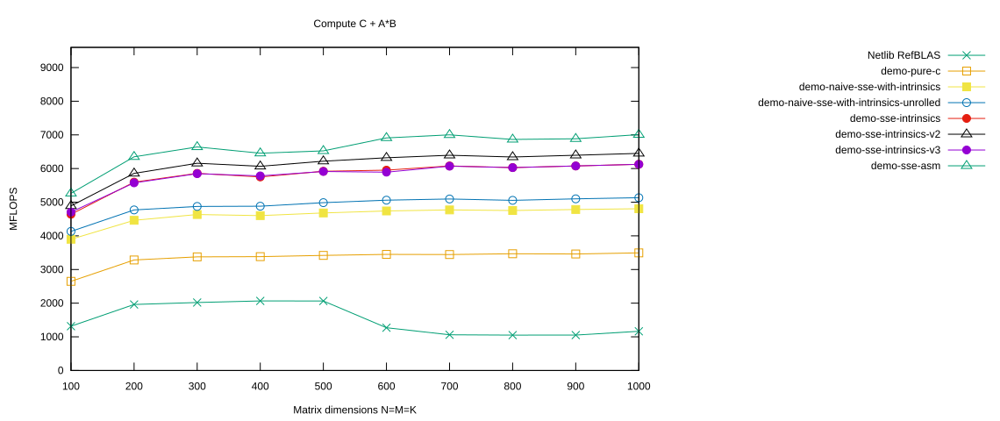

# Inline Assembler Micro Kernel

We now go one step further and translate the micro kernel from the previous page into assembly code ourselves.

The translation is fairly straightforward: most SSE intrinsics correspond directly to individual SSE instructions. In the comments of the assembly code, we keep the original intrinsics so that the two versions can easily be compared.

The assembler block is declared as `volatile`. This prevents the compiler from removing or moving the block as a whole; more importantly for our purpose, the instruction sequence *inside* the inline assembly is exactly the sequence we specify.

We are finally in full control of instruction scheduling.

## Select the `demo-sse-asm` Branch

As before, first clean the project:

```console
$ cd ulmBLAS
$ make clean
```

Now check out the `demo-sse-asm` branch:

```console
$ git checkout -B demo-sse-asm remotes/origin/demo-sse-asm
Switched to a new branch 'demo-sse-asm'
Branch demo-sse-asm set up to track remote branch demo-sse-asm from origin.
```

Then compile the project:

```console
$ make
```

<details>
<summary>Show complete build output</summary>

```console
$shell> make                                                             
make -C src
clang -Wall -I. -O2  -mfpmath=sse -fomit-frame-pointer -DULM_BLOCKED -c -o auxiliary/xerbla.o auxiliary/xerbla.c
clang -Wall -I. -O2  -mfpmath=sse -fomit-frame-pointer -DULM_BLOCKED -c -o level1/dasum.o level1/dasum.c
clang -Wall -I. -O2  -mfpmath=sse -fomit-frame-pointer -DULM_BLOCKED -c -o level1/daxpy.o level1/daxpy.c
clang -Wall -I. -O2  -mfpmath=sse -fomit-frame-pointer -DULM_BLOCKED -c -o level1/dcopy.o level1/dcopy.c
clang -Wall -I. -O2  -mfpmath=sse -fomit-frame-pointer -DULM_BLOCKED -c -o level1/ddot.o level1/ddot.c
clang -Wall -I. -O2  -mfpmath=sse -fomit-frame-pointer -DULM_BLOCKED -c -o level1/dnrm2.o level1/dnrm2.c
clang -Wall -I. -O2  -mfpmath=sse -fomit-frame-pointer -DULM_BLOCKED -c -o level1/drot.o level1/drot.c
clang -Wall -I. -O2  -mfpmath=sse -fomit-frame-pointer -DULM_BLOCKED -c -o level1/drotg.o level1/drotg.c
clang -Wall -I. -O2  -mfpmath=sse -fomit-frame-pointer -DULM_BLOCKED -c -o level1/drotm.o level1/drotm.c
clang -Wall -I. -O2  -mfpmath=sse -fomit-frame-pointer -DULM_BLOCKED -c -o level1/drotmg.o level1/drotmg.c
clang -Wall -I. -O2  -mfpmath=sse -fomit-frame-pointer -DULM_BLOCKED -c -o level1/dscal.o level1/dscal.c
clang -Wall -I. -O2  -mfpmath=sse -fomit-frame-pointer -DULM_BLOCKED -c -o level1/dswap.o level1/dswap.c
clang -Wall -I. -O2  -mfpmath=sse -fomit-frame-pointer -DULM_BLOCKED -c -o level1/idamax.o level1/idamax.c
clang -Wall -I. -O2  -mfpmath=sse -fomit-frame-pointer -DULM_BLOCKED -c -o level3/dgemm.o level3/dgemm.c
clang -Wall -I. -O2  -mfpmath=sse -fomit-frame-pointer -DULM_BLOCKED -c -o level3/dgemm_nn.o level3/dgemm_nn.c
clang -Wall -I. -O2  -mfpmath=sse -fomit-frame-pointer -DULM_BLOCKED -c -o level3/dsymm.o level3/dsymm.c
clang -Wall -I. -O2  -mfpmath=sse -fomit-frame-pointer -DULM_BLOCKED -c -o level3/stubs.o level3/stubs.c
ar cru ../libulmblas.a  auxiliary/xerbla.o  level1/dasum.o level1/daxpy.o level1/dcopy.o level1/ddot.o level1/dnrm2.o level1/drot.o level1/drotg.o level1/drotm.o level1/drotmg.o level1/dscal.o level1/dswap.o level1/idamax.o  level3/dgemm.o level3/dgemm_nn.o level3/dsymm.o level3/stubs.o
ranlib ../libulmblas.a
clang -Wall -I. -O2  -mfpmath=sse -fomit-frame-pointer -DULM_BLOCKED -DFAKE_ATLAS -c -o auxiliary/atl_xerbla.o auxiliary/xerbla.c
clang -Wall -I. -O2  -mfpmath=sse -fomit-frame-pointer -DULM_BLOCKED -DFAKE_ATLAS -c -o level1/atl_dasum.o level1/dasum.c
clang -Wall -I. -O2  -mfpmath=sse -fomit-frame-pointer -DULM_BLOCKED -DFAKE_ATLAS -c -o level1/atl_daxpy.o level1/daxpy.c
clang -Wall -I. -O2  -mfpmath=sse -fomit-frame-pointer -DULM_BLOCKED -DFAKE_ATLAS -c -o level1/atl_dcopy.o level1/dcopy.c
clang -Wall -I. -O2  -mfpmath=sse -fomit-frame-pointer -DULM_BLOCKED -DFAKE_ATLAS -c -o level1/atl_ddot.o level1/ddot.c
clang -Wall -I. -O2  -mfpmath=sse -fomit-frame-pointer -DULM_BLOCKED -DFAKE_ATLAS -c -o level1/atl_dnrm2.o level1/dnrm2.c
clang -Wall -I. -O2  -mfpmath=sse -fomit-frame-pointer -DULM_BLOCKED -DFAKE_ATLAS -c -o level1/atl_drot.o level1/drot.c
clang -Wall -I. -O2  -mfpmath=sse -fomit-frame-pointer -DULM_BLOCKED -DFAKE_ATLAS -c -o level1/atl_drotg.o level1/drotg.c
clang -Wall -I. -O2  -mfpmath=sse -fomit-frame-pointer -DULM_BLOCKED -DFAKE_ATLAS -c -o level1/atl_drotm.o level1/drotm.c
clang -Wall -I. -O2  -mfpmath=sse -fomit-frame-pointer -DULM_BLOCKED -DFAKE_ATLAS -c -o level1/atl_drotmg.o level1/drotmg.c
clang -Wall -I. -O2  -mfpmath=sse -fomit-frame-pointer -DULM_BLOCKED -DFAKE_ATLAS -c -o level1/atl_dscal.o level1/dscal.c
clang -Wall -I. -O2  -mfpmath=sse -fomit-frame-pointer -DULM_BLOCKED -DFAKE_ATLAS -c -o level1/atl_dswap.o level1/dswap.c
clang -Wall -I. -O2  -mfpmath=sse -fomit-frame-pointer -DULM_BLOCKED -DFAKE_ATLAS -c -o level1/atl_idamax.o level1/idamax.c
clang -Wall -I. -O2  -mfpmath=sse -fomit-frame-pointer -DULM_BLOCKED -DFAKE_ATLAS -c -o level3/atl_dgemm.o level3/dgemm.c
clang -Wall -I. -O2  -mfpmath=sse -fomit-frame-pointer -DULM_BLOCKED -DFAKE_ATLAS -c -o level3/atl_dgemm_nn.o level3/dgemm_nn.c
clang -Wall -I. -O2  -mfpmath=sse -fomit-frame-pointer -DULM_BLOCKED -DFAKE_ATLAS -c -o level3/atl_dsymm.o level3/dsymm.c
clang -Wall -I. -O2  -mfpmath=sse -fomit-frame-pointer -DULM_BLOCKED -DFAKE_ATLAS -c -o level3/atl_stubs.o level3/stubs.c
ar cru ../libatlulmblas.a  auxiliary/atl_xerbla.o  level1/atl_dasum.o level1/atl_daxpy.o level1/atl_dcopy.o level1/atl_ddot.o level1/atl_dnrm2.o level1/atl_drot.o level1/atl_drotg.o level1/atl_drotm.o level1/atl_drotmg.o level1/atl_dscal.o level1/atl_dswap.o level1/atl_idamax.o  level3/atl_dgemm.o level3/atl_dgemm_nn.o level3/atl_dsymm.o level3/atl_stubs.o
ranlib ../libatlulmblas.a
make -C refblas
gfortran -fimplicit-none -O3 -c -o caxpy.o caxpy.f
gfortran -fimplicit-none -O3 -c -o ccopy.o ccopy.f
gfortran -fimplicit-none -O3 -c -o cdotc.o cdotc.f
gfortran -fimplicit-none -O3 -c -o cdotu.o cdotu.f
gfortran -fimplicit-none -O3 -c -o cgbmv.o cgbmv.f
gfortran -fimplicit-none -O3 -c -o cgemm.o cgemm.f
gfortran -fimplicit-none -O3 -c -o cgemv.o cgemv.f
gfortran -fimplicit-none -O3 -c -o cgerc.o cgerc.f
gfortran -fimplicit-none -O3 -c -o cgeru.o cgeru.f
gfortran -fimplicit-none -O3 -c -o chbmv.o chbmv.f
gfortran -fimplicit-none -O3 -c -o chemm.o chemm.f
gfortran -fimplicit-none -O3 -c -o chemv.o chemv.f
gfortran -fimplicit-none -O3 -c -o cher.o cher.f
gfortran -fimplicit-none -O3 -c -o cher2.o cher2.f
gfortran -fimplicit-none -O3 -c -o cher2k.o cher2k.f
gfortran -fimplicit-none -O3 -c -o cherk.o cherk.f
gfortran -fimplicit-none -O3 -c -o chpmv.o chpmv.f
gfortran -fimplicit-none -O3 -c -o chpr.o chpr.f
gfortran -fimplicit-none -O3 -c -o chpr2.o chpr2.f
gfortran -fimplicit-none -O3 -c -o crotg.o crotg.f
gfortran -fimplicit-none -O3 -c -o cscal.o cscal.f
gfortran -fimplicit-none -O3 -c -o csrot.o csrot.f
gfortran -fimplicit-none -O3 -c -o csscal.o csscal.f
gfortran -fimplicit-none -O3 -c -o cswap.o cswap.f
gfortran -fimplicit-none -O3 -c -o csymm.o csymm.f
gfortran -fimplicit-none -O3 -c -o csyr2k.o csyr2k.f
gfortran -fimplicit-none -O3 -c -o csyrk.o csyrk.f
gfortran -fimplicit-none -O3 -c -o ctbmv.o ctbmv.f
gfortran -fimplicit-none -O3 -c -o ctbsv.o ctbsv.f
gfortran -fimplicit-none -O3 -c -o ctpmv.o ctpmv.f
gfortran -fimplicit-none -O3 -c -o ctpsv.o ctpsv.f
gfortran -fimplicit-none -O3 -c -o ctrmm.o ctrmm.f
gfortran -fimplicit-none -O3 -c -o ctrmv.o ctrmv.f
gfortran -fimplicit-none -O3 -c -o ctrsm.o ctrsm.f
gfortran -fimplicit-none -O3 -c -o ctrsv.o ctrsv.f
gfortran -fimplicit-none -O3 -c -o dasum.o dasum.f
gfortran -fimplicit-none -O3 -c -o daxpy.o daxpy.f
gfortran -fimplicit-none -O3 -c -o dcabs1.o dcabs1.f
gfortran -fimplicit-none -O3 -c -o dcopy.o dcopy.f
gfortran -fimplicit-none -O3 -c -o ddot.o ddot.f
gfortran -fimplicit-none -O3 -c -o dgbmv.o dgbmv.f
gfortran -fimplicit-none -O3 -c -o dgemm.o dgemm.f
gfortran -fimplicit-none -O3 -c -o dgemv.o dgemv.f
gfortran -fimplicit-none -O3 -c -o dger.o dger.f
gfortran -fimplicit-none -O3 -c -o dnrm2.o dnrm2.f
gfortran -fimplicit-none -O3 -c -o drot.o drot.f
gfortran -fimplicit-none -O3 -c -o drotg.o drotg.f
gfortran -fimplicit-none -O3 -c -o drotm.o drotm.f
gfortran -fimplicit-none -O3 -c -o drotmg.o drotmg.f
gfortran -fimplicit-none -O3 -c -o dsbmv.o dsbmv.f
gfortran -fimplicit-none -O3 -c -o dscal.o dscal.f
gfortran -fimplicit-none -O3 -c -o dsdot.o dsdot.f
gfortran -fimplicit-none -O3 -c -o dspmv.o dspmv.f
gfortran -fimplicit-none -O3 -c -o dspr.o dspr.f
gfortran -fimplicit-none -O3 -c -o dspr2.o dspr2.f
gfortran -fimplicit-none -O3 -c -o dswap.o dswap.f
gfortran -fimplicit-none -O3 -c -o dsymm.o dsymm.f
gfortran -fimplicit-none -O3 -c -o dsymv.o dsymv.f
gfortran -fimplicit-none -O3 -c -o dsyr.o dsyr.f
gfortran -fimplicit-none -O3 -c -o dsyr2.o dsyr2.f
gfortran -fimplicit-none -O3 -c -o dsyr2k.o dsyr2k.f
gfortran -fimplicit-none -O3 -c -o dsyrk.o dsyrk.f
gfortran -fimplicit-none -O3 -c -o dtbmv.o dtbmv.f
gfortran -fimplicit-none -O3 -c -o dtbsv.o dtbsv.f
gfortran -fimplicit-none -O3 -c -o dtpmv.o dtpmv.f
gfortran -fimplicit-none -O3 -c -o dtpsv.o dtpsv.f
gfortran -fimplicit-none -O3 -c -o dtrmm.o dtrmm.f
gfortran -fimplicit-none -O3 -c -o dtrmv.o dtrmv.f
gfortran -fimplicit-none -O3 -c -o dtrsm.o dtrsm.f
gfortran -fimplicit-none -O3 -c -o dtrsv.o dtrsv.f
gfortran -fimplicit-none -O3 -c -o dzasum.o dzasum.f
gfortran -fimplicit-none -O3 -c -o dznrm2.o dznrm2.f
gfortran -fimplicit-none -O3 -c -o icamax.o icamax.f
gfortran -fimplicit-none -O3 -c -o idamax.o idamax.f
gfortran -fimplicit-none -O3 -c -o isamax.o isamax.f
gfortran -fimplicit-none -O3 -c -o izamax.o izamax.f
gfortran -fimplicit-none -O3 -c -o lsame.o lsame.f
gfortran -fimplicit-none -O3 -c -o sasum.o sasum.f
gfortran -fimplicit-none -O3 -c -o saxpy.o saxpy.f
gfortran -fimplicit-none -O3 -c -o scabs1.o scabs1.f
gfortran -fimplicit-none -O3 -c -o scasum.o scasum.f
gfortran -fimplicit-none -O3 -c -o scnrm2.o scnrm2.f
gfortran -fimplicit-none -O3 -c -o scopy.o scopy.f
gfortran -fimplicit-none -O3 -c -o sdot.o sdot.f
gfortran -fimplicit-none -O3 -c -o sdsdot.o sdsdot.f
gfortran -fimplicit-none -O3 -c -o sgbmv.o sgbmv.f
gfortran -fimplicit-none -O3 -c -o sgemm.o sgemm.f
gfortran -fimplicit-none -O3 -c -o sgemv.o sgemv.f
gfortran -fimplicit-none -O3 -c -o sger.o sger.f
gfortran -fimplicit-none -O3 -c -o snrm2.o snrm2.f
gfortran -fimplicit-none -O3 -c -o srot.o srot.f
gfortran -fimplicit-none -O3 -c -o srotg.o srotg.f
gfortran -fimplicit-none -O3 -c -o srotm.o srotm.f
gfortran -fimplicit-none -O3 -c -o srotmg.o srotmg.f
gfortran -fimplicit-none -O3 -c -o ssbmv.o ssbmv.f
gfortran -fimplicit-none -O3 -c -o sscal.o sscal.f
gfortran -fimplicit-none -O3 -c -o sspmv.o sspmv.f
gfortran -fimplicit-none -O3 -c -o sspr.o sspr.f
gfortran -fimplicit-none -O3 -c -o sspr2.o sspr2.f
gfortran -fimplicit-none -O3 -c -o sswap.o sswap.f
gfortran -fimplicit-none -O3 -c -o ssymm.o ssymm.f
gfortran -fimplicit-none -O3 -c -o ssymv.o ssymv.f
gfortran -fimplicit-none -O3 -c -o ssyr.o ssyr.f
gfortran -fimplicit-none -O3 -c -o ssyr2.o ssyr2.f
gfortran -fimplicit-none -O3 -c -o ssyr2k.o ssyr2k.f
gfortran -fimplicit-none -O3 -c -o ssyrk.o ssyrk.f
gfortran -fimplicit-none -O3 -c -o stbmv.o stbmv.f
gfortran -fimplicit-none -O3 -c -o stbsv.o stbsv.f
gfortran -fimplicit-none -O3 -c -o stpmv.o stpmv.f
gfortran -fimplicit-none -O3 -c -o stpsv.o stpsv.f
gfortran -fimplicit-none -O3 -c -o strmm.o strmm.f
gfortran -fimplicit-none -O3 -c -o strmv.o strmv.f
gfortran -fimplicit-none -O3 -c -o strsm.o strsm.f
gfortran -fimplicit-none -O3 -c -o strsv.o strsv.f
gfortran -fimplicit-none -O3 -c -o xerbla.o xerbla.f
gfortran -fimplicit-none -O3 -c -o xerbla_array.o xerbla_array.f
gfortran -fimplicit-none -O3 -c -o zaxpy.o zaxpy.f
gfortran -fimplicit-none -O3 -c -o zcopy.o zcopy.f
gfortran -fimplicit-none -O3 -c -o zdotc.o zdotc.f
gfortran -fimplicit-none -O3 -c -o zdotu.o zdotu.f
gfortran -fimplicit-none -O3 -c -o zdrot.o zdrot.f
gfortran -fimplicit-none -O3 -c -o zdscal.o zdscal.f
gfortran -fimplicit-none -O3 -c -o zgbmv.o zgbmv.f
gfortran -fimplicit-none -O3 -c -o zgemm.o zgemm.f
gfortran -fimplicit-none -O3 -c -o zgemv.o zgemv.f
gfortran -fimplicit-none -O3 -c -o zgerc.o zgerc.f
gfortran -fimplicit-none -O3 -c -o zgeru.o zgeru.f
gfortran -fimplicit-none -O3 -c -o zhbmv.o zhbmv.f
gfortran -fimplicit-none -O3 -c -o zhemm.o zhemm.f
gfortran -fimplicit-none -O3 -c -o zhemv.o zhemv.f
gfortran -fimplicit-none -O3 -c -o zher.o zher.f
gfortran -fimplicit-none -O3 -c -o zher2.o zher2.f
gfortran -fimplicit-none -O3 -c -o zher2k.o zher2k.f
gfortran -fimplicit-none -O3 -c -o zherk.o zherk.f
gfortran -fimplicit-none -O3 -c -o zhpmv.o zhpmv.f
gfortran -fimplicit-none -O3 -c -o zhpr.o zhpr.f
gfortran -fimplicit-none -O3 -c -o zhpr2.o zhpr2.f
gfortran -fimplicit-none -O3 -c -o zrotg.o zrotg.f
gfortran -fimplicit-none -O3 -c -o zscal.o zscal.f
gfortran -fimplicit-none -O3 -c -o zswap.o zswap.f
gfortran -fimplicit-none -O3 -c -o zsymm.o zsymm.f
gfortran -fimplicit-none -O3 -c -o zsyr2k.o zsyr2k.f
gfortran -fimplicit-none -O3 -c -o zsyrk.o zsyrk.f
gfortran -fimplicit-none -O3 -c -o ztbmv.o ztbmv.f
gfortran -fimplicit-none -O3 -c -o ztbsv.o ztbsv.f
gfortran -fimplicit-none -O3 -c -o ztpmv.o ztpmv.f
gfortran -fimplicit-none -O3 -c -o ztpsv.o ztpsv.f
gfortran -fimplicit-none -O3 -c -o ztrmm.o ztrmm.f
gfortran -fimplicit-none -O3 -c -o ztrmv.o ztrmv.f
gfortran -fimplicit-none -O3 -c -o ztrsm.o ztrsm.f
gfortran -fimplicit-none -O3 -c -o ztrsv.o ztrsv.f
ar cru ../librefblas.a caxpy.o ccopy.o cdotc.o cdotu.o cgbmv.o cgemm.o cgemv.o cgerc.o cgeru.o chbmv.o chemm.o chemv.o cher.o cher2.o cher2k.o cherk.o chpmv.o chpr.o chpr2.o crotg.o cscal.o csrot.o csscal.o cswap.o csymm.o csyr2k.o csyrk.o ctbmv.o ctbsv.o ctpmv.o ctpsv.o ctrmm.o ctrmv.o ctrsm.o ctrsv.o dasum.o daxpy.o dcabs1.o dcopy.o ddot.o dgbmv.o dgemm.o dgemv.o dger.o dnrm2.o drot.o drotg.o drotm.o drotmg.o dsbmv.o dscal.o dsdot.o dspmv.o dspr.o dspr2.o dswap.o dsymm.o dsymv.o dsyr.o dsyr2.o dsyr2k.o dsyrk.o dtbmv.o dtbsv.o dtpmv.o dtpsv.o dtrmm.o dtrmv.o dtrsm.o dtrsv.o dzasum.o dznrm2.o icamax.o idamax.o isamax.o izamax.o lsame.o sasum.o saxpy.o scabs1.o scasum.o scnrm2.o scopy.o sdot.o sdsdot.o sgbmv.o sgemm.o sgemv.o sger.o snrm2.o srot.o srotg.o srotm.o srotmg.o ssbmv.o sscal.o sspmv.o sspr.o sspr2.o sswap.o ssymm.o ssymv.o ssyr.o ssyr2.o ssyr2k.o ssyrk.o stbmv.o stbsv.o stpmv.o stpsv.o strmm.o strmv.o strsm.o strsv.o xerbla.o xerbla_array.o zaxpy.o zcopy.o zdotc.o zdotu.o zdrot.o zdscal.o zgbmv.o zgemm.o zgemv.o zgerc.o zgeru.o zhbmv.o zhemm.o zhemv.o zher.o zher2.o zher2k.o zherk.o zhpmv.o zhpr.o zhpr2.o zrotg.o zscal.o zswap.o zsymm.o zsyr2k.o zsyrk.o ztbmv.o ztbsv.o ztpmv.o ztpsv.o ztrmm.o ztrmv.o ztrsm.o ztrsv.o
ranlib ../librefblas.a
make -C test
gfortran dblat1.f -L.. -lrefblas -o dblat1_ref
dblat1.f:215.44:
               CALL STEST1(DNRM2(N,SX,INCX),STEMP,STEMP,SFAC)           
                                            1
Warning: Rank mismatch in argument 'strue1' at (1) (scalar and rank-1)
dblat1.f:219.44:
               CALL STEST1(DASUM(N,SX,INCX),STEMP,STEMP,SFAC)           
                                            1
Warning: Rank mismatch in argument 'strue1' at (1) (scalar and rank-1)
gfortran dblat3.f -L.. -lrefblas -o dblat3_ref
gfortran dblat1.f -L.. -lulmblas -o dblat1_ulm
dblat1.f:215.44:
               CALL STEST1(DNRM2(N,SX,INCX),STEMP,STEMP,SFAC)           
                                            1
Warning: Rank mismatch in argument 'strue1' at (1) (scalar and rank-1)
dblat1.f:219.44:
               CALL STEST1(DASUM(N,SX,INCX),STEMP,STEMP,SFAC)           
                                            1
Warning: Rank mismatch in argument 'strue1' at (1) (scalar and rank-1)
gfortran dblat3.f -L.. -lulmblas -o dblat3_ulm
make -C bench
gcc-4.8 -c -DL2SIZE=4194304 -DAdd_ -DF77_INTEGER=int -DStringSunStyle -DATL_SSE2 -DDREAL   -c -o l1blastst.o l1blastst.c
gcc-4.8 -c -DL2SIZE=4194304 -DAdd_ -DF77_INTEGER=int -DStringSunStyle -DATL_SSE2 -DDREAL   -c -o ATL_cputime.o ATL_cputime.c
gcc-4.8 -c -DL2SIZE=4194304 -DAdd_ -DF77_INTEGER=int -DStringSunStyle -DATL_SSE2 -DDREAL   -c -o ATL_epsilon.o ATL_epsilon.c
gcc-4.8 -c -DL2SIZE=4194304 -DAdd_ -DF77_INTEGER=int -DStringSunStyle -DATL_SSE2 -DDREAL   -c -o ATL_f77amax.o ATL_f77amax.c
gcc-4.8 -c -DL2SIZE=4194304 -DAdd_ -DF77_INTEGER=int -DStringSunStyle -DATL_SSE2 -DDREAL   -c -o ATL_f77asum.o ATL_f77asum.c
gcc-4.8 -c -DL2SIZE=4194304 -DAdd_ -DF77_INTEGER=int -DStringSunStyle -DATL_SSE2 -DDREAL   -c -o ATL_f77axpy.o ATL_f77axpy.c
gcc-4.8 -c -DL2SIZE=4194304 -DAdd_ -DF77_INTEGER=int -DStringSunStyle -DATL_SSE2 -DDREAL   -c -o ATL_f77copy.o ATL_f77copy.c
gcc-4.8 -c -DL2SIZE=4194304 -DAdd_ -DF77_INTEGER=int -DStringSunStyle -DATL_SSE2 -DDREAL   -c -o ATL_f77dot.o ATL_f77dot.c
gcc-4.8 -c -DL2SIZE=4194304 -DAdd_ -DF77_INTEGER=int -DStringSunStyle -DATL_SSE2 -DDREAL   -c -o ATL_f77gemm.o ATL_f77gemm.c
gcc-4.8 -c -DL2SIZE=4194304 -DAdd_ -DF77_INTEGER=int -DStringSunStyle -DATL_SSE2 -DDREAL   -c -o ATL_f77nrm2.o ATL_f77nrm2.c
gcc-4.8 -c -DL2SIZE=4194304 -DAdd_ -DF77_INTEGER=int -DStringSunStyle -DATL_SSE2 -DDREAL   -c -o ATL_f77rot.o ATL_f77rot.c
gcc-4.8 -c -DL2SIZE=4194304 -DAdd_ -DF77_INTEGER=int -DStringSunStyle -DATL_SSE2 -DDREAL   -c -o ATL_f77rotg.o ATL_f77rotg.c
gcc-4.8 -c -DL2SIZE=4194304 -DAdd_ -DF77_INTEGER=int -DStringSunStyle -DATL_SSE2 -DDREAL   -c -o ATL_f77rotm.o ATL_f77rotm.c
gcc-4.8 -c -DL2SIZE=4194304 -DAdd_ -DF77_INTEGER=int -DStringSunStyle -DATL_SSE2 -DDREAL   -c -o ATL_f77rotmg.o ATL_f77rotmg.c
gcc-4.8 -c -DL2SIZE=4194304 -DAdd_ -DF77_INTEGER=int -DStringSunStyle -DATL_SSE2 -DDREAL   -c -o ATL_f77scal.o ATL_f77scal.c
gcc-4.8 -c -DL2SIZE=4194304 -DAdd_ -DF77_INTEGER=int -DStringSunStyle -DATL_SSE2 -DDREAL   -c -o ATL_f77swap.o ATL_f77swap.c
gcc-4.8 -c -DL2SIZE=4194304 -DAdd_ -DF77_INTEGER=int -DStringSunStyle -DATL_SSE2 -DDREAL   -c -o ATL_f77symm.o ATL_f77symm.c
gcc-4.8 -c -DL2SIZE=4194304 -DAdd_ -DF77_INTEGER=int -DStringSunStyle -DATL_SSE2 -DDREAL   -c -o ATL_f77syr2k.o ATL_f77syr2k.c
gcc-4.8 -c -DL2SIZE=4194304 -DAdd_ -DF77_INTEGER=int -DStringSunStyle -DATL_SSE2 -DDREAL   -c -o ATL_f77syrk.o ATL_f77syrk.c
gcc-4.8 -c -DL2SIZE=4194304 -DAdd_ -DF77_INTEGER=int -DStringSunStyle -DATL_SSE2 -DDREAL   -c -o ATL_f77trmm.o ATL_f77trmm.c
gcc-4.8 -c -DL2SIZE=4194304 -DAdd_ -DF77_INTEGER=int -DStringSunStyle -DATL_SSE2 -DDREAL   -c -o ATL_f77trsm.o ATL_f77trsm.c
gcc-4.8 -c -DL2SIZE=4194304 -DAdd_ -DF77_INTEGER=int -DStringSunStyle -DATL_SSE2 -DDREAL   -c -o ATL_flushcache.o ATL_flushcache.c
gcc-4.8 -c -DL2SIZE=4194304 -DAdd_ -DF77_INTEGER=int -DStringSunStyle -DATL_SSE2 -DDREAL   -c -o ATL_gediffnrm1.o ATL_gediffnrm1.c
gcc-4.8 -c -DL2SIZE=4194304 -DAdd_ -DF77_INTEGER=int -DStringSunStyle -DATL_SSE2 -DDREAL   -c -o ATL_gegen.o ATL_gegen.c
gcc-4.8 -c -DL2SIZE=4194304 -DAdd_ -DF77_INTEGER=int -DStringSunStyle -DATL_SSE2 -DDREAL   -c -o ATL_genrm1.o ATL_genrm1.c
gcc-4.8 -c -DL2SIZE=4194304 -DAdd_ -DF77_INTEGER=int -DStringSunStyle -DATL_SSE2 -DDREAL   -c -o ATL_infnrm.o ATL_infnrm.c
gcc-4.8 -c -DL2SIZE=4194304 -DAdd_ -DF77_INTEGER=int -DStringSunStyle -DATL_SSE2 -DDREAL   -c -o ATL_rand.o ATL_rand.c
gcc-4.8 -c -DL2SIZE=4194304 -DAdd_ -DF77_INTEGER=int -DStringSunStyle -DATL_SSE2 -DDREAL   -c -o ATL_set.o ATL_set.c
gcc-4.8 -c -DL2SIZE=4194304 -DAdd_ -DF77_INTEGER=int -DStringSunStyle -DATL_SSE2 -DDREAL   -c -o ATL_synrm.o ATL_synrm.c
gcc-4.8 -c -DL2SIZE=4194304 -DAdd_ -DF77_INTEGER=int -DStringSunStyle -DATL_SSE2 -DDREAL   -c -o ATL_trnrm1.o ATL_trnrm1.c
gcc-4.8 -c -DL2SIZE=4194304 -DAdd_ -DF77_INTEGER=int -DStringSunStyle -DATL_SSE2 -DDREAL   -c -o ATL_vdiff.o ATL_vdiff.c
gcc-4.8 -c -DL2SIZE=4194304 -DAdd_ -DF77_INTEGER=int -DStringSunStyle -DATL_SSE2 -DDREAL   -c -o ATL_zero.o ATL_zero.c
gfortran   -c -o ATL_df77wrap.o ATL_df77wrap.f
ar r libtstatlas.a  ATL_cputime.o  ATL_epsilon.o  ATL_f77amax.o  ATL_f77asum.o  ATL_f77axpy.o  ATL_f77copy.o  ATL_f77dot.o  ATL_f77gemm.o  ATL_f77nrm2.o  ATL_f77rot.o  ATL_f77rotg.o  ATL_f77rotm.o  ATL_f77rotmg.o  ATL_f77scal.o  ATL_f77swap.o  ATL_f77symm.o  ATL_f77syr2k.o  ATL_f77syrk.o  ATL_f77trmm.o  ATL_f77trsm.o  ATL_flushcache.o  ATL_gediffnrm1.o  ATL_gegen.o  ATL_genrm1.o  ATL_infnrm.o  ATL_rand.o  ATL_set.o  ATL_synrm.o  ATL_trnrm1.o  ATL_vdiff.o  ATL_zero.o  ATL_df77wrap.o
ar: creating archive libtstatlas.a
ranlib libtstatlas.a
gfortran -o xdl1blastst l1blastst.o libtstatlas.a ../libatlulmblas.a ../librefblas.a
gfortran -o xdl3blastst l3blastst.o libtstatlas.a ../libatlulmblas.a ../librefblas.a
```

</details>

## The Micro Kernel

The basic idea is simple: translate the intrinsics from the previous implementation one by one into assembly instructions.

For example,

```c
tmp0 = _mm_load_pd(A);
tmp1 = _mm_load_pd(A+2);
tmp2 = _mm_load_pd(B);
```

becomes

```asm
movapd     (%rax), %xmm0
movapd   16(%rax), %xmm1
movapd     (%rbx), %xmm2
```

Similarly,

```c
tmp4 = _mm_shuffle_pd(tmp2, tmp2, _MM_SHUFFLE2(0,1));
tmp2 = _mm_mul_pd(tmp2, tmp0);
tmp6 = _mm_mul_pd(tmp6, tmp1);
```

becomes

```asm
pshufd $78, %xmm2, %xmm4
mulpd        %xmm0, %xmm2
mulpd        %xmm1, %xmm6
```

The important difference is that the compiler no longer determines the order of these instructions. The order in the inline assembler block is the order that will be assembled.

## The `dgemm_nn` Code

The complete implementation is contained in

[`src/level3/dgemm_nn.c`](https://github.com/michael-lehn/ulmBLAS/blob/demo-sse-asm/src/level3/dgemm_nn.c)

on the `demo-sse-asm` branch.

The central part of the micro kernel is the following inline assembler block:

```c
__asm__ volatile
(
"movl      %0,      %%esi    \n\t"  // kc (32 bit) stored in %esi
"movq      %1,      %%rax    \n\t"  // Address of A stored in %rax
"movq      %2,      %%rbx    \n\t"  // Address of B stored in %rbx
"movq      %3,      %%rcx    \n\t"  // Address of AB stored in %rcx
"                            \n\t"
"movapd    (%%rax), %%xmm0   \n\t"  // tmp0 = _mm_load_pd(A)
"movapd  16(%%rax), %%xmm1   \n\t"  // tmp1 = _mm_load_pd(A+2)
"movapd    (%%rbx), %%xmm2   \n\t"  // tmp2 = _mm_load_pd(B)
"                            \n\t"
"xorpd     %%xmm8,  %%xmm8   \n\t"  // ab_00_11 = _mm_setzero_pd()
"xorpd     %%xmm9,  %%xmm9   \n\t"  // ab_20_31 = _mm_setzero_pd()
"xorpd     %%xmm10, %%xmm10  \n\t"  // ab_01_10 = _mm_setzero_pd()
"xorpd     %%xmm11, %%xmm11  \n\t"  // ab_21_30 = _mm_setzero_pd()
"xorpd     %%xmm12, %%xmm12  \n\t"  // ab_02_13 = _mm_setzero_pd()
"xorpd     %%xmm13, %%xmm13  \n\t"  // ab_22_33 = _mm_setzero_pd()
"xorpd     %%xmm14, %%xmm14  \n\t"  // ab_03_12 = _mm_setzero_pd()
"xorpd     %%xmm15, %%xmm15  \n\t"  // ab_23_32 = _mm_setzero_pd()
"                            \n\t"
"xorpd     %%xmm3,  %%xmm3   \n\t"  // tmp3 = _mm_setzero_pd()
"xorpd     %%xmm4,  %%xmm4   \n\t"  // tmp4 = _mm_setzero_pd()
"xorpd     %%xmm5,  %%xmm5   \n\t"  // tmp5 = _mm_setzero_pd()
"xorpd     %%xmm6,  %%xmm6   \n\t"  // tmp6 = _mm_setzero_pd()
"xorpd     %%xmm7,  %%xmm7   \n\t"  // tmp7 = _mm_setzero_pd()
"                            \n\t"
"testl     %%esi,   %%esi    \n\t"
"je        .DWRITEBACK%=     \n\t"
"                            \n\t"
".DLOOP%=:                   \n\t"
"                            \n\t"
"addpd     %%xmm3,  %%xmm12  \n\t"  // ab_02_13 = _mm_add_pd(ab_02_13, tmp3)
"movapd  16(%%rbx), %%xmm3   \n\t"  // tmp3 = _mm_load_pd(B+2)
"addpd     %%xmm6,  %%xmm13  \n\t"  // ab_22_33 = _mm_add_pd(ab_22_33, tmp6)
"movapd    %%xmm2,  %%xmm6   \n\t"  // tmp6 = tmp2
"pshufd $78,%%xmm2, %%xmm4   \n\t"  // tmp4 = shuffle(tmp2)
"mulpd     %%xmm0,  %%xmm2   \n\t"  // tmp2 = _mm_mul_pd(tmp2, tmp0)
"mulpd     %%xmm1,  %%xmm6   \n\t"  // tmp6 = _mm_mul_pd(tmp6, tmp1)
"                            \n\t"
"addpd     %%xmm5,  %%xmm14  \n\t"  // ab_03_12 = _mm_add_pd(ab_03_12, tmp5)
"addpd     %%xmm7,  %%xmm15  \n\t"  // ab_23_32 = _mm_add_pd(ab_23_32, tmp7)
"movapd    %%xmm4,  %%xmm7   \n\t"  // tmp7 = tmp4
"mulpd     %%xmm0,  %%xmm4   \n\t"  // tmp4 = _mm_mul_pd(tmp4, tmp0)
"mulpd     %%xmm1,  %%xmm7   \n\t"  // tmp7 = _mm_mul_pd(tmp7, tmp1)
"                            \n\t"
"addpd     %%xmm2,  %%xmm8   \n\t"  // ab_00_11 = _mm_add_pd(ab_00_11, tmp2)
"movapd  32(%%rbx), %%xmm2   \n\t"  // tmp2 = _mm_load_pd(B+4)
"addpd     %%xmm6,  %%xmm9   \n\t"  // ab_20_31 = _mm_add_pd(ab_20_31, tmp6)
"movapd    %%xmm3,  %%xmm6   \n\t"  // tmp6 = tmp3
"pshufd $78,%%xmm3, %%xmm5   \n\t"  // tmp5 = shuffle(tmp3)
"mulpd     %%xmm0,  %%xmm3   \n\t"  // tmp3 = _mm_mul_pd(tmp3, tmp0)
"mulpd     %%xmm1,  %%xmm6   \n\t"  // tmp6 = _mm_mul_pd(tmp6, tmp1)
"                            \n\t"
"addpd     %%xmm4,  %%xmm10  \n\t"  // ab_01_10 = _mm_add_pd(ab_01_10, tmp4)
"addpd     %%xmm7,  %%xmm11  \n\t"  // ab_21_30 = _mm_add_pd(ab_21_30, tmp7)
"movapd    %%xmm5,  %%xmm7   \n\t"  // tmp7 = tmp5
"mulpd     %%xmm0,  %%xmm5   \n\t"  // tmp5 = _mm_mul_pd(tmp5, tmp0)
"movapd  32(%%rax), %%xmm0   \n\t"  // tmp0 = _mm_load_pd(A+4)
"mulpd     %%xmm1,  %%xmm7   \n\t"  // tmp7 = _mm_mul_pd(tmp7, tmp1)
"movapd  48(%%rax), %%xmm1   \n\t"  // tmp1 = _mm_load_pd(A+6)
"                            \n\t"
"addq      $32,     %%rax    \n\t"  // A += 4
"addq      $32,     %%rbx    \n\t"  // B += 4
"                            \n\t"
"decl      %%esi             \n\t"
"jne       .DLOOP%=          \n\t"
"                            \n\t"
"addpd     %%xmm3,  %%xmm12  \n\t"
"addpd     %%xmm6,  %%xmm13  \n\t"
"addpd     %%xmm5,  %%xmm14  \n\t"
"addpd     %%xmm7,  %%xmm15  \n\t"
"                            \n\t"
".DWRITEBACK%=:              \n\t"
"                            \n\t"
"movlpd    %%xmm8,    (%%rcx)\n\t"
"movhpd    %%xmm10,  8(%%rcx)\n\t"
"movlpd    %%xmm9,  16(%%rcx)\n\t"
"movhpd    %%xmm11, 24(%%rcx)\n\t"
"                            \n\t"
"addq      $32,       %%rcx  \n\t"
"movlpd    %%xmm10,   (%%rcx)\n\t"
"movhpd    %%xmm8,   8(%%rcx)\n\t"
"movlpd    %%xmm11, 16(%%rcx)\n\t"
"movhpd    %%xmm9,  24(%%rcx)\n\t"
"                            \n\t"
"addq      $32,       %%rcx  \n\t"
"movlpd    %%xmm12,   (%%rcx)\n\t"
"movhpd    %%xmm14,  8(%%rcx)\n\t"
"movlpd    %%xmm13, 16(%%rcx)\n\t"
"movhpd    %%xmm15, 24(%%rcx)\n\t"
"                            \n\t"
"addq      $32,       %%rcx  \n\t"
"movlpd    %%xmm14,   (%%rcx)\n\t"
"movhpd    %%xmm12,  8(%%rcx)\n\t"
"movlpd    %%xmm15, 16(%%rcx)\n\t"
"movhpd    %%xmm13, 24(%%rcx)\n\t"
:
:
    "m" (kc),
    "m" (A),
    "m" (B),
    "m" (AB)
:
    "%rax", "%rbx", "%rcx", "%rsi",
    "%xmm0", "%xmm1", "%xmm2", "%xmm3",
    "%xmm4", "%xmm5", "%xmm6", "%xmm7",
    "%xmm8", "%xmm9", "%xmm10", "%xmm11",
    "%xmm12", "%xmm13", "%xmm14", "%xmm15",
    "memory"
);
```

The correspondence between the comments and the intrinsics from the previous page makes the translation particularly easy to follow.

For example,

```asm
"addpd     %%xmm2, %%xmm8"
```

corresponds directly to

```c
ab_00_11 = _mm_add_pd(ab_00_11, tmp2);
```

while

```asm
"movapd 32(%%rbx), %%xmm2"
```

corresponds to

```c
tmp2 = _mm_load_pd(B+4);
```

The instruction scheduling that we attempted to express using intrinsics on the previous page is now explicitly encoded in the assembly.

## Benchmark Results

Run the benchmark:

```console
$ cd bench
$ ./xdl3blastst > report
$ cat report
```

<details>
<summary>Show complete benchmark output</summary>

```text
./xdl3blastst
--------------------------------- GEMM ----------------------------------
TST# A B    M    N    K ALPHA  LDA  LDB  BETA  LDC  TIME MFLOP SpUp  TEST
==== = = ==== ==== ==== ===== ==== ==== ===== ==== ===== ===== ==== =====
   0 N N  100  100  100   1.0 1000 1000   1.0 1000  0.00 1806.7 1.00 -----
   0 N N  100  100  100   1.0 1000 1000   1.0 1000  0.00 5263.2 2.91 PASS
   1 N N  200  200  200   1.0 1000 1000   1.0 1000  0.01 1941.3 1.00 -----
   1 N N  200  200  200   1.0 1000 1000   1.0 1000  0.00 6349.2 3.27 PASS
   2 N N  300  300  300   1.0 1000 1000   1.0 1000  0.03 2001.9 1.00 -----
   2 N N  300  300  300   1.0 1000 1000   1.0 1000  0.01 6641.2 3.32 PASS
   3 N N  400  400  400   1.0 1000 1000   1.0 1000  0.07 1884.0 1.00 -----
   3 N N  400  400  400   1.0 1000 1000   1.0 1000  0.02 6455.8 3.43 PASS
   4 N N  500  500  500   1.0 1000 1000   1.0 1000  0.12 2038.1 1.00 -----
   4 N N  500  500  500   1.0 1000 1000   1.0 1000  0.04 6524.9 3.20 PASS
   5 N N  600  600  600   1.0 1000 1000   1.0 1000  0.32 1367.5 1.00 -----
   5 N N  600  600  600   1.0 1000 1000   1.0 1000  0.06 6910.0 5.05 PASS
   6 N N  700  700  700   1.0 1000 1000   1.0 1000  0.73 941.2 1.00 -----
   6 N N  700  700  700   1.0 1000 1000   1.0 1000  0.10 7001.4 7.44 PASS
   7 N N  800  800  800   1.0 1000 1000   1.0 1000  0.99 1035.8 1.00 -----
   7 N N  800  800  800   1.0 1000 1000   1.0 1000  0.15 6864.5 6.63 PASS
   8 N N  900  900  900   1.0 1000 1000   1.0 1000  1.44 1013.7 1.00 -----
   8 N N  900  900  900   1.0 1000 1000   1.0 1000  0.21 6884.6 6.79 PASS
   9 N N 1000 1000 1000   1.0 1000 1000   1.0 1000  1.77 1132.0 1.00 -----
   9 N N 1000 1000 1000   1.0 1000 1000   1.0 1000  0.29 7008.3 6.19 PASS

10 tests run, 10 passed
```

</details>

Filter out the results for this implementation:

```console
$ grep PASS report > demo-sse-asm
```

The gnuplot script `bench9.gps` is:

```gnuplot
set terminal svg size 1140,480 background rgb 'white'
set output "bench9.svg"

set xlabel "Matrix dimensions N=M=K"
set ylabel "MFLOPS"
set yrange [0:9600]
set title "Compute C + A*B"
set key outside

plot "refBLAS" using 4:13 with linespoints lt 2 \
         title "Netlib RefBLAS", \
     "demo-pure-c" using 4:13 with linespoints lt 4 \
         title "demo-pure-c", \
     "demo-naive-sse-with-intrinsics" using 4:13 with linespoints lt 5 \
         title "demo-naive-sse-with-intrinsics", \
     "demo-naive-sse-with-intrinsics-unrolled" using 4:13 with linespoints lt 6 \
         title "demo-naive-sse-with-intrinsics-unrolled", \
     "demo-sse-intrinsics" using 4:13 with linespoints lt 7 \
         title "demo-sse-intrinsics", \
     "demo-sse-intrinsics-v2" using 4:13 with linespoints lt 8 \
         title "demo-sse-intrinsics-v2", \
     "demo-sse-intrinsics-v3" using 4:13 with linespoints lt 9 \
         title "demo-sse-intrinsics-v3", \
     "demo-sse-asm" using 4:13 with linespoints lt 10 \
         title "demo-sse-asm"
```

Generate the plot with

```console
$ gnuplot bench9.gps
```



The inline assembler implementation reaches about **7.0 GFLOPS** on the original benchmark machine. At $N=1000$, the measured performance is **7008.3 MFLOPS**.

This is a noticeable improvement over the intrinsic versions.

## What We Learned

The transition from intrinsics to inline assembly did not change the algorithm.

It did not change the blocking strategy, the packing of $A$ and $B$, the size of the micro kernel, or even the SIMD operations being performed.

What changed is our level of control.

With C, we described the arithmetic and relied heavily on the compiler.

With intrinsics, we selected the SIMD operations ourselves, but still relied on the compiler for instruction selection and scheduling.

With inline assembly, we now determine the actual instruction stream:

```text
C
        ↓
SSE intrinsics
        ↓
inline SSE assembly
```

This lets us control exactly where loads, multiplications, additions, and shuffles occur relative to one another.

But the kernel still performs only **one rank-one update per loop iteration**.

The next natural step is therefore to combine our explicit instruction scheduling with another optimization we already encountered earlier:

**loop unrolling.**

---

[← Previous](../page07/README.md) | [Main Page](../README.md) | [Next →](../page09/README.md)

Copyright © 2014 Michael Lehn
