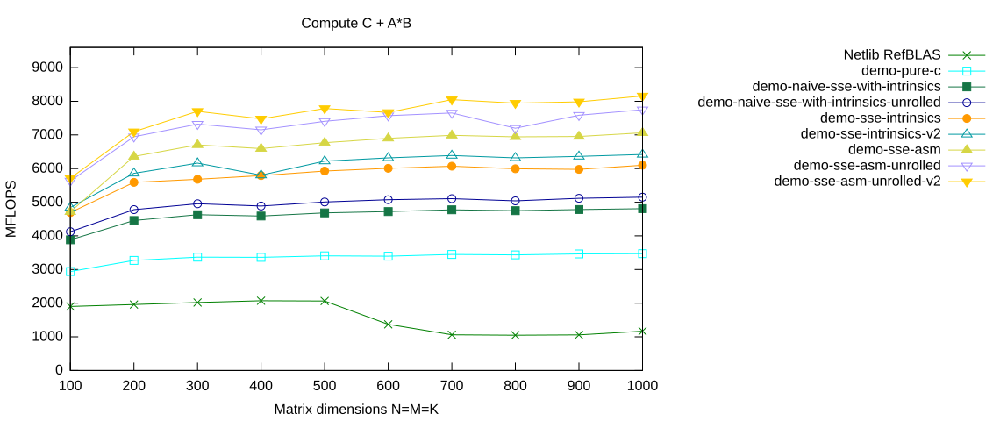

# Fine-tuning the Unrolled Assembler Kernel

In the previous assembler kernel, the pointer to the packed panel of $A$ was stored in `%rax` and the pointer to the packed panel of $B$ in `%rbx`.

When we unrolled the loop by a factor of four, we copied the original loop body four times. Consequently, we also copied the pointer increments four times:

```asm
addq    $32, %rax    # A += 4
addq    $32, %rbx    # B += 4
```

In this version, we remove these pointer updates from the individual update steps.

Instead, `%rax` and `%rbx` remain constant throughout the four unrolled updates, and we increment them only once at the end:

```asm
addq    $4*32, %rax    # A += 16
addq    $4*32, %rbx    # B += 16
```

The memory operands inside the unrolled loop therefore use appropriate offsets.

For example, during the second update we use

```asm
movapd  48(%rbx), %xmm3
```

instead of

```asm
movapd  16(%rbx), %xmm3
```

because `%rbx` itself has not been incremented after the first update.

Keeping the pointer registers unchanged during the unrolled block removes unnecessary dependencies between the individual updates and gives the processor more freedom to execute the instruction stream efficiently.

## Select the `demo-sse-asm-unrolled-v2` Branch

Again, first clean the project:

```console
$ cd ulmBLAS
$ make clean
```

<details>
<summary>Show complete output of <code>make clean</code></summary>

```console
<!-- Copy the complete make-clean output from the original Page 10 here. -->
```

</details>

Now check out the `demo-sse-asm-unrolled-v2` branch:

```console
$ git branch -a
  demo-naive-sse-with-intrinsics
  demo-naive-sse-with-intrinsics-unrolled
  demo-pure-c
  demo-sse-asm
* demo-sse-asm-unrolled
  demo-sse-intrinsics
  demo-sse-intrinsics-v2
  demo-sse-intrinsics-v3
  master
  remotes/origin/HEAD -> origin/master
  remotes/origin/bench-atlas
  remotes/origin/bench-blis
  remotes/origin/bench-eigen
  remotes/origin/bench-mkl
  remotes/origin/blis-avx-microkernel
  remotes/origin/demo-naive-avx-with-intrinsics
  remotes/origin/demo-naive-sse-with-intrinsics
  remotes/origin/demo-naive-sse-with-intrinsics-unrolled
  remotes/origin/demo-pure-c
  remotes/origin/demo-sse-all-asm
  remotes/origin/demo-sse-all-asm-try-prefetching
  remotes/origin/demo-sse-all-asm-try-prefetching-v2
  remotes/origin/demo-sse-all-asm-with-prefetching
  remotes/origin/demo-sse-asm
  remotes/origin/demo-sse-asm-for-AB-loop
  remotes/origin/demo-sse-asm-unrolled
  remotes/origin/demo-sse-asm-unrolled-v2
  remotes/origin/demo-sse-asm-unrolled-v3
  remotes/origin/demo-sse-asm-unrolled-with-prefetch
  remotes/origin/demo-sse-intrinsics
  remotes/origin/demo-sse-intrinsics-for-AB-loop
  remotes/origin/demo-sse-intrinsics-v2
  remotes/origin/demo-sse-intrinsics-v3
  remotes/origin/demo-with-sse-intrinsics
  remotes/origin/master
  remotes/origin/trsm-assignment
  remotes/origin/trsm-pure-c

$ git checkout -B demo-sse-asm-unrolled-v2 remotes/origin/demo-sse-asm-unrolled-v2
Switched to a new branch 'demo-sse-asm-unrolled-v2'
Branch demo-sse-asm-unrolled-v2 set up to track remote branch demo-sse-asm-unrolled-v2 from origin.
```

Then compile the project:

```console
$ make
```

<details>
<summary>Show complete build output</summary>

```console
<!-- Copy the complete make output from the original Page 10 here. -->
```

</details>

## The `dgemm_nn` Code

The complete implementation is contained in

[`src/level3/dgemm_nn.c`](https://github.com/michael-lehn/ulmBLAS/blob/demo-sse-asm-unrolled-v2/src/level3/dgemm_nn.c)

on the `demo-sse-asm-unrolled-v2` branch.

The change from the previous version is small but important.

Previously, each of the four unrolled updates ended with

```asm
addq    $32, %rax
addq    $32, %rbx
```

so the effective addresses in each update were based on newly modified pointer values.

Schematically, the previous version looked like this:

```text
update 1 using   0(%rax),  16(%rax),   0(%rbx),  16(%rbx), ...
%rax += 32
%rbx += 32

update 2 using   0(%rax),  16(%rax),   0(%rbx),  16(%rbx), ...
%rax += 32
%rbx += 32

update 3 using   0(%rax),  16(%rax),   0(%rbx),  16(%rbx), ...
%rax += 32
%rbx += 32

update 4 using   0(%rax),  16(%rax),   0(%rbx),  16(%rbx), ...
%rax += 32
%rbx += 32
```

Now the pointers remain unchanged while all four updates are executed:

```text
update 1 using   0(%rax),  16(%rax),   0(%rbx),  16(%rbx), ...
update 2 using  32(%rax),  48(%rax),  32(%rbx),  48(%rbx), ...
update 3 using  64(%rax),  80(%rax),  64(%rbx),  80(%rbx), ...
update 4 using  96(%rax), 112(%rax),  96(%rbx), 112(%rbx), ...

%rax += 128
%rbx += 128
```

For example, in the second update we find instructions such as

```asm
movapd  48(%rbx), %xmm3    # load B+6
```

and later in the third update

```asm
movapd  80(%rbx), %xmm3    # load B+10
```

while the corresponding loads from $A$ use offsets such as

```asm
movapd  64(%rax), %xmm0    # load A+8
movapd  80(%rax), %xmm1    # load A+10
```

The fourth update continues in the same way with offsets up to 112 bytes. Only after all four updates have been executed do we advance the two panel pointers.

The arithmetic and the register blocking are unchanged. We have only changed the **address-generation pattern** of the unrolled kernel.

## Benchmark Results

Run the benchmarks:

```console
$ cd bench
$ ./xdl3blastst > report
```

Then filter out the results for the `demo-sse-asm-unrolled-v2` branch:

```console
$ grep PASS report > demo-sse-asm-unrolled-v2
```

The original Page 10 does not print the complete benchmark report here; it directly stores the measurements in `report` and extracts the `PASS` lines. It then adds the new measurements to the accumulated benchmark plot.

The corresponding gnuplot script is:

```gnuplot
set terminal svg size 1140,480 background rgb 'white'
set output "bench11.svg"

set xlabel "Matrix dimensions N=M=K"
set ylabel "MFLOPS"
set yrange [0:9600]
set title "Compute C + A*B"
set key outside

plot "refBLAS" using 4:13 with linespoints lt 2 \
         title "Netlib RefBLAS", \
     "demo-pure-c" using 4:13 with linespoints lt 4 \
         title "demo-pure-c", \
     "demo-naive-sse-with-intrinsics" using 4:13 with linespoints lt 5 \
         title "demo-naive-sse-with-intrinsics", \
     "demo-naive-sse-with-intrinsics-unrolled" using 4:13 with linespoints lt 6 \
         title "demo-naive-sse-with-intrinsics-unrolled", \
     "demo-sse-intrinsics" using 4:13 with linespoints lt 7 \
         title "demo-sse-intrinsics", \
     "demo-sse-intrinsics-v2" using 4:13 with linespoints lt 8 \
         title "demo-sse-intrinsics-v2", \
     "demo-sse-asm" using 4:13 with linespoints lt 9 \
         title "demo-sse-asm", \
     "demo-sse-asm-unrolled" using 4:13 with linespoints lt 10 \
         title "demo-sse-asm-unrolled", \
     "demo-sse-asm-unrolled-v2" using 4:13 with linespoints lt 11 \
         title "demo-sse-asm-unrolled-v2"
```

Generate the plot with

```console
$ gnuplot bench11.gps
```



## What Changed?

This optimization is much smaller than the previous ones.

We have not changed

- the blocking parameters,
- the $4\times4$ micro kernel,
- the number of floating-point operations,
- the SSE instructions used for the arithmetic,
- or the unrolling factor.

We merely changed

```text
update
increment pointers
update
increment pointers
update
increment pointers
update
increment pointers
```

into

```text
update using offsets
update using offsets
update using offsets
update using offsets
increment pointers once
```

This removes repeated updates of `%rax` and `%rbx` from the unrolled instruction stream and reduces dependencies associated with address generation.

It is a good example of how, once a kernel is already highly optimized, even very small changes to the instruction stream can matter.

---

[← Previous](../page09/README.md) | [Main Page](../README.md) | [Next →](../page11/README.md)

Copyright © 2014 Michael Lehn