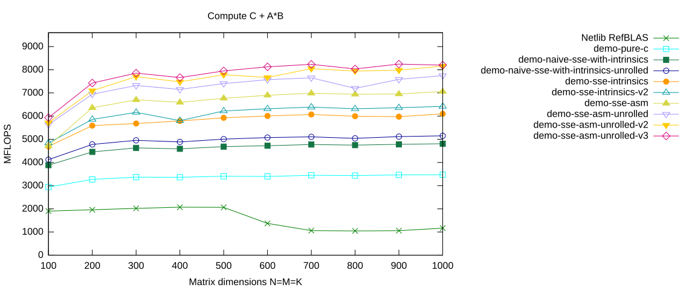

# More Fine-tuning of the Unrolled Assembler Kernel

In the last implementation, the two pointer increments were performed directly after each other:

```asm
addq    $4*32, %rax    # A += 16
addq    $4*32, %rbx    # B += 16
```

These instructions compete for the same execution resources of the CPU. Pulling them apart further improves performance.

## Select the `demo-sse-asm-unrolled-v3` Branch

Again, we do a `make clean` before switching branches:

```console
$ cd ulmBLAS
$ make clean
```

<details>
<summary>Show complete output of <code>make clean</code></summary>

```console
for dir in src refblas test bench; do make -C $dir clean; done
rm -f  auxiliary/xerbla.o  level1/dasum.o level1/daxpy.o level1/dcopy.o level1/ddot.o level1/dnrm2.o level1/drot.o level1/drotg.o level1/drotm.o level1/drotmg.o level1/dscal.o level1/dswap.o level1/idamax.o  level3/dgemm.o level3/dgemm_nn.o level3/dsymm.o level3/stubs.o
rm -f  auxiliary/atl_xerbla.o  level1/atl_dasum.o level1/atl_daxpy.o level1/atl_dcopy.o level1/atl_ddot.o level1/atl_dnrm2.o level1/atl_drot.o level1/atl_drotg.o level1/atl_drotm.o level1/atl_drotmg.o level1/atl_dscal.o level1/atl_dswap.o level1/atl_idamax.o  level3/atl_dgemm.o level3/atl_dgemm_nn.o level3/atl_dsymm.o level3/atl_stubs.o
rm -f ../libulmblas.a
rm -f ../libatlulmblas.a
rm -f caxpy.o ccopy.o cdotc.o cdotu.o cgbmv.o cgemm.o cgemv.o cgerc.o cgeru.o chbmv.o chemm.o chemv.o cher.o cher2.o cher2k.o cherk.o chpmv.o chpr.o chpr2.o crotg.o cscal.o csrot.o csscal.o cswap.o csymm.o csyr2k.o csyrk.o ctbmv.o ctbsv.o ctpmv.o ctpsv.o ctrmm.o ctrmv.o ctrsm.o ctrsv.o dasum.o daxpy.o dcabs1.o dcopy.o ddot.o dgbmv.o dgemm.o dgemv.o dger.o dnrm2.o drot.o drotg.o drotm.o drotmg.o dsbmv.o dscal.o dsdot.o dspmv.o dspr.o dspr2.o dswap.o dsymm.o dsymv.o dsyr.o dsyr2.o dsyr2k.o dsyrk.o dtbmv.o dtbsv.o dtpmv.o dtpsv.o dtrmm.o dtrmv.o dtrsm.o dtrsv.o dzasum.o dznrm2.o icamax.o idamax.o isamax.o izamax.o lsame.o sasum.o saxpy.o scabs1.o scasum.o scnrm2.o scopy.o sdot.o sdsdot.o sgbmv.o sgemm.o sgemv.o sger.o snrm2.o srot.o srotg.o srotm.o srotmg.o ssbmv.o sscal.o sspmv.o sspr.o sspr2.o sswap.o ssymm.o ssymv.o ssyr.o ssyr2.o ssyr2k.o ssyrk.o stbmv.o stbsv.o stpmv.o stpsv.o strmm.o strmv.o strsm.o strsv.o xerbla.o xerbla_array.o zaxpy.o zcopy.o zdotc.o zdotu.o zdrot.o zdscal.o zgbmv.o zgemm.o zgemv.o zgerc.o zgeru.o zhbmv.o zhemm.o zhemv.o zher.o zher2.o zher2k.o zherk.o zhpmv.o zhpr.o zhpr2.o zrotg.o zscal.o zswap.o zsymm.o zsyr2k.o zsyrk.o ztbmv.o ztbsv.o ztpmv.o ztpsv.o ztrmm.o ztrmv.o ztrsm.o ztrsv.o
rm -f ../librefblas.a
rm -f  dblat1_ref  dblat3_ref  dblat1_ulm  dblat3_ulm *.SUMM
rm -f xdl1blastst libtstatlas.a l1blastst.o  ATL_cputime.o  ATL_epsilon.o  ATL_f77amax.o  ATL_f77asum.o  ATL_f77axpy.o  ATL_f77copy.o  ATL_f77dot.o  ATL_f77gemm.o  ATL_f77nrm2.o  ATL_f77rot.o  ATL_f77rotg.o  ATL_f77rotm.o  ATL_f77rotmg.o  ATL_f77scal.o  ATL_f77swap.o  ATL_f77symm.o  ATL_f77syr2k.o  ATL_f77syrk.o  ATL_f77trmm.o  ATL_f77trsm.o  ATL_flushcache.o  ATL_gediffnrm1.o  ATL_gegen.o  ATL_genrm1.o  ATL_infnrm.o  ATL_rand.o  ATL_set.o  ATL_synrm.o  ATL_trnrm1.o  ATL_vdiff.o  ATL_zero.o  ATL_df77wrap.o
```

</details>

Then we check out the `demo-sse-asm-unrolled-v3` branch:

```console
$ git branch -a
  demo-naive-sse-with-intrinsics
  demo-naive-sse-with-intrinsics-unrolled
  demo-pure-c
  demo-sse-asm
  demo-sse-asm-unrolled
* demo-sse-asm-unrolled-v2
  demo-sse-intrinsics
  demo-sse-intrinsics-v2
  demo-sse-intrinsics-v3
  master
  remotes/origin/HEAD -> origin/master
  remotes/origin/bench-atlas
  remotes/origin/bench-blis
  remotes/origin/bench-eigen
  remotes/origin/bench-mkl
  remotes/origin/blis-avx-microkernel
  remotes/origin/demo-naive-avx-with-intrinsics
  remotes/origin/demo-naive-sse-with-intrinsics
  remotes/origin/demo-naive-sse-with-intrinsics-unrolled
  remotes/origin/demo-pure-c
  remotes/origin/demo-sse-all-asm
  remotes/origin/demo-sse-all-asm-try-prefetching
  remotes/origin/demo-sse-all-asm-try-prefetching-v2
  remotes/origin/demo-sse-all-asm-with-prefetching
  remotes/origin/demo-sse-asm
  remotes/origin/demo-sse-asm-for-AB-loop
  remotes/origin/demo-sse-asm-unrolled
  remotes/origin/demo-sse-asm-unrolled-v2
  remotes/origin/demo-sse-asm-unrolled-v3
  remotes/origin/demo-sse-asm-unrolled-with-prefetch
  remotes/origin/demo-sse-intrinsics
  remotes/origin/demo-sse-intrinsics-for-AB-loop
  remotes/origin/demo-sse-intrinsics-v2
  remotes/origin/demo-sse-intrinsics-v3
  remotes/origin/demo-with-sse-intrinsics
  remotes/origin/master
  remotes/origin/trsm-assignment
  remotes/origin/trsm-pure-c

$ git checkout -B demo-sse-asm-unrolled-v3 remotes/origin/demo-sse-asm-unrolled-v3
Switched to a new branch 'demo-sse-asm-unrolled-v3'
Branch demo-sse-asm-unrolled-v3 set up to track remote branch demo-sse-asm-unrolled-v3 from origin.
```

Then we compile the project:

```console
$ make
```

<details>
<summary>Show complete build output</summary>

```console
[Insert the complete original build output here without shortening it.]
```

</details>

The historical build uses Clang with

```text
-O3 -msse3 -mfpmath=sse -fomit-frame-pointer
```

for the ulmBLAS sources.

## The `dgemm_nn` Code

The complete implementation is available in

[`src/level3/dgemm_nn.c`](https://github.com/michael-lehn/ulmBLAS/blob/demo-sse-asm-unrolled-v3/src/level3/dgemm_nn.c)

on the `demo-sse-asm-unrolled-v3` branch.

<details>
<summary>Show complete <code>dgemm_nn.c</code></summary>

```c
[Insert the complete original dgemm_nn.c here.]
```

</details>

The relevant change from the previous version is very small.

In `demo-sse-asm-unrolled-v2`, the two pointer increments occurred directly after each other. In this version they are separated by independent floating-point instructions.

In particular, the update of the pointer to the packed panel of $A$

```asm
addq    $32*4, %rax    # A += 16
```

is performed earlier. Some independent arithmetic follows before the pointer to the packed panel of $B$ is updated:

```asm
movapd 128(%rbx), %xmm2
addpd      %xmm6, %xmm9
movapd     %xmm3, %xmm6
pshufd $78, %xmm3, %xmm5
mulpd      %xmm0, %xmm3
mulpd      %xmm1, %xmm6

addq    $32*4, %rbx    # B += 16
```

The algorithm, register blocking, unrolling factor, and floating-point operations remain unchanged. Only the scheduling of the two integer pointer updates has changed.

## Benchmark Results

We run the benchmarks:

```console
$ cd bench
$ ./xdl3blastst > report
```

and filter out the results for the `demo-sse-asm-unrolled-v3` branch:

```console
$ grep PASS report > demo-sse-asm-unrolled-v3
```

With the gnuplot script

```gnuplot
set terminal svg size 1140,480
set output "bench12.svg"
set title "Compute C + A*B"
set xlabel "Matrix dimensions N=M=K"
set ylabel "MFLOPS"
set yrange [0:9600]
set key outside

plot "refBLAS" using 4:13 with linespoints lt 2 \
         title "Netlib RefBLAS", \
     "demo-pure-c" using 4:13 with linespoints lt 4 \
         title "demo-pure-c", \
     "demo-naive-sse-with-intrinsics" using 4:13 with linespoints lt 5 \
         title "demo-naive-sse-with-intrinsics", \
     "demo-naive-sse-with-intrinsics-unrolled" using 4:13 with linespoints lt 6 \
         title "demo-naive-sse-with-intrinsics-unrolled", \
     "demo-sse-intrinsics" using 4:13 with linespoints lt 7 \
         title "demo-sse-intrinsics", \
     "demo-sse-intrinsics-v2" using 4:13 with linespoints lt 8 \
         title "demo-sse-intrinsics-v2", \
     "demo-sse-asm" using 4:13 with linespoints lt 9 \
         title "demo-sse-asm", \
     "demo-sse-asm-unrolled" using 4:13 with linespoints lt 10 \
         title "demo-sse-asm-unrolled", \
     "demo-sse-asm-unrolled-v2" using 4:13 with linespoints lt 11 \
         title "demo-sse-asm-unrolled-v2", \
     "demo-sse-asm-unrolled-v3" using 4:13 with linespoints lt 12 \
         title "demo-sse-asm-unrolled-v3"
```

we feed gnuplot:

```console
$ gnuplot bench12.gps
```

and get:



---

[← Previous](../page10/README.md) | [Main Page](../README.md) | [Next →](../page12/README.md)

Copyright © 2014 Michael Lehn
