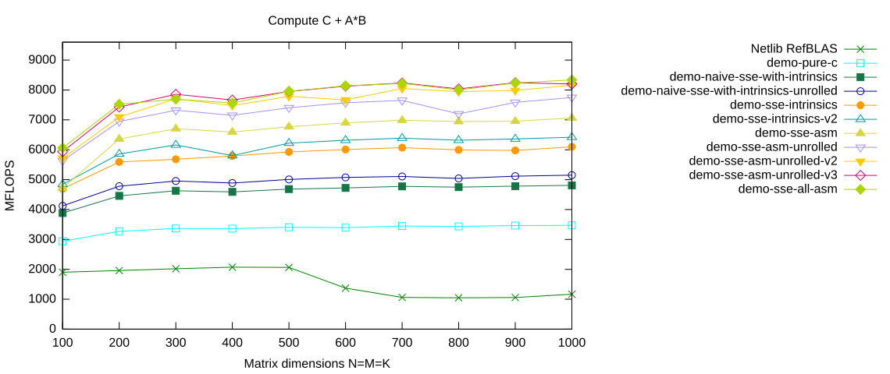

# Complete Assembler Micro Kernel

The BLIS micro kernel gains another performance boost through prefetching data. In my experiments I only was able to add the feature after converting the whole micro kernel into assembler.

**Status Quo:** So far only the loop for computing `AB` was implemented in assembler. The rest of the micro kernel was left untouched and is plain C code. The bridge between the assembler and C code is the `double` array `AB` of length 16. The assembler code copies at the end its results into this array. The remaining C code uses `AB` to compute

$$
C \leftarrow \beta C + \alpha A B.
$$

Having all the micro kernel in assembler removes the need for this internal buffer `AB`. Note that this will not improve performance. But again, it is a prerequisite for effectively adding prefetching.

It is no surprise that performance does not improve. Using a profiler one can see that only a few milliseconds were not spent on computing `AB`.

## Select the `demo-sse-all-asm` Branch

Again, we do a `make clean` before switching a branch:

```console
$ cd ulmBLAS
$ make clean
```

<details>
<summary>Show complete output of <code>make clean</code></summary>

```console
for dir in src refblas test bench; do make -C $dir clean; done
rm -f  auxiliary/xerbla.o  level1/dasum.o level1/daxpy.o level1/dcopy.o level1/ddot.o level1/dnrm2.o level1/drot.o level1/drotg.o level1/drotm.o level1/drotmg.o level1/dscal.o level1/dswap.o level1/idamax.o  level3/dgemm.o level3/dgemm_nn.o level3/dsymm.o level3/stubs.o
rm -f  auxiliary/atl_xerbla.o  level1/atl_dasum.o level1/atl_daxpy.o level1/atl_dcopy.o level1/atl_ddot.o level1/atl_dnrm2.o level1/atl_drot.o level1/atl_drotg.o level1/atl_drotm.o level1/atl_drotmg.o level1/atl_dscal.o level1/atl_dswap.o level1/atl_idamax.o  level3/atl_dgemm.o level3/atl_dgemm_nn.o level3/atl_dsymm.o level3/atl_stubs.o
rm -f ../libulmblas.a
rm -f ../libatlulmblas.a
rm -f caxpy.o ccopy.o cdotc.o cdotu.o cgbmv.o cgemm.o cgemv.o cgerc.o cgeru.o chbmv.o chemm.o chemv.o cher.o cher2.o cher2k.o cherk.o chpmv.o chpr.o chpr2.o crotg.o cscal.o csrot.o csscal.o cswap.o csymm.o csyr2k.o csyrk.o ctbmv.o ctbsv.o ctpmv.o ctpsv.o ctrmm.o ctrmv.o ctrsm.o ctrsv.o dasum.o daxpy.o dcabs1.o dcopy.o ddot.o dgbmv.o dgemm.o dgemv.o dger.o dnrm2.o drot.o drotg.o drotm.o drotmg.o dsbmv.o dscal.o dsdot.o dspmv.o dspr.o dspr2.o dswap.o dsymm.o dsymv.o dsyr.o dsyr2.o dsyr2k.o dsyrk.o dtbmv.o dtbsv.o dtpmv.o dtpsv.o dtrmm.o dtrmv.o dtrsm.o dtrsv.o dzasum.o dznrm2.o icamax.o idamax.o isamax.o izamax.o lsame.o sasum.o saxpy.o scabs1.o scasum.o scnrm2.o scopy.o sdot.o sdsdot.o sgbmv.o sgemm.o sgemv.o sger.o snrm2.o srot.o srotg.o srotm.o srotmg.o ssbmv.o sscal.o sspmv.o sspr.o sspr2.o sswap.o ssymm.o ssymv.o ssyr.o ssyr2.o ssyr2k.o ssyrk.o stbmv.o stbsv.o stpmv.o stpsv.o strmm.o strmv.o strsm.o strsv.o xerbla.o xerbla_array.o zaxpy.o zcopy.o zdotc.o zdotu.o zdrot.o zdscal.o zgbmv.o zgemm.o zgemv.o zgerc.o zgeru.o zhbmv.o zhemm.o zhemv.o zher.o zher2.o zher2k.o zherk.o zhpmv.o zhpr.o zhpr2.o zrotg.o zscal.o zswap.o zsymm.o zsyr2k.o zsyrk.o ztbmv.o ztbsv.o ztpmv.o ztpsv.o ztrmm.o ztrmv.o ztrsm.o ztrsv.o
rm -f ../librefblas.a
rm -f  dblat1_ref  dblat3_ref  dblat1_ulm  dblat3_ulm *.SUMM
rm -f xdl1blastst libtstatlas.a l1blastst.o  ATL_cputime.o  ATL_epsilon.o  ATL_f77amax.o  ATL_f77asum.o  ATL_f77axpy.o  ATL_f77copy.o  ATL_f77dot.o  ATL_f77gemm.o  ATL_f77nrm2.o  ATL_f77rot.o  ATL_f77rotg.o  ATL_f77rotm.o  ATL_f77rotmg.o  ATL_f77scal.o  ATL_f77swap.o  ATL_f77symm.o  ATL_f77syr2k.o  ATL_f77syrk.o  ATL_f77trmm.o  ATL_f77trsm.o  ATL_flushcache.o  ATL_gediffnrm1.o  ATL_gegen.o  ATL_genrm1.o  ATL_infnrm.o  ATL_rand.o  ATL_set.o  ATL_synrm.o  ATL_trnrm1.o  ATL_vdiff.o  ATL_zero.o  ATL_df77wrap.o
```

</details>

Then we are checking out the `demo-sse-all-asm` branch:

```console
$ git branch -a
  demo-naive-sse-with-intrinsics
  demo-naive-sse-with-intrinsics-unrolled
  demo-pure-c
  demo-sse-asm
  demo-sse-asm-unrolled
  demo-sse-asm-unrolled-v2
* demo-sse-asm-unrolled-v3
  demo-sse-intrinsics
  demo-sse-intrinsics-v2
  demo-sse-intrinsics-v3
  master
  remotes/origin/HEAD -> origin/master
  remotes/origin/bench-atlas
  remotes/origin/bench-blis
  remotes/origin/bench-eigen
  remotes/origin/bench-mkl
  remotes/origin/blis-avx-microkernel
  remotes/origin/demo-naive-avx-with-intrinsics
  remotes/origin/demo-naive-sse-with-intrinsics
  remotes/origin/demo-naive-sse-with-intrinsics-unrolled
  remotes/origin/demo-pure-c
  remotes/origin/demo-sse-all-asm
  remotes/origin/demo-sse-all-asm-try-prefetching
  remotes/origin/demo-sse-all-asm-try-prefetching-v2
  remotes/origin/demo-sse-all-asm-with-prefetching
  remotes/origin/demo-sse-asm
  remotes/origin/demo-sse-asm-for-AB-loop
  remotes/origin/demo-sse-asm-unrolled
  remotes/origin/demo-sse-asm-unrolled-v2
  remotes/origin/demo-sse-asm-unrolled-v3
  remotes/origin/demo-sse-asm-unrolled-with-prefetch
  remotes/origin/demo-sse-intrinsics
  remotes/origin/demo-sse-intrinsics-for-AB-loop
  remotes/origin/demo-sse-intrinsics-v2
  remotes/origin/demo-sse-intrinsics-v3
  remotes/origin/demo-with-sse-intrinsics
  remotes/origin/master
  remotes/origin/trsm-assignment
  remotes/origin/trsm-pure-c

$ git checkout -B demo-sse-all-asm remotes/origin/demo-sse-all-asm
Switched to a new branch 'demo-sse-all-asm'
Branch demo-sse-all-asm set up to track remote branch demo-sse-all-asm from origin.
```

Then we compile the project:

```console
$ make
```

<details>
<summary>Show complete build output</summary>

```console
make -C src
clang -Wall -I. -O3 -msse3 -mfpmath=sse -fomit-frame-pointer -DULM_BLOCKED -c -o auxiliary/xerbla.o auxiliary/xerbla.c
clang -Wall -I. -O3 -msse3 -mfpmath=sse -fomit-frame-pointer -DULM_BLOCKED -c -o level1/dasum.o level1/dasum.c
clang -Wall -I. -O3 -msse3 -mfpmath=sse -fomit-frame-pointer -DULM_BLOCKED -c -o level1/daxpy.o level1/daxpy.c
clang -Wall -I. -O3 -msse3 -mfpmath=sse -fomit-frame-pointer -DULM_BLOCKED -c -o level1/dcopy.o level1/dcopy.c
clang -Wall -I. -O3 -msse3 -mfpmath=sse -fomit-frame-pointer -DULM_BLOCKED -c -o level1/ddot.o level1/ddot.c
clang -Wall -I. -O3 -msse3 -mfpmath=sse -fomit-frame-pointer -DULM_BLOCKED -c -o level1/dnrm2.o level1/dnrm2.c
```

</details>

The historical build uses

```text
-O3 -msse3 -mfpmath=sse -fomit-frame-pointer
```

for the ulmBLAS sources.

## Outline of the Modification

- In the micro kernel we also go from `int` to `long`. It is just simpler to use only 64-bit registers.

- Registers `%xmm8`, ..., `%xmm15` are used to hold the result of $A B$.

- Once these registers contain the required values of $A B$ we begin with the update

  $$
  C \leftarrow \beta C + \alpha A B.
  $$

  - `%xmm0` is used to hold `alpha` and `%xmm1` for `beta`.

  - The strides of matrix $C$ must be multiplied by `sizeof(double)`. This gives the stride in bytes.

  - For each element $C_{i,j}$ we do the following:

    - Load $C_{i,j}$.
    - Compute $(\alpha A B)_{i,j}$.
    - Compute $\beta C_{i,j}$.
    - Store $\beta C_{i,j} + (\alpha A B)_{i,j}$.

## The `dgemm_nn` Code

The complete implementation is contained in

[`src/level3/dgemm_nn.c`](https://github.com/michael-lehn/ulmBLAS/blob/demo-sse-all-asm/src/level3/dgemm_nn.c)

on the `demo-sse-all-asm` branch.

<details>
<summary>Show complete <code>dgemm_nn.c</code></summary>

```c
#include <ulmblas.h>
#include <stdio.h>
#include <emmintrin.h>
#include <immintrin.h>

#define MC  384
#define KC  384
#define NC  4096

#define MR  4
#define NR  4

//
//  Local buffers for storing panels from A, B and C
//
static double _A[MC*KC] __attribute__ ((aligned (16)));
static double _B[KC*NC] __attribute__ ((aligned (16)));
static double _C[MR*NR] __attribute__ ((aligned (16)));

//
//  Packing complete panels from A (i.e. without padding)
//
static void
pack_MRxk(int k, const double *A, int incRowA, int incColA,
          double *buffer)
{
    int i, j;

    for (j=0; j<k; ++j) {
        for (i=0; i<MR; ++i) {
            buffer[i] = A[i*incRowA];
        }
        buffer += MR;
        A      += incColA;
    }
}

//
//  Packing panels from A with padding if required
//
static void
pack_A(int mc, int kc, const double *A, int incRowA, int incColA,
       double *buffer)
{
    int mp  = mc / MR;
    int _mr = mc % MR;

    int i, j;

    for (i=0; i<mp; ++i) {
        pack_MRxk(kc, A, incRowA, incColA, buffer);
        buffer += kc*MR;
        A      += MR*incRowA;
    }
    if (_mr>0) {
        for (j=0; j<kc; ++j) {
            for (i=0; i<_mr; ++i) {
                buffer[i] = A[i*incRowA];
            }
            for (i=_mr; i<MR; ++i) {
                buffer[i] = 0.0;
            }
            buffer += MR;
            A      += incColA;
        }
    }
}

//
//  Packing complete panels from B (i.e. without padding)
//
static void
pack_kxNR(int k, const double *B, int incRowB, int incColB,
          double *buffer)
{
    int i, j;

    for (i=0; i<k; ++i) {
        for (j=0; j<NR; ++j) {
            buffer[j] = B[j*incColB];
        }
        buffer += NR;
        B      += incRowB;
    }
}

//
//  Packing panels from B with padding if required
//
static void
pack_B(int kc, int nc, const double *B, int incRowB, int incColB,
       double *buffer)
{
    int np  = nc / NR;
    int _nr = nc % NR;

    int i, j;

    for (j=0; j<np; ++j) {
        pack_kxNR(kc, B, incRowB, incColB, buffer);
        buffer += kc*NR;
        B      += NR*incColB;
    }
    if (_nr>0) {
        for (i=0; i<kc; ++i) {
            for (j=0; j<_nr; ++j) {
                buffer[j] = B[j*incColB];
            }
            for (j=_nr; j<NR; ++j) {
                buffer[j] = 0.0;
            }
            buffer += NR;
            B      += incRowB;
        }
    }
}

//
//  Micro kernel for multiplying panels from A and B.
//
static void
dgemm_micro_kernel(long kc,
                   double alpha, const double *A, const double *B,
                   double beta,
                   double *C, long incRowC, long incColC,
                   const double *nextA, const double *nextB)
{
    long kb = kc / 4;
    long kl = kc % 4;

//
//  Compute AB = A*B
//
    __asm__ volatile
    (
    "movq      %0,      %%rsi    \n\t"  // kb (32 bit) stored in %rsi
    "movq      %1,      %%rdi    \n\t"  // kl (32 bit) stored in %rdi
    "movq      %2,      %%rax    \n\t"  // Address of A stored in %rax
    "movq      %3,      %%rbx    \n\t"  // Address of B stored in %rbx
    "movq      %9,      %%r9     \n\t"  // Address of nextA stored in %r9
    "movq      %10,     %%r10    \n\t"  // Address of nextB stored in %r10
    "                            \n\t"
    "addq      $128,    %%rax    \n\t"
    "addq      $128,    %%rbx    \n\t"
    "                            \n\t"
    "movapd -128(%%rax),%%xmm0   \n\t"  // tmp0 = _mm_load_pd(A)
    "movapd -112(%%rax),%%xmm1   \n\t"  // tmp1 = _mm_load_pd(A+2)
    "movapd -128(%%rbx),%%xmm2   \n\t"  // tmp2 = _mm_load_pd(B)
    "                            \n\t"
    "xorpd     %%xmm8,  %%xmm8   \n\t"  // ab_00_11 = _mm_setzero_pd()
    "xorpd     %%xmm9,  %%xmm9   \n\t"  // ab_20_31 = _mm_setzero_pd()
    "xorpd     %%xmm10, %%xmm10  \n\t"  // ab_01_10 = _mm_setzero_pd()
    "xorpd     %%xmm11, %%xmm11  \n\t"  // ab_21_30 = _mm_setzero_pd()
    "xorpd     %%xmm12, %%xmm12  \n\t"  // ab_02_13 = _mm_setzero_pd()
    "xorpd     %%xmm13, %%xmm13  \n\t"  // ab_22_33 = _mm_setzero_pd()
    "xorpd     %%xmm14, %%xmm14  \n\t"  // ab_03_12 = _mm_setzero_pd()
    "xorpd     %%xmm15, %%xmm15  \n\t"  // ab_23_32 = _mm_setzero_pd()
    "                            \n\t"
    "xorpd     %%xmm3,  %%xmm3   \n\t"  // tmp3 = _mm_setzero_pd
    "xorpd     %%xmm4,  %%xmm4   \n\t"  // tmp4 = _mm_setzero_pd
    "xorpd     %%xmm5,  %%xmm5   \n\t"  // tmp5 = _mm_setzero_pd
    "xorpd     %%xmm6,  %%xmm6   \n\t"  // tmp6 = _mm_setzero_pd
    "xorpd     %%xmm7,  %%xmm7   \n\t"  // tmp7 = _mm_setzero_pd
    "testq     %%rdi,   %%rdi    \n\t"  // if kl==0 writeback to AB
    "                            \n\t"
    "                            \n\t"
    "testq     %%rsi,   %%rsi    \n\t"  // if kb==0 handle remaining kl
    "je        .DCONSIDERLEFT%=  \n\t"  // update iterations
    "                            \n\t"
    ".DLOOP%=:                   \n\t"  // for l = kb,..,1 do
    "                            \n\t"
    "prefetcht0 (4*35+1)*8(%%rax)\n\t"
    "                            \n\t"
    "                            \n\t"  // 1. update
    "addpd     %%xmm3,  %%xmm12  \n\t"  // ab_02_13 = _mm_add_pd(ab_02_13, tmp3)
    "movaps -112(%%rbx),%%xmm3   \n\t"  // tmp3     = _mm_load_pd(B+2)
    "addpd     %%xmm6,  %%xmm13  \n\t"  // ab_22_33 = _mm_add_pd(ab_22_33, tmp6)
    "movaps    %%xmm2,  %%xmm6   \n\t"  // tmp6     = tmp2
    "pshufd $78,%%xmm2, %%xmm4   \n\t"  // tmp4     = _mm_shuffle_pd(tmp2, tmp2,
    "                            \n\t"  //                   _MM_SHUFFLE2(0, 1))
    "mulpd     %%xmm0,  %%xmm2   \n\t"  // tmp2     = _mm_mul_pd(tmp2, tmp0);
    "mulpd     %%xmm1,  %%xmm6   \n\t"  // tmp6     = _mm_mul_pd(tmp6, tmp1);
    "                            \n\t"
    "                            \n\t"
    "addpd     %%xmm5,  %%xmm14  \n\t"  // ab_03_12 = _mm_add_pd(ab_03_12, tmp5)
    "addpd     %%xmm7,  %%xmm15  \n\t"  // ab_23_32 = _mm_add_pd(ab_23_32, tmp7)
    "movaps    %%xmm4,  %%xmm7   \n\t"  // tmp7     = tmp4
    "mulpd     %%xmm0,  %%xmm4   \n\t"  // tmp4     = _mm_mul_pd(tmp4, tmp0)
    "mulpd     %%xmm1,  %%xmm7   \n\t"  // tmp7     = _mm_mul_pd(tmp7, tmp1)
    "                            \n\t"
    "                            \n\t"
    "addpd     %%xmm2,  %%xmm8   \n\t"  // ab_00_11 = _mm_add_pd(ab_00_11, tmp2)
    "movaps -96(%%rbx), %%xmm2   \n\t"  // tmp2     = _mm_load_pd(B+4)
    "addpd     %%xmm6,  %%xmm9   \n\t"  // ab_20_31 = _mm_add_pd(ab_20_31, tmp6)
    "movaps    %%xmm3,  %%xmm6   \n\t"  // tmp6     = tmp3
    "pshufd $78,%%xmm3, %%xmm5   \n\t"  // tmp5     = _mm_shuffle_pd(tmp3, tmp3,
    "                            \n\t"  //                   _MM_SHUFFLE2(0, 1))
    "mulpd     %%xmm0,  %%xmm3   \n\t"  // tmp3     = _mm_mul_pd(tmp3, tmp0)
    "mulpd     %%xmm1,  %%xmm6   \n\t"  // tmp6     = _mm_mul_pd(tmp6, tmp1)
    "                            \n\t"
    "                            \n\t"
    "addpd     %%xmm4,  %%xmm10  \n\t"  // ab_01_10 = _mm_add_pd(ab_01_10, tmp4)
    "addpd     %%xmm7,  %%xmm11  \n\t"  // ab_21_30 = _mm_add_pd(ab_21_30, tmp7)
    "movaps    %%xmm5,  %%xmm7   \n\t"  // tmp7     = tmp5
    "mulpd     %%xmm0,  %%xmm5   \n\t"  // tmp5     = _mm_mul_pd(tmp5, tmp0)
    "movaps -96(%%rax), %%xmm0   \n\t"  // tmp0     = _mm_load_pd(A+4)
    "mulpd     %%xmm1,  %%xmm7   \n\t"  // tmp7     = _mm_mul_pd(tmp7, tmp1)
    "movaps -80(%%rax), %%xmm1   \n\t"  // tmp1     = _mm_load_pd(A+6)
    "                            \n\t"
    "                            \n\t"
    "                            \n\t"
    "                            \n\t"  // 2. update
    "addpd     %%xmm3,  %%xmm12  \n\t"  // ab_02_13 = _mm_add_pd(ab_02_13, tmp3)
    "movaps -80(%%rbx), %%xmm3   \n\t"  // tmp3     = _mm_load_pd(B+6)
    "addpd     %%xmm6,  %%xmm13  \n\t"  // ab_22_33 = _mm_add_pd(ab_22_33, tmp6)
    "movaps    %%xmm2,  %%xmm6   \n\t"  // tmp6     = tmp2
    "pshufd $78,%%xmm2, %%xmm4   \n\t"  // tmp4     = _mm_shuffle_pd(tmp2, tmp2,
    "                            \n\t"  //                   _MM_SHUFFLE2(0, 1))
    "mulpd     %%xmm0,  %%xmm2   \n\t"  // tmp2     = _mm_mul_pd(tmp2, tmp0);
    "mulpd     %%xmm1,  %%xmm6   \n\t"  // tmp6     = _mm_mul_pd(tmp6, tmp1);
    "                            \n\t"
    "                            \n\t"
    "addpd     %%xmm5,  %%xmm14  \n\t"  // ab_03_12 = _mm_add_pd(ab_03_12, tmp5)
    "addpd     %%xmm7,  %%xmm15  \n\t"  // ab_23_32 = _mm_add_pd(ab_23_32, tmp7)
    "movaps    %%xmm4,  %%xmm7   \n\t"  // tmp7     = tmp4
    "mulpd     %%xmm0,  %%xmm4   \n\t"  // tmp4     = _mm_mul_pd(tmp4, tmp0)
    "mulpd     %%xmm1,  %%xmm7   \n\t"  // tmp7     = _mm_mul_pd(tmp7, tmp1)
    "                            \n\t"
    "                            \n\t"
    "addpd     %%xmm2,  %%xmm8   \n\t"  // ab_00_11 = _mm_add_pd(ab_00_11, tmp2)
    "movaps -64(%%rbx), %%xmm2   \n\t"  // tmp2     = _mm_load_pd(B+8)
    "addpd     %%xmm6,  %%xmm9   \n\t"  // ab_20_31 = _mm_add_pd(ab_20_31, tmp6)
    "movaps    %%xmm3,  %%xmm6   \n\t"  // tmp6     = tmp3
    "pshufd $78,%%xmm3, %%xmm5   \n\t"  // tmp5     = _mm_shuffle_pd(tmp3, tmp3,
    "                            \n\t"  //                   _MM_SHUFFLE2(0, 1))
    "mulpd     %%xmm0,  %%xmm3   \n\t"  // tmp3     = _mm_mul_pd(tmp3, tmp0)
    "mulpd     %%xmm1,  %%xmm6   \n\t"  // tmp6     = _mm_mul_pd(tmp6, tmp1)
    "                            \n\t"
    "                            \n\t"
    "addpd     %%xmm4,  %%xmm10  \n\t"  // ab_01_10 = _mm_add_pd(ab_01_10, tmp4)
    "addpd     %%xmm7,  %%xmm11  \n\t"  // ab_21_30 = _mm_add_pd(ab_21_30, tmp7)
    "movaps    %%xmm5,  %%xmm7   \n\t"  // tmp7     = tmp5
    "mulpd     %%xmm0,  %%xmm5   \n\t"  // tmp5     = _mm_mul_pd(tmp5, tmp0)
    "movaps -64(%%rax), %%xmm0   \n\t"  // tmp0     = _mm_load_pd(A+8)
    "mulpd     %%xmm1,  %%xmm7   \n\t"  // tmp7     = _mm_mul_pd(tmp7, tmp1)
    "movaps -48(%%rax), %%xmm1   \n\t"  // tmp1     = _mm_load_pd(A+10)
    "                            \n\t"
    "                            \n\t"
    "prefetcht0 (4*37+1)*8(%%rax)\n\t"
    "                            \n\t"
    "                            \n\t"  // 3. update
    "addpd     %%xmm3,  %%xmm12  \n\t"  // ab_02_13 = _mm_add_pd(ab_02_13, tmp3)
    "movaps -48(%%rbx), %%xmm3   \n\t"  // tmp3     = _mm_load_pd(B+10)
    "addpd     %%xmm6,  %%xmm13  \n\t"  // ab_22_33 = _mm_add_pd(ab_22_33, tmp6)
    "movaps    %%xmm2,  %%xmm6   \n\t"  // tmp6     = tmp2
    "pshufd $78,%%xmm2, %%xmm4   \n\t"  // tmp4     = _mm_shuffle_pd(tmp2, tmp2,
    "                            \n\t"  //                   _MM_SHUFFLE2(0, 1))
    "mulpd     %%xmm0,  %%xmm2   \n\t"  // tmp2     = _mm_mul_pd(tmp2, tmp0);
    "mulpd     %%xmm1,  %%xmm6   \n\t"  // tmp6     = _mm_mul_pd(tmp6, tmp1);
    "                            \n\t"
    "                            \n\t"
    "addpd     %%xmm5,  %%xmm14  \n\t"  // ab_03_12 = _mm_add_pd(ab_03_12, tmp5)
    "addpd     %%xmm7,  %%xmm15  \n\t"  // ab_23_32 = _mm_add_pd(ab_23_32, tmp7)
    "movaps    %%xmm4,  %%xmm7   \n\t"  // tmp7     = tmp4
    "mulpd     %%xmm0,  %%xmm4   \n\t"  // tmp4     = _mm_mul_pd(tmp4, tmp0)
    "mulpd     %%xmm1,  %%xmm7   \n\t"  // tmp7     = _mm_mul_pd(tmp7, tmp1)
    "                            \n\t"
    "                            \n\t"
    "addpd     %%xmm2,  %%xmm8   \n\t"  // ab_00_11 = _mm_add_pd(ab_00_11, tmp2)
    "movaps -32(%%rbx), %%xmm2   \n\t"  // tmp2     = _mm_load_pd(B+12)
    "addpd     %%xmm6,  %%xmm9   \n\t"  // ab_20_31 = _mm_add_pd(ab_20_31, tmp6)
    "movaps    %%xmm3,  %%xmm6   \n\t"  // tmp6     = tmp3
    "pshufd $78,%%xmm3, %%xmm5   \n\t"  // tmp5     = _mm_shuffle_pd(tmp3, tmp3,
    "                            \n\t"  //                   _MM_SHUFFLE2(0, 1))
    "mulpd     %%xmm0,  %%xmm3   \n\t"  // tmp3     = _mm_mul_pd(tmp3, tmp0)
    "mulpd     %%xmm1,  %%xmm6   \n\t"  // tmp6     = _mm_mul_pd(tmp6, tmp1)
    "                            \n\t"
    "                            \n\t"
    "addpd     %%xmm4,  %%xmm10  \n\t"  // ab_01_10 = _mm_add_pd(ab_01_10, tmp4)
    "addpd     %%xmm7,  %%xmm11  \n\t"  // ab_21_30 = _mm_add_pd(ab_21_30, tmp7)
    "movaps    %%xmm5,  %%xmm7   \n\t"  // tmp7     = tmp5
    "mulpd     %%xmm0,  %%xmm5   \n\t"  // tmp5     = _mm_mul_pd(tmp5, tmp0)
    "movaps -32(%%rax), %%xmm0   \n\t"  // tmp0     = _mm_load_pd(A+12)
    "mulpd     %%xmm1,  %%xmm7   \n\t"  // tmp7     = _mm_mul_pd(tmp7, tmp1)
    "movaps -16(%%rax), %%xmm1   \n\t"  // tmp1     = _mm_load_pd(A+14)
    "                            \n\t"
    "                            \n\t"
    "                            \n\t"  // 4. update
    "addpd     %%xmm3,  %%xmm12  \n\t"  // ab_02_13 = _mm_add_pd(ab_02_13, tmp3)
    "movaps -16(%%rbx), %%xmm3   \n\t"  // tmp3     = _mm_load_pd(B+14)
    "addpd     %%xmm6,  %%xmm13  \n\t"  // ab_22_33 = _mm_add_pd(ab_22_33, tmp6)
    "movaps    %%xmm2,  %%xmm6   \n\t"  // tmp6     = tmp2
    "pshufd $78,%%xmm2, %%xmm4   \n\t"  // tmp4     = _mm_shuffle_pd(tmp2, tmp2,
    "                            \n\t"  //                   _MM_SHUFFLE2(0, 1))
    "mulpd     %%xmm0,  %%xmm2   \n\t"  // tmp2     = _mm_mul_pd(tmp2, tmp0);
    "mulpd     %%xmm1,  %%xmm6   \n\t"  // tmp6     = _mm_mul_pd(tmp6, tmp1);
    "                            \n\t"
    "subq     $-32*4,   %%rax    \n\t"  // A += 16;
    "                            \n\t"
    "addpd     %%xmm5,  %%xmm14  \n\t"  // ab_03_12 = _mm_add_pd(ab_03_12, tmp5)
    "addpd     %%xmm7,  %%xmm15  \n\t"  // ab_23_32 = _mm_add_pd(ab_23_32, tmp7)
    "movaps    %%xmm4,  %%xmm7   \n\t"  // tmp7     = tmp4
    "mulpd     %%xmm0,  %%xmm4   \n\t"  // tmp4     = _mm_mul_pd(tmp4, tmp0)
    "mulpd     %%xmm1,  %%xmm7   \n\t"  // tmp7     = _mm_mul_pd(tmp7, tmp1)
    "                            \n\t"
    "subq     $-128,    %%r10    \n\t"  // nextB += 16
    "                            \n\t"
    "addpd     %%xmm2,  %%xmm8   \n\t"  // ab_00_11 = _mm_add_pd(ab_00_11, tmp2)
    "movaps    (%%rbx),%%xmm2   \n\t"  // tmp2     = _mm_load_pd(B+16)
    "addpd     %%xmm6,  %%xmm9   \n\t"  // ab_20_31 = _mm_add_pd(ab_20_31, tmp6)
    "movaps    %%xmm3,  %%xmm6   \n\t"  // tmp6     = tmp3
    "pshufd $78,%%xmm3, %%xmm5   \n\t"  // tmp5     = _mm_shuffle_pd(tmp3, tmp3,
    "                            \n\t"  //                   _MM_SHUFFLE2(0, 1))
    "mulpd     %%xmm0,  %%xmm3   \n\t"  // tmp3     = _mm_mul_pd(tmp3, tmp0)
    "mulpd     %%xmm1,  %%xmm6   \n\t"  // tmp6     = _mm_mul_pd(tmp6, tmp1)
    "                            \n\t"
    "subq     $-32*4,   %%rbx    \n\t"  // B += 16;
    "                            \n\t"
    "                            \n\t"
    "addpd     %%xmm4,  %%xmm10  \n\t"  // ab_01_10 = _mm_add_pd(ab_01_10, tmp4)
    "addpd     %%xmm7,  %%xmm11  \n\t"  // ab_21_30 = _mm_add_pd(ab_21_30, tmp7)
    "movaps    %%xmm5,  %%xmm7   \n\t"  // tmp7     = tmp5
    "mulpd     %%xmm0,  %%xmm5   \n\t"  // tmp5     = _mm_mul_pd(tmp5, tmp0)
    "movaps -128(%%rax),%%xmm0   \n\t"  // tmp0     = _mm_load_pd(A+16)
    "mulpd     %%xmm1,  %%xmm7   \n\t"  // tmp7     = _mm_mul_pd(tmp7, tmp1)
    "movaps -112(%%rax), %%xmm1   \n\t"  // tmp1     = _mm_load_pd(A+18)
    "                            \n\t"
    "prefetcht2        0(%%r10)  \n\t"  // prefetch nextB[0]
    "prefetcht2       64(%%r10)  \n\t"  // prefetch nextB[8]
    "                            \n\t"
    "decq      %%rsi             \n\t"  // --l
    "jne       .DLOOP%=          \n\t"  // if l>= 1 go back
    "                            \n\t"
    "                            \n\t"
    ".DCONSIDERLEFT%=:           \n\t"
    "testq     %%rdi,   %%rdi    \n\t"  // if kl==0 writeback to AB
    "je        .DPOSTACCUMULATE%=\n\t"
    "                            \n\t"
    ".DLOOPLEFT%=:               \n\t"  // for l = kl,..,1 do
    "                            \n\t"
    "addpd     %%xmm3,  %%xmm12  \n\t"  // ab_02_13 = _mm_add_pd(ab_02_13, tmp3)
    "movapd -112(%%rbx),%%xmm3   \n\t"  // tmp3     = _mm_load_pd(B+2)
    "addpd     %%xmm6,  %%xmm13  \n\t"  // ab_22_33 = _mm_add_pd(ab_22_33, tmp6)
    "movapd    %%xmm2,  %%xmm6   \n\t"  // tmp6     = tmp2
    "pshufd $78,%%xmm2, %%xmm4   \n\t"  // tmp4     = _mm_shuffle_pd(tmp2, tmp2,
    "                            \n\t"  //                   _MM_SHUFFLE2(0, 1))
    "mulpd     %%xmm0,  %%xmm2   \n\t"  // tmp2     = _mm_mul_pd(tmp2, tmp0);
    "mulpd     %%xmm1,  %%xmm6   \n\t"  // tmp6     = _mm_mul_pd(tmp6, tmp1);
    "                            \n\t"
    "                            \n\t"
    "addpd     %%xmm5,  %%xmm14  \n\t"  // ab_03_12 = _mm_add_pd(ab_03_12, tmp5)
    "addpd     %%xmm7,  %%xmm15  \n\t"  // ab_23_32 = _mm_add_pd(ab_23_32, tmp7)
    "movapd    %%xmm4,  %%xmm7   \n\t"  // tmp7     = tmp4
    "mulpd     %%xmm0,  %%xmm4   \n\t"  // tmp4     = _mm_mul_pd(tmp4, tmp0)
    "mulpd     %%xmm1,  %%xmm7   \n\t"  // tmp7     = _mm_mul_pd(tmp7, tmp1)
    "                            \n\t"
    "                            \n\t"
    "addpd     %%xmm2,  %%xmm8   \n\t"  // ab_00_11 = _mm_add_pd(ab_00_11, tmp2)
    "movapd -96(%%rbx), %%xmm2   \n\t"  // tmp2     = _mm_load_pd(B+4)
    "addpd     %%xmm6,  %%xmm9   \n\t"  // ab_20_31 = _mm_add_pd(ab_20_31, tmp6)
    "movapd    %%xmm3,  %%xmm6   \n\t"  // tmp6     = tmp3
    "pshufd $78,%%xmm3, %%xmm5   \n\t"  // tmp5     = _mm_shuffle_pd(tmp3, tmp3,
    "                            \n\t"  //                   _MM_SHUFFLE2(0, 1))
    "mulpd     %%xmm0,  %%xmm3   \n\t"  // tmp3     = _mm_mul_pd(tmp3, tmp0)
    "mulpd     %%xmm1,  %%xmm6   \n\t"  // tmp6     = _mm_mul_pd(tmp6, tmp1)
    "                            \n\t"
    "                            \n\t"
    "addpd     %%xmm4,  %%xmm10  \n\t"  // ab_01_10 = _mm_add_pd(ab_01_10, tmp4)
    "addpd     %%xmm7,  %%xmm11  \n\t"  // ab_21_30 = _mm_add_pd(ab_21_30, tmp7)
    "movapd    %%xmm5,  %%xmm7   \n\t"  // tmp7     = tmp5
    "mulpd     %%xmm0,  %%xmm5   \n\t"  // tmp5     = _mm_mul_pd(tmp5, tmp0)
    "movapd -96(%%rax), %%xmm0   \n\t"  // tmp0     = _mm_load_pd(A+4)
    "mulpd     %%xmm1,  %%xmm7   \n\t"  // tmp7     = _mm_mul_pd(tmp7, tmp1)
    "movapd -80(%%rax), %%xmm1   \n\t"  // tmp1     = _mm_load_pd(A+6)
    "                            \n\t"
    "                            \n\t"
    "addq      $32,     %%rax    \n\t"  // A += 4;
    "addq      $32,     %%rbx    \n\t"  // B += 4;
    "                            \n\t"
    "decq      %%rdi             \n\t"  // --l
    "jne       .DLOOPLEFT%=      \n\t"  // if l>= 1 go back
    "                            \n\t"
    ".DPOSTACCUMULATE%=:         \n\t"  // Update remaining ab_*_* registers
    "                            \n\t"
    "addpd    %%xmm3,   %%xmm12  \n\t"  // ab_02_13 = _mm_add_pd(ab_02_13, tmp3)
    "addpd    %%xmm6,   %%xmm13  \n\t"  // ab_22_33 = _mm_add_pd(ab_22_33, tmp6)
    "                            \n\t"  //
    "addpd    %%xmm5,   %%xmm14  \n\t"  // ab_03_12 = _mm_add_pd(ab_03_12, tmp5)
    "addpd    %%xmm7,   %%xmm15  \n\t"  // ab_23_32 = _mm_add_pd(ab_23_32, tmp7)
    "                            \n\t"
//
//  Update C <- beta*C + alpha*AB
//
//
    "movsd  %4,                  %%xmm0 \n\t"  // load alpha
    "movsd  %5,                  %%xmm1 \n\t"  // load beta 
    "movq   %6,                  %%rcx  \n\t"  // Address of C stored in %rcx

    "movq   %7,                  %%r8   \n\t"  // load incRowC
    "leaq   (,%%r8,8),           %%r8   \n\t"  //      incRowC *= sizeof(double)
    "movq   %8,                  %%r9   \n\t"  // load incColC
    "leaq   (,%%r9,8),           %%r9   \n\t"  //      incRowC *= sizeof(double)
    "                                   \n\t"
    "leaq (%%rcx,%%r9),          %%r10  \n\t"  // Store addr of C01 in %r10
    "leaq (%%rcx,%%r8,2),        %%rdx  \n\t"  // Store addr of C20 in %rdx
    "leaq (%%rdx,%%r9),          %%r11  \n\t"  // Store addr of C21 in %r11
    "                                   \n\t"
    "unpcklpd %%xmm0,            %%xmm0 \n\t"  // duplicate alpha
    "unpcklpd %%xmm1,            %%xmm1 \n\t"  // duplicate beta
    "                                   \n\t"
    "                                   \n\t"
    "movlpd (%%rcx),             %%xmm3 \n\t"  // load (C00,
    "movhpd (%%r10,%%r8),        %%xmm3 \n\t"  //       C11)
    "mulpd  %%xmm0,              %%xmm8 \n\t"  // scale ab_00_11 by alpha
    "mulpd  %%xmm1,              %%xmm3 \n\t"  // scale (C00, C11) by beta
    "addpd  %%xmm8,              %%xmm3 \n\t"  // add results

    "movlpd %%xmm3,        (%%rcx)       \n\t"  // write back (C00,
    "movhpd %%xmm3,        (%%r10,%%r8)  \n\t"  //             C11)
    "                                   \n\t"
    "movlpd (%%rdx),             %%xmm4 \n\t"  // load (C20,
    "movhpd (%%r11,%%r8),        %%xmm4 \n\t"  //       C31)
    "mulpd  %%xmm0,              %%xmm9 \n\t"  // scale ab_20_31 by alpha
    "mulpd  %%xmm1,              %%xmm4 \n\t"  // scale (C20, C31) by beta
    "addpd  %%xmm9,              %%xmm4 \n\t"  // add results
    "movlpd %%xmm4,        (%%rdx)       \n\t"  // write back (C20,
    "movhpd %%xmm4,        (%%r11,%%r8)  \n\t"  //             C31)
    "                                   \n\t"
    "                                   \n\t"
    "movlpd (%%r10),             %%xmm3 \n\t"  // load (C01,
    "movhpd (%%rcx,%%r8),        %%xmm3 \n\t"  //       C10)
    "mulpd  %%xmm0,              %%xmm10\n\t"  // scale ab_01_10 by alpha
    "mulpd  %%xmm1,              %%xmm3 \n\t"  // scale (C01, C10) by beta
    "addpd  %%xmm10,             %%xmm3 \n\t"  // add results
    "movlpd %%xmm3,        (%%r10)      \n\t"  // write back (C01,
    "movhpd %%xmm3,        (%%rcx,%%r8) \n\t"  //             C10)
    "                                   \n\t"
    "movlpd (%%r11),             %%xmm4 \n\t"  // load (C21,
    "movhpd (%%rdx,%%r8),        %%xmm4 \n\t"  //       C30)
    "mulpd  %%xmm0,              %%xmm11\n\t"  // scale ab_21_30 by alpha
    "mulpd  %%xmm1,              %%xmm4 \n\t"  // scale (C21, C30) by beta
    "addpd  %%xmm11,             %%xmm4 \n\t"  // add results
    "movlpd %%xmm4,        (%%r11)      \n\t"  // write back (C21,
    "movhpd %%xmm4,        (%%rdx,%%r8) \n\t"  //             C30)
    "                                   \n\t"
    "                                   \n\t"
    "leaq   (%%rcx,%%r9,2),      %%rcx  \n\t"  // Store addr of C02 in %rcx
    "leaq   (%%r10,%%r9,2),      %%r10  \n\t"  // Store addr of C03 in %r10
    "leaq   (%%rdx,%%r9,2),      %%rdx  \n\t"  // Store addr of C22 in $rdx
    "leaq   (%%r11,%%r9,2),      %%r11  \n\t"  // Store addr of C23 in %r11
    "                                   \n\t"
    "                                   \n\t"
    "movlpd (%%rcx),             %%xmm3 \n\t"  // load (C02,
    "movhpd (%%r10,%%r8),        %%xmm3 \n\t"  //       C13)
    "mulpd  %%xmm0,              %%xmm12\n\t"  // scale ab_02_13 by alpha
    "mulpd  %%xmm1,              %%xmm3 \n\t"  // scale (C02, C13) by beta
    "addpd  %%xmm12,             %%xmm3 \n\t"  // add results
    "movlpd %%xmm3,        (%%rcx)      \n\t"  // write back (C02,
    "movhpd %%xmm3,        (%%r10,%%r8) \n\t"  //             C13)
    "                                   \n\t"
    "movlpd (%%rdx),             %%xmm4 \n\t"  // load (C22,
    "movhpd (%%r11, %%r8),       %%xmm4 \n\t"  //       C33)
    "mulpd  %%xmm0,              %%xmm13\n\t"  // scale ab_22_33 by alpha
    "mulpd  %%xmm1,              %%xmm4 \n\t"  // scale (C22, C33) by beta
    "addpd  %%xmm13,             %%xmm4 \n\t"  // add results
    "movlpd %%xmm4,             (%%rdx) \n\t"  // write back (C22,
    "movhpd %%xmm4,        (%%r11,%%r8) \n\t"  //             C33)
    "                                   \n\t"
    "                                   \n\t"
    "movlpd (%%r10),             %%xmm3 \n\t"  // load (C03,
    "movhpd (%%rcx,%%r8),        %%xmm3 \n\t"  //       C12)
    "mulpd  %%xmm0,              %%xmm14\n\t"  // scale ab_03_12 by alpha
    "mulpd  %%xmm1,              %%xmm3 \n\t"  // scale (C03, C12) by beta
    "addpd  %%xmm14,             %%xmm3 \n\t"  // add results
    "movlpd %%xmm3,        (%%r10)      \n\t"  // write back (C03,
    "movhpd %%xmm3,        (%%rcx,%%r8) \n\t"  //             C12)
    "                                   \n\t"
    "movlpd (%%r11),             %%xmm4 \n\t"  // load (C23,
    "movhpd (%%rdx,%%r8),        %%xmm4 \n\t"  //       C32)
    "mulpd  %%xmm0,              %%xmm15\n\t"  // scale ab_23_32 by alpha
    "mulpd  %%xmm1,              %%xmm4 \n\t"  // scale (C23, C32) by beta
    "addpd  %%xmm15,             %%xmm4 \n\t"  // add results
    "movlpd %%xmm4,        (%%r11)      \n\t"  // write back (C23,
    "movhpd %%xmm4,        (%%rdx,%%r8) \n\t"  //             C32)
    : // output
    : // input
        "m" (kb),       // 0
        "m" (kl),       // 1
        "m" (A),        // 2
        "m" (B),        // 3
        "m" (alpha),    // 4
        "m" (beta),     // 5
        "m" (C),        // 6
        "m" (incRowC),  // 7
        "m" (incColC),  // 8
        "m" (nextA),    // 9
        "m" (nextB)     // 10
    : // register clobber list
        "rax", "rbx", "rcx", "rdx", "rsi", "rdi", "r8", "r9", "r10", "r11",
        "xmm0", "xmm1", "xmm2", "xmm3",
        "xmm4", "xmm5", "xmm6", "xmm7",
        "xmm8", "xmm9", "xmm10", "xmm11",
        "xmm12", "xmm13", "xmm14", "xmm15"
    );
}

//
//  Compute Y += alpha*X
//
static void
dgeaxpy(int           m,
        int           n,
        double        alpha,
        const double  *X,
        int           incRowX,
        int           incColX,
        double        *Y,
        int           incRowY,
        int           incColY)
{
    int i, j;


    if (alpha!=1.0) {
        for (j=0; j<n; ++j) {
            for (i=0; i<m; ++i) {
                Y[i*incRowY+j*incColY] += alpha*X[i*incRowX+j*incColX];
            }
        }
    } else {
        for (j=0; j<n; ++j) {
            for (i=0; i<m; ++i) {
                Y[i*incRowY+j*incColY] += X[i*incRowX+j*incColX];
            }
        }
    }
}

//
//  Compute X *= alpha
//
static void
dgescal(int     m,
        int     n,
        double  alpha,
        double  *X,
        int     incRowX,
        int     incColX)
{
    int i, j;

    if (alpha!=0.0) {
        for (j=0; j<n; ++j) {
            for (i=0; i<m; ++i) {
                X[i*incRowX+j*incColX] *= alpha;
            }
        }
    } else {
        for (j=0; j<n; ++j) {
            for (i=0; i<m; ++i) {
                X[i*incRowX+j*incColX] = 0.0;
            }
        }
    }
}

//
//  Macro Kernel for the multiplication of blocks of A and B.  We assume that
//  these blocks were previously packed to buffers _A and _B.
//
static void
dgemm_macro_kernel(int     mc,
                   int     nc,
                   int     kc,
                   double  alpha,
                   double  beta,
                   double  *C,
                   int     incRowC,
                   int     incColC)
{
    int mp = (mc+MR-1) / MR;
    int np = (nc+NR-1) / NR;

    int _mr = mc % MR;
    int _nr = nc % NR;

    int mr, nr;
    int i, j;

    const double *nextA;
    const double *nextB;

    for (j=0; j<np; ++j) {
        nr    = (j!=np-1 || _nr==0) ? NR : _nr;
        nextB = &_B[j*kc*NR];

        for (i=0; i<mp; ++i) {
            mr    = (i!=mp-1 || _mr==0) ? MR : _mr;
            nextA = &_A[(i+1)*kc*MR];

            if (i==mp-1) {
                nextA = _A;
                nextB = &_B[(j+1)*kc*NR];
                if (j==np-1) {
                    nextB = _B;
                }
            }

            if (mr==MR && nr==NR) {
                dgemm_micro_kernel(kc, alpha, &_A[i*kc*MR], &_B[j*kc*NR],
                                   beta,
                                   &C[i*MR*incRowC+j*NR*incColC],
                                   incRowC, incColC,
                                   nextA, nextB);
            } else {
                dgemm_micro_kernel(kc, alpha, &_A[i*kc*MR], &_B[j*kc*NR],
                                   0.0,
                                   _C, 1, MR,
                                   nextA, nextB);
                dgescal(mr, nr, beta,
                        &C[i*MR*incRowC+j*NR*incColC], incRowC, incColC);
                dgeaxpy(mr, nr, 1.0, _C, 1, MR,
                        &C[i*MR*incRowC+j*NR*incColC], incRowC, incColC);
            }
        }
    }
}

//
//  Compute C <- beta*C + alpha*A*B
//
void
ULMBLAS(dgemm_nn)(int            m,
                  int            n,
                  int            k,
                  double         alpha,
                  const double   *A,
                  int            incRowA,
                  int            incColA,
                  const double   *B,
                  int            incRowB,
                  int            incColB,
                  double         beta,
                  double         *C,
                  int            incRowC,
                  int            incColC)
{
    int mb = (m+MC-1) / MC;
    int nb = (n+NC-1) / NC;
    int kb = (k+KC-1) / KC;

    int _mc = m % MC;
    int _nc = n % NC;
    int _kc = k % KC;

    int mc, nc, kc;
    int i, j, l;

    double _beta;

    if (alpha==0.0 || k==0) {
        dgescal(m, n, beta, C, incRowC, incColC);
        return;
    }

    for (j=0; j<nb; ++j) {
        nc = (j!=nb-1 || _nc==0) ? NC : _nc;

        for (l=0; l<kb; ++l) {
            kc    = (l!=kb-1 || _kc==0) ? KC   : _kc;
            _beta = (l==0) ? beta : 1.0;

            pack_B(kc, nc,
                   &B[l*KC*incRowB+j*NC*incColB], incRowB, incColB,
                   _B);

            for (i=0; i<mb; ++i) {
                mc = (i!=mb-1 || _mc==0) ? MC : _mc;

                pack_A(mc, kc,
                       &A[i*MC*incRowA+l*KC*incColA], incRowA, incColA,
                       _A);

                dgemm_macro_kernel(mc, nc, kc, alpha, _beta,
                                   &C[i*MC*incRowC+j*NC*incColC],
                                   incRowC, incColC);
            }
        }
    }
}
```

</details>

The important difference from the previous version is that the temporary

```c
double AB[16];
```

is no longer required as the interface between the assembler loop and the C part of the micro kernel.

The partial results remain in `%xmm8` through `%xmm15`. After the computation of $A B$ has finished, the assembler code directly performs

$$
C \leftarrow \beta C + \alpha A B.
$$

For example, `alpha` and `beta` are loaded into SIMD registers and duplicated:

```asm
movsd      %6, %%xmm0
movsd      %7, %%xmm1
unpcklpd   %%xmm0, %%xmm0
unpcklpd   %%xmm1, %%xmm1
```

The strides of $C$ are converted from numbers of `double` elements to byte offsets. The elements of $C$ can then be loaded directly, multiplied by `beta`, combined with the corresponding accumulator multiplied by `alpha`, and written back.

The complete implementation above shows all sixteen updates of the $4\times4$ block.

## Benchmark Results

Run the benchmark:

```console
$ cd bench
$ ./xdl3blastst > report
```

and extract the measurements for this implementation:

```console
$ grep PASS report > demo-sse-all-asm
```

The corresponding gnuplot script is:

```gnuplot
set terminal svg size 1140,480
set output "bench13.svg"

set xlabel "Matrix dimensions N=M=K"
set ylabel "MFLOPS"
set yrange [0:9600]
set title "Compute C + A*B"
set key outside

plot "refBLAS" using 4:13 with linespoints lt 2 \
         title "Netlib RefBLAS", \
     "demo-pure-c" using 4:13 with linespoints lt 4 \
         title "demo-pure-c", \
     "demo-naive-sse-with-intrinsics" using 4:13 with linespoints lt 5 \
         title "demo-naive-sse-with-intrinsics", \
     "demo-naive-sse-with-intrinsics-unrolled" using 4:13 with linespoints lt 6 \
         title "demo-naive-sse-with-intrinsics-unrolled", \
     "demo-sse-intrinsics" using 4:13 with linespoints lt 7 \
         title "demo-sse-intrinsics", \
     "demo-sse-intrinsics-v2" using 4:13 with linespoints lt 8 \
         title "demo-sse-intrinsics-v2", \
     "demo-sse-asm" using 4:13 with linespoints lt 9 \
         title "demo-sse-asm", \
     "demo-sse-asm-unrolled" using 4:13 with linespoints lt 10 \
         title "demo-sse-asm-unrolled", \
     "demo-sse-asm-unrolled-v2" using 4:13 with linespoints lt 11 \
         title "demo-sse-asm-unrolled-v2", \
     "demo-sse-asm-unrolled-v3" using 4:13 with linespoints lt 12 \
         title "demo-sse-asm-unrolled-v3", \
     "demo-sse-all-asm" using 4:13 with linespoints lt 13 \
         title "demo-sse-all-asm"
```

Generate the plot with

```console
$ gnuplot bench13.gps
```



As expected, converting the remainder of the micro kernel to assembler does not give a significant performance improvement. Almost all execution time was already spent in the assembler loop computing $A B$.

The important result of this step is therefore not additional performance. We now have the complete micro kernel under our control, which will allow us to introduce prefetching in the next steps.

## Code Size of `kb`-Loop Body

Before adding further instructions to the kernel, it is useful to determine the code size of the `kb`-loop body.

First compile `dgemm_nn.c` separately:

```console
$ cd ../src/level3
$ make dgemm_nn.o
```

We can inspect the generated machine code with `otool`:

```console
$ otool -dtV dgemm_nn.o
```

<details>
<summary>Show complete <code>otool -dtV dgemm_nn.o</code> output</summary>

```text
dgemm_nn.o:
(__TEXT,__text) section
_ULM_dgemm_nn:
0000000000000000	pushq	%rbp
0000000000000001	pushq	%r15
0000000000000003	pushq	%r14
0000000000000005	pushq	%r13
0000000000000007	pushq	%r12
0000000000000009	pushq	%rbx
000000000000000a	subq	$0x288, %rsp
0000000000000011	movsd	%xmm1, 0x208(%rsp)
000000000000001a	movl	%r9d, 0x44(%rsp)
000000000000001f	movsd	%xmm0, 0x1d0(%rsp)
0000000000000028	leal	0xfff(%rsi), %eax
000000000000002e	movq	%rsi, %rbx
0000000000000031	movq	%rdx, %rsi
0000000000000034	sarl	$0x1f, %eax
0000000000000037	shrl	$0x14, %eax
000000000000003a	xorps	%xmm2, %xmm2
000000000000003d	ucomisd	%xmm2, %xmm0
0000000000000041	movl	0x2e8(%rsp), %r12d
0000000000000049	movl	0x2e0(%rsp), %r15d
0000000000000051	movq	0x2d8(%rsp), %r14
0000000000000059	jne	0x5d
000000000000005b	jnp	0x65
000000000000005d	testl	%esi, %esi
000000000000005f	jne	0x110
0000000000000065	testl	%ebx, %ebx
0000000000000067	setg	%cl
000000000000006a	testl	%edi, %edi
000000000000006c	setg	%al
000000000000006f	andb	%cl, %al
0000000000000071	ucomisd	%xmm2, %xmm1
0000000000000075	jne	0x7b
0000000000000077	jp	0x7b
0000000000000079	jmp	0xc8
000000000000007b	testb	%al, %al
000000000000007d	je	.DPOSTACCUMULATE1+1034
0000000000000083	xorl	%eax, %eax
0000000000000085	xorl	%ecx, %ecx
0000000000000087	nopw	_ULM_dgemm_nn(%rax,%rax)
0000000000000090	movl	%eax, %edx
0000000000000092	movl	%edi, %esi
0000000000000094	nopw	%cs:_ULM_dgemm_nn(%rax,%rax)
00000000000000a0	movslq	%edx, %rdx
00000000000000a3	movsd	_ULM_dgemm_nn(%r14,%rdx,8), %xmm0
00000000000000a9	mulsd	%xmm1, %xmm0
00000000000000ad	movsd	%xmm0, _ULM_dgemm_nn(%r14,%rdx,8)
00000000000000b3	addl	%r15d, %edx
00000000000000b6	decl	%esi
00000000000000b8	jne	0xa0
00000000000000ba	incl	%ecx
00000000000000bc	addl	%r12d, %eax
00000000000000bf	cmpl	%ebx, %ecx
00000000000000c1	jne	0x90
00000000000000c3	jmpq	.DPOSTACCUMULATE1+1034
00000000000000c8	testb	%al, %al
00000000000000ca	je	.DPOSTACCUMULATE1+1034
00000000000000d0	xorl	%eax, %eax
00000000000000d2	xorl	%ecx, %ecx
00000000000000d4	nopw	%cs:_ULM_dgemm_nn(%rax,%rax)
00000000000000e0	movl	%eax, %edx
00000000000000e2	movl	%edi, %esi
00000000000000e4	nopw	%cs:_ULM_dgemm_nn(%rax,%rax)
00000000000000f0	movslq	%edx, %rdx
00000000000000f3	movq	$_ULM_dgemm_nn, _ULM_dgemm_nn(%r14,%rdx,8)
00000000000000fb	addl	%r15d, %edx
00000000000000fe	decl	%esi
0000000000000100	jne	0xf0
0000000000000102	incl	%ecx
0000000000000104	addl	%r12d, %eax
0000000000000107	cmpl	%ebx, %ecx
0000000000000109	jne	0xe0
000000000000010b	jmpq	.DPOSTACCUMULATE1+1034
0000000000000110	movq	%rcx, 0x130(%rsp)
0000000000000118	testl	%ebx, %ebx
000000000000011a	jle	.DPOSTACCUMULATE1+1034
0000000000000120	movq	%rdi, %r9
0000000000000123	movq	%r9, 0x90(%rsp)
000000000000012b	leal	0x17f(%r9), %ecx
0000000000000132	movslq	%ecx, %rcx
0000000000000135	imulq	$0x2aaaaaab, %rcx, %r11
000000000000013c	movq	%r11, %rcx
000000000000013f	shrq	$0x3f, %rcx
0000000000000143	sarq	$0x26, %r11
0000000000000147	addl	%ecx, %r11d
000000000000014a	movq	%r11, 0x118(%rsp)
0000000000000152	movq	%rbx, %rdi
0000000000000155	leal	0xfff(%rdi,%rax), %r10d
000000000000015d	sarl	$0xc, %r10d
0000000000000161	movq	%r10, 0x18(%rsp)
0000000000000166	leal	0x17f(%rsi), %eax
000000000000016c	cltq
000000000000016e	imulq	$0x2aaaaaab, %rax, %rbx
0000000000000175	movq	%rbx, %rax
0000000000000178	shrq	$0x3f, %rax
000000000000017c	sarq	$0x26, %rbx
0000000000000180	addl	%eax, %ebx
0000000000000182	movq	%rbx, 0x80(%rsp)
000000000000018a	movslq	%r9d, %rdx
000000000000018d	imulq	$0x2aaaaaab, %rdx, %rax
0000000000000194	movq	%rax, %rcx
0000000000000197	shrq	$0x3f, %rcx
000000000000019b	sarq	$0x26, %rax
000000000000019f	addl	%ecx, %eax
00000000000001a1	imull	$0x180, %eax, %eax
00000000000001a7	subl	%eax, %edx
00000000000001a9	movq	%rdx, 0x128(%rsp)
00000000000001b1	movl	%edi, %eax
00000000000001b3	sarl	$0x1f, %eax
00000000000001b6	shrl	$0x14, %eax
00000000000001b9	addl	%edi, %eax
00000000000001bb	andl	$0xfffff000, %eax
00000000000001c0	subl	%eax, %edi
00000000000001c2	movq	%rdi, 0x28(%rsp)
00000000000001c7	movslq	%esi, %rdx
00000000000001ca	imulq	$0x2aaaaaab, %rdx, %rax
00000000000001d1	movq	%rax, %rcx
00000000000001d4	shrq	$0x3f, %rcx
00000000000001d8	sarq	$0x26, %rax
00000000000001dc	addl	%ecx, %eax
00000000000001de	imull	$0x180, %eax, %eax
00000000000001e4	subl	%eax, %edx
00000000000001e6	movq	%rdx, 0xa0(%rsp)
00000000000001ee	movl	0x2d0(%rsp), %ebp
00000000000001f5	leal	-0x1(%r10), %eax
00000000000001f9	movl	%eax, 0x24(%rsp)
00000000000001fd	leal	-0x1(%rbx), %eax
0000000000000200	movl	%eax, 0x9c(%rsp)
0000000000000207	movslq	0x2c8(%rsp), %rdx
000000000000020f	movq	%rdx, 0xc0(%rsp)
0000000000000217	leal	_ULM_dgemm_nn(,%rbp,4), %r10d
000000000000021f	leal	-0x1(%r11), %ecx
0000000000000223	movl	%ecx, 0x124(%rsp)
000000000000022a	movslq	0x44(%rsp), %r13
000000000000022f	movq	%r13, 0x168(%rsp)
0000000000000237	movq	%r8, 0x170(%rsp)
000000000000023f	leal	_ULM_dgemm_nn(,%r8,4), %r9d
0000000000000247	movslq	%r15d, %rcx
000000000000024a	movq	%rcx, 0x1c8(%rsp)
0000000000000252	movslq	%r12d, %rcx
0000000000000255	movq	%rcx, 0x1c0(%rsp)
000000000000025d	movl	%ebp, %ecx
000000000000025f	imull	$0x180, %edx, %eax
0000000000000265	movl	%eax, 0x7c(%rsp)
0000000000000269	movslq	%r10d, %rax
000000000000026c	movq	%rax, 0x8(%rsp)
0000000000000271	leaq	_ULM_dgemm_nn(,%rax,8), %rax
0000000000000279	movq	%rax, 0xf8(%rsp)
0000000000000281	leaq	_ULM_dgemm_nn(,%rdx,8), %rdi
0000000000000289	movq	%rdi, 0x70(%rsp)
000000000000028e	leal	_ULM_dgemm_nn(%rbp,%rbp,2), %r11d
0000000000000293	leal	_ULM_dgemm_nn(%rbp,%rbp), %edx
0000000000000297	movslq	%ebp, %rbx
000000000000029a	movq	%rbx, 0x68(%rsp)
000000000000029f	imull	$0x180, %r13d, %eax
00000000000002a6	movl	%eax, 0x64(%rsp)
00000000000002aa	imull	$0x180, %r8d, %eax
00000000000002b1	movl	%eax, 0x114(%rsp)
00000000000002b8	movslq	%r9d, %rax
00000000000002bb	movq	%rax, 0xe0(%rsp)
00000000000002c3	leaq	_ULM_dgemm_nn(,%rax,8), %rax
00000000000002cb	movq	%rax, 0xd8(%rsp)
00000000000002d3	leaq	_ULM_dgemm_nn(,%r13,8), %rax
00000000000002db	movq	%rax, 0x140(%rsp)
00000000000002e3	leal	_ULM_dgemm_nn(%r8,%r8,2), %r9d
00000000000002e7	movq	%rsi, %rax
00000000000002ea	movq	%rax, 0x88(%rsp)
00000000000002f2	leal	_ULM_dgemm_nn(%r8,%r8), %esi
00000000000002f6	movslq	%r8d, %rbp
00000000000002f9	movq	%rbp, 0x138(%rsp)
0000000000000301	xorl	%ebp, %ebp
0000000000000303	movq	%rbp, 0x38(%rsp)
0000000000000308	shll	$0xc, %ecx
000000000000030b	movl	%ecx, 0x14(%rsp)
000000000000030f	xorl	%ecx, %ecx
0000000000000311	movslq	%r11d, %r11
0000000000000314	movq	%r11, 0x58(%rsp)
0000000000000319	movslq	%edx, %rdx
000000000000031c	movq	%rdx, 0xf0(%rsp)
0000000000000324	movslq	%r9d, %rdx
0000000000000327	movq	%rdx, 0x180(%rsp)
000000000000032f	movslq	%esi, %rdx
0000000000000332	movq	%rdx, 0x178(%rsp)
000000000000033a	movq	%rax, %rsi
000000000000033d	nopl	_ULM_dgemm_nn(%rax)
0000000000000340	movl	%ecx, 0x34(%rsp)
0000000000000344	movq	0x28(%rsp), %rdx
0000000000000349	testl	%edx, %edx
000000000000034b	sete	%al
000000000000034e	cmpl	0x24(%rsp), %ecx
0000000000000352	setne	%cl
0000000000000355	orb	%al, %cl
0000000000000357	movl	$0x1000, %eax
000000000000035c	cmovnel	%eax, %edx
000000000000035f	movq	%rdx, %rcx
0000000000000362	testl	%esi, %esi
0000000000000364	movq	%rdi, %rdx
0000000000000367	jle	.DPOSTACCUMULATE1+998
000000000000036d	movl	0x34(%rsp), %edi
0000000000000371	shll	$0xc, %edi
0000000000000374	movl	%edi, %esi
0000000000000376	movl	0x2d0(%rsp), %eax
000000000000037d	imull	%eax, %esi
0000000000000380	movl	%esi, 0xa8(%rsp)
0000000000000387	movq	%rcx, %rsi
000000000000038a	movq	%rsi, 0x148(%rsp)
0000000000000392	movl	%esi, %eax
0000000000000394	sarl	$0x1f, %eax
0000000000000397	shrl	$0x1e, %eax
000000000000039a	addl	%esi, %eax
000000000000039c	movl	%eax, %ecx
000000000000039e	sarl	$0x2, %ecx
00000000000003a1	movq	%rcx, 0x100(%rsp)
00000000000003a9	andl	$-0x4, %eax
00000000000003ac	movl	%esi, %r8d
00000000000003af	subl	%eax, %r8d
00000000000003b2	movq	%r8, 0x1a0(%rsp)
00000000000003ba	negl	%eax
00000000000003bc	leal	-0x1(%rcx), %ecx
00000000000003bf	cmpl	$0x7, %esi
00000000000003c2	leaq	0x8(,%rcx,8), %rbp
00000000000003ca	movl	$0x8, %ecx
00000000000003cf	cmovleq	%rcx, %rbp
00000000000003d3	movq	%rbp, 0x50(%rsp)
00000000000003d8	imulq	0x8(%rsp), %rbp
00000000000003de	movq	%rbp, 0x48(%rsp)
00000000000003e3	movslq	%r8d, %rcx
00000000000003e6	movq	%rcx, 0xd0(%rsp)
00000000000003ee	leal	0x1(%rsi,%rax), %eax
00000000000003f2	cmpl	$0x4, %eax
00000000000003f5	movl	$0x3, %eax
00000000000003fa	cmovgl	%r8d, %eax
00000000000003fe	subl	%ecx, %eax
0000000000000400	leaq	0x8(,%rax,8), %rax
0000000000000408	movq	%rax, 0xc8(%rsp)
0000000000000410	imull	%r12d, %edi
0000000000000414	movl	%edi, 0xec(%rsp)
000000000000041b	leal	0x3(%rsi), %eax
000000000000041e	sarl	$0x1f, %eax
0000000000000421	shrl	$0x1e, %eax
0000000000000424	leal	0x3(%rsi,%rax), %eax
0000000000000428	sarl	$0x2, %eax
000000000000042b	movq	%rax, 0x190(%rsp)
0000000000000433	leal	-0x1(%rax), %eax
0000000000000436	movl	%eax, 0x18c(%rsp)
000000000000043d	xorl	%eax, %eax
000000000000043f	movq	%rax, 0xb8(%rsp)
0000000000000447	movq	0x38(%rsp), %rax
000000000000044c	movl	%eax, %r13d
000000000000044f	xorl	%edi, %edi
0000000000000451	nopw	%cs:_ULM_dgemm_nn(%rax,%rax)
0000000000000460	movq	0xa0(%rsp), %rsi
0000000000000468	testl	%esi, %esi
000000000000046a	sete	%al
000000000000046d	cmpl	0x9c(%rsp), %edi
0000000000000474	setne	%cl
0000000000000477	orb	%al, %cl
0000000000000479	movl	$0x180, %eax
000000000000047e	cmovnel	%eax, %esi
0000000000000481	movq	%rsi, 0x1b0(%rsp)
0000000000000489	testl	%edi, %edi
000000000000048b	je	0x498
000000000000048d	movsd	0x139b(%rip), %xmm0
0000000000000495	movaps	%xmm0, %xmm1
0000000000000498	imull	$0x180, %edi, %eax
000000000000049e	movl	%eax, 0x154(%rsp)
00000000000004a5	movq	%rdi, 0xb0(%rsp)
00000000000004ad	imull	0x2c8(%rsp), %eax
00000000000004b5	addl	0xa8(%rsp), %eax
00000000000004bc	movq	0x148(%rsp), %rcx
00000000000004c4	cmpl	$0x4, %ecx
00000000000004c7	cltq
00000000000004c9	movq	0x2c0(%rsp), %rcx
00000000000004d1	leaq	_ULM_dgemm_nn(%rcx,%rax,8), %r12
00000000000004d5	jl	0x5e0
00000000000004db	movq	0x1b0(%rsp), %rcx
00000000000004e3	leal	_ULM_dgemm_nn(,%rcx,4), %eax
00000000000004ea	cltq
00000000000004ec	movq	%rax, 0x238(%rsp)
00000000000004f4	testl	%ecx, %ecx
00000000000004f6	jle	0x5a0
00000000000004fc	movslq	%r13d, %rax
00000000000004ff	movq	0x2c0(%rsp), %rcx
0000000000000507	leaq	_ULM_dgemm_nn(%rcx,%rax,8), %r9
000000000000050b	movq	0x238(%rsp), %rax
0000000000000513	leaq	_ULM_dgemm_nn(,%rax,8), %r8
000000000000051b	xorl	%eax, %eax
000000000000051d	leaq	__B(%rip), %rsi
0000000000000524	nopw	%cs:_ULM_dgemm_nn(%rax,%rax)
0000000000000530	movq	%r9, %rdi
0000000000000533	xorl	%ebp, %ebp
0000000000000535	movq	0x1b0(%rsp), %rcx
000000000000053d	movq	0xf0(%rsp), %r10
0000000000000545	nopw	%cs:_ULM_dgemm_nn(%rax,%rax)
0000000000000550	movsd	_ULM_dgemm_nn(%rdi), %xmm0
0000000000000554	movsd	%xmm0, _ULM_dgemm_nn(%rsi,%rbp)
0000000000000559	movsd	_ULM_dgemm_nn(%rdi,%rbx,8), %xmm0
000000000000055e	movsd	%xmm0, 0x8(%rsi,%rbp)
0000000000000564	movsd	_ULM_dgemm_nn(%rdi,%r10,8), %xmm0
000000000000056a	movsd	%xmm0, 0x10(%rsi,%rbp)
0000000000000570	movsd	_ULM_dgemm_nn(%rdi,%r11,8), %xmm0
0000000000000576	movsd	%xmm0, 0x18(%rsi,%rbp)
000000000000057c	addq	$0x20, %rbp
0000000000000580	addq	%rdx, %rdi
0000000000000583	decl	%ecx
0000000000000585	jne	0x550
0000000000000587	incl	%eax
0000000000000589	addq	%r8, %rsi
000000000000058c	addq	0xf8(%rsp), %r9
0000000000000594	movq	0x100(%rsp), %rcx
000000000000059c	cmpl	%ecx, %eax
000000000000059e	jl	0x530
00000000000005a0	movl	%r13d, 0xac(%rsp)
00000000000005a8	movq	0x238(%rsp), %rax
00000000000005b0	movq	%rax, %rcx
00000000000005b3	imulq	0x50(%rsp), %rcx
00000000000005b9	leaq	__B(%rip), %rax
00000000000005c0	addq	%rax, %rcx
00000000000005c3	movq	%rcx, 0x238(%rsp)
00000000000005cb	addq	0x48(%rsp), %r12
00000000000005d0	movq	0x1a0(%rsp), %r8
00000000000005d8	jmp	0x5f7
00000000000005da	nopw	_ULM_dgemm_nn(%rax,%rax)
00000000000005e0	movl	%r13d, 0xac(%rsp)
00000000000005e8	leaq	__B(%rip), %rax
00000000000005ef	movq	%rax, 0x238(%rsp)
00000000000005f7	movsd	%xmm1, 0x1e8(%rsp)
0000000000000600	testl	%r8d, %r8d
0000000000000603	jle	0x6b0
0000000000000609	movq	0x1b0(%rsp), %rax
0000000000000611	testl	%eax, %eax
0000000000000613	movl	$_ULM_dgemm_nn, %r13d
0000000000000619	movq	0x238(%rsp), %rbp
0000000000000621	jle	0x6b0
0000000000000627	nopw	_ULM_dgemm_nn(%rax,%rax)
0000000000000630	movq	0xd0(%rsp), %rax
0000000000000638	leaq	_ULM_dgemm_nn(%rax,%r13,4), %rax
000000000000063c	movq	0x238(%rsp), %rcx
0000000000000644	leaq	_ULM_dgemm_nn(%rcx,%rax,8), %rdi
0000000000000648	xorl	%eax, %eax
000000000000064a	xorl	%ecx, %ecx
000000000000064c	movl	0x2d0(%rsp), %edx
0000000000000653	nopw	%cs:_ULM_dgemm_nn(%rax,%rax)
0000000000000660	cltq
0000000000000662	movsd	_ULM_dgemm_nn(%r12,%rax,8), %xmm0
0000000000000668	movsd	%xmm0, _ULM_dgemm_nn(%rbp,%rcx,8)
000000000000066e	incq	%rcx
0000000000000671	addl	%edx, %eax
0000000000000673	cmpl	%ecx, %r8d
0000000000000676	jne	0x660
0000000000000678	movq	0xc8(%rsp), %rsi
0000000000000680	movq	%r8, %rbx
0000000000000683	callq	___bzero
0000000000000688	movq	%rbx, %r8
000000000000068b	addq	$0x20, %rbp
000000000000068f	movq	0xc0(%rsp), %rax
0000000000000697	leaq	_ULM_dgemm_nn(%r12,%rax,8), %r12
000000000000069b	incq	%r13
000000000000069e	movq	0x1b0(%rsp), %rax
00000000000006a6	cmpl	%eax, %r13d
00000000000006a9	jne	0x630
00000000000006ab	nopl	_ULM_dgemm_nn(%rax,%rax)
00000000000006b0	movq	0x90(%rsp), %rax
00000000000006b8	testl	%eax, %eax
00000000000006ba	movsd	0x208(%rsp), %xmm1
00000000000006c3	movq	0x140(%rsp), %rbp
00000000000006cb	movq	0x138(%rsp), %rbx
00000000000006d3	jle	.DPOSTACCUMULATE1+897
00000000000006d9	movl	0x154(%rsp), %eax
00000000000006e0	imull	0x44(%rsp), %eax
00000000000006e5	movl	%eax, 0x154(%rsp)
00000000000006ec	movq	0x1b0(%rsp), %rax
00000000000006f4	leal	_ULM_dgemm_nn(,%rax,4), %ecx
00000000000006fb	movl	%ecx, 0x22c(%rsp)
0000000000000702	movslq	%ecx, %rcx
0000000000000705	movq	%rcx, 0x108(%rsp)
000000000000070d	movslq	%eax, %rdx
0000000000000710	movq	%rdx, %rax
0000000000000713	sarq	$0x3f, %rax
0000000000000717	shrq	$0x3e, %rax
000000000000071b	addq	%rdx, %rax
000000000000071e	movq	%rax, %rsi
0000000000000721	sarq	$0x2, %rsi
0000000000000725	movq	%rsi, 0x1d8(%rsp)
000000000000072d	andq	$-0x4, %rax
0000000000000731	subq	%rax, %rdx
0000000000000734	movq	%rdx, 0x1e0(%rsp)
000000000000073c	leaq	_ULM_dgemm_nn(,%rcx,8), %rax
0000000000000744	movq	%rax, 0x198(%rsp)
000000000000074c	movq	0xb8(%rsp), %rax
0000000000000754	movl	%eax, %esi
0000000000000756	xorl	%edi, %edi
0000000000000758	nopl	_ULM_dgemm_nn(%rax,%rax)
0000000000000760	movq	0x128(%rsp), %rdx
0000000000000768	testl	%edx, %edx
000000000000076a	sete	%al
000000000000076d	cmpl	0x124(%rsp), %edi
0000000000000774	setne	%cl
0000000000000777	orb	%al, %cl
0000000000000779	movl	$0x180, %eax
000000000000077e	cmovnel	%eax, %edx
0000000000000781	imull	$0x180, %edi, %r8d
0000000000000788	movl	%r8d, %eax
000000000000078b	movq	0x170(%rsp), %rcx
0000000000000793	imull	%ecx, %eax
0000000000000796	addl	0x154(%rsp), %eax
000000000000079d	movl	%edx, %ecx
000000000000079f	sarl	$0x1f, %ecx
00000000000007a2	shrl	$0x1e, %ecx
00000000000007a5	addl	%edx, %ecx
00000000000007a7	cmpl	$0x4, %edx
00000000000007aa	cltq
00000000000007ac	movq	0x130(%rsp), %r9
00000000000007b4	leaq	_ULM_dgemm_nn(%r9,%rax,8), %r13
00000000000007b8	jl	0x8f0
00000000000007be	movl	%r8d, 0x21c(%rsp)
00000000000007c6	movq	%rdi, 0x158(%rsp)
00000000000007ce	movslq	%esi, %rax
00000000000007d1	movl	%esi, 0x164(%rsp)
00000000000007d8	movq	%rdx, 0x1a8(%rsp)
00000000000007e0	leaq	_ULM_dgemm_nn(%r9,%rax,8), %r12
00000000000007e4	movl	%ecx, %r10d
00000000000007e7	movl	%ecx, 0x230(%rsp)
00000000000007ee	sarl	$0x2, %r10d
00000000000007f2	leal	-0x1(%r10), %eax
00000000000007f6	cmpl	$0x7, %edx
00000000000007f9	leaq	0x8(,%rax,8), %rcx
0000000000000801	movl	$0x8, %eax
0000000000000806	cmovleq	%rax, %rcx
000000000000080a	movq	%rcx, %rax
000000000000080d	imulq	0xe0(%rsp), %rax
0000000000000816	movq	%rax, 0x220(%rsp)
000000000000081e	imulq	0x108(%rsp), %rcx
0000000000000827	movq	%rcx, 0x238(%rsp)
000000000000082f	xorl	%edi, %edi
0000000000000831	leaq	__A(%rip), %rsi
0000000000000838	movq	0xd8(%rsp), %r11
0000000000000840	movq	0x1b0(%rsp), %rdx
0000000000000848	testl	%edx, %edx
000000000000084a	movq	%r12, %rcx
000000000000084d	movl	$_ULM_dgemm_nn, %eax
0000000000000852	movq	0x180(%rsp), %r8
000000000000085a	movq	0x178(%rsp), %r9
0000000000000862	jle	0x8a7
0000000000000864	nopw	%cs:_ULM_dgemm_nn(%rax,%rax)
0000000000000870	movsd	_ULM_dgemm_nn(%rcx), %xmm0
0000000000000874	movsd	%xmm0, _ULM_dgemm_nn(%rsi,%rax)
0000000000000879	movsd	_ULM_dgemm_nn(%rcx,%rbx,8), %xmm0
000000000000087e	movsd	%xmm0, 0x8(%rsi,%rax)
0000000000000884	movsd	_ULM_dgemm_nn(%rcx,%r9,8), %xmm0
000000000000088a	movsd	%xmm0, 0x10(%rsi,%rax)
0000000000000890	movsd	_ULM_dgemm_nn(%rcx,%r8,8), %xmm0
0000000000000896	movsd	%xmm0, 0x18(%rsi,%rax)
000000000000089c	addq	$0x20, %rax
00000000000008a0	addq	%rbp, %rcx
00000000000008a3	decl	%edx
00000000000008a5	jne	0x870
00000000000008a7	incl	%edi
00000000000008a9	addq	0x198(%rsp), %rsi
00000000000008b1	addq	%r11, %r12
00000000000008b4	cmpl	%r10d, %edi
00000000000008b7	jl	0x840
00000000000008b9	addq	0x220(%rsp), %r13
00000000000008c1	leaq	__A(%rip), %rax
00000000000008c8	addq	%rax, 0x238(%rsp)
00000000000008d0	movq	0x1a8(%rsp), %rdx
00000000000008d8	movl	0x230(%rsp), %ecx
00000000000008df	jmp	0x916
00000000000008e1	nopw	%cs:_ULM_dgemm_nn(%rax,%rax)
00000000000008f0	movl	%r8d, 0x21c(%rsp)
00000000000008f8	movq	%rdi, 0x158(%rsp)
0000000000000900	movl	%esi, 0x164(%rsp)
0000000000000907	leaq	__A(%rip), %rax
000000000000090e	movq	%rax, 0x238(%rsp)
0000000000000916	movq	%rdx, 0x1a8(%rsp)
000000000000091e	andl	$-0x4, %ecx
0000000000000921	subl	%ecx, %edx
0000000000000923	movq	%rdx, 0x210(%rsp)
000000000000092b	testl	%edx, %edx
000000000000092d	jle	0xa10
0000000000000933	movq	0x1b0(%rsp), %rax
000000000000093b	testl	%eax, %eax
000000000000093d	jle	0xa10
0000000000000943	movq	0x210(%rsp), %rcx
000000000000094b	movslq	%ecx, %rax
000000000000094e	movq	%rax, 0x230(%rsp)
0000000000000956	leal	0x1(%rcx), %eax
0000000000000959	cmpl	$0x4, %eax
000000000000095c	movl	$0x3, %eax
0000000000000961	cmovgl	%ecx, %eax
0000000000000964	subl	%ecx, %eax
0000000000000966	leaq	0x8(,%rax,8), %rax
000000000000096e	movq	%rax, 0x220(%rsp)
0000000000000976	movl	%ecx, %r12d
0000000000000979	xorl	%ebp, %ebp
000000000000097b	movq	0x238(%rsp), %rbx
0000000000000983	nopw	%cs:_ULM_dgemm_nn(%rax,%rax)
0000000000000990	movq	0x230(%rsp), %rax
0000000000000998	leaq	_ULM_dgemm_nn(%rax,%rbp,4), %rax
000000000000099c	movq	0x238(%rsp), %rcx
00000000000009a4	leaq	_ULM_dgemm_nn(%rcx,%rax,8), %rdi
00000000000009a8	xorl	%eax, %eax
00000000000009aa	xorl	%ecx, %ecx
00000000000009ac	movq	0x170(%rsp), %rdx
00000000000009b4	nopw	%cs:_ULM_dgemm_nn(%rax,%rax)
00000000000009c0	cltq
00000000000009c2	movsd	_ULM_dgemm_nn(%r13,%rax,8), %xmm0
00000000000009c9	movsd	%xmm0, _ULM_dgemm_nn(%rbx,%rcx,8)
00000000000009ce	incq	%rcx
00000000000009d1	addl	%edx, %eax
00000000000009d3	cmpl	%ecx, %r12d
00000000000009d6	jne	0x9c0
00000000000009d8	movq	0x220(%rsp), %rsi
00000000000009e0	callq	___bzero
00000000000009e5	addq	$0x20, %rbx
00000000000009e9	movq	0x168(%rsp), %rax
00000000000009f1	leaq	_ULM_dgemm_nn(%r13,%rax,8), %r13
00000000000009f6	incq	%rbp
00000000000009f9	movq	0x1b0(%rsp), %rax
0000000000000a01	cmpl	%eax, %ebp
0000000000000a03	jne	0x990
0000000000000a05	nopw	%cs:_ULM_dgemm_nn(%rax,%rax)
0000000000000a10	movq	0x1a8(%rsp), %rdx
0000000000000a18	leal	0x3(%rdx), %eax
0000000000000a1b	sarl	$0x1f, %eax
0000000000000a1e	shrl	$0x1e, %eax
0000000000000a21	movq	0x148(%rsp), %rcx
0000000000000a29	testl	%ecx, %ecx
0000000000000a2b	movl	0x2e8(%rsp), %r9d
0000000000000a33	movsd	0x208(%rsp), %xmm1
0000000000000a3c	jle	.DPOSTACCUMULATE1+840
0000000000000a42	movl	0x21c(%rsp), %ecx
0000000000000a49	imull	%r15d, %ecx
0000000000000a4d	addl	0xec(%rsp), %ecx
0000000000000a54	leal	0x3(%rdx,%rax), %eax
0000000000000a58	sarl	$0x2, %eax
0000000000000a5b	movq	%rax, 0x200(%rsp)
0000000000000a63	movslq	%ecx, %rcx
0000000000000a66	movq	%rcx, 0x1f0(%rsp)
0000000000000a6e	leal	-0x1(%rax), %eax
0000000000000a71	movl	%eax, 0x1fc(%rsp)
0000000000000a78	xorl	%esi, %esi
0000000000000a7a	nopw	_ULM_dgemm_nn(%rax,%rax)
0000000000000a80	movq	%rsi, 0x1b8(%rsp)
0000000000000a88	movq	0x1a0(%rsp), %rcx
0000000000000a90	testl	%ecx, %ecx
0000000000000a92	sete	%al
0000000000000a95	cmpl	0x18c(%rsp), %esi
0000000000000a9c	setne	%bl
0000000000000a9f	orb	%al, %bl
0000000000000aa1	movb	%bl, 0x230(%rsp)
0000000000000aa8	movl	%ecx, %r13d
0000000000000aab	movl	$0x4, %eax
0000000000000ab0	cmovnel	%eax, %r13d
0000000000000ab4	testl	%edx, %edx
0000000000000ab6	jle	.DPOSTACCUMULATE1+805
0000000000000abc	movq	0x1b8(%rsp), %rdx
0000000000000ac4	movl	%edx, %eax
0000000000000ac6	imull	0x22c(%rsp), %eax
0000000000000ace	cltq
0000000000000ad0	leaq	__B(%rip), %rcx
0000000000000ad7	leaq	_ULM_dgemm_nn(%rcx,%rax,8), %rax
0000000000000adb	movq	%rax, 0x220(%rsp)
0000000000000ae3	movl	%edx, %eax
0000000000000ae5	imull	%r9d, %eax
0000000000000ae9	movl	%eax, 0x21c(%rsp)
0000000000000af0	xorl	%esi, %esi
0000000000000af2	nopw	%cs:_ULM_dgemm_nn(%rax,%rax)
0000000000000b00	movq	0x210(%rsp), %rdx
0000000000000b08	testl	%edx, %edx
0000000000000b0a	sete	%al
0000000000000b0d	cmpl	0x1fc(%rsp), %esi
0000000000000b14	setne	%cl
0000000000000b17	orb	%al, %cl
0000000000000b19	movl	%edx, %r12d
0000000000000b1c	movl	$0x4, %eax
0000000000000b21	cmovnel	%eax, %r12d
0000000000000b25	andb	0x230(%rsp), %cl
0000000000000b2c	movl	%esi, %eax
0000000000000b2e	imull	0x22c(%rsp), %eax
0000000000000b36	cmpb	$0x1, %cl
0000000000000b39	cltq
0000000000000b3b	leaq	__A(%rip), %rcx
0000000000000b42	leaq	_ULM_dgemm_nn(%rcx,%rax,8), %rax
0000000000000b46	jne	.DPOSTACCUMULATE0+420
0000000000000b4c	movl	%esi, %ecx
0000000000000b4e	movq	%rsi, 0x238(%rsp)
0000000000000b56	imull	%r15d, %ecx
0000000000000b5a	addl	0x21c(%rsp), %ecx
0000000000000b61	shll	$0x2, %ecx
0000000000000b64	movslq	%ecx, %rcx
0000000000000b67	addq	0x1f0(%rsp), %rcx
0000000000000b6f	leaq	_ULM_dgemm_nn(%r14,%rcx,8), %rcx
0000000000000b73	movsd	0x1d0(%rsp), %xmm0
0000000000000b7c	movsd	%xmm0, 0x280(%rsp)
0000000000000b85	movq	%rax, 0x278(%rsp)
0000000000000b8d	movq	0x220(%rsp), %rax
0000000000000b95	movq	%rax, 0x270(%rsp)
0000000000000b9d	movsd	0x1e8(%rsp), %xmm0
0000000000000ba6	movsd	%xmm0, 0x268(%rsp)
0000000000000baf	movq	%rcx, 0x260(%rsp)
0000000000000bb7	movq	0x1c8(%rsp), %rax
0000000000000bbf	movq	%rax, 0x258(%rsp)
0000000000000bc7	movq	0x1c0(%rsp), %rax
0000000000000bcf	movq	%rax, 0x250(%rsp)
0000000000000bd7	movq	0x1d8(%rsp), %rax
0000000000000bdf	movq	%rax, 0x248(%rsp)
0000000000000be7	movq	0x1e0(%rsp), %rax
0000000000000bef	movq	%rax, 0x240(%rsp)
0000000000000bf7	movq	0x248(%rsp), %rsi
0000000000000bff	movq	0x240(%rsp), %rdi
0000000000000c07	movq	0x278(%rsp), %rax
0000000000000c0f	movq	0x270(%rsp), %rbx
0000000000000c17	movapd	_ULM_dgemm_nn(%rax), %xmm0
0000000000000c1b	movapd	0x10(%rax), %xmm1
0000000000000c20	movapd	_ULM_dgemm_nn(%rbx), %xmm2
0000000000000c24	xorpd	%xmm8, %xmm8
0000000000000c29	xorpd	%xmm9, %xmm9
0000000000000c2e	xorpd	%xmm10, %xmm10
0000000000000c33	xorpd	%xmm11, %xmm11
0000000000000c38	xorpd	%xmm12, %xmm12
0000000000000c3d	xorpd	%xmm13, %xmm13
0000000000000c42	xorpd	%xmm14, %xmm14
0000000000000c47	xorpd	%xmm15, %xmm15
0000000000000c4c	xorpd	%xmm3, %xmm3
0000000000000c50	xorpd	%xmm4, %xmm4
0000000000000c54	xorpd	%xmm5, %xmm5
0000000000000c58	xorpd	%xmm6, %xmm6
0000000000000c5c	xorpd	%xmm7, %xmm7
0000000000000c60	testq	%rdi, %rdi
0000000000000c63	testq	%rsi, %rsi
0000000000000c66	je	.DCONSIDERLEFT0
.DLOOP0:
0000000000000c6c	addpd	%xmm3, %xmm12
0000000000000c71	movapd	0x10(%rbx), %xmm3
0000000000000c76	addpd	%xmm6, %xmm13
0000000000000c7b	movapd	%xmm2, %xmm6
0000000000000c7f	pshufd	$0x4e, %xmm2, %xmm4
0000000000000c84	mulpd	%xmm0, %xmm2
0000000000000c88	mulpd	%xmm1, %xmm6
0000000000000c8c	addpd	%xmm5, %xmm14
0000000000000c91	addpd	%xmm7, %xmm15
0000000000000c96	movapd	%xmm4, %xmm7
0000000000000c9a	mulpd	%xmm0, %xmm4
0000000000000c9e	mulpd	%xmm1, %xmm7
0000000000000ca2	addpd	%xmm2, %xmm8
0000000000000ca7	movapd	0x20(%rbx), %xmm2
0000000000000cac	addpd	%xmm6, %xmm9
0000000000000cb1	movapd	%xmm3, %xmm6
0000000000000cb5	pshufd	$0x4e, %xmm3, %xmm5
0000000000000cba	mulpd	%xmm0, %xmm3
0000000000000cbe	mulpd	%xmm1, %xmm6
0000000000000cc2	addpd	%xmm4, %xmm10
0000000000000cc7	addpd	%xmm7, %xmm11
0000000000000ccc	movapd	%xmm5, %xmm7
0000000000000cd0	mulpd	%xmm0, %xmm5
0000000000000cd4	movapd	0x20(%rax), %xmm0
0000000000000cd9	mulpd	%xmm1, %xmm7
0000000000000cdd	movapd	0x30(%rax), %xmm1
0000000000000ce2	addpd	%xmm3, %xmm12
0000000000000ce7	movapd	0x30(%rbx), %xmm3
0000000000000cec	addpd	%xmm6, %xmm13
0000000000000cf1	movapd	%xmm2, %xmm6
0000000000000cf5	pshufd	$0x4e, %xmm2, %xmm4
0000000000000cfa	mulpd	%xmm0, %xmm2
0000000000000cfe	mulpd	%xmm1, %xmm6
0000000000000d02	addpd	%xmm5, %xmm14
0000000000000d07	addpd	%xmm7, %xmm15
0000000000000d0c	movapd	%xmm4, %xmm7
0000000000000d10	mulpd	%xmm0, %xmm4
0000000000000d14	mulpd	%xmm1, %xmm7
0000000000000d18	addpd	%xmm2, %xmm8
0000000000000d1d	movapd	0x40(%rbx), %xmm2
0000000000000d22	addpd	%xmm6, %xmm9
0000000000000d27	movapd	%xmm3, %xmm6
0000000000000d2b	pshufd	$0x4e, %xmm3, %xmm5
0000000000000d30	mulpd	%xmm0, %xmm3
0000000000000d34	mulpd	%xmm1, %xmm6
0000000000000d38	addpd	%xmm4, %xmm10
0000000000000d3d	addpd	%xmm7, %xmm11
0000000000000d42	movapd	%xmm5, %xmm7
0000000000000d46	mulpd	%xmm0, %xmm5
0000000000000d4a	movapd	0x40(%rax), %xmm0
0000000000000d4f	mulpd	%xmm1, %xmm7
0000000000000d53	movapd	0x50(%rax), %xmm1
0000000000000d58	addpd	%xmm3, %xmm12
0000000000000d5d	movapd	0x50(%rbx), %xmm3
0000000000000d62	addpd	%xmm6, %xmm13
0000000000000d67	movapd	%xmm2, %xmm6
0000000000000d6b	pshufd	$0x4e, %xmm2, %xmm4
0000000000000d70	mulpd	%xmm0, %xmm2
0000000000000d74	mulpd	%xmm1, %xmm6
0000000000000d78	addpd	%xmm5, %xmm14
0000000000000d7d	addpd	%xmm7, %xmm15
0000000000000d82	movapd	%xmm4, %xmm7
0000000000000d86	mulpd	%xmm0, %xmm4
0000000000000d8a	mulpd	%xmm1, %xmm7
0000000000000d8e	addpd	%xmm2, %xmm8
0000000000000d93	movapd	0x60(%rbx), %xmm2
0000000000000d98	addpd	%xmm6, %xmm9
0000000000000d9d	movapd	%xmm3, %xmm6
0000000000000da1	pshufd	$0x4e, %xmm3, %xmm5
0000000000000da6	mulpd	%xmm0, %xmm3
0000000000000daa	mulpd	%xmm1, %xmm6
0000000000000dae	addpd	%xmm4, %xmm10
0000000000000db3	addpd	%xmm7, %xmm11
0000000000000db8	movapd	%xmm5, %xmm7
0000000000000dbc	mulpd	%xmm0, %xmm5
0000000000000dc0	movapd	0x60(%rax), %xmm0
0000000000000dc5	mulpd	%xmm1, %xmm7
0000000000000dc9	movapd	0x70(%rax), %xmm1
0000000000000dce	addpd	%xmm3, %xmm12
0000000000000dd3	movapd	0x70(%rbx), %xmm3
0000000000000dd8	addpd	%xmm6, %xmm13
0000000000000ddd	movapd	%xmm2, %xmm6
0000000000000de1	pshufd	$0x4e, %xmm2, %xmm4
0000000000000de6	mulpd	%xmm0, %xmm2
0000000000000dea	mulpd	%xmm1, %xmm6
0000000000000dee	addq	$0x80, %rax
0000000000000df4	addpd	%xmm5, %xmm14
0000000000000df9	addpd	%xmm7, %xmm15
0000000000000dfe	movapd	%xmm4, %xmm7
0000000000000e02	mulpd	%xmm0, %xmm4
0000000000000e06	mulpd	%xmm1, %xmm7
0000000000000e0a	addpd	%xmm2, %xmm8
0000000000000e0f	movapd	0x80(%rbx), %xmm2
0000000000000e17	addpd	%xmm6, %xmm9
0000000000000e1c	movapd	%xmm3, %xmm6
0000000000000e20	pshufd	$0x4e, %xmm3, %xmm5
0000000000000e25	mulpd	%xmm0, %xmm3
0000000000000e29	mulpd	%xmm1, %xmm6
0000000000000e2d	addq	$0x80, %rbx
0000000000000e34	addpd	%xmm4, %xmm10
0000000000000e39	addpd	%xmm7, %xmm11
0000000000000e3e	movapd	%xmm5, %xmm7
0000000000000e42	mulpd	%xmm0, %xmm5
0000000000000e46	movapd	_ULM_dgemm_nn(%rax), %xmm0
0000000000000e4a	mulpd	%xmm1, %xmm7
0000000000000e4e	movapd	0x10(%rax), %xmm1
0000000000000e53	decq	%rsi
0000000000000e56	jne	.DLOOP0
.DCONSIDERLEFT0:
0000000000000e5c	testq	%rdi, %rdi
0000000000000e5f	je	.DPOSTACCUMULATE0
.DLOOPLEFT0:
0000000000000e65	addpd	%xmm3, %xmm12
0000000000000e6a	movapd	0x10(%rbx), %xmm3
0000000000000e6f	addpd	%xmm6, %xmm13
0000000000000e74	movapd	%xmm2, %xmm6
0000000000000e78	pshufd	$0x4e, %xmm2, %xmm4
0000000000000e7d	mulpd	%xmm0, %xmm2
0000000000000e81	mulpd	%xmm1, %xmm6
0000000000000e85	addpd	%xmm5, %xmm14
0000000000000e8a	addpd	%xmm7, %xmm15
0000000000000e8f	movapd	%xmm4, %xmm7
0000000000000e93	mulpd	%xmm0, %xmm4
0000000000000e97	mulpd	%xmm1, %xmm7
0000000000000e9b	addpd	%xmm2, %xmm8
0000000000000ea0	movapd	0x20(%rbx), %xmm2
0000000000000ea5	addpd	%xmm6, %xmm9
0000000000000eaa	movapd	%xmm3, %xmm6
0000000000000eae	pshufd	$0x4e, %xmm3, %xmm5
0000000000000eb3	mulpd	%xmm0, %xmm3
0000000000000eb7	mulpd	%xmm1, %xmm6
0000000000000ebb	addpd	%xmm4, %xmm10
0000000000000ec0	addpd	%xmm7, %xmm11
0000000000000ec5	movapd	%xmm5, %xmm7
0000000000000ec9	mulpd	%xmm0, %xmm5
0000000000000ecd	movapd	0x20(%rax), %xmm0
0000000000000ed2	mulpd	%xmm1, %xmm7
0000000000000ed6	movapd	0x30(%rax), %xmm1
0000000000000edb	addq	$0x20, %rax
0000000000000edf	addq	$0x20, %rbx
0000000000000ee3	decq	%rdi
0000000000000ee6	jne	.DLOOPLEFT0
.DPOSTACCUMULATE0:
0000000000000eec	addpd	%xmm3, %xmm12
0000000000000ef1	addpd	%xmm6, %xmm13
0000000000000ef6	addpd	%xmm5, %xmm14
0000000000000efb	addpd	%xmm7, %xmm15
0000000000000f00	movsd	0x280(%rsp), %xmm0
0000000000000f09	movsd	0x268(%rsp), %xmm1
0000000000000f12	movq	0x260(%rsp), %rcx
0000000000000f1a	movq	0x258(%rsp), %r8
0000000000000f22	leaq	_ULM_dgemm_nn(,%r8,8), %r8
0000000000000f2a	movq	0x250(%rsp), %r9
0000000000000f32	leaq	_ULM_dgemm_nn(,%r9,8), %r9
0000000000000f3a	leaq	_ULM_dgemm_nn(%rcx,%r9), %r10
0000000000000f3e	leaq	_ULM_dgemm_nn(%rcx,%r8,2), %rdx
0000000000000f42	leaq	_ULM_dgemm_nn(%rdx,%r9), %r11
0000000000000f46	unpcklpd	%xmm0, %xmm0
0000000000000f4a	unpcklpd	%xmm1, %xmm1
0000000000000f4e	movlpd	_ULM_dgemm_nn(%rcx), %xmm3
0000000000000f52	movhpd	_ULM_dgemm_nn(%r10,%r8), %xmm3
0000000000000f58	mulpd	%xmm0, %xmm8
0000000000000f5d	mulpd	%xmm1, %xmm3
0000000000000f61	addpd	%xmm8, %xmm3
0000000000000f66	movlpd	%xmm3, _ULM_dgemm_nn(%rcx)
0000000000000f6a	movhpd	%xmm3, _ULM_dgemm_nn(%r10,%r8)
0000000000000f70	movlpd	_ULM_dgemm_nn(%rdx), %xmm4
0000000000000f74	movhpd	_ULM_dgemm_nn(%r11,%r8), %xmm4
0000000000000f7a	mulpd	%xmm0, %xmm9
0000000000000f7f	mulpd	%xmm1, %xmm4
0000000000000f83	addpd	%xmm9, %xmm4
0000000000000f88	movlpd	%xmm4, _ULM_dgemm_nn(%rdx)
0000000000000f8c	movhpd	%xmm4, _ULM_dgemm_nn(%r11,%r8)
0000000000000f92	movlpd	_ULM_dgemm_nn(%r10), %xmm3
0000000000000f97	movhpd	_ULM_dgemm_nn(%rcx,%r8), %xmm3
0000000000000f9d	mulpd	%xmm0, %xmm10
0000000000000fa2	mulpd	%xmm1, %xmm3
0000000000000fa6	addpd	%xmm10, %xmm3
0000000000000fab	movlpd	%xmm3, _ULM_dgemm_nn(%r10)
0000000000000fb0	movhpd	%xmm3, _ULM_dgemm_nn(%rcx,%r8)
0000000000000fb6	movlpd	_ULM_dgemm_nn(%r11), %xmm4
0000000000000fbb	movhpd	_ULM_dgemm_nn(%rdx,%r8), %xmm4
0000000000000fc1	mulpd	%xmm0, %xmm11
0000000000000fc6	mulpd	%xmm1, %xmm4
0000000000000fca	addpd	%xmm11, %xmm4
0000000000000fcf	movlpd	%xmm4, _ULM_dgemm_nn(%r11)
0000000000000fd4	movhpd	%xmm4, _ULM_dgemm_nn(%rdx,%r8)
0000000000000fda	leaq	_ULM_dgemm_nn(%rcx,%r9,2), %rcx
0000000000000fde	leaq	_ULM_dgemm_nn(%r10,%r9,2), %r10
0000000000000fe2	leaq	_ULM_dgemm_nn(%rdx,%r9,2), %rdx
0000000000000fe6	leaq	_ULM_dgemm_nn(%r11,%r9,2), %r11
0000000000000fea	movlpd	_ULM_dgemm_nn(%rcx), %xmm3
0000000000000fee	movhpd	_ULM_dgemm_nn(%r10,%r8), %xmm3
0000000000000ff4	mulpd	%xmm0, %xmm12
0000000000000ff9	mulpd	%xmm1, %xmm3
0000000000000ffd	addpd	%xmm12, %xmm3
0000000000001002	movlpd	%xmm3, _ULM_dgemm_nn(%rcx)
0000000000001006	movhpd	%xmm3, _ULM_dgemm_nn(%r10,%r8)
000000000000100c	movlpd	_ULM_dgemm_nn(%rdx), %xmm4
0000000000001010	movhpd	_ULM_dgemm_nn(%r11,%r8), %xmm4
0000000000001016	mulpd	%xmm0, %xmm13
000000000000101b	mulpd	%xmm1, %xmm4
000000000000101f	addpd	%xmm13, %xmm4
0000000000001024	movlpd	%xmm4, _ULM_dgemm_nn(%rdx)
0000000000001028	movhpd	%xmm4, _ULM_dgemm_nn(%r11,%r8)
000000000000102e	movlpd	_ULM_dgemm_nn(%r10), %xmm3
0000000000001033	movhpd	_ULM_dgemm_nn(%rcx,%r8), %xmm3
0000000000001039	mulpd	%xmm0, %xmm14
000000000000103e	mulpd	%xmm1, %xmm3
0000000000001042	addpd	%xmm14, %xmm3
0000000000001047	movlpd	%xmm3, _ULM_dgemm_nn(%r10)
000000000000104c	movhpd	%xmm3, _ULM_dgemm_nn(%rcx,%r8)
0000000000001052	movlpd	_ULM_dgemm_nn(%r11), %xmm4
0000000000001057	movhpd	_ULM_dgemm_nn(%rdx,%r8), %xmm4
000000000000105d	mulpd	%xmm0, %xmm15
0000000000001062	mulpd	%xmm1, %xmm4
0000000000001066	addpd	%xmm15, %xmm4
000000000000106b	movlpd	%xmm4, _ULM_dgemm_nn(%r11)
0000000000001070	movhpd	%xmm4, _ULM_dgemm_nn(%rdx,%r8)
0000000000001076	movl	0x2e8(%rsp), %r9d
000000000000107e	jmpq	.DPOSTACCUMULATE1+769
0000000000001083	nopw	%cs:_ULM_dgemm_nn(%rax,%rax)
0000000000001090	testl	%r13d, %r13d
0000000000001093	setg	0x238(%rsp)
000000000000109b	movsd	0x1d0(%rsp), %xmm0
00000000000010a4	movsd	%xmm0, 0x280(%rsp)
00000000000010ad	movq	%rax, 0x278(%rsp)
00000000000010b5	movq	0x220(%rsp), %rax
00000000000010bd	movq	%rax, 0x270(%rsp)
00000000000010c5	movq	$_ULM_dgemm_nn, 0x268(%rsp)
00000000000010d1	leaq	__C(%rip), %rax
00000000000010d8	movq	%rax, 0x260(%rsp)
00000000000010e0	movq	$0x1, 0x258(%rsp)
00000000000010ec	movq	$0x4, 0x250(%rsp)
00000000000010f8	movq	0x1d8(%rsp), %rax
0000000000001100	movq	%rax, 0x248(%rsp)
0000000000001108	movq	0x1e0(%rsp), %rax
0000000000001110	movq	%rax, 0x240(%rsp)
0000000000001118	movq	%rsi, %rbp
000000000000111b	movq	0x248(%rsp), %rsi
0000000000001123	movq	0x240(%rsp), %rdi
000000000000112b	movq	0x278(%rsp), %rax
0000000000001133	movq	0x270(%rsp), %rbx
000000000000113b	movapd	_ULM_dgemm_nn(%rax), %xmm0
000000000000113f	movapd	0x10(%rax), %xmm1
0000000000001144	movapd	_ULM_dgemm_nn(%rbx), %xmm2
0000000000001148	xorpd	%xmm8, %xmm8
000000000000114d	xorpd	%xmm9, %xmm9
0000000000001152	xorpd	%xmm10, %xmm10
0000000000001157	xorpd	%xmm11, %xmm11
000000000000115c	xorpd	%xmm12, %xmm12
0000000000001161	xorpd	%xmm13, %xmm13
0000000000001166	xorpd	%xmm14, %xmm14
000000000000116b	xorpd	%xmm15, %xmm15
0000000000001170	xorpd	%xmm3, %xmm3
0000000000001174	xorpd	%xmm4, %xmm4
0000000000001178	xorpd	%xmm5, %xmm5
000000000000117c	xorpd	%xmm6, %xmm6
0000000000001180	xorpd	%xmm7, %xmm7
0000000000001184	testq	%rdi, %rdi
0000000000001187	testq	%rsi, %rsi
000000000000118a	je	.DCONSIDERLEFT1
.DLOOP1:
0000000000001190	addpd	%xmm3, %xmm12
0000000000001195	movapd	0x10(%rbx), %xmm3
000000000000119a	addpd	%xmm6, %xmm13
000000000000119f	movapd	%xmm2, %xmm6
00000000000011a3	pshufd	$0x4e, %xmm2, %xmm4
00000000000011a8	mulpd	%xmm0, %xmm2
00000000000011ac	mulpd	%xmm1, %xmm6
00000000000011b0	addpd	%xmm5, %xmm14
00000000000011b5	addpd	%xmm7, %xmm15
00000000000011ba	movapd	%xmm4, %xmm7
00000000000011be	mulpd	%xmm0, %xmm4
00000000000011c2	mulpd	%xmm1, %xmm7
00000000000011c6	addpd	%xmm2, %xmm8
00000000000011cb	movapd	0x20(%rbx), %xmm2
00000000000011d0	addpd	%xmm6, %xmm9
00000000000011d5	movapd	%xmm3, %xmm6
00000000000011d9	pshufd	$0x4e, %xmm3, %xmm5
00000000000011de	mulpd	%xmm0, %xmm3
00000000000011e2	mulpd	%xmm1, %xmm6
00000000000011e6	addpd	%xmm4, %xmm10
00000000000011eb	addpd	%xmm7, %xmm11
00000000000011f0	movapd	%xmm5, %xmm7
00000000000011f4	mulpd	%xmm0, %xmm5
00000000000011f8	movapd	0x20(%rax), %xmm0
00000000000011fd	mulpd	%xmm1, %xmm7
0000000000001201	movapd	0x30(%rax), %xmm1
0000000000001206	addpd	%xmm3, %xmm12
000000000000120b	movapd	0x30(%rbx), %xmm3
0000000000001210	addpd	%xmm6, %xmm13
0000000000001215	movapd	%xmm2, %xmm6
0000000000001219	pshufd	$0x4e, %xmm2, %xmm4
000000000000121e	mulpd	%xmm0, %xmm2
0000000000001222	mulpd	%xmm1, %xmm6
0000000000001226	addpd	%xmm5, %xmm14
000000000000122b	addpd	%xmm7, %xmm15
0000000000001230	movapd	%xmm4, %xmm7
0000000000001234	mulpd	%xmm0, %xmm4
0000000000001238	mulpd	%xmm1, %xmm7
000000000000123c	addpd	%xmm2, %xmm8
0000000000001241	movapd	0x40(%rbx), %xmm2
0000000000001246	addpd	%xmm6, %xmm9
000000000000124b	movapd	%xmm3, %xmm6
000000000000124f	pshufd	$0x4e, %xmm3, %xmm5
0000000000001254	mulpd	%xmm0, %xmm3
0000000000001258	mulpd	%xmm1, %xmm6
000000000000125c	addpd	%xmm4, %xmm10
0000000000001261	addpd	%xmm7, %xmm11
0000000000001266	movapd	%xmm5, %xmm7
000000000000126a	mulpd	%xmm0, %xmm5
000000000000126e	movapd	0x40(%rax), %xmm0
0000000000001273	mulpd	%xmm1, %xmm7
0000000000001277	movapd	0x50(%rax), %xmm1
000000000000127c	addpd	%xmm3, %xmm12
0000000000001281	movapd	0x50(%rbx), %xmm3
0000000000001286	addpd	%xmm6, %xmm13
000000000000128b	movapd	%xmm2, %xmm6
000000000000128f	pshufd	$0x4e, %xmm2, %xmm4
0000000000001294	mulpd	%xmm0, %xmm2
0000000000001298	mulpd	%xmm1, %xmm6
000000000000129c	addpd	%xmm5, %xmm14
00000000000012a1	addpd	%xmm7, %xmm15
00000000000012a6	movapd	%xmm4, %xmm7
00000000000012aa	mulpd	%xmm0, %xmm4
00000000000012ae	mulpd	%xmm1, %xmm7
00000000000012b2	addpd	%xmm2, %xmm8
00000000000012b7	movapd	0x60(%rbx), %xmm2
00000000000012bc	addpd	%xmm6, %xmm9
00000000000012c1	movapd	%xmm3, %xmm6
00000000000012c5	pshufd	$0x4e, %xmm3, %xmm5
00000000000012ca	mulpd	%xmm0, %xmm3
00000000000012ce	mulpd	%xmm1, %xmm6
00000000000012d2	addpd	%xmm4, %xmm10
00000000000012d7	addpd	%xmm7, %xmm11
00000000000012dc	movapd	%xmm5, %xmm7
00000000000012e0	mulpd	%xmm0, %xmm5
00000000000012e4	movapd	0x60(%rax), %xmm0
00000000000012e9	mulpd	%xmm1, %xmm7
00000000000012ed	movapd	0x70(%rax), %xmm1
00000000000012f2	addpd	%xmm3, %xmm12
00000000000012f7	movapd	0x70(%rbx), %xmm3
00000000000012fc	addpd	%xmm6, %xmm13
0000000000001301	movapd	%xmm2, %xmm6
0000000000001305	pshufd	$0x4e, %xmm2, %xmm4
000000000000130a	mulpd	%xmm0, %xmm2
000000000000130e	mulpd	%xmm1, %xmm6
0000000000001312	addq	$0x80, %rax
0000000000001318	addpd	%xmm5, %xmm14
000000000000131d	addpd	%xmm7, %xmm15
0000000000001322	movapd	%xmm4, %xmm7
0000000000001326	mulpd	%xmm0, %xmm4
000000000000132a	mulpd	%xmm1, %xmm7
000000000000132e	addpd	%xmm2, %xmm8
0000000000001333	movapd	0x80(%rbx), %xmm2
000000000000133b	addpd	%xmm6, %xmm9
0000000000001340	movapd	%xmm3, %xmm6
0000000000001344	pshufd	$0x4e, %xmm3, %xmm5
0000000000001349	mulpd	%xmm0, %xmm3
000000000000134d	mulpd	%xmm1, %xmm6
0000000000001351	addq	$0x80, %rbx
0000000000001358	addpd	%xmm4, %xmm10
000000000000135d	addpd	%xmm7, %xmm11
0000000000001362	movapd	%xmm5, %xmm7
0000000000001366	mulpd	%xmm0, %xmm5
000000000000136a	movapd	_ULM_dgemm_nn(%rax), %xmm0
000000000000136e	mulpd	%xmm1, %xmm7
0000000000001372	movapd	0x10(%rax), %xmm1
0000000000001377	decq	%rsi
000000000000137a	jne	.DLOOP1
.DCONSIDERLEFT1:
0000000000001380	testq	%rdi, %rdi
0000000000001383	je	.DPOSTACCUMULATE1
.DLOOPLEFT1:
0000000000001389	addpd	%xmm3, %xmm12
000000000000138e	movapd	0x10(%rbx), %xmm3
0000000000001393	addpd	%xmm6, %xmm13
0000000000001398	movapd	%xmm2, %xmm6
000000000000139c	pshufd	$0x4e, %xmm2, %xmm4
00000000000013a1	mulpd	%xmm0, %xmm2
00000000000013a5	mulpd	%xmm1, %xmm6
00000000000013a9	addpd	%xmm5, %xmm14
00000000000013ae	addpd	%xmm7, %xmm15
00000000000013b3	movapd	%xmm4, %xmm7
00000000000013b7	mulpd	%xmm0, %xmm4
00000000000013bb	mulpd	%xmm1, %xmm7
00000000000013bf	addpd	%xmm2, %xmm8
00000000000013c4	movapd	0x20(%rbx), %xmm2
00000000000013c9	addpd	%xmm6, %xmm9
00000000000013ce	movapd	%xmm3, %xmm6
00000000000013d2	pshufd	$0x4e, %xmm3, %xmm5
00000000000013d7	mulpd	%xmm0, %xmm3
00000000000013db	mulpd	%xmm1, %xmm6
00000000000013df	addpd	%xmm4, %xmm10
00000000000013e4	addpd	%xmm7, %xmm11
00000000000013e9	movapd	%xmm5, %xmm7
00000000000013ed	mulpd	%xmm0, %xmm5
00000000000013f1	movapd	0x20(%rax), %xmm0
00000000000013f6	mulpd	%xmm1, %xmm7
00000000000013fa	movapd	0x30(%rax), %xmm1
00000000000013ff	addq	$0x20, %rax
0000000000001403	addq	$0x20, %rbx
0000000000001407	decq	%rdi
000000000000140a	jne	.DLOOPLEFT1
.DPOSTACCUMULATE1:
0000000000001410	addpd	%xmm3, %xmm12
0000000000001415	addpd	%xmm6, %xmm13
000000000000141a	addpd	%xmm5, %xmm14
000000000000141f	addpd	%xmm7, %xmm15
0000000000001424	movsd	0x280(%rsp), %xmm0
000000000000142d	movsd	0x268(%rsp), %xmm1
0000000000001436	movq	0x260(%rsp), %rcx
000000000000143e	movq	0x258(%rsp), %r8
0000000000001446	leaq	_ULM_dgemm_nn(,%r8,8), %r8
000000000000144e	movq	0x250(%rsp), %r9
0000000000001456	leaq	_ULM_dgemm_nn(,%r9,8), %r9
000000000000145e	leaq	_ULM_dgemm_nn(%rcx,%r9), %r10
0000000000001462	leaq	_ULM_dgemm_nn(%rcx,%r8,2), %rdx
0000000000001466	leaq	_ULM_dgemm_nn(%rdx,%r9), %r11
000000000000146a	unpcklpd	%xmm0, %xmm0
000000000000146e	unpcklpd	%xmm1, %xmm1
0000000000001472	movlpd	_ULM_dgemm_nn(%rcx), %xmm3
0000000000001476	movhpd	_ULM_dgemm_nn(%r10,%r8), %xmm3
000000000000147c	mulpd	%xmm0, %xmm8
0000000000001481	mulpd	%xmm1, %xmm3
0000000000001485	addpd	%xmm8, %xmm3
000000000000148a	movlpd	%xmm3, _ULM_dgemm_nn(%rcx)
000000000000148e	movhpd	%xmm3, _ULM_dgemm_nn(%r10,%r8)
0000000000001494	movlpd	_ULM_dgemm_nn(%rdx), %xmm4
0000000000001498	movhpd	_ULM_dgemm_nn(%r11,%r8), %xmm4
000000000000149e	mulpd	%xmm0, %xmm9
00000000000014a3	mulpd	%xmm1, %xmm4
00000000000014a7	addpd	%xmm9, %xmm4
00000000000014ac	movlpd	%xmm4, _ULM_dgemm_nn(%rdx)
00000000000014b0	movhpd	%xmm4, _ULM_dgemm_nn(%r11,%r8)
00000000000014b6	movlpd	_ULM_dgemm_nn(%r10), %xmm3
00000000000014bb	movhpd	_ULM_dgemm_nn(%rcx,%r8), %xmm3
00000000000014c1	mulpd	%xmm0, %xmm10
00000000000014c6	mulpd	%xmm1, %xmm3
00000000000014ca	addpd	%xmm10, %xmm3
00000000000014cf	movlpd	%xmm3, _ULM_dgemm_nn(%r10)
00000000000014d4	movhpd	%xmm3, _ULM_dgemm_nn(%rcx,%r8)
00000000000014da	movlpd	_ULM_dgemm_nn(%r11), %xmm4
00000000000014df	movhpd	_ULM_dgemm_nn(%rdx,%r8), %xmm4
00000000000014e5	mulpd	%xmm0, %xmm11
00000000000014ea	mulpd	%xmm1, %xmm4
00000000000014ee	addpd	%xmm11, %xmm4
00000000000014f3	movlpd	%xmm4, _ULM_dgemm_nn(%r11)
00000000000014f8	movhpd	%xmm4, _ULM_dgemm_nn(%rdx,%r8)
00000000000014fe	leaq	_ULM_dgemm_nn(%rcx,%r9,2), %rcx
0000000000001502	leaq	_ULM_dgemm_nn(%r10,%r9,2), %r10
0000000000001506	leaq	_ULM_dgemm_nn(%rdx,%r9,2), %rdx
000000000000150a	leaq	_ULM_dgemm_nn(%r11,%r9,2), %r11
000000000000150e	movlpd	_ULM_dgemm_nn(%rcx), %xmm3
0000000000001512	movhpd	_ULM_dgemm_nn(%r10,%r8), %xmm3
0000000000001518	mulpd	%xmm0, %xmm12
000000000000151d	mulpd	%xmm1, %xmm3
0000000000001521	addpd	%xmm12, %xmm3
0000000000001526	movlpd	%xmm3, _ULM_dgemm_nn(%rcx)
000000000000152a	movhpd	%xmm3, _ULM_dgemm_nn(%r10,%r8)
0000000000001530	movlpd	_ULM_dgemm_nn(%rdx), %xmm4
0000000000001534	movhpd	_ULM_dgemm_nn(%r11,%r8), %xmm4
000000000000153a	mulpd	%xmm0, %xmm13
000000000000153f	mulpd	%xmm1, %xmm4
0000000000001543	addpd	%xmm13, %xmm4
0000000000001548	movlpd	%xmm4, _ULM_dgemm_nn(%rdx)
000000000000154c	movhpd	%xmm4, _ULM_dgemm_nn(%r11,%r8)
0000000000001552	movlpd	_ULM_dgemm_nn(%r10), %xmm3
0000000000001557	movhpd	_ULM_dgemm_nn(%rcx,%r8), %xmm3
000000000000155d	mulpd	%xmm0, %xmm14
0000000000001562	mulpd	%xmm1, %xmm3
0000000000001566	addpd	%xmm14, %xmm3
000000000000156b	movlpd	%xmm3, _ULM_dgemm_nn(%r10)
0000000000001570	movhpd	%xmm3, _ULM_dgemm_nn(%rcx,%r8)
0000000000001576	movlpd	_ULM_dgemm_nn(%r11), %xmm4
000000000000157b	movhpd	_ULM_dgemm_nn(%rdx,%r8), %xmm4
0000000000001581	mulpd	%xmm0, %xmm15
0000000000001586	mulpd	%xmm1, %xmm4
000000000000158a	addpd	%xmm15, %xmm4
000000000000158f	movlpd	%xmm4, _ULM_dgemm_nn(%r11)
0000000000001594	movhpd	%xmm4, _ULM_dgemm_nn(%rdx,%r8)
000000000000159a	movq	%rbp, %rdx
000000000000159d	movl	%edx, %eax
000000000000159f	imull	%r15d, %eax
00000000000015a3	addl	0x21c(%rsp), %eax
00000000000015aa	shll	$0x2, %eax
00000000000015ad	testl	%r12d, %r12d
00000000000015b0	setg	%cl
00000000000015b3	andb	0x238(%rsp), %cl
00000000000015ba	cltq
00000000000015bc	movsd	0x1e8(%rsp), %xmm1
00000000000015c5	ucomisd	0x26b(%rip), %xmm1
00000000000015cd	jne	0x15d3
00000000000015cf	jp	0x15d3
00000000000015d1	jmp	0x1640
00000000000015d3	movq	%rdx, 0x238(%rsp)
00000000000015db	testb	%cl, %cl
00000000000015dd	movl	0x2e8(%rsp), %r9d
00000000000015e5	je	0x16a0
00000000000015eb	movq	0x1f0(%rsp), %rcx
00000000000015f3	leaq	_ULM_dgemm_nn(%rax,%rcx), %rcx
00000000000015f7	xorl	%edx, %edx
00000000000015f9	xorl	%esi, %esi
00000000000015fb	nopl	_ULM_dgemm_nn(%rax,%rax)
0000000000001600	movl	%edx, %edi
0000000000001602	movl	%r12d, %ebp
0000000000001605	nopw	%cs:_ULM_dgemm_nn(%rax,%rax)
0000000000001610	movslq	%edi, %rdi
0000000000001613	leaq	_ULM_dgemm_nn(%rcx,%rdi), %rbx
0000000000001617	movsd	_ULM_dgemm_nn(%r14,%rbx,8), %xmm0
000000000000161d	mulsd	%xmm1, %xmm0
0000000000001621	movsd	%xmm0, _ULM_dgemm_nn(%r14,%rbx,8)
0000000000001627	addl	%r15d, %edi
000000000000162a	decl	%ebp
000000000000162c	jne	0x1610
000000000000162e	incl	%esi
0000000000001630	addl	%r9d, %edx
0000000000001633	cmpl	%r13d, %esi
0000000000001636	jne	0x1600
0000000000001638	jmp	0x16a0
000000000000163a	nopw	_ULM_dgemm_nn(%rax,%rax)
0000000000001640	movq	%rdx, 0x238(%rsp)
0000000000001648	testb	%cl, %cl
000000000000164a	movl	0x2e8(%rsp), %r9d
0000000000001652	je	0x16a0
0000000000001654	movq	0x1f0(%rsp), %rcx
000000000000165c	leaq	_ULM_dgemm_nn(%rax,%rcx), %rcx
0000000000001660	xorl	%edx, %edx
0000000000001662	xorl	%esi, %esi
0000000000001664	nopw	%cs:_ULM_dgemm_nn(%rax,%rax)
0000000000001670	movl	%edx, %edi
0000000000001672	movl	%r12d, %ebp
0000000000001675	nopw	%cs:_ULM_dgemm_nn(%rax,%rax)
0000000000001680	movslq	%edi, %rdi
0000000000001683	leaq	_ULM_dgemm_nn(%rcx,%rdi), %rbx
0000000000001687	movq	$_ULM_dgemm_nn, _ULM_dgemm_nn(%r14,%rbx,8)
000000000000168f	addl	%r15d, %edi
0000000000001692	decl	%ebp
0000000000001694	jne	0x1680
0000000000001696	incl	%esi
0000000000001698	addl	%r9d, %edx
000000000000169b	cmpl	%r13d, %esi
000000000000169e	jne	0x1670
00000000000016a0	testl	%r13d, %r13d
00000000000016a3	jle	0x1711
00000000000016a5	addq	0x1f0(%rsp), %rax
00000000000016ad	xorl	%r8d, %r8d
00000000000016b0	xorl	%edx, %edx
00000000000016b2	xorl	%esi, %esi
00000000000016b4	nopw	%cs:_ULM_dgemm_nn(%rax,%rax)
00000000000016c0	testl	%r12d, %r12d
00000000000016c3	jle	0x1702
00000000000016c5	movslq	%r8d, %rdi
00000000000016c8	leaq	__C(%rip), %rcx
00000000000016cf	leaq	_ULM_dgemm_nn(%rcx,%rdi,8), %rdi
00000000000016d3	movl	%edx, %ebx
00000000000016d5	movl	%r12d, %ebp
00000000000016d8	nopl	_ULM_dgemm_nn(%rax,%rax)
00000000000016e0	movsd	_ULM_dgemm_nn(%rdi), %xmm0
00000000000016e4	movslq	%ebx, %rbx
00000000000016e7	leaq	_ULM_dgemm_nn(%rax,%rbx), %rcx
00000000000016eb	addsd	_ULM_dgemm_nn(%r14,%rcx,8), %xmm0
00000000000016f1	movsd	%xmm0, _ULM_dgemm_nn(%r14,%rcx,8)
00000000000016f7	addl	%r15d, %ebx
00000000000016fa	addq	$0x8, %rdi
00000000000016fe	decl	%ebp
0000000000001700	jne	0x16e0
0000000000001702	incq	%rsi
0000000000001705	addl	%r9d, %edx
0000000000001708	addl	$0x4, %r8d
000000000000170c	cmpl	%r13d, %esi
000000000000170f	jne	0x16c0
0000000000001711	movq	0x238(%rsp), %rsi
0000000000001719	incq	%rsi
000000000000171c	movq	0x200(%rsp), %rax
0000000000001724	cmpl	%eax, %esi
0000000000001726	movsd	0x208(%rsp), %xmm1
000000000000172f	jl	_ULM_dgemm_nn+2816
0000000000001735	movq	0x1b8(%rsp), %rsi
000000000000173d	incq	%rsi
0000000000001740	movq	0x190(%rsp), %rax
0000000000001748	cmpl	%eax, %esi
000000000000174a	movq	0x1a8(%rsp), %rdx
0000000000001752	jl	_ULM_dgemm_nn+2688
0000000000001758	movq	0x158(%rsp), %rdi
0000000000001760	incq	%rdi
0000000000001763	movl	0x164(%rsp), %esi
000000000000176a	addl	0x114(%rsp), %esi
0000000000001771	movq	0x118(%rsp), %rax
0000000000001779	cmpl	%eax, %edi
000000000000177b	movq	0x140(%rsp), %rbp
0000000000001783	movq	0x138(%rsp), %rbx
000000000000178b	jl	_ULM_dgemm_nn+1888
0000000000001791	movq	0xb0(%rsp), %rdi
0000000000001799	incq	%rdi
000000000000179c	movl	0xac(%rsp), %r13d
00000000000017a4	addl	0x7c(%rsp), %r13d
00000000000017a9	movq	0xb8(%rsp), %rax
00000000000017b1	addl	0x64(%rsp), %eax
00000000000017b5	movq	%rax, 0xb8(%rsp)
00000000000017bd	movq	0x80(%rsp), %rax
00000000000017c5	cmpl	%eax, %edi
00000000000017c7	movl	0x2e8(%rsp), %ebx
00000000000017ce	movl	%ebx, %r12d
00000000000017d1	movq	0x88(%rsp), %rsi
00000000000017d9	movq	0x70(%rsp), %rdx
00000000000017de	movq	0x68(%rsp), %rbx
00000000000017e3	movq	0x58(%rsp), %r11
00000000000017e8	movq	0x1a0(%rsp), %r8
00000000000017f0	jl	_ULM_dgemm_nn+1120
00000000000017f6	movq	%rdx, %rdi
00000000000017f9	movl	0x34(%rsp), %ecx
00000000000017fd	incl	%ecx
00000000000017ff	movq	0x38(%rsp), %rax
0000000000001804	addl	0x14(%rsp), %eax
0000000000001808	movq	%rax, 0x38(%rsp)
000000000000180d	movq	0x18(%rsp), %rax
0000000000001812	cmpl	%eax, %ecx
0000000000001814	jl	_ULM_dgemm_nn+832
000000000000181a	addq	$0x288, %rsp
0000000000001821	popq	%rbx
0000000000001822	popq	%r12
0000000000001824	popq	%r13
0000000000001826	popq	%r14
0000000000001828	popq	%r15
000000000000182a	popq	%rbp
000000000000182b	ret
```

</details>

The line right before the `.DLOOP0` label is

```console
$ otool -dtV dgemm_nn.o | while read line; do if test "$line" = ".DLOOP0:"; then echo $last; fi; last=$line; done
0000000000000c66 je .DCONSIDERLEFT0
```

and the line with `jne .DLOOP0` is

```console
$ otool -dtV dgemm_nn.o | grep ".DLOOP0$"
0000000000000e56	jne	.DLOOP0
```

So the code in between takes

```console
$ BEGIN=`otool -dtV dgemm_nn.o | while read line; do if test "$line" = ".DLOOP0:"; then echo $last; fi; last=$line; done`
$ BEGIN=($BEGIN)
$ BEGIN=${BEGIN[0]}
$ BEGIN=`echo $BEGIN | tr "a-f" "A-F"`
$ END=`otool -dtV dgemm_nn.o | grep ".DLOOP0$" | tr "a-f" "A-F"`
$ END=($END)
$ END=${END[0]}
$ END=`echo $END | tr "a-f" "A-F"`
$ SIZE=`dc -e "16 i $END $BEGIN - f"`
$ echo "Code size of loop body (in bytes): $SIZE"
Code size of loop body (in bytes): 496
```

bytes.

---

[← Previous](../page11/README.md) | [Main Page](../README.md) | [Next →](../page13/README.md)

Copyright © 2014 Michael Lehn
