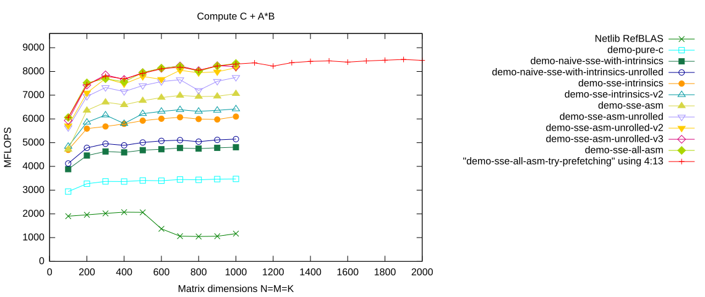
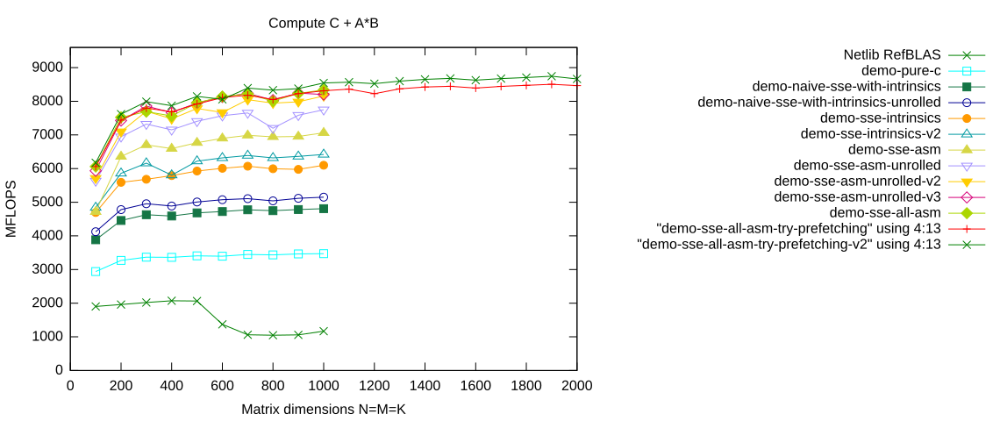
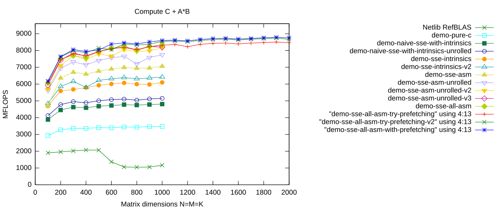

# Prefetching Panels

## First Attempt

Check out the `demo-sse-all-asm-try-prefetching` branch:

```console
$ git branch -a
  demo-naive-sse-with-intrinsics
  demo-naive-sse-with-intrinsics-unrolled
  demo-pure-c
* demo-sse-all-asm
  demo-sse-asm
  demo-sse-asm-unrolled
  demo-sse-asm-unrolled-v2
  demo-sse-asm-unrolled-v3
  demo-sse-intrinsics
  demo-sse-intrinsics-v2
  demo-sse-intrinsics-v3
  master
  remotes/origin/HEAD -> origin/master
  remotes/origin/bench-atlas
  remotes/origin/bench-blis
  remotes/origin/bench-eigen
  remotes/origin/bench-mkl
  remotes/origin/blis-avx-microkernel
  remotes/origin/demo-naive-avx-with-intrinsics
  remotes/origin/demo-naive-sse-with-intrinsics
  remotes/origin/demo-naive-sse-with-intrinsics-unrolled
  remotes/origin/demo-pure-c
  remotes/origin/demo-sse-all-asm
  remotes/origin/demo-sse-all-asm-try-prefetching
  remotes/origin/demo-sse-all-asm-try-prefetching-v2
  remotes/origin/demo-sse-all-asm-with-prefetching
  remotes/origin/demo-sse-asm
  remotes/origin/demo-sse-asm-for-AB-loop
  remotes/origin/demo-sse-asm-unrolled
  remotes/origin/demo-sse-asm-unrolled-v2
  remotes/origin/demo-sse-asm-unrolled-v3
  remotes/origin/demo-sse-asm-unrolled-with-prefetch
  remotes/origin/demo-sse-intrinsics
  remotes/origin/demo-sse-intrinsics-for-AB-loop
  remotes/origin/demo-sse-intrinsics-v2
  remotes/origin/demo-sse-intrinsics-v3
  remotes/origin/demo-with-sse-intrinsics
  remotes/origin/master
  remotes/origin/trsm-assignment
  remotes/origin/trsm-pure-c

$ git checkout -B demo-sse-all-asm-try-prefetching remotes/origin/demo-sse-all-asm-try-prefetching
Switched to a new branch 'demo-sse-all-asm-try-prefetching'
Branch demo-sse-all-asm-try-prefetching set up to track remote branch demo-sse-all-asm-try-prefetching from origin.
```

Then we compile the project:

```console
$ make
```

<details>
<summary>Show complete build output</summary>

```console
make -C src
clang -Wall -I. -O3 -msse3 -mfpmath=sse -fomit-frame-pointer -DULM_BLOCKED -c -o level3/dgemm_nn.o level3/dgemm_nn.c
ar cru ../libulmblas.a  auxiliary/xerbla.o  level1/dasum.o level1/daxpy.o level1/dcopy.o level1/ddot.o level1/dnrm2.o level1/drot.o level1/drotg.o level1/drotm.o level1/drotmg.o level1/dscal.o level1/dswap.o level1/idamax.o  level3/dgemm.o level3/dgemm_nn.o level3/dsymm.o level3/stubs.o
ranlib ../libulmblas.a
clang -Wall -I. -O3 -msse3 -mfpmath=sse -fomit-frame-pointer -DULM_BLOCKED -DFAKE_ATLAS -c -o level3/atl_dgemm_nn.o level3/dgemm_nn.c
ar cru ../libatlulmblas.a  auxiliary/atl_xerbla.o  level1/atl_dasum.o level1/atl_daxpy.o level1/atl_dcopy.o level1/atl_ddot.o level1/atl_dnrm2.o level1/atl_drot.o level1/atl_drotg.o level1/atl_drotm.o level1/atl_drotmg.o level1/atl_dscal.o level1/atl_dswap.o level1/atl_idamax.o  level3/atl_dgemm.o level3/atl_dgemm_nn.o level3/atl_dsymm.o level3/atl_stubs.o
ranlib ../libatlulmblas.a
make -C refblas
make[1]: Nothing to be done for `all'.
make -C test
gfortran dblat1.f -L.. -lulmblas -o dblat1_ulm
dblat1.f:215.44:

               CALL STEST1(DNRM2(N,SX,INCX),STEMP,STEMP,SFAC)
                                            1
Warning: Rank mismatch in argument 'strue1' at (1) (scalar and rank-1)
dblat1.f:219.44:

               CALL STEST1(DASUM(N,SX,INCX),STEMP,STEMP,SFAC)
                                            1
Warning: Rank mismatch in argument 'strue1' at (1) (scalar and rank-1)
gfortran dblat3.f -L.. -lulmblas -o dblat3_ulm
make -C bench
gfortran -o xdl1blastst l1blastst.o libtstatlas.a ../libatlulmblas.a ../librefblas.a
gfortran -o xdl3blastst l3blastst.o libtstatlas.a ../libatlulmblas.a ../librefblas.a
```

</details>

### Code Modifications

- The macro kernel now also passes pointers to the next panels of $A$ and $B$ to the micro kernel.

- In the micro kernel we add prefetch instructions.

- TODO: More details ...

- TODO: Add link to course material ...

The complete implementation is contained in

[`src/level3/dgemm_nn.c`](https://github.com/michael-lehn/ulmBLAS/blob/demo-sse-all-asm-try-prefetching/src/level3/dgemm_nn.c)

on the `demo-sse-all-asm-try-prefetching` branch.

<details>
<summary>Show complete <code>dgemm_nn.c</code></summary>

```c
#include <ulmblas.h>
#include <stdio.h>
#include <emmintrin.h>
#include <immintrin.h>

#define MC  384
#define KC  384
#define NC  4096

#define MR  4
#define NR  4

//
//  Local buffers for storing panels from A, B and C
//
static double _A[MC*KC] __attribute__ ((aligned (16)));
static double _B[KC*NC] __attribute__ ((aligned (16)));
static double _C[MR*NR] __attribute__ ((aligned (16)));

//
//  Packing complete panels from A (i.e. without padding)
//
static void
pack_MRxk(int k, const double *A, int incRowA, int incColA,
          double *buffer)
{
    int i, j;

    for (j=0; j<k; ++j) {
        for (i=0; i<MR; ++i) {
            buffer[i] = A[i*incRowA];
        }
        buffer += MR;
        A      += incColA;
    }
}

//
//  Packing panels from A with padding if required
//
static void
pack_A(int mc, int kc, const double *A, int incRowA, int incColA,
       double *buffer)
{
    int mp  = mc / MR;
    int _mr = mc % MR;

    int i, j;

    for (i=0; i<mp; ++i) {
        pack_MRxk(kc, A, incRowA, incColA, buffer);
        buffer += kc*MR;
        A      += MR*incRowA;
    }
    if (_mr>0) {
        for (j=0; j<kc; ++j) {
            for (i=0; i<_mr; ++i) {
                buffer[i] = A[i*incRowA];
            }
            for (i=_mr; i<MR; ++i) {
                buffer[i] = 0.0;
            }
            buffer += MR;
            A      += incColA;
        }
    }
}

//
//  Packing complete panels from B (i.e. without padding)
//
static void
pack_kxNR(int k, const double *B, int incRowB, int incColB,
          double *buffer)
{
    int i, j;

    for (i=0; i<k; ++i) {
        for (j=0; j<NR; ++j) {
            buffer[j] = B[j*incColB];
        }
        buffer += NR;
        B      += incRowB;
    }
}

//
//  Packing panels from B with padding if required
//
static void
pack_B(int kc, int nc, const double *B, int incRowB, int incColB,
       double *buffer)
{
    int np  = nc / NR;
    int _nr = nc % NR;

    int i, j;

    for (j=0; j<np; ++j) {
        pack_kxNR(kc, B, incRowB, incColB, buffer);
        buffer += kc*NR;
        B      += NR*incColB;
    }
    if (_nr>0) {
        for (i=0; i<kc; ++i) {
            for (j=0; j<_nr; ++j) {
                buffer[j] = B[j*incColB];
            }
            for (j=_nr; j<NR; ++j) {
                buffer[j] = 0.0;
            }
            buffer += NR;
            B      += incRowB;
        }
    }
}

//
//  Micro kernel for multiplying panels from A and B.
//
static void
dgemm_micro_kernel(long kc,
                   double alpha, const double *A, const double *B,
                   double beta,
                   double *C, long incRowC, long incColC,
                   const double *nextA, const double *nextB)
{
    long kb = kc / 4;
    long kl = kc % 4;

//
//  Compute AB = A*B
//
    __asm__ volatile
    (
    "movq      %0,      %%rsi    \n\t"  // kb (32 bit) stored in %rsi
    "movq      %1,      %%rdi    \n\t"  // kl (32 bit) stored in %rdi
    "movq      %2,      %%rax    \n\t"  // Address of A stored in %rax
    "movq      %3,      %%rbx    \n\t"  // Address of B stored in %rbx
    "movq      %9,      %%r9     \n\t"  // Address of nextA stored in %r9
    "movq      %10,     %%r10    \n\t"  // Address of nextB stored in %r10
    "                            \n\t"
    "addq      $128,    %%rax    \n\t"
    "addq      $128,    %%rbx    \n\t"
    "                            \n\t"
    "movapd -128(%%rax),%%xmm0   \n\t"  // tmp0 = _mm_load_pd(A)
    "movapd -112(%%rax),%%xmm1   \n\t"  // tmp1 = _mm_load_pd(A+2)
    "movapd -128(%%rbx),%%xmm2   \n\t"  // tmp2 = _mm_load_pd(B)
    "                            \n\t"
    "xorpd     %%xmm8,  %%xmm8   \n\t"  // ab_00_11 = _mm_setzero_pd()
    "xorpd     %%xmm9,  %%xmm9   \n\t"  // ab_20_31 = _mm_setzero_pd()
    "xorpd     %%xmm10, %%xmm10  \n\t"  // ab_01_10 = _mm_setzero_pd()
    "xorpd     %%xmm11, %%xmm11  \n\t"  // ab_21_30 = _mm_setzero_pd()
    "xorpd     %%xmm12, %%xmm12  \n\t"  // ab_02_13 = _mm_setzero_pd()
    "xorpd     %%xmm13, %%xmm13  \n\t"  // ab_22_33 = _mm_setzero_pd()
    "xorpd     %%xmm14, %%xmm14  \n\t"  // ab_03_12 = _mm_setzero_pd()
    "xorpd     %%xmm15, %%xmm15  \n\t"  // ab_23_32 = _mm_setzero_pd()
    "                            \n\t"
    "xorpd     %%xmm3,  %%xmm3   \n\t"  // tmp3 = _mm_setzero_pd
    "xorpd     %%xmm4,  %%xmm4   \n\t"  // tmp4 = _mm_setzero_pd
    "xorpd     %%xmm5,  %%xmm5   \n\t"  // tmp5 = _mm_setzero_pd
    "xorpd     %%xmm6,  %%xmm6   \n\t"  // tmp6 = _mm_setzero_pd
    "xorpd     %%xmm7,  %%xmm7   \n\t"  // tmp7 = _mm_setzero_pd
    "testq     %%rdi,   %%rdi    \n\t"  // if kl==0 writeback to AB
    "                            \n\t"
    "                            \n\t"
    "testq     %%rsi,   %%rsi    \n\t"  // if kb==0 handle remaining kl
    "je        .DCONSIDERLEFT%=  \n\t"  // update iterations
    "                            \n\t"
    ".DLOOP%=:                   \n\t"  // for l = kb,..,1 do
    "                            \n\t"
    "prefetcht0 (4*35+1)*8(%%rax)\n\t"
    "                            \n\t"
    "                            \n\t"  // 1. update
    "addpd     %%xmm3,  %%xmm12  \n\t"  // ab_02_13 = _mm_add_pd(ab_02_13, tmp3)
    "movaps -112(%%rbx),%%xmm3   \n\t"  // tmp3     = _mm_load_pd(B+2)
    "addpd     %%xmm6,  %%xmm13  \n\t"  // ab_22_33 = _mm_add_pd(ab_22_33, tmp6)
    "movaps    %%xmm2,  %%xmm6   \n\t"  // tmp6     = tmp2
    "pshufd $78,%%xmm2, %%xmm4   \n\t"  // tmp4     = _mm_shuffle_pd(tmp2, tmp2,
    "                            \n\t"  //                   _MM_SHUFFLE2(0, 1))
    "mulpd     %%xmm0,  %%xmm2   \n\t"  // tmp2     = _mm_mul_pd(tmp2, tmp0);
    "mulpd     %%xmm1,  %%xmm6   \n\t"  // tmp6     = _mm_mul_pd(tmp6, tmp1);
    "                            \n\t"
    "                            \n\t"
    "addpd     %%xmm5,  %%xmm14  \n\t"  // ab_03_12 = _mm_add_pd(ab_03_12, tmp5)
    "addpd     %%xmm7,  %%xmm15  \n\t"  // ab_23_32 = _mm_add_pd(ab_23_32, tmp7)
    "movaps    %%xmm4,  %%xmm7   \n\t"  // tmp7     = tmp4
    "mulpd     %%xmm0,  %%xmm4   \n\t"  // tmp4     = _mm_mul_pd(tmp4, tmp0)
    "mulpd     %%xmm1,  %%xmm7   \n\t"  // tmp7     = _mm_mul_pd(tmp7, tmp1)
    "                            \n\t"
    "                            \n\t"
    "addpd     %%xmm2,  %%xmm8   \n\t"  // ab_00_11 = _mm_add_pd(ab_00_11, tmp2)
    "movaps -96(%%rbx), %%xmm2   \n\t"  // tmp2     = _mm_load_pd(B+4)
    "addpd     %%xmm6,  %%xmm9   \n\t"  // ab_20_31 = _mm_add_pd(ab_20_31, tmp6)
    "movaps    %%xmm3,  %%xmm6   \n\t"  // tmp6     = tmp3
    "pshufd $78,%%xmm3, %%xmm5   \n\t"  // tmp5     = _mm_shuffle_pd(tmp3, tmp3,
    "                            \n\t"  //                   _MM_SHUFFLE2(0, 1))
    "mulpd     %%xmm0,  %%xmm3   \n\t"  // tmp3     = _mm_mul_pd(tmp3, tmp0)
    "mulpd     %%xmm1,  %%xmm6   \n\t"  // tmp6     = _mm_mul_pd(tmp6, tmp1)
    "                            \n\t"
    "                            \n\t"
    "addpd     %%xmm4,  %%xmm10  \n\t"  // ab_01_10 = _mm_add_pd(ab_01_10, tmp4)
    "addpd     %%xmm7,  %%xmm11  \n\t"  // ab_21_30 = _mm_add_pd(ab_21_30, tmp7)
    "movaps    %%xmm5,  %%xmm7   \n\t"  // tmp7     = tmp5
    "mulpd     %%xmm0,  %%xmm5   \n\t"  // tmp5     = _mm_mul_pd(tmp5, tmp0)
    "movaps -96(%%rax), %%xmm0   \n\t"  // tmp0     = _mm_load_pd(A+4)
    "mulpd     %%xmm1,  %%xmm7   \n\t"  // tmp7     = _mm_mul_pd(tmp7, tmp1)
    "movaps -80(%%rax), %%xmm1   \n\t"  // tmp1     = _mm_load_pd(A+6)
    "                            \n\t"
    "                            \n\t"
    "                            \n\t"
    "                            \n\t"  // 2. update
    "addpd     %%xmm3,  %%xmm12  \n\t"  // ab_02_13 = _mm_add_pd(ab_02_13, tmp3)
    "movaps -80(%%rbx), %%xmm3   \n\t"  // tmp3     = _mm_load_pd(B+6)
    "addpd     %%xmm6,  %%xmm13  \n\t"  // ab_22_33 = _mm_add_pd(ab_22_33, tmp6)
    "movaps    %%xmm2,  %%xmm6   \n\t"  // tmp6     = tmp2
    "pshufd $78,%%xmm2, %%xmm4   \n\t"  // tmp4     = _mm_shuffle_pd(tmp2, tmp2,
    "                            \n\t"  //                   _MM_SHUFFLE2(0, 1))
    "mulpd     %%xmm0,  %%xmm2   \n\t"  // tmp2     = _mm_mul_pd(tmp2, tmp0);
    "mulpd     %%xmm1,  %%xmm6   \n\t"  // tmp6     = _mm_mul_pd(tmp6, tmp1);
    "                            \n\t"
    "                            \n\t"
    "addpd     %%xmm5,  %%xmm14  \n\t"  // ab_03_12 = _mm_add_pd(ab_03_12, tmp5)
    "addpd     %%xmm7,  %%xmm15  \n\t"  // ab_23_32 = _mm_add_pd(ab_23_32, tmp7)
    "movaps    %%xmm4,  %%xmm7   \n\t"  // tmp7     = tmp4
    "mulpd     %%xmm0,  %%xmm4   \n\t"  // tmp4     = _mm_mul_pd(tmp4, tmp0)
    "mulpd     %%xmm1,  %%xmm7   \n\t"  // tmp7     = _mm_mul_pd(tmp7, tmp1)
    "                            \n\t"
    "                            \n\t"
    "addpd     %%xmm2,  %%xmm8   \n\t"  // ab_00_11 = _mm_add_pd(ab_00_11, tmp2)
    "movaps -64(%%rbx), %%xmm2   \n\t"  // tmp2     = _mm_load_pd(B+8)
    "addpd     %%xmm6,  %%xmm9   \n\t"  // ab_20_31 = _mm_add_pd(ab_20_31, tmp6)
    "movaps    %%xmm3,  %%xmm6   \n\t"  // tmp6     = tmp3
    "pshufd $78,%%xmm3, %%xmm5   \n\t"  // tmp5     = _mm_shuffle_pd(tmp3, tmp3,
    "                            \n\t"  //                   _MM_SHUFFLE2(0, 1))
    "mulpd     %%xmm0,  %%xmm3   \n\t"  // tmp3     = _mm_mul_pd(tmp3, tmp0)
    "mulpd     %%xmm1,  %%xmm6   \n\t"  // tmp6     = _mm_mul_pd(tmp6, tmp1)
    "                            \n\t"
    "                            \n\t"
    "addpd     %%xmm4,  %%xmm10  \n\t"  // ab_01_10 = _mm_add_pd(ab_01_10, tmp4)
    "addpd     %%xmm7,  %%xmm11  \n\t"  // ab_21_30 = _mm_add_pd(ab_21_30, tmp7)
    "movaps    %%xmm5,  %%xmm7   \n\t"  // tmp7     = tmp5
    "mulpd     %%xmm0,  %%xmm5   \n\t"  // tmp5     = _mm_mul_pd(tmp5, tmp0)
    "movaps -64(%%rax), %%xmm0   \n\t"  // tmp0     = _mm_load_pd(A+8)
    "mulpd     %%xmm1,  %%xmm7   \n\t"  // tmp7     = _mm_mul_pd(tmp7, tmp1)
    "movaps -48(%%rax), %%xmm1   \n\t"  // tmp1     = _mm_load_pd(A+10)
    "                            \n\t"
    "                            \n\t"
    "prefetcht0 (4*37+1)*8(%%rax)\n\t"
    "                            \n\t"
    "                            \n\t"  // 3. update
    "addpd     %%xmm3,  %%xmm12  \n\t"  // ab_02_13 = _mm_add_pd(ab_02_13, tmp3)
    "movaps -48(%%rbx), %%xmm3   \n\t"  // tmp3     = _mm_load_pd(B+10)
    "addpd     %%xmm6,  %%xmm13  \n\t"  // ab_22_33 = _mm_add_pd(ab_22_33, tmp6)
    "movaps    %%xmm2,  %%xmm6   \n\t"  // tmp6     = tmp2
    "pshufd $78,%%xmm2, %%xmm4   \n\t"  // tmp4     = _mm_shuffle_pd(tmp2, tmp2,
    "                            \n\t"  //                   _MM_SHUFFLE2(0, 1))
    "mulpd     %%xmm0,  %%xmm2   \n\t"  // tmp2     = _mm_mul_pd(tmp2, tmp0);
    "mulpd     %%xmm1,  %%xmm6   \n\t"  // tmp6     = _mm_mul_pd(tmp6, tmp1);
    "                            \n\t"
    "                            \n\t"
    "addpd     %%xmm5,  %%xmm14  \n\t"  // ab_03_12 = _mm_add_pd(ab_03_12, tmp5)
    "addpd     %%xmm7,  %%xmm15  \n\t"  // ab_23_32 = _mm_add_pd(ab_23_32, tmp7)
    "movaps    %%xmm4,  %%xmm7   \n\t"  // tmp7     = tmp4
    "mulpd     %%xmm0,  %%xmm4   \n\t"  // tmp4     = _mm_mul_pd(tmp4, tmp0)
    "mulpd     %%xmm1,  %%xmm7   \n\t"  // tmp7     = _mm_mul_pd(tmp7, tmp1)
    "                            \n\t"
    "                            \n\t"
    "addpd     %%xmm2,  %%xmm8   \n\t"  // ab_00_11 = _mm_add_pd(ab_00_11, tmp2)
    "movaps -32(%%rbx), %%xmm2   \n\t"  // tmp2     = _mm_load_pd(B+12)
    "addpd     %%xmm6,  %%xmm9   \n\t"  // ab_20_31 = _mm_add_pd(ab_20_31, tmp6)
    "movaps    %%xmm3,  %%xmm6   \n\t"  // tmp6     = tmp3
    "pshufd $78,%%xmm3, %%xmm5   \n\t"  // tmp5     = _mm_shuffle_pd(tmp3, tmp3,
    "                            \n\t"  //                   _MM_SHUFFLE2(0, 1))
    "mulpd     %%xmm0,  %%xmm3   \n\t"  // tmp3     = _mm_mul_pd(tmp3, tmp0)
    "mulpd     %%xmm1,  %%xmm6   \n\t"  // tmp6     = _mm_mul_pd(tmp6, tmp1)
    "                            \n\t"
    "                            \n\t"
    "addpd     %%xmm4,  %%xmm10  \n\t"  // ab_01_10 = _mm_add_pd(ab_01_10, tmp4)
    "addpd     %%xmm7,  %%xmm11  \n\t"  // ab_21_30 = _mm_add_pd(ab_21_30, tmp7)
    "movaps    %%xmm5,  %%xmm7   \n\t"  // tmp7     = tmp5
    "mulpd     %%xmm0,  %%xmm5   \n\t"  // tmp5     = _mm_mul_pd(tmp5, tmp0)
    "movaps -32(%%rax), %%xmm0   \n\t"  // tmp0     = _mm_load_pd(A+12)
    "mulpd     %%xmm1,  %%xmm7   \n\t"  // tmp7     = _mm_mul_pd(tmp7, tmp1)
    "movaps -16(%%rax), %%xmm1   \n\t"  // tmp1     = _mm_load_pd(A+14)
    "                            \n\t"
    "                            \n\t"
    "                            \n\t"  // 4. update
    "addpd     %%xmm3,  %%xmm12  \n\t"  // ab_02_13 = _mm_add_pd(ab_02_13, tmp3)
    "movaps -16(%%rbx), %%xmm3   \n\t"  // tmp3     = _mm_load_pd(B+14)
    "addpd     %%xmm6,  %%xmm13  \n\t"  // ab_22_33 = _mm_add_pd(ab_22_33, tmp6)
    "movaps    %%xmm2,  %%xmm6   \n\t"  // tmp6     = tmp2
    "pshufd $78,%%xmm2, %%xmm4   \n\t"  // tmp4     = _mm_shuffle_pd(tmp2, tmp2,
    "                            \n\t"  //                   _MM_SHUFFLE2(0, 1))
    "mulpd     %%xmm0,  %%xmm2   \n\t"  // tmp2     = _mm_mul_pd(tmp2, tmp0);
    "mulpd     %%xmm1,  %%xmm6   \n\t"  // tmp6     = _mm_mul_pd(tmp6, tmp1);
    "                            \n\t"
    "subq     $-32*4,   %%rax    \n\t"  // A += 16;
    "                            \n\t"
    "addpd     %%xmm5,  %%xmm14  \n\t"  // ab_03_12 = _mm_add_pd(ab_03_12, tmp5)
    "addpd     %%xmm7,  %%xmm15  \n\t"  // ab_23_32 = _mm_add_pd(ab_23_32, tmp7)
    "movaps    %%xmm4,  %%xmm7   \n\t"  // tmp7     = tmp4
    "mulpd     %%xmm0,  %%xmm4   \n\t"  // tmp4     = _mm_mul_pd(tmp4, tmp0)
    "mulpd     %%xmm1,  %%xmm7   \n\t"  // tmp7     = _mm_mul_pd(tmp7, tmp1)
    "                            \n\t"
    "subq     $-128,    %%r10    \n\t"  // nextB += 16
    "                            \n\t"
    "addpd     %%xmm2,  %%xmm8   \n\t"  // ab_00_11 = _mm_add_pd(ab_00_11, tmp2)
    "movaps    (%%rbx),%%xmm2   \n\t"  // tmp2     = _mm_load_pd(B+16)
    "addpd     %%xmm6,  %%xmm9   \n\t"  // ab_20_31 = _mm_add_pd(ab_20_31, tmp6)
    "movaps    %%xmm3,  %%xmm6   \n\t"  // tmp6     = tmp3
    "pshufd $78,%%xmm3, %%xmm5   \n\t"  // tmp5     = _mm_shuffle_pd(tmp3, tmp3,
    "                            \n\t"  //                   _MM_SHUFFLE2(0, 1))
    "mulpd     %%xmm0,  %%xmm3   \n\t"  // tmp3     = _mm_mul_pd(tmp3, tmp0)
    "mulpd     %%xmm1,  %%xmm6   \n\t"  // tmp6     = _mm_mul_pd(tmp6, tmp1)
    "                            \n\t"
    "subq     $-32*4,   %%rbx    \n\t"  // B += 16;
    "                            \n\t"
    "                            \n\t"
    "addpd     %%xmm4,  %%xmm10  \n\t"  // ab_01_10 = _mm_add_pd(ab_01_10, tmp4)
    "addpd     %%xmm7,  %%xmm11  \n\t"  // ab_21_30 = _mm_add_pd(ab_21_30, tmp7)
    "movaps    %%xmm5,  %%xmm7   \n\t"  // tmp7     = tmp5
    "mulpd     %%xmm0,  %%xmm5   \n\t"  // tmp5     = _mm_mul_pd(tmp5, tmp0)
    "movaps -128(%%rax),%%xmm0   \n\t"  // tmp0     = _mm_load_pd(A+16)
    "mulpd     %%xmm1,  %%xmm7   \n\t"  // tmp7     = _mm_mul_pd(tmp7, tmp1)
    "movaps -112(%%rax), %%xmm1   \n\t"  // tmp1     = _mm_load_pd(A+18)
    "                            \n\t"
    "prefetcht2        0(%%r10)  \n\t"  // prefetch nextB[0]
    "prefetcht2       64(%%r10)  \n\t"  // prefetch nextB[8]
    "                            \n\t"
    "decq      %%rsi             \n\t"  // --l
    "jne       .DLOOP%=          \n\t"  // if l>= 1 go back
    "                            \n\t"
    "                            \n\t"
    ".DCONSIDERLEFT%=:           \n\t"
    "testq     %%rdi,   %%rdi    \n\t"  // if kl==0 writeback to AB
    "je        .DPOSTACCUMULATE%=\n\t"
    "                            \n\t"
    ".DLOOPLEFT%=:               \n\t"  // for l = kl,..,1 do
    "                            \n\t"
    "addpd     %%xmm3,  %%xmm12  \n\t"  // ab_02_13 = _mm_add_pd(ab_02_13, tmp3)
    "movapd -112(%%rbx),%%xmm3   \n\t"  // tmp3     = _mm_load_pd(B+2)
    "addpd     %%xmm6,  %%xmm13  \n\t"  // ab_22_33 = _mm_add_pd(ab_22_33, tmp6)
    "movapd    %%xmm2,  %%xmm6   \n\t"  // tmp6     = tmp2
    "pshufd $78,%%xmm2, %%xmm4   \n\t"  // tmp4     = _mm_shuffle_pd(tmp2, tmp2,
    "                            \n\t"  //                   _MM_SHUFFLE2(0, 1))
    "mulpd     %%xmm0,  %%xmm2   \n\t"  // tmp2     = _mm_mul_pd(tmp2, tmp0);
    "mulpd     %%xmm1,  %%xmm6   \n\t"  // tmp6     = _mm_mul_pd(tmp6, tmp1);
    "                            \n\t"
    "                            \n\t"
    "addpd     %%xmm5,  %%xmm14  \n\t"  // ab_03_12 = _mm_add_pd(ab_03_12, tmp5)
    "addpd     %%xmm7,  %%xmm15  \n\t"  // ab_23_32 = _mm_add_pd(ab_23_32, tmp7)
    "movapd    %%xmm4,  %%xmm7   \n\t"  // tmp7     = tmp4
    "mulpd     %%xmm0,  %%xmm4   \n\t"  // tmp4     = _mm_mul_pd(tmp4, tmp0)
    "mulpd     %%xmm1,  %%xmm7   \n\t"  // tmp7     = _mm_mul_pd(tmp7, tmp1)
    "                            \n\t"
    "                            \n\t"
    "addpd     %%xmm2,  %%xmm8   \n\t"  // ab_00_11 = _mm_add_pd(ab_00_11, tmp2)
    "movapd -96(%%rbx), %%xmm2   \n\t"  // tmp2     = _mm_load_pd(B+4)
    "addpd     %%xmm6,  %%xmm9   \n\t"  // ab_20_31 = _mm_add_pd(ab_20_31, tmp6)
    "movapd    %%xmm3,  %%xmm6   \n\t"  // tmp6     = tmp3
    "pshufd $78,%%xmm3, %%xmm5   \n\t"  // tmp5     = _mm_shuffle_pd(tmp3, tmp3,
    "                            \n\t"  //                   _MM_SHUFFLE2(0, 1))
    "mulpd     %%xmm0,  %%xmm3   \n\t"  // tmp3     = _mm_mul_pd(tmp3, tmp0)
    "mulpd     %%xmm1,  %%xmm6   \n\t"  // tmp6     = _mm_mul_pd(tmp6, tmp1)
    "                            \n\t"
    "                            \n\t"
    "addpd     %%xmm4,  %%xmm10  \n\t"  // ab_01_10 = _mm_add_pd(ab_01_10, tmp4)
    "addpd     %%xmm7,  %%xmm11  \n\t"  // ab_21_30 = _mm_add_pd(ab_21_30, tmp7)
    "movapd    %%xmm5,  %%xmm7   \n\t"  // tmp7     = tmp5
    "mulpd     %%xmm0,  %%xmm5   \n\t"  // tmp5     = _mm_mul_pd(tmp5, tmp0)
    "movapd -96(%%rax), %%xmm0   \n\t"  // tmp0     = _mm_load_pd(A+4)
    "mulpd     %%xmm1,  %%xmm7   \n\t"  // tmp7     = _mm_mul_pd(tmp7, tmp1)
    "movapd -80(%%rax), %%xmm1   \n\t"  // tmp1     = _mm_load_pd(A+6)
    "                            \n\t"
    "                            \n\t"
    "addq      $32,     %%rax    \n\t"  // A += 4;
    "addq      $32,     %%rbx    \n\t"  // B += 4;
    "                            \n\t"
    "decq      %%rdi             \n\t"  // --l
    "jne       .DLOOPLEFT%=      \n\t"  // if l>= 1 go back
    "                            \n\t"
    ".DPOSTACCUMULATE%=:         \n\t"  // Update remaining ab_*_* registers
    "                            \n\t"
    "addpd    %%xmm3,   %%xmm12  \n\t"  // ab_02_13 = _mm_add_pd(ab_02_13, tmp3)
    "addpd    %%xmm6,   %%xmm13  \n\t"  // ab_22_33 = _mm_add_pd(ab_22_33, tmp6)
    "                            \n\t"  //
    "addpd    %%xmm5,   %%xmm14  \n\t"  // ab_03_12 = _mm_add_pd(ab_03_12, tmp5)
    "addpd    %%xmm7,   %%xmm15  \n\t"  // ab_23_32 = _mm_add_pd(ab_23_32, tmp7)
    "                            \n\t"
//
//  Update C <- beta*C + alpha*AB
//
//
    "movsd  %4,                  %%xmm0 \n\t"  // load alpha
    "movsd  %5,                  %%xmm1 \n\t"  // load beta 
    "movq   %6,                  %%rcx  \n\t"  // Address of C stored in %rcx

    "movq   %7,                  %%r8   \n\t"  // load incRowC
    "leaq   (,%%r8,8),           %%r8   \n\t"  //      incRowC *= sizeof(double)
    "movq   %8,                  %%r9   \n\t"  // load incColC
    "leaq   (,%%r9,8),           %%r9   \n\t"  //      incRowC *= sizeof(double)
    "                                   \n\t"
    "leaq (%%rcx,%%r9),          %%r10  \n\t"  // Store addr of C01 in %r10
    "leaq (%%rcx,%%r8,2),        %%rdx  \n\t"  // Store addr of C20 in %rdx
    "leaq (%%rdx,%%r9),          %%r11  \n\t"  // Store addr of C21 in %r11
    "                                   \n\t"
    "unpcklpd %%xmm0,            %%xmm0 \n\t"  // duplicate alpha
    "unpcklpd %%xmm1,            %%xmm1 \n\t"  // duplicate beta
    "                                   \n\t"
    "                                   \n\t"
    "movlpd (%%rcx),             %%xmm3 \n\t"  // load (C00,
    "movhpd (%%r10,%%r8),        %%xmm3 \n\t"  //       C11)
    "mulpd  %%xmm0,              %%xmm8 \n\t"  // scale ab_00_11 by alpha
    "mulpd  %%xmm1,              %%xmm3 \n\t"  // scale (C00, C11) by beta
    "addpd  %%xmm8,              %%xmm3 \n\t"  // add results

    "movlpd %%xmm3,        (%%rcx)       \n\t"  // write back (C00,
    "movhpd %%xmm3,        (%%r10,%%r8)  \n\t"  //             C11)
    "                                   \n\t"
    "movlpd (%%rdx),             %%xmm4 \n\t"  // load (C20,
    "movhpd (%%r11,%%r8),        %%xmm4 \n\t"  //       C31)
    "mulpd  %%xmm0,              %%xmm9 \n\t"  // scale ab_20_31 by alpha
    "mulpd  %%xmm1,              %%xmm4 \n\t"  // scale (C20, C31) by beta
    "addpd  %%xmm9,              %%xmm4 \n\t"  // add results
    "movlpd %%xmm4,        (%%rdx)       \n\t"  // write back (C20,
    "movhpd %%xmm4,        (%%r11,%%r8)  \n\t"  //             C31)
    "                                   \n\t"
    "                                   \n\t"
    "movlpd (%%r10),             %%xmm3 \n\t"  // load (C01,
    "movhpd (%%rcx,%%r8),        %%xmm3 \n\t"  //       C10)
    "mulpd  %%xmm0,              %%xmm10\n\t"  // scale ab_01_10 by alpha
    "mulpd  %%xmm1,              %%xmm3 \n\t"  // scale (C01, C10) by beta
    "addpd  %%xmm10,             %%xmm3 \n\t"  // add results
    "movlpd %%xmm3,        (%%r10)      \n\t"  // write back (C01,
    "movhpd %%xmm3,        (%%rcx,%%r8) \n\t"  //             C10)
    "                                   \n\t"
    "movlpd (%%r11),             %%xmm4 \n\t"  // load (C21,
    "movhpd (%%rdx,%%r8),        %%xmm4 \n\t"  //       C30)
    "mulpd  %%xmm0,              %%xmm11\n\t"  // scale ab_21_30 by alpha
    "mulpd  %%xmm1,              %%xmm4 \n\t"  // scale (C21, C30) by beta
    "addpd  %%xmm11,             %%xmm4 \n\t"  // add results
    "movlpd %%xmm4,        (%%r11)      \n\t"  // write back (C21,
    "movhpd %%xmm4,        (%%rdx,%%r8) \n\t"  //             C30)
    "                                   \n\t"
    "                                   \n\t"
    "leaq   (%%rcx,%%r9,2),      %%rcx  \n\t"  // Store addr of C02 in %rcx
    "leaq   (%%r10,%%r9,2),      %%r10  \n\t"  // Store addr of C03 in %r10
    "leaq   (%%rdx,%%r9,2),      %%rdx  \n\t"  // Store addr of C22 in $rdx
    "leaq   (%%r11,%%r9,2),      %%r11  \n\t"  // Store addr of C23 in %r11
    "                                   \n\t"
    "                                   \n\t"
    "movlpd (%%rcx),             %%xmm3 \n\t"  // load (C02,
    "movhpd (%%r10,%%r8),        %%xmm3 \n\t"  //       C13)
    "mulpd  %%xmm0,              %%xmm12\n\t"  // scale ab_02_13 by alpha
    "mulpd  %%xmm1,              %%xmm3 \n\t"  // scale (C02, C13) by beta
    "addpd  %%xmm12,             %%xmm3 \n\t"  // add results
    "movlpd %%xmm3,        (%%rcx)      \n\t"  // write back (C02,
    "movhpd %%xmm3,        (%%r10,%%r8) \n\t"  //             C13)
    "                                   \n\t"
    "movlpd (%%rdx),             %%xmm4 \n\t"  // load (C22,
    "movhpd (%%r11, %%r8),       %%xmm4 \n\t"  //       C33)
    "mulpd  %%xmm0,              %%xmm13\n\t"  // scale ab_22_33 by alpha
    "mulpd  %%xmm1,              %%xmm4 \n\t"  // scale (C22, C33) by beta
    "addpd  %%xmm13,             %%xmm4 \n\t"  // add results
    "movlpd %%xmm4,             (%%rdx) \n\t"  // write back (C22,
    "movhpd %%xmm4,        (%%r11,%%r8) \n\t"  //             C33)
    "                                   \n\t"
    "                                   \n\t"
    "movlpd (%%r10),             %%xmm3 \n\t"  // load (C03,
    "movhpd (%%rcx,%%r8),        %%xmm3 \n\t"  //       C12)
    "mulpd  %%xmm0,              %%xmm14\n\t"  // scale ab_03_12 by alpha
    "mulpd  %%xmm1,              %%xmm3 \n\t"  // scale (C03, C12) by beta
    "addpd  %%xmm14,             %%xmm3 \n\t"  // add results
    "movlpd %%xmm3,        (%%r10)      \n\t"  // write back (C03,
    "movhpd %%xmm3,        (%%rcx,%%r8) \n\t"  //             C12)
    "                                   \n\t"
    "movlpd (%%r11),             %%xmm4 \n\t"  // load (C23,
    "movhpd (%%rdx,%%r8),        %%xmm4 \n\t"  //       C32)
    "mulpd  %%xmm0,              %%xmm15\n\t"  // scale ab_23_32 by alpha
    "mulpd  %%xmm1,              %%xmm4 \n\t"  // scale (C23, C32) by beta
    "addpd  %%xmm15,             %%xmm4 \n\t"  // add results
    "movlpd %%xmm4,        (%%r11)      \n\t"  // write back (C23,
    "movhpd %%xmm4,        (%%rdx,%%r8) \n\t"  //             C32)
    : // output
    : // input
        "m" (kb),       // 0
        "m" (kl),       // 1
        "m" (A),        // 2
        "m" (B),        // 3
        "m" (alpha),    // 4
        "m" (beta),     // 5
        "m" (C),        // 6
        "m" (incRowC),  // 7
        "m" (incColC),  // 8
        "m" (nextA),    // 9
        "m" (nextB)     // 10
    : // register clobber list
        "rax", "rbx", "rcx", "rdx", "rsi", "rdi", "r8", "r9", "r10", "r11",
        "xmm0", "xmm1", "xmm2", "xmm3",
        "xmm4", "xmm5", "xmm6", "xmm7",
        "xmm8", "xmm9", "xmm10", "xmm11",
        "xmm12", "xmm13", "xmm14", "xmm15"
    );
}

//
//  Compute Y += alpha*X
//
static void
dgeaxpy(int           m,
        int           n,
        double        alpha,
        const double  *X,
        int           incRowX,
        int           incColX,
        double        *Y,
        int           incRowY,
        int           incColY)
{
    int i, j;


    if (alpha!=1.0) {
        for (j=0; j<n; ++j) {
            for (i=0; i<m; ++i) {
                Y[i*incRowY+j*incColY] += alpha*X[i*incRowX+j*incColX];
            }
        }
    } else {
        for (j=0; j<n; ++j) {
            for (i=0; i<m; ++i) {
                Y[i*incRowY+j*incColY] += X[i*incRowX+j*incColX];
            }
        }
    }
}

//
//  Compute X *= alpha
//
static void
dgescal(int     m,
        int     n,
        double  alpha,
        double  *X,
        int     incRowX,
        int     incColX)
{
    int i, j;

    if (alpha!=0.0) {
        for (j=0; j<n; ++j) {
            for (i=0; i<m; ++i) {
                X[i*incRowX+j*incColX] *= alpha;
            }
        }
    } else {
        for (j=0; j<n; ++j) {
            for (i=0; i<m; ++i) {
                X[i*incRowX+j*incColX] = 0.0;
            }
        }
    }
}

//
//  Macro Kernel for the multiplication of blocks of A and B.  We assume that
//  these blocks were previously packed to buffers _A and _B.
//
static void
dgemm_macro_kernel(int     mc,
                   int     nc,
                   int     kc,
                   double  alpha,
                   double  beta,
                   double  *C,
                   int     incRowC,
                   int     incColC)
{
    int mp = (mc+MR-1) / MR;
    int np = (nc+NR-1) / NR;

    int _mr = mc % MR;
    int _nr = nc % NR;

    int mr, nr;
    int i, j;

    const double *nextA;
    const double *nextB;

    for (j=0; j<np; ++j) {
        nr    = (j!=np-1 || _nr==0) ? NR : _nr;
        nextB = &_B[j*kc*NR];

        for (i=0; i<mp; ++i) {
            mr    = (i!=mp-1 || _mr==0) ? MR : _mr;
            nextA = &_A[(i+1)*kc*MR];

            if (i==mp-1) {
                nextA = _A;
                nextB = &_B[(j+1)*kc*NR];
                if (j==np-1) {
                    nextB = _B;
                }
            }

            if (mr==MR && nr==NR) {
                dgemm_micro_kernel(kc, alpha, &_A[i*kc*MR], &_B[j*kc*NR],
                                   beta,
                                   &C[i*MR*incRowC+j*NR*incColC],
                                   incRowC, incColC,
                                   nextA, nextB);
            } else {
                dgemm_micro_kernel(kc, alpha, &_A[i*kc*MR], &_B[j*kc*NR],
                                   0.0,
                                   _C, 1, MR,
                                   nextA, nextB);
                dgescal(mr, nr, beta,
                        &C[i*MR*incRowC+j*NR*incColC], incRowC, incColC);
                dgeaxpy(mr, nr, 1.0, _C, 1, MR,
                        &C[i*MR*incRowC+j*NR*incColC], incRowC, incColC);
            }
        }
    }
}

//
//  Compute C <- beta*C + alpha*A*B
//
void
ULMBLAS(dgemm_nn)(int            m,
                  int            n,
                  int            k,
                  double         alpha,
                  const double   *A,
                  int            incRowA,
                  int            incColA,
                  const double   *B,
                  int            incRowB,
                  int            incColB,
                  double         beta,
                  double         *C,
                  int            incRowC,
                  int            incColC)
{
    int mb = (m+MC-1) / MC;
    int nb = (n+NC-1) / NC;
    int kb = (k+KC-1) / KC;

    int _mc = m % MC;
    int _nc = n % NC;
    int _kc = k % KC;

    int mc, nc, kc;
    int i, j, l;

    double _beta;

    if (alpha==0.0 || k==0) {
        dgescal(m, n, beta, C, incRowC, incColC);
        return;
    }

    for (j=0; j<nb; ++j) {
        nc = (j!=nb-1 || _nc==0) ? NC : _nc;

        for (l=0; l<kb; ++l) {
            kc    = (l!=kb-1 || _kc==0) ? KC   : _kc;
            _beta = (l==0) ? beta : 1.0;

            pack_B(kc, nc,
                   &B[l*KC*incRowB+j*NC*incColB], incRowB, incColB,
                   _B);

            for (i=0; i<mb; ++i) {
                mc = (i!=mb-1 || _mc==0) ? MC : _mc;

                pack_A(mc, kc,
                       &A[i*MC*incRowA+l*KC*incColA], incRowA, incColA,
                       _A);

                dgemm_macro_kernel(mc, nc, kc, alpha, _beta,
                                   &C[i*MC*incRowC+j*NC*incColC],
                                   incRowC, incColC);
            }
        }
    }
}
```

</details>

The important structural change in the macro kernel is that it determines the panels that will be used by the *next* invocation of the micro kernel:

```c
const double *nextA;
const double *nextB;

for (j=0; j<np; ++j) {
    nr    = (j!=np-1 || _nr==0) ? NR : _nr;
    nextB = &_B[j*kc*NR];

    for (i=0; i<mp; ++i) {
        mr    = (i!=mp-1 || _mr==0) ? MR : _mr;
        nextA = &_A[(i+1)*kc*MR];

        if (i==mp-1) {
            nextA = _A;
            nextB = &_B[(j+1)*kc*NR];

            if (j==np-1) {
                nextB = _B;
            }
        }

        ...
    }
}
```

The pointers `nextA` and `nextB` are passed to `dgemm_micro_kernel`, where prefetch instructions can bring data for the next micro-kernel invocation into the cache while the current one is still being computed.

### Benchmark Results

We run the benchmarks:

```console
$ cd bench
$ ./xdl3blastst -N 100 2000 100 > report
```

and filter out the results for the `demo-sse-all-asm-try-prefetching` branch:

```console
$ grep PASS report > demo-sse-all-asm-try-prefetching
$ cat demo-sse-all-asm-try-prefetching
   0 N N  100  100  100   1.0 2000 2000   1.0 2000  0.00 6006.0 3.31 PASS
   1 N N  200  200  200   1.0 2000 2000   1.0 2000  0.00 7407.4 3.81 PASS
   2 N N  300  300  300   1.0 2000 2000   1.0 2000  0.01 7712.1 3.82 PASS
   3 N N  400  400  400   1.0 2000 2000   1.0 2000  0.02 7681.7 3.81 PASS
   4 N N  500  500  500   1.0 2000 2000   1.0 2000  0.03 7940.0 3.98 PASS
   5 N N  600  600  600   1.0 2000 2000   1.0 2000  0.05 8089.4 6.15 PASS
   6 N N  700  700  700   1.0 2000 2000   1.0 2000  0.08 8113.9 7.90 PASS
   7 N N  800  800  800   1.0 2000 2000   1.0 2000  0.13 8124.6 7.69 PASS
   8 N N  900  900  900   1.0 2000 2000   1.0 2000  0.18 8004.8 7.53 PASS
   9 N N 1000 1000 1000   1.0 2000 2000   1.0 2000  0.24 8268.6 7.96 PASS
  10 N N 1100 1100 1100   1.0 2000 2000   1.0 2000  0.32 8360.5 7.84 PASS
  11 N N 1200 1200 1200   1.0 2000 2000   1.0 2000  0.42 8292.0 7.62 PASS
  12 N N 1300 1300 1300   1.0 2000 2000   1.0 2000  0.52 8372.4 7.71 PASS
  13 N N 1400 1400 1400   1.0 2000 2000   1.0 2000  0.65 8425.8 7.67 PASS
  14 N N 1500 1500 1500   1.0 2000 2000   1.0 2000  0.80 8445.0 7.69 PASS
  15 N N 1600 1600 1600   1.0 2000 2000   1.0 2000  0.98 8394.5 7.61 PASS
  16 N N 1700 1700 1700   1.0 2000 2000   1.0 2000  1.16 8444.4 7.62 PASS
  17 N N 1800 1800 1800   1.0 2000 2000   1.0 2000  1.38 8472.7 7.66 PASS
  18 N N 1900 1900 1900   1.0 2000 2000   1.0 2000  1.61 8501.7 7.68 PASS
  19 N N 2000 2000 2000   1.0 2000 2000   1.0 2000  1.89 8471.1 7.26 PASS
```

With the gnuplot script

```gnuplot
set terminal svg size 1140,480
set output "bench14.svg"
set title "Compute C + A*B"
set xlabel "Matrix dimensions N=M=K"
set ylabel "MFLOPS"
set yrange [0:9600]
set key outside

# Use the complete plot command from the original bench14.gps here.
```

we feed gnuplot:

```console
$ gnuplot bench14.gps
```

and get:



## Second Attempt: Making the Code Size of `kb`-Loop Body a few Bytes Smaller

In the second attempt we use the `demo-sse-all-asm-try-prefetching-v2` branch.

```console
$ git checkout -B demo-sse-all-asm-try-prefetching-v2 remotes/origin/demo-sse-all-asm-try-prefetching-v2
Switched to a new branch 'demo-sse-all-asm-try-prefetching-v2'
Branch demo-sse-all-asm-try-prefetching-v2 set up to track remote branch demo-sse-all-asm-try-prefetching-v2 from origin.
```

Then compile the project:

```console
$ make
```

<details>
<summary>Show complete build output</summary>

```console
make -C src
clang -Wall -I. -O3 -msse3 -mfpmath=sse -fomit-frame-pointer -DULM_BLOCKED -c -o level3/dgemm_nn.o level3/dgemm_nn.c
ar cru ../libulmblas.a  auxiliary/xerbla.o  level1/dasum.o level1/daxpy.o level1/dcopy.o level1/ddot.o level1/dnrm2.o level1/drot.o level1/drotg.o level1/drotm.o level1/drotmg.o level1/dscal.o level1/dswap.o level1/idamax.o  level3/dgemm.o level3/dgemm_nn.o level3/dsymm.o level3/stubs.o
ranlib ../libulmblas.a
clang -Wall -I. -O3 -msse3 -mfpmath=sse -fomit-frame-pointer -DULM_BLOCKED -DFAKE_ATLAS -c -o level3/atl_dgemm_nn.o level3/dgemm_nn.c
ar cru ../libatlulmblas.a  auxiliary/atl_xerbla.o  level1/atl_dasum.o level1/atl_daxpy.o level1/atl_dcopy.o level1/atl_ddot.o level1/atl_dnrm2.o level1/atl_drot.o level1/atl_drotg.o level1/atl_drotm.o level1/atl_drotmg.o level1/atl_dscal.o level1/atl_dswap.o level1/atl_idamax.o  level3/atl_dgemm.o level3/atl_dgemm_nn.o level3/atl_dsymm.o level3/atl_stubs.o
ranlib ../libatlulmblas.a
make -C refblas
make[1]: Nothing to be done for `all'.
make -C test
gfortran dblat1.f -L.. -lulmblas -o dblat1_ulm
dblat1.f:215.44:
               CALL STEST1(DNRM2(N,SX,INCX),STEMP,STEMP,SFAC)           
                                            1
Warning: Rank mismatch in argument 'strue1' at (1) (scalar and rank-1)
dblat1.f:219.44:
               CALL STEST1(DASUM(N,SX,INCX),STEMP,STEMP,SFAC)           
                                            1
Warning: Rank mismatch in argument 'strue1' at (1) (scalar and rank-1)
gfortran dblat3.f -L.. -lulmblas -o dblat3_ulm
make -C bench
gfortran -o xdl1blastst l1blastst.o libtstatlas.a ../libatlulmblas.a ../librefblas.a
gfortran -o xdl3blastst l3blastst.o libtstatlas.a ../libatlulmblas.a ../librefblas.a
```

</details>

The complete implementation is contained in

[`src/level3/dgemm_nn.c`](https://github.com/michael-lehn/ulmBLAS/blob/demo-sse-all-asm-try-prefetching-v2/src/level3/dgemm_nn.c)

on the `demo-sse-all-asm-try-prefetching-v2` branch.

<details>
<summary>Show complete <code>dgemm_nn.c</code></summary>

```c
#include <ulmblas.h>
#include <stdio.h>
#include <emmintrin.h>
#include <immintrin.h>

#define MC  384
#define KC  384
#define NC  4096

#define MR  4
#define NR  4

//
//  Local buffers for storing panels from A, B and C
//
static double _A[MC*KC] __attribute__ ((aligned (16)));
static double _B[KC*NC] __attribute__ ((aligned (16)));
static double _C[MR*NR] __attribute__ ((aligned (16)));

//
//  Packing complete panels from A (i.e. without padding)
//
static void
pack_MRxk(int k, const double *A, int incRowA, int incColA,
          double *buffer)
{
    int i, j;

    for (j=0; j<k; ++j) {
        for (i=0; i<MR; ++i) {
            buffer[i] = A[i*incRowA];
        }
        buffer += MR;
        A      += incColA;
    }
}

//
//  Packing panels from A with padding if required
//
static void
pack_A(int mc, int kc, const double *A, int incRowA, int incColA,
       double *buffer)
{
    int mp  = mc / MR;
    int _mr = mc % MR;

    int i, j;

    for (i=0; i<mp; ++i) {
        pack_MRxk(kc, A, incRowA, incColA, buffer);
        buffer += kc*MR;
        A      += MR*incRowA;
    }
    if (_mr>0) {
        for (j=0; j<kc; ++j) {
            for (i=0; i<_mr; ++i) {
                buffer[i] = A[i*incRowA];
            }
            for (i=_mr; i<MR; ++i) {
                buffer[i] = 0.0;
            }
            buffer += MR;
            A      += incColA;
        }
    }
}

//
//  Packing complete panels from B (i.e. without padding)
//
static void
pack_kxNR(int k, const double *B, int incRowB, int incColB,
          double *buffer)
{
    int i, j;

    for (i=0; i<k; ++i) {
        for (j=0; j<NR; ++j) {
            buffer[j] = B[j*incColB];
        }
        buffer += NR;
        B      += incRowB;
    }
}

//
//  Packing panels from B with padding if required
//
static void
pack_B(int kc, int nc, const double *B, int incRowB, int incColB,
       double *buffer)
{
    int np  = nc / NR;
    int _nr = nc % NR;

    int i, j;

    for (j=0; j<np; ++j) {
        pack_kxNR(kc, B, incRowB, incColB, buffer);
        buffer += kc*NR;
        B      += NR*incColB;
    }
    if (_nr>0) {
        for (i=0; i<kc; ++i) {
            for (j=0; j<_nr; ++j) {
                buffer[j] = B[j*incColB];
            }
            for (j=_nr; j<NR; ++j) {
                buffer[j] = 0.0;
            }
            buffer += NR;
            B      += incRowB;
        }
    }
}

//
//  Micro kernel for multiplying panels from A and B.
//
static void
dgemm_micro_kernel(long kc,
                   double alpha, const double *A, const double *B,
                   double beta,
                   double *C, long incRowC, long incColC,
                   const double *nextA, const double *nextB)
{
    long kb = kc / 4;
    long kl = kc % 4;

//
//  Compute AB = A*B
//
    __asm__ volatile
    (
    "movq      %0,      %%rsi    \n\t"  // kb (32 bit) stored in %rsi
    "movq      %1,      %%rdi    \n\t"  // kl (32 bit) stored in %rdi
    "movq      %2,      %%rax    \n\t"  // Address of A stored in %rax
    "movq      %3,      %%rbx    \n\t"  // Address of B stored in %rbx
    "movq      %9,      %%r9     \n\t"  // Address of nextA stored in %r9
    "movq      %10,     %%r10    \n\t"  // Address of nextB stored in %r10
    "                            \n\t"
    "addq      $128,    %%rax    \n\t"
    "addq      $128,    %%rbx    \n\t"
    "                            \n\t"
    "movapd -128(%%rax),%%xmm0   \n\t"  // tmp0 = _mm_load_pd(A)
    "movapd -112(%%rax),%%xmm1   \n\t"  // tmp1 = _mm_load_pd(A+2)
    "movapd -128(%%rbx),%%xmm2   \n\t"  // tmp2 = _mm_load_pd(B)
    "                            \n\t"
    "xorpd     %%xmm8,  %%xmm8   \n\t"  // ab_00_11 = _mm_setzero_pd()
    "xorpd     %%xmm9,  %%xmm9   \n\t"  // ab_20_31 = _mm_setzero_pd()
    "xorpd     %%xmm10, %%xmm10  \n\t"  // ab_01_10 = _mm_setzero_pd()
    "xorpd     %%xmm11, %%xmm11  \n\t"  // ab_21_30 = _mm_setzero_pd()
    "xorpd     %%xmm12, %%xmm12  \n\t"  // ab_02_13 = _mm_setzero_pd()
    "xorpd     %%xmm13, %%xmm13  \n\t"  // ab_22_33 = _mm_setzero_pd()
    "xorpd     %%xmm14, %%xmm14  \n\t"  // ab_03_12 = _mm_setzero_pd()
    "xorpd     %%xmm15, %%xmm15  \n\t"  // ab_23_32 = _mm_setzero_pd()
    "                            \n\t"
    "xorpd     %%xmm3,  %%xmm3   \n\t"  // tmp3 = _mm_setzero_pd
    "xorpd     %%xmm4,  %%xmm4   \n\t"  // tmp4 = _mm_setzero_pd
    "xorpd     %%xmm5,  %%xmm5   \n\t"  // tmp5 = _mm_setzero_pd
    "xorpd     %%xmm6,  %%xmm6   \n\t"  // tmp6 = _mm_setzero_pd
    "xorpd     %%xmm7,  %%xmm7   \n\t"  // tmp7 = _mm_setzero_pd
    "testq     %%rdi,   %%rdi    \n\t"  // if kl==0 writeback to AB
    "                            \n\t"
    "                            \n\t"
    "testq     %%rsi,   %%rsi    \n\t"  // if kb==0 handle remaining kl
    "je        .DCONSIDERLEFT%=  \n\t"  // update iterations
    "                            \n\t"
    ".DLOOP%=:                   \n\t"  // for l = kb,..,1 do
    "                            \n\t"
    "prefetcht0 (4*35+1)*8(%%rax)\n\t"
    "                            \n\t"
    "                            \n\t"  // 1. update
    "addpd     %%xmm3,  %%xmm12  \n\t"  // ab_02_13 = _mm_add_pd(ab_02_13, tmp3)
    "movaps -112(%%rbx),%%xmm3   \n\t"  // tmp3     = _mm_load_pd(B+2)
    "addpd     %%xmm6,  %%xmm13  \n\t"  // ab_22_33 = _mm_add_pd(ab_22_33, tmp6)
    "movaps    %%xmm2,  %%xmm6   \n\t"  // tmp6     = tmp2
    "pshufd $78,%%xmm2, %%xmm4   \n\t"  // tmp4     = _mm_shuffle_pd(tmp2, tmp2,
    "                            \n\t"  //                   _MM_SHUFFLE2(0, 1))
    "mulpd     %%xmm0,  %%xmm2   \n\t"  // tmp2     = _mm_mul_pd(tmp2, tmp0);
    "mulpd     %%xmm1,  %%xmm6   \n\t"  // tmp6     = _mm_mul_pd(tmp6, tmp1);
    "                            \n\t"
    "                            \n\t"
    "addpd     %%xmm5,  %%xmm14  \n\t"  // ab_03_12 = _mm_add_pd(ab_03_12, tmp5)
    "addpd     %%xmm7,  %%xmm15  \n\t"  // ab_23_32 = _mm_add_pd(ab_23_32, tmp7)
    "movaps    %%xmm4,  %%xmm7   \n\t"  // tmp7     = tmp4
    "mulpd     %%xmm0,  %%xmm4   \n\t"  // tmp4     = _mm_mul_pd(tmp4, tmp0)
    "mulpd     %%xmm1,  %%xmm7   \n\t"  // tmp7     = _mm_mul_pd(tmp7, tmp1)
    "                            \n\t"
    "                            \n\t"
    "addpd     %%xmm2,  %%xmm8   \n\t"  // ab_00_11 = _mm_add_pd(ab_00_11, tmp2)
    "movaps -96(%%rbx), %%xmm2   \n\t"  // tmp2     = _mm_load_pd(B+4)
    "addpd     %%xmm6,  %%xmm9   \n\t"  // ab_20_31 = _mm_add_pd(ab_20_31, tmp6)
    "movaps    %%xmm3,  %%xmm6   \n\t"  // tmp6     = tmp3
    "pshufd $78,%%xmm3, %%xmm5   \n\t"  // tmp5     = _mm_shuffle_pd(tmp3, tmp3,
    "                            \n\t"  //                   _MM_SHUFFLE2(0, 1))
    "mulpd     %%xmm0,  %%xmm3   \n\t"  // tmp3     = _mm_mul_pd(tmp3, tmp0)
    "mulpd     %%xmm1,  %%xmm6   \n\t"  // tmp6     = _mm_mul_pd(tmp6, tmp1)
    "                            \n\t"
    "                            \n\t"
    "addpd     %%xmm4,  %%xmm10  \n\t"  // ab_01_10 = _mm_add_pd(ab_01_10, tmp4)
    "addpd     %%xmm7,  %%xmm11  \n\t"  // ab_21_30 = _mm_add_pd(ab_21_30, tmp7)
    "movaps    %%xmm5,  %%xmm7   \n\t"  // tmp7     = tmp5
    "mulpd     %%xmm0,  %%xmm5   \n\t"  // tmp5     = _mm_mul_pd(tmp5, tmp0)
    "movaps -96(%%rax), %%xmm0   \n\t"  // tmp0     = _mm_load_pd(A+4)
    "mulpd     %%xmm1,  %%xmm7   \n\t"  // tmp7     = _mm_mul_pd(tmp7, tmp1)
    "movaps -80(%%rax), %%xmm1   \n\t"  // tmp1     = _mm_load_pd(A+6)
    "                            \n\t"
    "                            \n\t"
    "                            \n\t"
    "                            \n\t"  // 2. update
    "addpd     %%xmm3,  %%xmm12  \n\t"  // ab_02_13 = _mm_add_pd(ab_02_13, tmp3)
    "movaps -80(%%rbx), %%xmm3   \n\t"  // tmp3     = _mm_load_pd(B+6)
    "addpd     %%xmm6,  %%xmm13  \n\t"  // ab_22_33 = _mm_add_pd(ab_22_33, tmp6)
    "movaps    %%xmm2,  %%xmm6   \n\t"  // tmp6     = tmp2
    "pshufd $78,%%xmm2, %%xmm4   \n\t"  // tmp4     = _mm_shuffle_pd(tmp2, tmp2,
    "                            \n\t"  //                   _MM_SHUFFLE2(0, 1))
    "mulpd     %%xmm0,  %%xmm2   \n\t"  // tmp2     = _mm_mul_pd(tmp2, tmp0);
    "mulpd     %%xmm1,  %%xmm6   \n\t"  // tmp6     = _mm_mul_pd(tmp6, tmp1);
    "                            \n\t"
    "                            \n\t"
    "addpd     %%xmm5,  %%xmm14  \n\t"  // ab_03_12 = _mm_add_pd(ab_03_12, tmp5)
    "addpd     %%xmm7,  %%xmm15  \n\t"  // ab_23_32 = _mm_add_pd(ab_23_32, tmp7)
    "movaps    %%xmm4,  %%xmm7   \n\t"  // tmp7     = tmp4
    "mulpd     %%xmm0,  %%xmm4   \n\t"  // tmp4     = _mm_mul_pd(tmp4, tmp0)
    "mulpd     %%xmm1,  %%xmm7   \n\t"  // tmp7     = _mm_mul_pd(tmp7, tmp1)
    "                            \n\t"
    "                            \n\t"
    "addpd     %%xmm2,  %%xmm8   \n\t"  // ab_00_11 = _mm_add_pd(ab_00_11, tmp2)
    "movaps -64(%%rbx), %%xmm2   \n\t"  // tmp2     = _mm_load_pd(B+8)
    "addpd     %%xmm6,  %%xmm9   \n\t"  // ab_20_31 = _mm_add_pd(ab_20_31, tmp6)
    "movaps    %%xmm3,  %%xmm6   \n\t"  // tmp6     = tmp3
    "pshufd $78,%%xmm3, %%xmm5   \n\t"  // tmp5     = _mm_shuffle_pd(tmp3, tmp3,
    "                            \n\t"  //                   _MM_SHUFFLE2(0, 1))
    "mulpd     %%xmm0,  %%xmm3   \n\t"  // tmp3     = _mm_mul_pd(tmp3, tmp0)
    "mulpd     %%xmm1,  %%xmm6   \n\t"  // tmp6     = _mm_mul_pd(tmp6, tmp1)
    "                            \n\t"
    "                            \n\t"
    "addpd     %%xmm4,  %%xmm10  \n\t"  // ab_01_10 = _mm_add_pd(ab_01_10, tmp4)
    "addpd     %%xmm7,  %%xmm11  \n\t"  // ab_21_30 = _mm_add_pd(ab_21_30, tmp7)
    "movaps    %%xmm5,  %%xmm7   \n\t"  // tmp7     = tmp5
    "mulpd     %%xmm0,  %%xmm5   \n\t"  // tmp5     = _mm_mul_pd(tmp5, tmp0)
    "movaps -64(%%rax), %%xmm0   \n\t"  // tmp0     = _mm_load_pd(A+8)
    "mulpd     %%xmm1,  %%xmm7   \n\t"  // tmp7     = _mm_mul_pd(tmp7, tmp1)
    "movaps -48(%%rax), %%xmm1   \n\t"  // tmp1     = _mm_load_pd(A+10)
    "                            \n\t"
    "                            \n\t"
    "prefetcht0 (4*37+1)*8(%%rax)\n\t"
    "                            \n\t"
    "                            \n\t"  // 3. update
    "addpd     %%xmm3,  %%xmm12  \n\t"  // ab_02_13 = _mm_add_pd(ab_02_13, tmp3)
    "movaps -48(%%rbx), %%xmm3   \n\t"  // tmp3     = _mm_load_pd(B+10)
    "addpd     %%xmm6,  %%xmm13  \n\t"  // ab_22_33 = _mm_add_pd(ab_22_33, tmp6)
    "movaps    %%xmm2,  %%xmm6   \n\t"  // tmp6     = tmp2
    "pshufd $78,%%xmm2, %%xmm4   \n\t"  // tmp4     = _mm_shuffle_pd(tmp2, tmp2,
    "                            \n\t"  //                   _MM_SHUFFLE2(0, 1))
    "mulpd     %%xmm0,  %%xmm2   \n\t"  // tmp2     = _mm_mul_pd(tmp2, tmp0);
    "mulpd     %%xmm1,  %%xmm6   \n\t"  // tmp6     = _mm_mul_pd(tmp6, tmp1);
    "                            \n\t"
    "                            \n\t"
    "addpd     %%xmm5,  %%xmm14  \n\t"  // ab_03_12 = _mm_add_pd(ab_03_12, tmp5)
    "addpd     %%xmm7,  %%xmm15  \n\t"  // ab_23_32 = _mm_add_pd(ab_23_32, tmp7)
    "movaps    %%xmm4,  %%xmm7   \n\t"  // tmp7     = tmp4
    "mulpd     %%xmm0,  %%xmm4   \n\t"  // tmp4     = _mm_mul_pd(tmp4, tmp0)
    "mulpd     %%xmm1,  %%xmm7   \n\t"  // tmp7     = _mm_mul_pd(tmp7, tmp1)
    "                            \n\t"
    "                            \n\t"
    "addpd     %%xmm2,  %%xmm8   \n\t"  // ab_00_11 = _mm_add_pd(ab_00_11, tmp2)
    "movaps -32(%%rbx), %%xmm2   \n\t"  // tmp2     = _mm_load_pd(B+12)
    "addpd     %%xmm6,  %%xmm9   \n\t"  // ab_20_31 = _mm_add_pd(ab_20_31, tmp6)
    "movaps    %%xmm3,  %%xmm6   \n\t"  // tmp6     = tmp3
    "pshufd $78,%%xmm3, %%xmm5   \n\t"  // tmp5     = _mm_shuffle_pd(tmp3, tmp3,
    "                            \n\t"  //                   _MM_SHUFFLE2(0, 1))
    "mulpd     %%xmm0,  %%xmm3   \n\t"  // tmp3     = _mm_mul_pd(tmp3, tmp0)
    "mulpd     %%xmm1,  %%xmm6   \n\t"  // tmp6     = _mm_mul_pd(tmp6, tmp1)
    "                            \n\t"
    "                            \n\t"
    "addpd     %%xmm4,  %%xmm10  \n\t"  // ab_01_10 = _mm_add_pd(ab_01_10, tmp4)
    "addpd     %%xmm7,  %%xmm11  \n\t"  // ab_21_30 = _mm_add_pd(ab_21_30, tmp7)
    "movaps    %%xmm5,  %%xmm7   \n\t"  // tmp7     = tmp5
    "mulpd     %%xmm0,  %%xmm5   \n\t"  // tmp5     = _mm_mul_pd(tmp5, tmp0)
    "movaps -32(%%rax), %%xmm0   \n\t"  // tmp0     = _mm_load_pd(A+12)
    "mulpd     %%xmm1,  %%xmm7   \n\t"  // tmp7     = _mm_mul_pd(tmp7, tmp1)
    "movaps -16(%%rax), %%xmm1   \n\t"  // tmp1     = _mm_load_pd(A+14)
    "                            \n\t"
    "                            \n\t"
    "                            \n\t"  // 4. update
    "addpd     %%xmm3,  %%xmm12  \n\t"  // ab_02_13 = _mm_add_pd(ab_02_13, tmp3)
    "movaps -16(%%rbx), %%xmm3   \n\t"  // tmp3     = _mm_load_pd(B+14)
    "addpd     %%xmm6,  %%xmm13  \n\t"  // ab_22_33 = _mm_add_pd(ab_22_33, tmp6)
    "movaps    %%xmm2,  %%xmm6   \n\t"  // tmp6     = tmp2
    "pshufd $78,%%xmm2, %%xmm4   \n\t"  // tmp4     = _mm_shuffle_pd(tmp2, tmp2,
    "                            \n\t"  //                   _MM_SHUFFLE2(0, 1))
    "mulpd     %%xmm0,  %%xmm2   \n\t"  // tmp2     = _mm_mul_pd(tmp2, tmp0);
    "mulpd     %%xmm1,  %%xmm6   \n\t"  // tmp6     = _mm_mul_pd(tmp6, tmp1);
    "                            \n\t"
    "subq     $-32*4,   %%rax    \n\t"  // A += 16;
    "                            \n\t"
    "addpd     %%xmm5,  %%xmm14  \n\t"  // ab_03_12 = _mm_add_pd(ab_03_12, tmp5)
    "addpd     %%xmm7,  %%xmm15  \n\t"  // ab_23_32 = _mm_add_pd(ab_23_32, tmp7)
    "movaps    %%xmm4,  %%xmm7   \n\t"  // tmp7     = tmp4
    "mulpd     %%xmm0,  %%xmm4   \n\t"  // tmp4     = _mm_mul_pd(tmp4, tmp0)
    "mulpd     %%xmm1,  %%xmm7   \n\t"  // tmp7     = _mm_mul_pd(tmp7, tmp1)
    "                            \n\t"
    "subq     $-128,    %%r10    \n\t"  // nextB += 16
    "                            \n\t"
    "addpd     %%xmm2,  %%xmm8   \n\t"  // ab_00_11 = _mm_add_pd(ab_00_11, tmp2)
    "movaps    (%%rbx),%%xmm2   \n\t"  // tmp2     = _mm_load_pd(B+16)
    "addpd     %%xmm6,  %%xmm9   \n\t"  // ab_20_31 = _mm_add_pd(ab_20_31, tmp6)
    "movaps    %%xmm3,  %%xmm6   \n\t"  // tmp6     = tmp3
    "pshufd $78,%%xmm3, %%xmm5   \n\t"  // tmp5     = _mm_shuffle_pd(tmp3, tmp3,
    "                            \n\t"  //                   _MM_SHUFFLE2(0, 1))
    "mulpd     %%xmm0,  %%xmm3   \n\t"  // tmp3     = _mm_mul_pd(tmp3, tmp0)
    "mulpd     %%xmm1,  %%xmm6   \n\t"  // tmp6     = _mm_mul_pd(tmp6, tmp1)
    "                            \n\t"
    "subq     $-32*4,   %%rbx    \n\t"  // B += 16;
    "                            \n\t"
    "                            \n\t"
    "addpd     %%xmm4,  %%xmm10  \n\t"  // ab_01_10 = _mm_add_pd(ab_01_10, tmp4)
    "addpd     %%xmm7,  %%xmm11  \n\t"  // ab_21_30 = _mm_add_pd(ab_21_30, tmp7)
    "movaps    %%xmm5,  %%xmm7   \n\t"  // tmp7     = tmp5
    "mulpd     %%xmm0,  %%xmm5   \n\t"  // tmp5     = _mm_mul_pd(tmp5, tmp0)
    "movaps -128(%%rax),%%xmm0   \n\t"  // tmp0     = _mm_load_pd(A+16)
    "mulpd     %%xmm1,  %%xmm7   \n\t"  // tmp7     = _mm_mul_pd(tmp7, tmp1)
    "movaps -112(%%rax), %%xmm1   \n\t"  // tmp1     = _mm_load_pd(A+18)
    "                            \n\t"
    "prefetcht2        0(%%r10)  \n\t"  // prefetch nextB[0]
    "prefetcht2       64(%%r10)  \n\t"  // prefetch nextB[8]
    "                            \n\t"
    "decq      %%rsi             \n\t"  // --l
    "jne       .DLOOP%=          \n\t"  // if l>= 1 go back
    "                            \n\t"
    "                            \n\t"
    ".DCONSIDERLEFT%=:           \n\t"
    "testq     %%rdi,   %%rdi    \n\t"  // if kl==0 writeback to AB
    "je        .DPOSTACCUMULATE%=\n\t"
    "                            \n\t"
    ".DLOOPLEFT%=:               \n\t"  // for l = kl,..,1 do
    "                            \n\t"
    "addpd     %%xmm3,  %%xmm12  \n\t"  // ab_02_13 = _mm_add_pd(ab_02_13, tmp3)
    "movapd -112(%%rbx),%%xmm3   \n\t"  // tmp3     = _mm_load_pd(B+2)
    "addpd     %%xmm6,  %%xmm13  \n\t"  // ab_22_33 = _mm_add_pd(ab_22_33, tmp6)
    "movapd    %%xmm2,  %%xmm6   \n\t"  // tmp6     = tmp2
    "pshufd $78,%%xmm2, %%xmm4   \n\t"  // tmp4     = _mm_shuffle_pd(tmp2, tmp2,
    "                            \n\t"  //                   _MM_SHUFFLE2(0, 1))
    "mulpd     %%xmm0,  %%xmm2   \n\t"  // tmp2     = _mm_mul_pd(tmp2, tmp0);
    "mulpd     %%xmm1,  %%xmm6   \n\t"  // tmp6     = _mm_mul_pd(tmp6, tmp1);
    "                            \n\t"
    "                            \n\t"
    "addpd     %%xmm5,  %%xmm14  \n\t"  // ab_03_12 = _mm_add_pd(ab_03_12, tmp5)
    "addpd     %%xmm7,  %%xmm15  \n\t"  // ab_23_32 = _mm_add_pd(ab_23_32, tmp7)
    "movapd    %%xmm4,  %%xmm7   \n\t"  // tmp7     = tmp4
    "mulpd     %%xmm0,  %%xmm4   \n\t"  // tmp4     = _mm_mul_pd(tmp4, tmp0)
    "mulpd     %%xmm1,  %%xmm7   \n\t"  // tmp7     = _mm_mul_pd(tmp7, tmp1)
    "                            \n\t"
    "                            \n\t"
    "addpd     %%xmm2,  %%xmm8   \n\t"  // ab_00_11 = _mm_add_pd(ab_00_11, tmp2)
    "movapd -96(%%rbx), %%xmm2   \n\t"  // tmp2     = _mm_load_pd(B+4)
    "addpd     %%xmm6,  %%xmm9   \n\t"  // ab_20_31 = _mm_add_pd(ab_20_31, tmp6)
    "movapd    %%xmm3,  %%xmm6   \n\t"  // tmp6     = tmp3
    "pshufd $78,%%xmm3, %%xmm5   \n\t"  // tmp5     = _mm_shuffle_pd(tmp3, tmp3,
    "                            \n\t"  //                   _MM_SHUFFLE2(0, 1))
    "mulpd     %%xmm0,  %%xmm3   \n\t"  // tmp3     = _mm_mul_pd(tmp3, tmp0)
    "mulpd     %%xmm1,  %%xmm6   \n\t"  // tmp6     = _mm_mul_pd(tmp6, tmp1)
    "                            \n\t"
    "                            \n\t"
    "addpd     %%xmm4,  %%xmm10  \n\t"  // ab_01_10 = _mm_add_pd(ab_01_10, tmp4)
    "addpd     %%xmm7,  %%xmm11  \n\t"  // ab_21_30 = _mm_add_pd(ab_21_30, tmp7)
    "movapd    %%xmm5,  %%xmm7   \n\t"  // tmp7     = tmp5
    "mulpd     %%xmm0,  %%xmm5   \n\t"  // tmp5     = _mm_mul_pd(tmp5, tmp0)
    "movapd -96(%%rax), %%xmm0   \n\t"  // tmp0     = _mm_load_pd(A+4)
    "mulpd     %%xmm1,  %%xmm7   \n\t"  // tmp7     = _mm_mul_pd(tmp7, tmp1)
    "movapd -80(%%rax), %%xmm1   \n\t"  // tmp1     = _mm_load_pd(A+6)
    "                            \n\t"
    "                            \n\t"
    "addq      $32,     %%rax    \n\t"  // A += 4;
    "addq      $32,     %%rbx    \n\t"  // B += 4;
    "                            \n\t"
    "decq      %%rdi             \n\t"  // --l
    "jne       .DLOOPLEFT%=      \n\t"  // if l>= 1 go back
    "                            \n\t"
    ".DPOSTACCUMULATE%=:         \n\t"  // Update remaining ab_*_* registers
    "                            \n\t"
    "addpd    %%xmm3,   %%xmm12  \n\t"  // ab_02_13 = _mm_add_pd(ab_02_13, tmp3)
    "addpd    %%xmm6,   %%xmm13  \n\t"  // ab_22_33 = _mm_add_pd(ab_22_33, tmp6)
    "                            \n\t"  //
    "addpd    %%xmm5,   %%xmm14  \n\t"  // ab_03_12 = _mm_add_pd(ab_03_12, tmp5)
    "addpd    %%xmm7,   %%xmm15  \n\t"  // ab_23_32 = _mm_add_pd(ab_23_32, tmp7)
    "                            \n\t"
//
//  Update C <- beta*C + alpha*AB
//
//
    "movsd  %4,                  %%xmm0 \n\t"  // load alpha
    "movsd  %5,                  %%xmm1 \n\t"  // load beta 
    "movq   %6,                  %%rcx  \n\t"  // Address of C stored in %rcx

    "movq   %7,                  %%r8   \n\t"  // load incRowC
    "leaq   (,%%r8,8),           %%r8   \n\t"  //      incRowC *= sizeof(double)
    "movq   %8,                  %%r9   \n\t"  // load incColC
    "leaq   (,%%r9,8),           %%r9   \n\t"  //      incRowC *= sizeof(double)
    "                                   \n\t"
    "leaq (%%rcx,%%r9),          %%r10  \n\t"  // Store addr of C01 in %r10
    "leaq (%%rcx,%%r8,2),        %%rdx  \n\t"  // Store addr of C20 in %rdx
    "leaq (%%rdx,%%r9),          %%r11  \n\t"  // Store addr of C21 in %r11
    "                                   \n\t"
    "unpcklpd %%xmm0,            %%xmm0 \n\t"  // duplicate alpha
    "unpcklpd %%xmm1,            %%xmm1 \n\t"  // duplicate beta
    "                                   \n\t"
    "                                   \n\t"
    "movlpd (%%rcx),             %%xmm3 \n\t"  // load (C00,
    "movhpd (%%r10,%%r8),        %%xmm3 \n\t"  //       C11)
    "mulpd  %%xmm0,              %%xmm8 \n\t"  // scale ab_00_11 by alpha
    "mulpd  %%xmm1,              %%xmm3 \n\t"  // scale (C00, C11) by beta
    "addpd  %%xmm8,              %%xmm3 \n\t"  // add results

    "movlpd %%xmm3,        (%%rcx)       \n\t"  // write back (C00,
    "movhpd %%xmm3,        (%%r10,%%r8)  \n\t"  //             C11)
    "                                   \n\t"
    "movlpd (%%rdx),             %%xmm4 \n\t"  // load (C20,
    "movhpd (%%r11,%%r8),        %%xmm4 \n\t"  //       C31)
    "mulpd  %%xmm0,              %%xmm9 \n\t"  // scale ab_20_31 by alpha
    "mulpd  %%xmm1,              %%xmm4 \n\t"  // scale (C20, C31) by beta
    "addpd  %%xmm9,              %%xmm4 \n\t"  // add results
    "movlpd %%xmm4,        (%%rdx)       \n\t"  // write back (C20,
    "movhpd %%xmm4,        (%%r11,%%r8)  \n\t"  //             C31)
    "                                   \n\t"
    "                                   \n\t"
    "movlpd (%%r10),             %%xmm3 \n\t"  // load (C01,
    "movhpd (%%rcx,%%r8),        %%xmm3 \n\t"  //       C10)
    "mulpd  %%xmm0,              %%xmm10\n\t"  // scale ab_01_10 by alpha
    "mulpd  %%xmm1,              %%xmm3 \n\t"  // scale (C01, C10) by beta
    "addpd  %%xmm10,             %%xmm3 \n\t"  // add results
    "movlpd %%xmm3,        (%%r10)      \n\t"  // write back (C01,
    "movhpd %%xmm3,        (%%rcx,%%r8) \n\t"  //             C10)
    "                                   \n\t"
    "movlpd (%%r11),             %%xmm4 \n\t"  // load (C21,
    "movhpd (%%rdx,%%r8),        %%xmm4 \n\t"  //       C30)
    "mulpd  %%xmm0,              %%xmm11\n\t"  // scale ab_21_30 by alpha
    "mulpd  %%xmm1,              %%xmm4 \n\t"  // scale (C21, C30) by beta
    "addpd  %%xmm11,             %%xmm4 \n\t"  // add results
    "movlpd %%xmm4,        (%%r11)      \n\t"  // write back (C21,
    "movhpd %%xmm4,        (%%rdx,%%r8) \n\t"  //             C30)
    "                                   \n\t"
    "                                   \n\t"
    "leaq   (%%rcx,%%r9,2),      %%rcx  \n\t"  // Store addr of C02 in %rcx
    "leaq   (%%r10,%%r9,2),      %%r10  \n\t"  // Store addr of C03 in %r10
    "leaq   (%%rdx,%%r9,2),      %%rdx  \n\t"  // Store addr of C22 in $rdx
    "leaq   (%%r11,%%r9,2),      %%r11  \n\t"  // Store addr of C23 in %r11
    "                                   \n\t"
    "                                   \n\t"
    "movlpd (%%rcx),             %%xmm3 \n\t"  // load (C02,
    "movhpd (%%r10,%%r8),        %%xmm3 \n\t"  //       C13)
    "mulpd  %%xmm0,              %%xmm12\n\t"  // scale ab_02_13 by alpha
    "mulpd  %%xmm1,              %%xmm3 \n\t"  // scale (C02, C13) by beta
    "addpd  %%xmm12,             %%xmm3 \n\t"  // add results
    "movlpd %%xmm3,        (%%rcx)      \n\t"  // write back (C02,
    "movhpd %%xmm3,        (%%r10,%%r8) \n\t"  //             C13)
    "                                   \n\t"
    "movlpd (%%rdx),             %%xmm4 \n\t"  // load (C22,
    "movhpd (%%r11, %%r8),       %%xmm4 \n\t"  //       C33)
    "mulpd  %%xmm0,              %%xmm13\n\t"  // scale ab_22_33 by alpha
    "mulpd  %%xmm1,              %%xmm4 \n\t"  // scale (C22, C33) by beta
    "addpd  %%xmm13,             %%xmm4 \n\t"  // add results
    "movlpd %%xmm4,             (%%rdx) \n\t"  // write back (C22,
    "movhpd %%xmm4,        (%%r11,%%r8) \n\t"  //             C33)
    "                                   \n\t"
    "                                   \n\t"
    "movlpd (%%r10),             %%xmm3 \n\t"  // load (C03,
    "movhpd (%%rcx,%%r8),        %%xmm3 \n\t"  //       C12)
    "mulpd  %%xmm0,              %%xmm14\n\t"  // scale ab_03_12 by alpha
    "mulpd  %%xmm1,              %%xmm3 \n\t"  // scale (C03, C12) by beta
    "addpd  %%xmm14,             %%xmm3 \n\t"  // add results
    "movlpd %%xmm3,        (%%r10)      \n\t"  // write back (C03,
    "movhpd %%xmm3,        (%%rcx,%%r8) \n\t"  //             C12)
    "                                   \n\t"
    "movlpd (%%r11),             %%xmm4 \n\t"  // load (C23,
    "movhpd (%%rdx,%%r8),        %%xmm4 \n\t"  //       C32)
    "mulpd  %%xmm0,              %%xmm15\n\t"  // scale ab_23_32 by alpha
    "mulpd  %%xmm1,              %%xmm4 \n\t"  // scale (C23, C32) by beta
    "addpd  %%xmm15,             %%xmm4 \n\t"  // add results
    "movlpd %%xmm4,        (%%r11)      \n\t"  // write back (C23,
    "movhpd %%xmm4,        (%%rdx,%%r8) \n\t"  //             C32)
    : // output
    : // input
        "m" (kb),       // 0
        "m" (kl),       // 1
        "m" (A),        // 2
        "m" (B),        // 3
        "m" (alpha),    // 4
        "m" (beta),     // 5
        "m" (C),        // 6
        "m" (incRowC),  // 7
        "m" (incColC),  // 8
        "m" (nextA),    // 9
        "m" (nextB)     // 10
    : // register clobber list
        "rax", "rbx", "rcx", "rdx", "rsi", "rdi", "r8", "r9", "r10", "r11",
        "xmm0", "xmm1", "xmm2", "xmm3",
        "xmm4", "xmm5", "xmm6", "xmm7",
        "xmm8", "xmm9", "xmm10", "xmm11",
        "xmm12", "xmm13", "xmm14", "xmm15"
    );
}

//
//  Compute Y += alpha*X
//
static void
dgeaxpy(int           m,
        int           n,
        double        alpha,
        const double  *X,
        int           incRowX,
        int           incColX,
        double        *Y,
        int           incRowY,
        int           incColY)
{
    int i, j;


    if (alpha!=1.0) {
        for (j=0; j<n; ++j) {
            for (i=0; i<m; ++i) {
                Y[i*incRowY+j*incColY] += alpha*X[i*incRowX+j*incColX];
            }
        }
    } else {
        for (j=0; j<n; ++j) {
            for (i=0; i<m; ++i) {
                Y[i*incRowY+j*incColY] += X[i*incRowX+j*incColX];
            }
        }
    }
}

//
//  Compute X *= alpha
//
static void
dgescal(int     m,
        int     n,
        double  alpha,
        double  *X,
        int     incRowX,
        int     incColX)
{
    int i, j;

    if (alpha!=0.0) {
        for (j=0; j<n; ++j) {
            for (i=0; i<m; ++i) {
                X[i*incRowX+j*incColX] *= alpha;
            }
        }
    } else {
        for (j=0; j<n; ++j) {
            for (i=0; i<m; ++i) {
                X[i*incRowX+j*incColX] = 0.0;
            }
        }
    }
}

//
//  Macro Kernel for the multiplication of blocks of A and B.  We assume that
//  these blocks were previously packed to buffers _A and _B.
//
static void
dgemm_macro_kernel(int     mc,
                   int     nc,
                   int     kc,
                   double  alpha,
                   double  beta,
                   double  *C,
                   int     incRowC,
                   int     incColC)
{
    int mp = (mc+MR-1) / MR;
    int np = (nc+NR-1) / NR;

    int _mr = mc % MR;
    int _nr = nc % NR;

    int mr, nr;
    int i, j;

    const double *nextA;
    const double *nextB;

    for (j=0; j<np; ++j) {
        nr    = (j!=np-1 || _nr==0) ? NR : _nr;
        nextB = &_B[j*kc*NR];

        for (i=0; i<mp; ++i) {
            mr    = (i!=mp-1 || _mr==0) ? MR : _mr;
            nextA = &_A[(i+1)*kc*MR];

            if (i==mp-1) {
                nextA = _A;
                nextB = &_B[(j+1)*kc*NR];
                if (j==np-1) {
                    nextB = _B;
                }
            }

            if (mr==MR && nr==NR) {
                dgemm_micro_kernel(kc, alpha, &_A[i*kc*MR], &_B[j*kc*NR],
                                   beta,
                                   &C[i*MR*incRowC+j*NR*incColC],
                                   incRowC, incColC,
                                   nextA, nextB);
            } else {
                dgemm_micro_kernel(kc, alpha, &_A[i*kc*MR], &_B[j*kc*NR],
                                   0.0,
                                   _C, 1, MR,
                                   nextA, nextB);
                dgescal(mr, nr, beta,
                        &C[i*MR*incRowC+j*NR*incColC], incRowC, incColC);
                dgeaxpy(mr, nr, 1.0, _C, 1, MR,
                        &C[i*MR*incRowC+j*NR*incColC], incRowC, incColC);
            }
        }
    }
}

//
//  Compute C <- beta*C + alpha*A*B
//
void
ULMBLAS(dgemm_nn)(int            m,
                  int            n,
                  int            k,
                  double         alpha,
                  const double   *A,
                  int            incRowA,
                  int            incColA,
                  const double   *B,
                  int            incRowB,
                  int            incColB,
                  double         beta,
                  double         *C,
                  int            incRowC,
                  int            incColC)
{
    int mb = (m+MC-1) / MC;
    int nb = (n+NC-1) / NC;
    int kb = (k+KC-1) / KC;

    int _mc = m % MC;
    int _nc = n % NC;
    int _kc = k % KC;

    int mc, nc, kc;
    int i, j, l;

    double _beta;

    if (alpha==0.0 || k==0) {
        dgescal(m, n, beta, C, incRowC, incColC);
        return;
    }

    for (j=0; j<nb; ++j) {
        nc = (j!=nb-1 || _nc==0) ? NC : _nc;

        for (l=0; l<kb; ++l) {
            kc    = (l!=kb-1 || _kc==0) ? KC   : _kc;
            _beta = (l==0) ? beta : 1.0;

            pack_B(kc, nc,
                   &B[l*KC*incRowB+j*NC*incColB], incRowB, incColB,
                   _B);

            for (i=0; i<mb; ++i) {
                mc = (i!=mb-1 || _mc==0) ? MC : _mc;

                pack_A(mc, kc,
                       &A[i*MC*incRowA+l*KC*incColA], incRowA, incColA,
                       _A);

                dgemm_macro_kernel(mc, nc, kc, alpha, _beta,
                                   &C[i*MC*incRowC+j*NC*incColC],
                                   incRowC, incColC);
            }
        }
    }
}
```

</details>

### Benchmark Results

We run the benchmarks and filter out the results for this branch:

```console
$ cd bench
$ ./xdl3blastst -N 100 2000 100 > report
$ grep PASS report > demo-sse-all-asm-try-prefetching-v2
$ cat demo-sse-all-asm-try-prefetching-v2
   0 N N  100  100  100   1.0 2000 2000   1.0 2000  0.00 6172.8 3.41 PASS
   1 N N  200  200  200   1.0 2000 2000   1.0 2000  0.00 7626.3 3.88 PASS
   2 N N  300  300  300   1.0 2000 2000   1.0 2000  0.01 7988.2 3.95 PASS
   3 N N  400  400  400   1.0 2000 2000   1.0 2000  0.02 7853.7 3.78 PASS
   4 N N  500  500  500   1.0 2000 2000   1.0 2000  0.03 8141.5 3.94 PASS
   5 N N  600  600  600   1.0 2000 2000   1.0 2000  0.05 8188.5 7.15 PASS
   6 N N  700  700  700   1.0 2000 2000   1.0 2000  0.08 8360.2 8.38 PASS
   7 N N  800  800  800   1.0 2000 2000   1.0 2000  0.12 8291.3 7.91 PASS
   8 N N  900  900  900   1.0 2000 2000   1.0 2000  0.17 8407.5 7.90 PASS
   9 N N 1000 1000 1000   1.0 2000 2000   1.0 2000  0.23 8544.3 7.95 PASS
  10 N N 1100 1100 1100   1.0 2000 2000   1.0 2000  0.31 8585.8 7.96 PASS
  11 N N 1200 1200 1200   1.0 2000 2000   1.0 2000  0.41 8525.7 7.84 PASS
  12 N N 1300 1300 1300   1.0 2000 2000   1.0 2000  0.51 8596.0 7.88 PASS
  13 N N 1400 1400 1400   1.0 2000 2000   1.0 2000  0.63 8646.6 7.88 PASS
  14 N N 1500 1500 1500   1.0 2000 2000   1.0 2000  0.78 8687.8 7.94 PASS
  15 N N 1600 1600 1600   1.0 2000 2000   1.0 2000  0.95 8631.0 7.79 PASS
  16 N N 1700 1700 1700   1.0 2000 2000   1.0 2000  1.13 8668.8 7.83 PASS
  17 N N 1800 1800 1800   1.0 2000 2000   1.0 2000  1.34 8711.3 7.89 PASS
  18 N N 1900 1900 1900   1.0 2000 2000   1.0 2000  1.57 8742.5 7.88 PASS
  19 N N 2000 2000 2000   1.0 2000 2000   1.0 2000  1.84 8683.8 7.48 PASS
```

With `bench15.gps` we generate the next comparison:

```console
$ gnuplot bench15.gps
```



## Third Attempt: Further Improvements

Check out the `demo-sse-all-asm-with-prefetching` branch:

```console
$ git checkout -B demo-sse-all-asm-with-prefetching remotes/origin/demo-sse-all-asm-with-prefetching
Switched to a new branch 'demo-sse-all-asm-with-prefetching'
Branch demo-sse-all-asm-with-prefetching set up to track remote branch demo-sse-all-asm-with-prefetching from origin.
```

Then compile the project:

```console
$ make
```

<details>
<summary>Show complete build output</summary>

```console
make -C src
clang -Wall -I. -O3 -msse3 -mfpmath=sse -fomit-frame-pointer -DULM_BLOCKED -c -o level3/dgemm_nn.o level3/dgemm_nn.c
ar cru ../libulmblas.a  auxiliary/xerbla.o  level1/dasum.o level1/daxpy.o level1/dcopy.o level1/ddot.o level1/dnrm2.o level1/drot.o level1/drotg.o level1/drotm.o level1/drotmg.o level1/dscal.o level1/dswap.o level1/idamax.o  level3/dgemm.o level3/dgemm_nn.o level3/dsymm.o level3/stubs.o
ranlib ../libulmblas.a
clang -Wall -I. -O3 -msse3 -mfpmath=sse -fomit-frame-pointer -DULM_BLOCKED -DFAKE_ATLAS -c -o level3/atl_dgemm_nn.o level3/dgemm_nn.c
ar cru ../libatlulmblas.a  auxiliary/atl_xerbla.o  level1/atl_dasum.o level1/atl_daxpy.o level1/atl_dcopy.o level1/atl_ddot.o level1/atl_dnrm2.o level1/atl_drot.o level1/atl_drotg.o level1/atl_drotm.o level1/atl_drotmg.o level1/atl_dscal.o level1/atl_dswap.o level1/atl_idamax.o  level3/atl_dgemm.o level3/atl_dgemm_nn.o level3/atl_dsymm.o level3/atl_stubs.o
ranlib ../libatlulmblas.a
```

</details>

The complete implementation is contained in

[`src/level3/dgemm_nn.c`](https://github.com/michael-lehn/ulmBLAS/blob/demo-sse-all-asm-with-prefetching/src/level3/dgemm_nn.c)

on the `demo-sse-all-asm-with-prefetching` branch.

<details>
<summary>Show complete <code>dgemm_nn.c</code></summary>

```c
#include <ulmblas.h>
#include <stdio.h>
#include <emmintrin.h>
#include <immintrin.h>

#define MC  384
#define KC  384
#define NC  4096

#define MR  4
#define NR  4

//
//  Local buffers for storing panels from A, B and C
//
static double _A[MC*KC] __attribute__ ((aligned (16)));
static double _B[KC*NC] __attribute__ ((aligned (16)));
static double _C[MR*NR] __attribute__ ((aligned (16)));

//
//  Packing complete panels from A (i.e. without padding)
//
static void
pack_MRxk(int k, const double *A, int incRowA, int incColA,
          double *buffer)
{
    int i, j;

    for (j=0; j<k; ++j) {
        for (i=0; i<MR; ++i) {
            buffer[i] = A[i*incRowA];
        }
        buffer += MR;
        A      += incColA;
    }
}

//
//  Packing panels from A with padding if required
//
static void
pack_A(int mc, int kc, const double *A, int incRowA, int incColA,
       double *buffer)
{
    int mp  = mc / MR;
    int _mr = mc % MR;

    int i, j;

    for (i=0; i<mp; ++i) {
        pack_MRxk(kc, A, incRowA, incColA, buffer);
        buffer += kc*MR;
        A      += MR*incRowA;
    }
    if (_mr>0) {
        for (j=0; j<kc; ++j) {
            for (i=0; i<_mr; ++i) {
                buffer[i] = A[i*incRowA];
            }
            for (i=_mr; i<MR; ++i) {
                buffer[i] = 0.0;
            }
            buffer += MR;
            A      += incColA;
        }
    }
}

//
//  Packing complete panels from B (i.e. without padding)
//
static void
pack_kxNR(int k, const double *B, int incRowB, int incColB,
          double *buffer)
{
    int i, j;

    for (i=0; i<k; ++i) {
        for (j=0; j<NR; ++j) {
            buffer[j] = B[j*incColB];
        }
        buffer += NR;
        B      += incRowB;
    }
}

//
//  Packing panels from B with padding if required
//
static void
pack_B(int kc, int nc, const double *B, int incRowB, int incColB,
       double *buffer)
{
    int np  = nc / NR;
    int _nr = nc % NR;

    int i, j;

    for (j=0; j<np; ++j) {
        pack_kxNR(kc, B, incRowB, incColB, buffer);
        buffer += kc*NR;
        B      += NR*incColB;
    }
    if (_nr>0) {
        for (i=0; i<kc; ++i) {
            for (j=0; j<_nr; ++j) {
                buffer[j] = B[j*incColB];
            }
            for (j=_nr; j<NR; ++j) {
                buffer[j] = 0.0;
            }
            buffer += NR;
            B      += incRowB;
        }
    }
}

//
//  Micro kernel for multiplying panels from A and B.
//
static void
dgemm_micro_kernel(long kc,
                   double alpha, const double *A, const double *B,
                   double beta,
                   double *C, long incRowC, long incColC,
                   const double *nextA, const double *nextB)
{
    long kb = kc / 4;
    long kl = kc % 4;

//
//  Compute AB = A*B
//
    __asm__ volatile
    (
    "movq      %0,      %%rsi    \n\t"  // kb (32 bit) stored in %rsi
    "movq      %1,      %%rdi    \n\t"  // kl (32 bit) stored in %rdi
    "movq      %2,      %%rax    \n\t"  // Address of A stored in %rax
    "movq      %3,      %%rbx    \n\t"  // Address of B stored in %rbx
    "movq      %9,      %%r9     \n\t"  // Address of nextA stored in %r9
    "movq      %10,     %%r10    \n\t"  // Address of nextB stored in %r10
    "                            \n\t"
    "addq      $128,    %%rax    \n\t"
    "addq      $128,    %%rbx    \n\t"
    "                            \n\t"
    "movapd -128(%%rax),%%xmm0   \n\t"  // tmp0 = _mm_load_pd(A)
    "movapd -112(%%rax),%%xmm1   \n\t"  // tmp1 = _mm_load_pd(A+2)
    "movapd -128(%%rbx),%%xmm2   \n\t"  // tmp2 = _mm_load_pd(B)
    "                            \n\t"
    "xorpd     %%xmm8,  %%xmm8   \n\t"  // ab_00_11 = _mm_setzero_pd()
    "xorpd     %%xmm9,  %%xmm9   \n\t"  // ab_20_31 = _mm_setzero_pd()
    "xorpd     %%xmm10, %%xmm10  \n\t"  // ab_01_10 = _mm_setzero_pd()
    "xorpd     %%xmm11, %%xmm11  \n\t"  // ab_21_30 = _mm_setzero_pd()
    "xorpd     %%xmm12, %%xmm12  \n\t"  // ab_02_13 = _mm_setzero_pd()
    "xorpd     %%xmm13, %%xmm13  \n\t"  // ab_22_33 = _mm_setzero_pd()
    "xorpd     %%xmm14, %%xmm14  \n\t"  // ab_03_12 = _mm_setzero_pd()
    "xorpd     %%xmm15, %%xmm15  \n\t"  // ab_23_32 = _mm_setzero_pd()
    "                            \n\t"
    "xorpd     %%xmm3,  %%xmm3   \n\t"  // tmp3 = _mm_setzero_pd
    "xorpd     %%xmm4,  %%xmm4   \n\t"  // tmp4 = _mm_setzero_pd
    "xorpd     %%xmm5,  %%xmm5   \n\t"  // tmp5 = _mm_setzero_pd
    "xorpd     %%xmm6,  %%xmm6   \n\t"  // tmp6 = _mm_setzero_pd
    "xorpd     %%xmm7,  %%xmm7   \n\t"  // tmp7 = _mm_setzero_pd
    "testq     %%rdi,   %%rdi    \n\t"  // if kl==0 writeback to AB
    "                            \n\t"
    "                            \n\t"
    "testq     %%rsi,   %%rsi    \n\t"  // if kb==0 handle remaining kl
    "je        .DCONSIDERLEFT%=  \n\t"  // update iterations
    "                            \n\t"
    ".DLOOP%=:                   \n\t"  // for l = kb,..,1 do
    "                            \n\t"
    "prefetcht0 (4*35+1)*8(%%rax)\n\t"
    "                            \n\t"
    "                            \n\t"  // 1. update
    "addpd     %%xmm3,  %%xmm12  \n\t"  // ab_02_13 = _mm_add_pd(ab_02_13, tmp3)
    "movaps -112(%%rbx),%%xmm3   \n\t"  // tmp3     = _mm_load_pd(B+2)
    "addpd     %%xmm6,  %%xmm13  \n\t"  // ab_22_33 = _mm_add_pd(ab_22_33, tmp6)
    "movaps    %%xmm2,  %%xmm6   \n\t"  // tmp6     = tmp2
    "pshufd $78,%%xmm2, %%xmm4   \n\t"  // tmp4     = _mm_shuffle_pd(tmp2, tmp2,
    "                            \n\t"  //                   _MM_SHUFFLE2(0, 1))
    "mulpd     %%xmm0,  %%xmm2   \n\t"  // tmp2     = _mm_mul_pd(tmp2, tmp0);
    "mulpd     %%xmm1,  %%xmm6   \n\t"  // tmp6     = _mm_mul_pd(tmp6, tmp1);
    "                            \n\t"
    "                            \n\t"
    "addpd     %%xmm5,  %%xmm14  \n\t"  // ab_03_12 = _mm_add_pd(ab_03_12, tmp5)
    "addpd     %%xmm7,  %%xmm15  \n\t"  // ab_23_32 = _mm_add_pd(ab_23_32, tmp7)
    "movaps    %%xmm4,  %%xmm7   \n\t"  // tmp7     = tmp4
    "mulpd     %%xmm0,  %%xmm4   \n\t"  // tmp4     = _mm_mul_pd(tmp4, tmp0)
    "mulpd     %%xmm1,  %%xmm7   \n\t"  // tmp7     = _mm_mul_pd(tmp7, tmp1)
    "                            \n\t"
    "                            \n\t"
    "addpd     %%xmm2,  %%xmm8   \n\t"  // ab_00_11 = _mm_add_pd(ab_00_11, tmp2)
    "movaps -96(%%rbx), %%xmm2   \n\t"  // tmp2     = _mm_load_pd(B+4)
    "addpd     %%xmm6,  %%xmm9   \n\t"  // ab_20_31 = _mm_add_pd(ab_20_31, tmp6)
    "movaps    %%xmm3,  %%xmm6   \n\t"  // tmp6     = tmp3
    "pshufd $78,%%xmm3, %%xmm5   \n\t"  // tmp5     = _mm_shuffle_pd(tmp3, tmp3,
    "                            \n\t"  //                   _MM_SHUFFLE2(0, 1))
    "mulpd     %%xmm0,  %%xmm3   \n\t"  // tmp3     = _mm_mul_pd(tmp3, tmp0)
    "mulpd     %%xmm1,  %%xmm6   \n\t"  // tmp6     = _mm_mul_pd(tmp6, tmp1)
    "                            \n\t"
    "                            \n\t"
    "addpd     %%xmm4,  %%xmm10  \n\t"  // ab_01_10 = _mm_add_pd(ab_01_10, tmp4)
    "addpd     %%xmm7,  %%xmm11  \n\t"  // ab_21_30 = _mm_add_pd(ab_21_30, tmp7)
    "movaps    %%xmm5,  %%xmm7   \n\t"  // tmp7     = tmp5
    "mulpd     %%xmm0,  %%xmm5   \n\t"  // tmp5     = _mm_mul_pd(tmp5, tmp0)
    "movaps -96(%%rax), %%xmm0   \n\t"  // tmp0     = _mm_load_pd(A+4)
    "mulpd     %%xmm1,  %%xmm7   \n\t"  // tmp7     = _mm_mul_pd(tmp7, tmp1)
    "movaps -80(%%rax), %%xmm1   \n\t"  // tmp1     = _mm_load_pd(A+6)
    "                            \n\t"
    "                            \n\t"
    "                            \n\t"
    "                            \n\t"  // 2. update
    "addpd     %%xmm3,  %%xmm12  \n\t"  // ab_02_13 = _mm_add_pd(ab_02_13, tmp3)
    "movaps -80(%%rbx), %%xmm3   \n\t"  // tmp3     = _mm_load_pd(B+6)
    "addpd     %%xmm6,  %%xmm13  \n\t"  // ab_22_33 = _mm_add_pd(ab_22_33, tmp6)
    "movaps    %%xmm2,  %%xmm6   \n\t"  // tmp6     = tmp2
    "pshufd $78,%%xmm2, %%xmm4   \n\t"  // tmp4     = _mm_shuffle_pd(tmp2, tmp2,
    "                            \n\t"  //                   _MM_SHUFFLE2(0, 1))
    "mulpd     %%xmm0,  %%xmm2   \n\t"  // tmp2     = _mm_mul_pd(tmp2, tmp0);
    "mulpd     %%xmm1,  %%xmm6   \n\t"  // tmp6     = _mm_mul_pd(tmp6, tmp1);
    "                            \n\t"
    "                            \n\t"
    "addpd     %%xmm5,  %%xmm14  \n\t"  // ab_03_12 = _mm_add_pd(ab_03_12, tmp5)
    "addpd     %%xmm7,  %%xmm15  \n\t"  // ab_23_32 = _mm_add_pd(ab_23_32, tmp7)
    "movaps    %%xmm4,  %%xmm7   \n\t"  // tmp7     = tmp4
    "mulpd     %%xmm0,  %%xmm4   \n\t"  // tmp4     = _mm_mul_pd(tmp4, tmp0)
    "mulpd     %%xmm1,  %%xmm7   \n\t"  // tmp7     = _mm_mul_pd(tmp7, tmp1)
    "                            \n\t"
    "                            \n\t"
    "addpd     %%xmm2,  %%xmm8   \n\t"  // ab_00_11 = _mm_add_pd(ab_00_11, tmp2)
    "movaps -64(%%rbx), %%xmm2   \n\t"  // tmp2     = _mm_load_pd(B+8)
    "addpd     %%xmm6,  %%xmm9   \n\t"  // ab_20_31 = _mm_add_pd(ab_20_31, tmp6)
    "movaps    %%xmm3,  %%xmm6   \n\t"  // tmp6     = tmp3
    "pshufd $78,%%xmm3, %%xmm5   \n\t"  // tmp5     = _mm_shuffle_pd(tmp3, tmp3,
    "                            \n\t"  //                   _MM_SHUFFLE2(0, 1))
    "mulpd     %%xmm0,  %%xmm3   \n\t"  // tmp3     = _mm_mul_pd(tmp3, tmp0)
    "mulpd     %%xmm1,  %%xmm6   \n\t"  // tmp6     = _mm_mul_pd(tmp6, tmp1)
    "                            \n\t"
    "                            \n\t"
    "addpd     %%xmm4,  %%xmm10  \n\t"  // ab_01_10 = _mm_add_pd(ab_01_10, tmp4)
    "addpd     %%xmm7,  %%xmm11  \n\t"  // ab_21_30 = _mm_add_pd(ab_21_30, tmp7)
    "movaps    %%xmm5,  %%xmm7   \n\t"  // tmp7     = tmp5
    "mulpd     %%xmm0,  %%xmm5   \n\t"  // tmp5     = _mm_mul_pd(tmp5, tmp0)
    "movaps -64(%%rax), %%xmm0   \n\t"  // tmp0     = _mm_load_pd(A+8)
    "mulpd     %%xmm1,  %%xmm7   \n\t"  // tmp7     = _mm_mul_pd(tmp7, tmp1)
    "movaps -48(%%rax), %%xmm1   \n\t"  // tmp1     = _mm_load_pd(A+10)
    "                            \n\t"
    "                            \n\t"
    "prefetcht0 (4*37+1)*8(%%rax)\n\t"
    "                            \n\t"
    "                            \n\t"  // 3. update
    "addpd     %%xmm3,  %%xmm12  \n\t"  // ab_02_13 = _mm_add_pd(ab_02_13, tmp3)
    "movaps -48(%%rbx), %%xmm3   \n\t"  // tmp3     = _mm_load_pd(B+10)
    "addpd     %%xmm6,  %%xmm13  \n\t"  // ab_22_33 = _mm_add_pd(ab_22_33, tmp6)
    "movaps    %%xmm2,  %%xmm6   \n\t"  // tmp6     = tmp2
    "pshufd $78,%%xmm2, %%xmm4   \n\t"  // tmp4     = _mm_shuffle_pd(tmp2, tmp2,
    "                            \n\t"  //                   _MM_SHUFFLE2(0, 1))
    "mulpd     %%xmm0,  %%xmm2   \n\t"  // tmp2     = _mm_mul_pd(tmp2, tmp0);
    "mulpd     %%xmm1,  %%xmm6   \n\t"  // tmp6     = _mm_mul_pd(tmp6, tmp1);
    "                            \n\t"
    "                            \n\t"
    "addpd     %%xmm5,  %%xmm14  \n\t"  // ab_03_12 = _mm_add_pd(ab_03_12, tmp5)
    "addpd     %%xmm7,  %%xmm15  \n\t"  // ab_23_32 = _mm_add_pd(ab_23_32, tmp7)
    "movaps    %%xmm4,  %%xmm7   \n\t"  // tmp7     = tmp4
    "mulpd     %%xmm0,  %%xmm4   \n\t"  // tmp4     = _mm_mul_pd(tmp4, tmp0)
    "mulpd     %%xmm1,  %%xmm7   \n\t"  // tmp7     = _mm_mul_pd(tmp7, tmp1)
    "                            \n\t"
    "                            \n\t"
    "addpd     %%xmm2,  %%xmm8   \n\t"  // ab_00_11 = _mm_add_pd(ab_00_11, tmp2)
    "movaps -32(%%rbx), %%xmm2   \n\t"  // tmp2     = _mm_load_pd(B+12)
    "addpd     %%xmm6,  %%xmm9   \n\t"  // ab_20_31 = _mm_add_pd(ab_20_31, tmp6)
    "movaps    %%xmm3,  %%xmm6   \n\t"  // tmp6     = tmp3
    "pshufd $78,%%xmm3, %%xmm5   \n\t"  // tmp5     = _mm_shuffle_pd(tmp3, tmp3,
    "                            \n\t"  //                   _MM_SHUFFLE2(0, 1))
    "mulpd     %%xmm0,  %%xmm3   \n\t"  // tmp3     = _mm_mul_pd(tmp3, tmp0)
    "mulpd     %%xmm1,  %%xmm6   \n\t"  // tmp6     = _mm_mul_pd(tmp6, tmp1)
    "                            \n\t"
    "                            \n\t"
    "addpd     %%xmm4,  %%xmm10  \n\t"  // ab_01_10 = _mm_add_pd(ab_01_10, tmp4)
    "addpd     %%xmm7,  %%xmm11  \n\t"  // ab_21_30 = _mm_add_pd(ab_21_30, tmp7)
    "movaps    %%xmm5,  %%xmm7   \n\t"  // tmp7     = tmp5
    "mulpd     %%xmm0,  %%xmm5   \n\t"  // tmp5     = _mm_mul_pd(tmp5, tmp0)
    "movaps -32(%%rax), %%xmm0   \n\t"  // tmp0     = _mm_load_pd(A+12)
    "mulpd     %%xmm1,  %%xmm7   \n\t"  // tmp7     = _mm_mul_pd(tmp7, tmp1)
    "movaps -16(%%rax), %%xmm1   \n\t"  // tmp1     = _mm_load_pd(A+14)
    "                            \n\t"
    "                            \n\t"
    "                            \n\t"  // 4. update
    "addpd     %%xmm3,  %%xmm12  \n\t"  // ab_02_13 = _mm_add_pd(ab_02_13, tmp3)
    "movaps -16(%%rbx), %%xmm3   \n\t"  // tmp3     = _mm_load_pd(B+14)
    "addpd     %%xmm6,  %%xmm13  \n\t"  // ab_22_33 = _mm_add_pd(ab_22_33, tmp6)
    "movaps    %%xmm2,  %%xmm6   \n\t"  // tmp6     = tmp2
    "pshufd $78,%%xmm2, %%xmm4   \n\t"  // tmp4     = _mm_shuffle_pd(tmp2, tmp2,
    "                            \n\t"  //                   _MM_SHUFFLE2(0, 1))
    "mulpd     %%xmm0,  %%xmm2   \n\t"  // tmp2     = _mm_mul_pd(tmp2, tmp0);
    "mulpd     %%xmm1,  %%xmm6   \n\t"  // tmp6     = _mm_mul_pd(tmp6, tmp1);
    "                            \n\t"
    "subq     $-32*4,   %%rax    \n\t"  // A += 16;
    "                            \n\t"
    "addpd     %%xmm5,  %%xmm14  \n\t"  // ab_03_12 = _mm_add_pd(ab_03_12, tmp5)
    "addpd     %%xmm7,  %%xmm15  \n\t"  // ab_23_32 = _mm_add_pd(ab_23_32, tmp7)
    "movaps    %%xmm4,  %%xmm7   \n\t"  // tmp7     = tmp4
    "mulpd     %%xmm0,  %%xmm4   \n\t"  // tmp4     = _mm_mul_pd(tmp4, tmp0)
    "mulpd     %%xmm1,  %%xmm7   \n\t"  // tmp7     = _mm_mul_pd(tmp7, tmp1)
    "                            \n\t"
    "subq     $-128,    %%r10    \n\t"  // nextB += 16
    "                            \n\t"
    "addpd     %%xmm2,  %%xmm8   \n\t"  // ab_00_11 = _mm_add_pd(ab_00_11, tmp2)
    "movaps    (%%rbx),%%xmm2   \n\t"  // tmp2     = _mm_load_pd(B+16)
    "addpd     %%xmm6,  %%xmm9   \n\t"  // ab_20_31 = _mm_add_pd(ab_20_31, tmp6)
    "movaps    %%xmm3,  %%xmm6   \n\t"  // tmp6     = tmp3
    "pshufd $78,%%xmm3, %%xmm5   \n\t"  // tmp5     = _mm_shuffle_pd(tmp3, tmp3,
    "                            \n\t"  //                   _MM_SHUFFLE2(0, 1))
    "mulpd     %%xmm0,  %%xmm3   \n\t"  // tmp3     = _mm_mul_pd(tmp3, tmp0)
    "mulpd     %%xmm1,  %%xmm6   \n\t"  // tmp6     = _mm_mul_pd(tmp6, tmp1)
    "                            \n\t"
    "subq     $-32*4,   %%rbx    \n\t"  // B += 16;
    "                            \n\t"
    "                            \n\t"
    "addpd     %%xmm4,  %%xmm10  \n\t"  // ab_01_10 = _mm_add_pd(ab_01_10, tmp4)
    "addpd     %%xmm7,  %%xmm11  \n\t"  // ab_21_30 = _mm_add_pd(ab_21_30, tmp7)
    "movaps    %%xmm5,  %%xmm7   \n\t"  // tmp7     = tmp5
    "mulpd     %%xmm0,  %%xmm5   \n\t"  // tmp5     = _mm_mul_pd(tmp5, tmp0)
    "movaps -128(%%rax),%%xmm0   \n\t"  // tmp0     = _mm_load_pd(A+16)
    "mulpd     %%xmm1,  %%xmm7   \n\t"  // tmp7     = _mm_mul_pd(tmp7, tmp1)
    "movaps -112(%%rax), %%xmm1   \n\t"  // tmp1     = _mm_load_pd(A+18)
    "                            \n\t"
    "prefetcht2        0(%%r10)  \n\t"  // prefetch nextB[0]
    "prefetcht2       64(%%r10)  \n\t"  // prefetch nextB[8]
    "                            \n\t"
    "decq      %%rsi             \n\t"  // --l
    "jne       .DLOOP%=          \n\t"  // if l>= 1 go back
    "                            \n\t"
    "                            \n\t"
    ".DCONSIDERLEFT%=:           \n\t"
    "testq     %%rdi,   %%rdi    \n\t"  // if kl==0 writeback to AB
    "je        .DPOSTACCUMULATE%=\n\t"
    "                            \n\t"
    ".DLOOPLEFT%=:               \n\t"  // for l = kl,..,1 do
    "                            \n\t"
    "addpd     %%xmm3,  %%xmm12  \n\t"  // ab_02_13 = _mm_add_pd(ab_02_13, tmp3)
    "movapd -112(%%rbx),%%xmm3   \n\t"  // tmp3     = _mm_load_pd(B+2)
    "addpd     %%xmm6,  %%xmm13  \n\t"  // ab_22_33 = _mm_add_pd(ab_22_33, tmp6)
    "movapd    %%xmm2,  %%xmm6   \n\t"  // tmp6     = tmp2
    "pshufd $78,%%xmm2, %%xmm4   \n\t"  // tmp4     = _mm_shuffle_pd(tmp2, tmp2,
    "                            \n\t"  //                   _MM_SHUFFLE2(0, 1))
    "mulpd     %%xmm0,  %%xmm2   \n\t"  // tmp2     = _mm_mul_pd(tmp2, tmp0);
    "mulpd     %%xmm1,  %%xmm6   \n\t"  // tmp6     = _mm_mul_pd(tmp6, tmp1);
    "                            \n\t"
    "                            \n\t"
    "addpd     %%xmm5,  %%xmm14  \n\t"  // ab_03_12 = _mm_add_pd(ab_03_12, tmp5)
    "addpd     %%xmm7,  %%xmm15  \n\t"  // ab_23_32 = _mm_add_pd(ab_23_32, tmp7)
    "movapd    %%xmm4,  %%xmm7   \n\t"  // tmp7     = tmp4
    "mulpd     %%xmm0,  %%xmm4   \n\t"  // tmp4     = _mm_mul_pd(tmp4, tmp0)
    "mulpd     %%xmm1,  %%xmm7   \n\t"  // tmp7     = _mm_mul_pd(tmp7, tmp1)
    "                            \n\t"
    "                            \n\t"
    "addpd     %%xmm2,  %%xmm8   \n\t"  // ab_00_11 = _mm_add_pd(ab_00_11, tmp2)
    "movapd -96(%%rbx), %%xmm2   \n\t"  // tmp2     = _mm_load_pd(B+4)
    "addpd     %%xmm6,  %%xmm9   \n\t"  // ab_20_31 = _mm_add_pd(ab_20_31, tmp6)
    "movapd    %%xmm3,  %%xmm6   \n\t"  // tmp6     = tmp3
    "pshufd $78,%%xmm3, %%xmm5   \n\t"  // tmp5     = _mm_shuffle_pd(tmp3, tmp3,
    "                            \n\t"  //                   _MM_SHUFFLE2(0, 1))
    "mulpd     %%xmm0,  %%xmm3   \n\t"  // tmp3     = _mm_mul_pd(tmp3, tmp0)
    "mulpd     %%xmm1,  %%xmm6   \n\t"  // tmp6     = _mm_mul_pd(tmp6, tmp1)
    "                            \n\t"
    "                            \n\t"
    "addpd     %%xmm4,  %%xmm10  \n\t"  // ab_01_10 = _mm_add_pd(ab_01_10, tmp4)
    "addpd     %%xmm7,  %%xmm11  \n\t"  // ab_21_30 = _mm_add_pd(ab_21_30, tmp7)
    "movapd    %%xmm5,  %%xmm7   \n\t"  // tmp7     = tmp5
    "mulpd     %%xmm0,  %%xmm5   \n\t"  // tmp5     = _mm_mul_pd(tmp5, tmp0)
    "movapd -96(%%rax), %%xmm0   \n\t"  // tmp0     = _mm_load_pd(A+4)
    "mulpd     %%xmm1,  %%xmm7   \n\t"  // tmp7     = _mm_mul_pd(tmp7, tmp1)
    "movapd -80(%%rax), %%xmm1   \n\t"  // tmp1     = _mm_load_pd(A+6)
    "                            \n\t"
    "                            \n\t"
    "addq      $32,     %%rax    \n\t"  // A += 4;
    "addq      $32,     %%rbx    \n\t"  // B += 4;
    "                            \n\t"
    "decq      %%rdi             \n\t"  // --l
    "jne       .DLOOPLEFT%=      \n\t"  // if l>= 1 go back
    "                            \n\t"
    ".DPOSTACCUMULATE%=:         \n\t"  // Update remaining ab_*_* registers
    "                            \n\t"
    "addpd    %%xmm3,   %%xmm12  \n\t"  // ab_02_13 = _mm_add_pd(ab_02_13, tmp3)
    "addpd    %%xmm6,   %%xmm13  \n\t"  // ab_22_33 = _mm_add_pd(ab_22_33, tmp6)
    "                            \n\t"  //
    "addpd    %%xmm5,   %%xmm14  \n\t"  // ab_03_12 = _mm_add_pd(ab_03_12, tmp5)
    "addpd    %%xmm7,   %%xmm15  \n\t"  // ab_23_32 = _mm_add_pd(ab_23_32, tmp7)
    "                            \n\t"
//
//  Update C <- beta*C + alpha*AB
//
//
    "movsd  %4,                  %%xmm0 \n\t"  // load alpha
    "movsd  %5,                  %%xmm1 \n\t"  // load beta 
    "movq   %6,                  %%rcx  \n\t"  // Address of C stored in %rcx

    "movq   %7,                  %%r8   \n\t"  // load incRowC
    "leaq   (,%%r8,8),           %%r8   \n\t"  //      incRowC *= sizeof(double)
    "movq   %8,                  %%r9   \n\t"  // load incColC
    "leaq   (,%%r9,8),           %%r9   \n\t"  //      incRowC *= sizeof(double)
    "                                   \n\t"
    "leaq (%%rcx,%%r9),          %%r10  \n\t"  // Store addr of C01 in %r10
    "leaq (%%rcx,%%r8,2),        %%rdx  \n\t"  // Store addr of C20 in %rdx
    "leaq (%%rdx,%%r9),          %%r11  \n\t"  // Store addr of C21 in %r11
    "                                   \n\t"
    "unpcklpd %%xmm0,            %%xmm0 \n\t"  // duplicate alpha
    "unpcklpd %%xmm1,            %%xmm1 \n\t"  // duplicate beta
    "                                   \n\t"
    "                                   \n\t"
    "movlpd (%%rcx),             %%xmm3 \n\t"  // load (C00,
    "movhpd (%%r10,%%r8),        %%xmm3 \n\t"  //       C11)
    "mulpd  %%xmm0,              %%xmm8 \n\t"  // scale ab_00_11 by alpha
    "mulpd  %%xmm1,              %%xmm3 \n\t"  // scale (C00, C11) by beta
    "addpd  %%xmm8,              %%xmm3 \n\t"  // add results

    "movlpd %%xmm3,        (%%rcx)       \n\t"  // write back (C00,
    "movhpd %%xmm3,        (%%r10,%%r8)  \n\t"  //             C11)
    "                                   \n\t"
    "movlpd (%%rdx),             %%xmm4 \n\t"  // load (C20,
    "movhpd (%%r11,%%r8),        %%xmm4 \n\t"  //       C31)
    "mulpd  %%xmm0,              %%xmm9 \n\t"  // scale ab_20_31 by alpha
    "mulpd  %%xmm1,              %%xmm4 \n\t"  // scale (C20, C31) by beta
    "addpd  %%xmm9,              %%xmm4 \n\t"  // add results
    "movlpd %%xmm4,        (%%rdx)       \n\t"  // write back (C20,
    "movhpd %%xmm4,        (%%r11,%%r8)  \n\t"  //             C31)
    "                                   \n\t"
    "                                   \n\t"
    "movlpd (%%r10),             %%xmm3 \n\t"  // load (C01,
    "movhpd (%%rcx,%%r8),        %%xmm3 \n\t"  //       C10)
    "mulpd  %%xmm0,              %%xmm10\n\t"  // scale ab_01_10 by alpha
    "mulpd  %%xmm1,              %%xmm3 \n\t"  // scale (C01, C10) by beta
    "addpd  %%xmm10,             %%xmm3 \n\t"  // add results
    "movlpd %%xmm3,        (%%r10)      \n\t"  // write back (C01,
    "movhpd %%xmm3,        (%%rcx,%%r8) \n\t"  //             C10)
    "                                   \n\t"
    "movlpd (%%r11),             %%xmm4 \n\t"  // load (C21,
    "movhpd (%%rdx,%%r8),        %%xmm4 \n\t"  //       C30)
    "mulpd  %%xmm0,              %%xmm11\n\t"  // scale ab_21_30 by alpha
    "mulpd  %%xmm1,              %%xmm4 \n\t"  // scale (C21, C30) by beta
    "addpd  %%xmm11,             %%xmm4 \n\t"  // add results
    "movlpd %%xmm4,        (%%r11)      \n\t"  // write back (C21,
    "movhpd %%xmm4,        (%%rdx,%%r8) \n\t"  //             C30)
    "                                   \n\t"
    "                                   \n\t"
    "leaq   (%%rcx,%%r9,2),      %%rcx  \n\t"  // Store addr of C02 in %rcx
    "leaq   (%%r10,%%r9,2),      %%r10  \n\t"  // Store addr of C03 in %r10
    "leaq   (%%rdx,%%r9,2),      %%rdx  \n\t"  // Store addr of C22 in $rdx
    "leaq   (%%r11,%%r9,2),      %%r11  \n\t"  // Store addr of C23 in %r11
    "                                   \n\t"
    "                                   \n\t"
    "movlpd (%%rcx),             %%xmm3 \n\t"  // load (C02,
    "movhpd (%%r10,%%r8),        %%xmm3 \n\t"  //       C13)
    "mulpd  %%xmm0,              %%xmm12\n\t"  // scale ab_02_13 by alpha
    "mulpd  %%xmm1,              %%xmm3 \n\t"  // scale (C02, C13) by beta
    "addpd  %%xmm12,             %%xmm3 \n\t"  // add results
    "movlpd %%xmm3,        (%%rcx)      \n\t"  // write back (C02,
    "movhpd %%xmm3,        (%%r10,%%r8) \n\t"  //             C13)
    "                                   \n\t"
    "movlpd (%%rdx),             %%xmm4 \n\t"  // load (C22,
    "movhpd (%%r11, %%r8),       %%xmm4 \n\t"  //       C33)
    "mulpd  %%xmm0,              %%xmm13\n\t"  // scale ab_22_33 by alpha
    "mulpd  %%xmm1,              %%xmm4 \n\t"  // scale (C22, C33) by beta
    "addpd  %%xmm13,             %%xmm4 \n\t"  // add results
    "movlpd %%xmm4,             (%%rdx) \n\t"  // write back (C22,
    "movhpd %%xmm4,        (%%r11,%%r8) \n\t"  //             C33)
    "                                   \n\t"
    "                                   \n\t"
    "movlpd (%%r10),             %%xmm3 \n\t"  // load (C03,
    "movhpd (%%rcx,%%r8),        %%xmm3 \n\t"  //       C12)
    "mulpd  %%xmm0,              %%xmm14\n\t"  // scale ab_03_12 by alpha
    "mulpd  %%xmm1,              %%xmm3 \n\t"  // scale (C03, C12) by beta
    "addpd  %%xmm14,             %%xmm3 \n\t"  // add results
    "movlpd %%xmm3,        (%%r10)      \n\t"  // write back (C03,
    "movhpd %%xmm3,        (%%rcx,%%r8) \n\t"  //             C12)
    "                                   \n\t"
    "movlpd (%%r11),             %%xmm4 \n\t"  // load (C23,
    "movhpd (%%rdx,%%r8),        %%xmm4 \n\t"  //       C32)
    "mulpd  %%xmm0,              %%xmm15\n\t"  // scale ab_23_32 by alpha
    "mulpd  %%xmm1,              %%xmm4 \n\t"  // scale (C23, C32) by beta
    "addpd  %%xmm15,             %%xmm4 \n\t"  // add results
    "movlpd %%xmm4,        (%%r11)      \n\t"  // write back (C23,
    "movhpd %%xmm4,        (%%rdx,%%r8) \n\t"  //             C32)
    : // output
    : // input
        "m" (kb),       // 0
        "m" (kl),       // 1
        "m" (A),        // 2
        "m" (B),        // 3
        "m" (alpha),    // 4
        "m" (beta),     // 5
        "m" (C),        // 6
        "m" (incRowC),  // 7
        "m" (incColC),  // 8
        "m" (nextA),    // 9
        "m" (nextB)     // 10
    : // register clobber list
        "rax", "rbx", "rcx", "rdx", "rsi", "rdi", "r8", "r9", "r10", "r11",
        "xmm0", "xmm1", "xmm2", "xmm3",
        "xmm4", "xmm5", "xmm6", "xmm7",
        "xmm8", "xmm9", "xmm10", "xmm11",
        "xmm12", "xmm13", "xmm14", "xmm15"
    );
}

//
//  Compute Y += alpha*X
//
static void
dgeaxpy(int           m,
        int           n,
        double        alpha,
        const double  *X,
        int           incRowX,
        int           incColX,
        double        *Y,
        int           incRowY,
        int           incColY)
{
    int i, j;


    if (alpha!=1.0) {
        for (j=0; j<n; ++j) {
            for (i=0; i<m; ++i) {
                Y[i*incRowY+j*incColY] += alpha*X[i*incRowX+j*incColX];
            }
        }
    } else {
        for (j=0; j<n; ++j) {
            for (i=0; i<m; ++i) {
                Y[i*incRowY+j*incColY] += X[i*incRowX+j*incColX];
            }
        }
    }
}

//
//  Compute X *= alpha
//
static void
dgescal(int     m,
        int     n,
        double  alpha,
        double  *X,
        int     incRowX,
        int     incColX)
{
    int i, j;

    if (alpha!=0.0) {
        for (j=0; j<n; ++j) {
            for (i=0; i<m; ++i) {
                X[i*incRowX+j*incColX] *= alpha;
            }
        }
    } else {
        for (j=0; j<n; ++j) {
            for (i=0; i<m; ++i) {
                X[i*incRowX+j*incColX] = 0.0;
            }
        }
    }
}

//
//  Macro Kernel for the multiplication of blocks of A and B.  We assume that
//  these blocks were previously packed to buffers _A and _B.
//
static void
dgemm_macro_kernel(int     mc,
                   int     nc,
                   int     kc,
                   double  alpha,
                   double  beta,
                   double  *C,
                   int     incRowC,
                   int     incColC)
{
    int mp = (mc+MR-1) / MR;
    int np = (nc+NR-1) / NR;

    int _mr = mc % MR;
    int _nr = nc % NR;

    int mr, nr;
    int i, j;

    const double *nextA;
    const double *nextB;

    for (j=0; j<np; ++j) {
        nr    = (j!=np-1 || _nr==0) ? NR : _nr;
        nextB = &_B[j*kc*NR];

        for (i=0; i<mp; ++i) {
            mr    = (i!=mp-1 || _mr==0) ? MR : _mr;
            nextA = &_A[(i+1)*kc*MR];

            if (i==mp-1) {
                nextA = _A;
                nextB = &_B[(j+1)*kc*NR];
                if (j==np-1) {
                    nextB = _B;
                }
            }

            if (mr==MR && nr==NR) {
                dgemm_micro_kernel(kc, alpha, &_A[i*kc*MR], &_B[j*kc*NR],
                                   beta,
                                   &C[i*MR*incRowC+j*NR*incColC],
                                   incRowC, incColC,
                                   nextA, nextB);
            } else {
                dgemm_micro_kernel(kc, alpha, &_A[i*kc*MR], &_B[j*kc*NR],
                                   0.0,
                                   _C, 1, MR,
                                   nextA, nextB);
                dgescal(mr, nr, beta,
                        &C[i*MR*incRowC+j*NR*incColC], incRowC, incColC);
                dgeaxpy(mr, nr, 1.0, _C, 1, MR,
                        &C[i*MR*incRowC+j*NR*incColC], incRowC, incColC);
            }
        }
    }
}

//
//  Compute C <- beta*C + alpha*A*B
//
void
ULMBLAS(dgemm_nn)(int            m,
                  int            n,
                  int            k,
                  double         alpha,
                  const double   *A,
                  int            incRowA,
                  int            incColA,
                  const double   *B,
                  int            incRowB,
                  int            incColB,
                  double         beta,
                  double         *C,
                  int            incRowC,
                  int            incColC)
{
    int mb = (m+MC-1) / MC;
    int nb = (n+NC-1) / NC;
    int kb = (k+KC-1) / KC;

    int _mc = m % MC;
    int _nc = n % NC;
    int _kc = k % KC;

    int mc, nc, kc;
    int i, j, l;

    double _beta;

    if (alpha==0.0 || k==0) {
        dgescal(m, n, beta, C, incRowC, incColC);
        return;
    }

    for (j=0; j<nb; ++j) {
        nc = (j!=nb-1 || _nc==0) ? NC : _nc;

        for (l=0; l<kb; ++l) {
            kc    = (l!=kb-1 || _kc==0) ? KC   : _kc;
            _beta = (l==0) ? beta : 1.0;

            pack_B(kc, nc,
                   &B[l*KC*incRowB+j*NC*incColB], incRowB, incColB,
                   _B);

            for (i=0; i<mb; ++i) {
                mc = (i!=mb-1 || _mc==0) ? MC : _mc;

                pack_A(mc, kc,
                       &A[i*MC*incRowA+l*KC*incColA], incRowA, incColA,
                       _A);

                dgemm_macro_kernel(mc, nc, kc, alpha, _beta,
                                   &C[i*MC*incRowC+j*NC*incColC],
                                   incRowC, incColC);
            }
        }
    }
}
```

</details>

The macro kernel still determines `nextA` and `nextB` so that the current
micro-kernel invocation can prefetch data required by the following one:

```c
const double *nextA;
const double *nextB;

for (j=0; j<np; ++j) {
    nr    = (j!=np-1 || _nr==0) ? NR : _nr;
    nextB = &_B[j*kc*NR];

    for (i=0; i<mp; ++i) {
        mr    = (i!=mp-1 || _mr==0) ? MR : _mr;
        nextA = &_A[(i+1)*kc*MR];

        if (i==mp-1) {
            nextA = _A;
            nextB = &_B[(j+1)*kc*NR];

            if (j==np-1) {
                nextB = _B;
            }
        }

        ...
    }
}
```

## Final Benchmark

We run the benchmarks:

```console
$ cd bench
$ ./xdl3blastst -N 100 2000 100 > report
```

and filter out the results for the `demo-sse-all-asm-with-prefetching` branch:

```console
$ grep PASS report > demo-sse-all-asm-with-prefetching
$ cat demo-sse-all-asm-with-prefetching
   0 N N  100  100  100   1.0 2000 2000   1.0 2000  0.00 6153.8 3.40 PASS
   1 N N  200  200  200   1.0 2000 2000   1.0 2000  0.00 7659.2 3.90 PASS
   2 N N  300  300  300   1.0 2000 2000   1.0 2000  0.01 8050.1 3.98 PASS
   3 N N  400  400  400   1.0 2000 2000   1.0 2000  0.02 7934.0 3.83 PASS
   4 N N  500  500  500   1.0 2000 2000   1.0 2000  0.03 8213.1 3.97 PASS
   5 N N  600  600  600   1.0 2000 2000   1.0 2000  0.05 8378.4 7.93 PASS
   6 N N  700  700  700   1.0 2000 2000   1.0 2000  0.08 8454.3 8.08 PASS
   7 N N  800  800  800   1.0 2000 2000   1.0 2000  0.12 8392.8 8.04 PASS
   8 N N  900  900  900   1.0 2000 2000   1.0 2000  0.17 8471.5 8.16 PASS
   9 N N 1000 1000 1000   1.0 2000 2000   1.0 2000  0.23 8601.2 8.02 PASS
  10 N N 1100 1100 1100   1.0 2000 2000   1.0 2000  0.31 8645.9 7.99 PASS
  11 N N 1200 1200 1200   1.0 2000 2000   1.0 2000  0.40 8557.0 7.86 PASS
  12 N N 1300 1300 1300   1.0 2000 2000   1.0 2000  0.51 8656.2 7.92 PASS
  13 N N 1400 1400 1400   1.0 2000 2000   1.0 2000  0.63 8688.7 7.97 PASS
  14 N N 1500 1500 1500   1.0 2000 2000   1.0 2000  0.77 8744.1 8.00 PASS
  15 N N 1600 1600 1600   1.0 2000 2000   1.0 2000  0.94 8694.4 7.85 PASS
  16 N N 1700 1700 1700   1.0 2000 2000   1.0 2000  1.13 8732.7 7.89 PASS
  17 N N 1800 1800 1800   1.0 2000 2000   1.0 2000  1.33 8770.2 7.93 PASS
  18 N N 1900 1900 1900   1.0 2000 2000   1.0 2000  1.56 8787.6 7.91 PASS
  19 N N 2000 2000 2000   1.0 2000 2000   1.0 2000  1.83 8759.9 7.54 PASS
```

With the gnuplot script `bench16.gps` we generate the final plot:

```console
$ gnuplot bench16.gps
```



---

[← Previous](../page12/README.md) | [Main Page](../README.md) | [Next →](../page14/README.md)

Copyright © 2014 Michael Lehn
